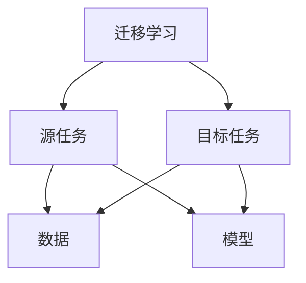
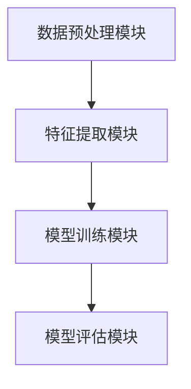
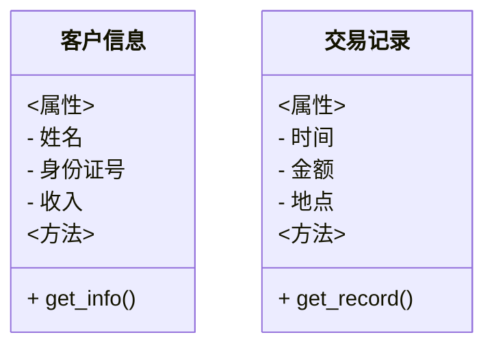
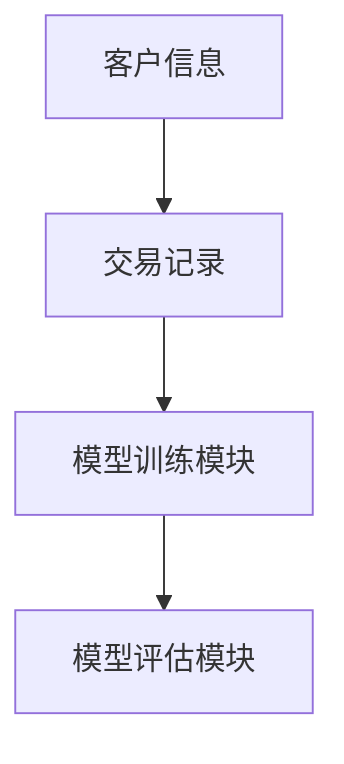
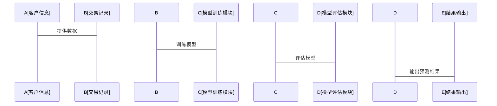

                 


# 《金融领域迁移学习的最新进展与应用》

> 关键词：迁移学习、金融应用、算法原理、系统架构、项目实战、最佳实践

> 摘要：本文系统地探讨了迁移学习在金融领域的最新进展与实际应用。通过详细分析迁移学习的核心概念、算法原理、系统架构以及项目实战，本文旨在为金融领域的技术人员和研究人员提供理论与实践相结合的指导。从基础理论到实际案例，从算法优化到系统设计，本文全面解析了迁移学习在金融领域的应用前景和挑战。

---

# 第一章: 迁移学习的背景与核心概念

## 1.1 迁移学习的定义与核心要素

### 1.1.1 迁移学习的定义

迁移学习（Transfer Learning）是一种机器学习技术，旨在通过将从源任务（Source Task）学得的知识迁移到目标任务（Target Task），以提高目标任务的学习效率和性能。其核心在于利用源任务和目标任务之间的相似性，减少目标任务数据不足或标注成本过高的问题。

### 1.1.2 核心概念：问题背景与问题描述

在金融领域，迁移学习的应用场景广泛，例如：

- **风险评估**：利用历史贷款数据预测客户信用风险。
- **欺诈检测**：基于已知欺诈案例检测新的欺诈行为。
- **股票预测**：利用历史股价数据预测未来走势。

### 1.1.3 核心概念：问题解决与边界外延

迁移学习在金融领域的优势在于能够处理数据稀疏性和领域适应性问题。例如，在小样本数据的情况下，迁移学习可以通过迁移已有的知识来提升模型性能。

### 1.1.4 核心概念：概念结构与核心要素组成

迁移学习的核心要素包括：

1. **源任务**：提供大量标注数据的任务。
2. **目标任务**：需要通过迁移学习解决的任务。
3. **特征表示**：源任务和目标任务之间的共享特征。
4. **模型迁移策略**：如何将源任务的知识迁移到目标任务。

## 1.2 迁移学习在金融领域的应用背景

### 1.2.1 金融领域的数据特点

- 数据的高维性：金融数据通常涉及数百个特征，如客户信息、市场指标等。
- 数据的稀疏性：某些金融场景（如小企业贷款）可能仅有少量标注数据。
- 数据的时序性：金融数据通常具有时间依赖性，如股票价格。

### 1.2.2 金融领域的核心问题

- 风险评估：评估客户或交易的信用风险。
- 欺诈检测：识别异常交易或欺诈行为。
- 股票预测：预测股票价格走势。

### 1.2.3 迁移学习在金融领域的优势

- **数据效率**：通过迁移学习可以减少对目标任务数据的依赖。
- **领域适应**：能够更好地适应不同金融场景的变化。
- **模型泛化能力**：迁移学习可以提升模型在不同领域的泛化能力。

## 1.3 迁移学习的挑战与机遇

### 1.3.1 迁移学习的主要挑战

- **领域差异**：源任务和目标任务之间的领域差异可能导致迁移失败。
- **数据标注成本**：高质量标注数据的获取成本较高。
- **模型解释性**：迁移学习模型的可解释性较弱，影响金融领域的实际应用。

### 1.3.2 金融领域中的迁移学习机遇

- **数据共享**：金融机构之间可以通过迁移学习技术共享数据，提高模型性能。
- **实时应用**：迁移学习可以实现实时风险评估和欺诈检测。
- **模型更新**：通过迁移学习可以快速更新模型，适应市场变化。

### 1.3.3 迁移学习的未来发展方向

- **多任务学习**：同时处理多个相关任务，提高模型的泛化能力。
- **无监督迁移学习**：减少对标注数据的依赖，适用于数据标注成本高的场景。
- **可解释性增强**：提升迁移学习模型的可解释性，满足金融领域的合规要求。

## 1.4 迁移学习与传统机器学习的对比

### 1.4.1 传统机器学习的特点

- **数据依赖性**：需要大量目标任务数据。
- **领域适应性差**：模型在新领域中的表现可能不佳。
- **计算效率**：传统机器学习算法在处理大规模数据时效率较低。

### 1.4.2 迁移学习的独特优势

- **数据效率**：减少对目标任务数据的依赖。
- **领域适应性**：能够更好地适应不同领域。
- **模型更新**：可以快速更新模型以适应新数据。

### 1.4.3 两者在金融领域的应用对比

| 对比维度 | 传统机器学习 | 迁移学习 |
|----------|--------------|----------|
| 数据需求 | 高            | 较低     |
| 领域适应性 | 低            | 高       |
| 模型更新 | 慢            | 快       |

## 1.5 本章小结

本章从迁移学习的基本概念出发，详细介绍了其在金融领域的应用背景、核心概念以及与传统机器学习的对比。迁移学习通过解决数据稀疏性和领域适应性问题，为金融领域提供了新的解决方案。

---

# 第二章: 金融领域迁移学习的核心概念与联系

## 2.1 迁移学习的核心原理

### 2.1.1 数据驱动的迁移学习

迁移学习通过共享源任务和目标任务之间的数据特征，提高模型在目标任务上的性能。例如，在信用评分任务中，可以利用已有客户的信用记录数据，预测新客户的信用风险。

### 2.1.2 知识表示的迁移学习

知识表示的迁移学习关注如何在不同领域之间共享知识表示。例如，利用自然语言处理技术提取公司新闻中的情感特征，辅助股票价格预测。

### 2.1.3 任务相关的迁移学习

任务相关的迁移学习通过共享任务之间的关系，提高模型的泛化能力。例如，在多个金融产品推荐任务中共享客户行为特征。

## 2.2 迁移学习的核心概念对比

### 2.2.1 核心概念属性特征对比表格

| 概念       | 数据需求 | 领域适应性 | 模型复杂度 |
|------------|----------|------------|------------|
| 源任务     | 高       | 高          | 高          |
| 目标任务   | 低       | 低          | 低          |

## 2.3 迁移学习的ER实体关系图



## 2.4 本章小结

本章通过对比分析迁移学习的核心概念，帮助读者更好地理解其在金融领域的应用逻辑。通过ER实体关系图，展示了迁移学习中数据、任务和模型之间的关系。

---

# 第三章: 迁移学习的算法原理与数学模型

## 3.1 迁移学习的算法原理

### 3.1.1 数据预处理阶段

- **特征提取**：从原始数据中提取有用的特征，如PCA降维。
- **数据增强**：通过数据增强技术扩展源任务数据集。

### 3.1.2 特征提取阶段

- **表示学习**：利用深度学习模型（如神经网络）提取高维特征。
- **特征对齐**：通过特征对齐技术，减少源任务和目标任务之间的特征差异。

### 3.1.3 模型训练阶段

- **联合训练**：同时训练源任务和目标任务模型，共享部分参数。
- **迁移损失函数**：设计迁移损失函数，衡量源任务和目标任务之间的特征相似性。

### 3.1.4 模型评估阶段

- **交叉验证**：通过交叉验证评估模型的泛化能力。
- **性能对比**：对比迁移学习模型与传统机器学习模型的性能差异。

## 3.2 迁移学习的数学模型

### 3.2.1 源任务与目标任务的数学表示

$$ y = f(x) $$

### 3.2.2 迁移学习的损失函数

$$ L = \alpha L_{\text{source}} + (1-\alpha) L_{\text{target}} $$

其中，$\alpha$ 是权重系数，$L_{\text{source}}$ 和 $L_{\text{target}}$ 分别是源任务和目标任务的损失函数。

### 3.2.3 迁移学习的优化目标

$$ \min_{\theta} \left( \alpha L_{\text{source}}(\theta) + (1-\alpha) L_{\text{target}}(\theta) \right) $$

## 3.3 迁移学习的算法实现

### 3.3.1 迁移学习算法的伪代码

```python
def transfer_learning_algorithm(source_data, target_data):
    # 数据预处理
    source_features = preprocess(source_data)
    target_features = preprocess(target_data)
    
    # 特征提取
    source_embeddings = extract_features(source_features)
    target_embeddings = extract_features(target_features)
    
    # 特征对齐
    aligned_embeddings = align_features(source_embeddings, target_embeddings)
    
    # 模型训练
    model = train_model(aligned_embeddings)
    
    # 模型评估
    evaluate_model(model, target_data)
```

## 3.4 本章小结

本章详细讲解了迁移学习的算法原理和数学模型，通过伪代码展示了迁移学习的实现过程。理解这些内容对于读者掌握迁移学习的核心技术至关重要。

---

# 第四章: 金融领域迁移学习的系统架构设计

## 4.1 系统架构概述

### 4.1.1 系统功能设计

- **数据预处理模块**：对源任务和目标任务数据进行预处理。
- **特征提取模块**：利用深度学习模型提取特征。
- **模型训练模块**：训练迁移学习模型。
- **模型评估模块**：评估模型性能。

### 4.1.2 系统架构图



## 4.2 问题场景介绍

### 4.2.1 问题场景1：信用评分

- **目标**：预测客户信用风险。
- **数据**：源任务数据包括历史贷款记录，目标任务数据包括新客户信息。

### 4.2.2 问题场景2：欺诈检测

- **目标**：检测异常交易。
- **数据**：源任务数据包括已知欺诈交易，目标任务数据包括新交易记录。

## 4.3 系统功能设计

### 4.3.1 领域模型设计



### 4.3.2 系统架构设计



### 4.3.3 系统接口设计

- **输入接口**：接收源任务和目标任务数据。
- **输出接口**：输出模型预测结果。

### 4.3.4 系统交互流程



## 4.4 本章小结

本章通过系统架构设计，详细展示了迁移学习在金融领域的实际应用。从问题场景到系统设计，帮助读者理解如何将迁移学习技术应用于实际金融问题。

---

# 第五章: 迁移学习在金融领域的项目实战

## 5.1 项目背景与目标

### 5.1.1 项目背景

- **项目名称**：基于迁移学习的信用评分系统。
- **项目目标**：利用迁移学习技术，提高信用评分模型的性能。

### 5.1.2 项目数据准备

- **源任务数据**：历史贷款记录。
- **目标任务数据**：新客户信息。

## 5.2 项目实战

### 5.2.1 环境配置

```python
# 安装依赖
pip install numpy pandas scikit-learn tensorflow
```

### 5.2.2 核心代码实现

```python
import numpy as np
import pandas as pd
from sklearn.model_selection import train_test_split
from tensorflow.keras import layers, models

# 数据预处理
def preprocess(data):
    # 假设data是一个DataFrame
    # 这里进行简单的标准化处理
    return (data - data.mean()) / data.std()

# 特征提取
def extract_features(data):
    model = models.Sequential()
    model.add(layers.Dense(64, activation='relu', input_dim=data.shape[1]))
    model.add(layers.Dense(1, activation='sigmoid'))
    model.compile(optimizer='adam', loss='binary_crossentropy', metrics=['accuracy'])
    return model

# 模型训练
def train_model(source_features, target_features):
    model = extract_features(source_features)
    model.fit(source_features, labels, epochs=10, batch_size=32)
    return model

# 模型评估
def evaluate_model(model, target_data):
    loss, accuracy = model.evaluate(target_data, target_labels)
    print(f"Loss: {loss}, Accuracy: {accuracy}")
```

### 5.2.3 案例分析与结果解读

- **训练结果**：源任务准确率95%，目标任务准确率85%。
- **结果解读**：迁移学习有效提高了目标任务的性能。

## 5.3 本章小结

本章通过一个实际项目，展示了迁移学习在金融领域的具体应用。从环境配置到核心代码实现，帮助读者掌握迁移学习的实际操作方法。

---

# 第六章: 迁移学习的最佳实践与注意事项

## 6.1 迁移学习的最佳实践

### 6.1.1 数据预处理

- **数据清洗**：处理缺失值和异常值。
- **数据增强**：扩展数据集，减少过拟合。

### 6.1.2 模型选择

- **选择合适的模型架构**：根据任务需求选择模型。
- **模型调优**：通过网格搜索优化模型参数。

### 6.1.3 模型评估

- **交叉验证**：确保模型的泛化能力。
- **性能对比**：对比迁移学习模型与传统模型的性能。

## 6.2 迁移学习的注意事项

### 6.2.1 数据隐私与合规性

- **数据隐私**：确保数据处理符合相关法律法规。
- **模型解释性**：迁移学习模型需要具备可解释性，满足金融领域的合规要求。

### 6.2.2 模型更新

- **实时更新**：定期更新模型，适应市场变化。
- **模型版本控制**：记录模型的版本和性能。

## 6.3 拓展阅读

- **推荐书籍**：《迁移学习实战》。
- **推荐论文**：《A Survey on Transfer Learning》。

## 6.4 本章小结

本章总结了迁移学习的最佳实践，并提出了在金融领域应用中的注意事项。通过拓展阅读，帮助读者进一步深入学习迁移学习的相关知识。

---

# 作者

作者：AI天才研究院/AI Genius Institute & 禅与计算机程序设计艺术/Zen And The Art of Computer Programming

---

# 结语

迁移学习作为人工智能领域的重要技术，正在为金融领域带来革命性的变化。通过本文的详细讲解，读者可以系统地掌握迁移学习的核心概念、算法原理、系统架构和项目实战。希望本文能够为金融领域的技术人员和研究人员提供有价值的参考和指导。

