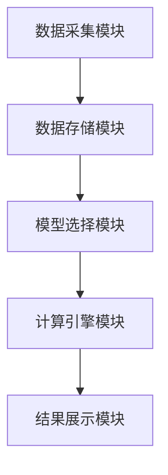

                 


# 金融风险压力测试模型

> **关键词**: 金融风险，压力测试，风险模型，算法，系统架构，项目实战

> **摘要**: 本文系统地介绍了金融风险压力测试模型的核心概念、算法原理、系统架构及项目实战。通过对单因素和多因素压力测试模型的深入分析，结合具体的Python代码实现和实际案例，帮助读者理解压力测试模型的构建与应用。文章还探讨了系统架构设计和最佳实践，为金融风险管理和监管提供理论和实践指导。

---

## 第一部分: 金融风险压力测试模型概述

### 第1章: 金融风险与压力测试概述

#### 1.1 金融风险的基本概念
金融风险是指在金融活动中，由于不确定因素的影响，导致资产价值或收益发生不利变动的可能性。常见的金融风险包括市场风险、信用风险、流动性风险和操作风险等。压力测试是评估金融资产或机构在极端市场条件下的表现，以确保其稳健性的关键工具。

#### 1.2 压力测试的定义与作用
压力测试是一种模拟极端市场条件下的情景分析，用于评估金融资产或机构在不利环境下的风险承受能力。其作用包括：识别潜在风险点、评估资产或机构的稳健性、制定风险缓解策略等。

#### 1.3 本书的核心内容
本书将详细探讨压力测试模型的构建与应用，包括单因素和多因素模型的原理、算法实现、系统架构设计以及实际案例分析。

---

### 第2章: 压力测试模型的背景与应用

#### 2.1 金融风险压力测试的背景
金融危机（如2008年全球金融危机）暴露了金融机构在极端市场条件下的脆弱性，促使监管机构和金融机构加强压力测试，以确保金融系统的稳定性。

#### 2.2 压力测试的主要应用场景
压力测试广泛应用于银行、证券、保险等金融领域，帮助机构评估在市场波动、经济衰退等情况下的风险暴露。

#### 2.3 压力测试的实施流程
1. **数据收集**：获取历史市场数据、资产组合信息等。
2. **模型选择**：选择适合的单因素或多因素模型。
3. **结果分析**：评估资产或机构在极端情况下的表现。

---

## 第二部分: 压力测试模型的核心概念

### 第3章: 压力测试模型的核心概念

#### 3.1 单因素压力测试模型
单因素模型假设只有一个风险因素影响资产价值，适用于简单场景下的压力测试。

| **对比项** | **单因素模型** | **多因素模型** |
|------------|----------------|----------------|
| 输入变量 | 单个风险因素 | 多个风险因素 |
| 适用场景 | 简单场景 | 复杂场景 |
| 优缺点 | 简单易实现，但不够全面 | 能够捕捉多因素影响，但复杂度高 |

#### 3.2 多因素压力测试模型
多因素模型考虑多个风险因素，能够更准确地模拟复杂市场环境。

---

## 第三部分: 压力测试模型的算法原理

### 第4章: 压力测试模型的算法原理

#### 4.1 单因素压力测试算法
假设市场收益率下降10%，计算资产组合的价值变化。

```python
import numpy as np

# 单因素模型实现
def single_factor_stress_test(assets, factor_change):
    stressed_assets = assets * (1 + factor_change)
    return stressed_assets

# 示例
assets = np.array([100, 200, 300])
factor_change = -0.1  # 假设收益率下降10%
stressed_assets = single_factor_stress_test(assets, factor_change)
print("Stressed Assets:", stressed_assets)
```

#### 4.2 多因素压力测试算法
考虑多个风险因素，如市场收益率和信用违约率同时变化。

```python
def multi_factor_stress_test(assets, factor_changes):
    stressed_assets = []
    for asset in assets:
        new_asset = asset * (1 + factor_changes['market'] + factor_changes['credit'])
        stressed_assets.append(new_asset)
    return stressed_assets

# 示例
assets = np.array([100, 200, 300])
factor_changes = {'market': -0.1, 'credit': -0.05}
stressed_assets = multi_factor_stress_test(assets, factor_changes)
print("Stressed Assets:", stressed_assets)
```

---

## 第四部分: 系统架构与实现

### 第5章: 系统架构设计

#### 5.1 系统功能模块划分
- **数据采集模块**：收集市场数据、资产组合信息。
- **模型选择模块**：选择适合的压力测试模型。
- **计算引擎模块**：执行压力测试计算。
- **结果展示模块**：输出测试结果。

#### 5.2 系统架构图



---

## 第五部分: 项目实战

### 第6章: 项目实战

#### 6.1 环境安装
安装Python和必要的库（如NumPy、Pandas）。

#### 6.2 核心实现代码
```python
import numpy as np

def compute VaR(returns, confidence_level):
    returns_sorted = np.sort(returns)
    VaR = np.quantile(returns_sorted, 1 - confidence_level)
    return VaR

# 示例
returns = np.random.normal(0, 1, 1000)
confidence_level = 0.95
var = compute VaR(returns, confidence_level)
print("VaR at 95% confidence level:", var)
```

#### 6.3 案例分析
通过实际案例分析压力测试结果，评估资产组合的风险。

---

## 第六部分: 最佳实践与小结

### 第7章: 最佳实践

#### 7.1 数据质量的重要性
确保数据的准确性和完整性。

#### 7.2 模型选择的注意事项
根据实际情况选择适合的模型。

#### 7.3 结果解释的关键点
压力测试结果应结合业务背景进行解释。

---

## 作者

作者：AI天才研究院 & 禅与计算机程序设计艺术

---

以上是《金融风险压力测试模型》的技术博客文章的详细目录和内容概述。文章从背景介绍、核心概念、算法原理、系统架构、项目实战到最佳实践，全面覆盖了压力测试模型的相关知识，并结合实际案例和代码示例，帮助读者深入理解压力测试模型的构建与应用。

