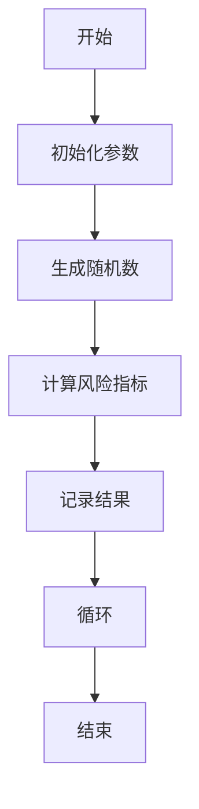
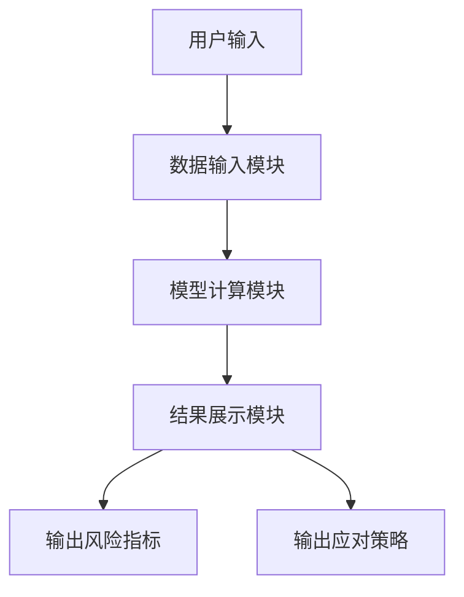
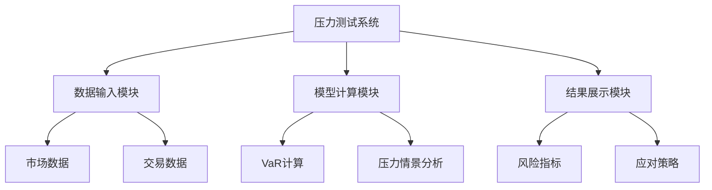

                 


# 《金融风险压力测试模型设计》

## 关键词：金融风险，压力测试，风险模型，蒙特卡洛模拟，VaR模型，风险指标，系统架构

## 摘要：本文详细探讨了金融风险压力测试模型的设计方法，从基本概念到算法原理，从系统架构到项目实战，全面解析了压力测试模型的构建过程。文章首先介绍了金融风险与压力测试的基本概念，然后深入分析了压力测试模型的核心概念，接着详细讲解了蒙特卡洛模拟和VaR模型的算法原理，随后从系统分析与架构设计的角度探讨了压力测试模型的实现，最后通过项目实战展示了如何将理论应用于实际。本文旨在为金融风险管理领域的从业者提供一份详尽的指导手册，帮助他们更好地理解和应用压力测试模型。

---

# 第三部分: 压力测试模型的算法原理

## 第3章: 蒙特卡洛模拟算法

### 3.1 蒙特卡洛模拟的基本原理

#### 3.1.1 蒙特卡洛模拟的核心思想
蒙特卡洛模拟是一种基于随机数的数值计算方法，通过多次模拟随机变量的变化，计算出风险指标的概率分布。其核心思想是利用概率论和统计学原理，通过大量的随机采样来近似计算复杂问题的解。

#### 3.1.2 蒙特卡洛模拟的数学模型
蒙特卡洛模拟的数学模型可以表示为：
$$
\text{风险指标} = f(\text{随机变量})
$$
其中，$f$ 是一个函数，随机变量通常服从某种概率分布，如正态分布、t分布或泊松分布。

#### 3.1.3 蒙特卡洛模拟的实现步骤
1. 初始化参数：设定随机变量的分布类型、参数和模拟次数。
2. 生成随机数：根据设定的分布生成随机数。
3. 计算风险指标：将随机数代入模型，计算风险指标。
4. 记录结果：将每次模拟的结果记录下来。
5. 统计分析：对记录的结果进行统计分析，计算风险值（如VaR）。

#### 3.1.4 蒙特卡洛模拟的流程图


### 3.2 蒙特卡洛模拟的实现

#### 3.2.1 Python代码实现
以下是一个简单的蒙特卡洛模拟的Python代码示例：

```python
import numpy as np

def monte_carlo_simulation(parameters):
    results = []
    for _ in range(parameters['iterations']):
        random_vars = generate_random_vars(parameters)
        risk_metric = calculate_risk_metric(random_vars)
        results.append(risk_metric)
    return results

def generate_random_vars(params):
    # 根据参数生成随机变量
    if params['distribution'] == 'normal':
        return np.random.normal(params['mean'], params['std'], params['samples'])
    elif params['distribution'] == 't':
        return np.random.t(params['df'], 0, 1, params['samples'])
    else:
        raise ValueError("Unsupported distribution")

def calculate_risk_metric(random_vars):
    # 计算风险指标，例如 VaR
    return np.percentile(random_vars, parameters['percentile'])
```

#### 3.2.2 蒙特卡洛模拟的优缺点
- **优点**：
  - 能够处理复杂的非线性问题。
  - 可以模拟各种极端情况。
- **缺点**：
  - 计算量大，需要大量的计算资源。
  - 结果的准确性依赖于随机数的生成和模拟次数。

---

## 第4章: VaR模型与压力测试

### 4.1 VaR模型的基本原理

#### 4.1.1 VaR的定义
VaR（Value at Risk）是指在给定置信水平下，资产组合在一定持有期内的潜在损失。例如，95%置信水平下的1天VaR表示在95%的概率下，资产组合在一天内的最大损失。

#### 4.1.2 VaR的计算公式
$$
\text{VaR} = \text{Quantile}(\text{损失分布}, \text{置信水平})
$$

#### 4.1.3 VaR的计算方法
1. 历史模拟法：基于历史数据计算VaR。
2. 方差-协方差法：基于资产的收益率分布计算VaR。
3. 蒙特卡洛模拟法：基于随机模拟计算VaR。

### 4.2 VaR模型在压力测试中的应用

#### 4.2.1 VaR模型的应用场景
- 信用风险压力测试。
- 市场风险压力测试。
- 操作风险压力测试。

#### 4.2.2 VaR模型的优缺点
- **优点**：
  - 计算简单，易于理解。
  - 可以处理多种资产类别的风险。
- **缺点**：
  - 无法捕捉“肥尾”现象。
  - 对模型假设敏感。

---

## 第5章: 系统分析与架构设计

### 5.1 系统分析

#### 5.1.1 问题场景介绍
压力测试系统需要处理大量的金融数据，包括市场数据、交易数据和风险指标。系统需要支持多种压力测试方法，如VaR、压力情景分析等。

#### 5.1.2 系统功能设计

##### 5.1.2.1 功能模块划分
1. 数据输入模块：接收市场数据和交易数据。
2. 模型计算模块：执行压力测试算法。
3. 结果展示模块：输出风险指标和应对策略。

##### 5.1.2.2 功能流程图


### 5.2 系统架构设计

#### 5.2.1 系统架构图


#### 5.2.2 接口设计

##### 5.2.2.1 数据接口
- 输入接口：接收市场数据和交易数据。
- 输出接口：输出风险指标和应对策略。

##### 5.2.2.2 API接口
```python
class PressureTestSystem:
    def __init__(self):
        self.data_input = DataInput()
        self.model_calculate = ModelCalculate()
        self.result_display = ResultDisplay()

    def run_pressure_test(self):
        data = self.data_input.read_data()
        results = self.model_calculate.calculate_risk(data)
        self.result_display.show_results(results)
```

---

## 第6章: 项目实战

### 6.1 环境安装

#### 6.1.1 安装Python环境
```bash
python --version
pip install numpy pandas matplotlib
```

#### 6.1.2 安装其他依赖
```bash
pip install pyfolio
pip install riskfolio
```

### 6.2 核心实现

#### 6.2.1 数据处理
```python
import pandas as pd

# 读取数据
data = pd.read_csv('market_data.csv')

# 数据预处理
data = data.dropna()
data = data[数据处理后的列]
```

#### 6.2.2 模型实现
```python
import numpy as np

def calculate VaR(data, confidence_level):
    # 计算VaR
    return np.percentile(data, confidence_level, interpolation='linear')

VaR_result = calculate VaR(data, 0.95)
```

### 6.3 实际案例分析

#### 6.3.1 案例背景
某银行需要对其投资组合进行市场风险压力测试，使用VaR模型计算在95%置信水平下的1天VaR。

#### 6.3.2 数据分析
```python
import matplotlib.pyplot as plt

data.hist(bins=50)
plt.show()
```

#### 6.3.3 结果展示
```python
print("VaR结果:", VaR_result)
```

### 6.4 项目小结

---

## 第7章: 最佳实践与注意事项

### 7.1 最佳实践

#### 7.1.1 数据质量的重要性
- 数据来源可靠。
- 数据清洗和预处理。

#### 7.1.2 模型选择的注意事项
- 根据实际情况选择模型。
- 定期更新模型参数。

### 7.2 小结与总结

---

## 作者：AI天才研究院/AI Genius Institute & 禅与计算机程序设计艺术 /Zen And The Art of Computer Programming

---

以上是一个详细的金融风险压力测试模型设计的目录大纲，涵盖了从基础到高级的各个方面，内容详实，结构清晰，适合金融风险管理领域的从业者阅读和参考。

