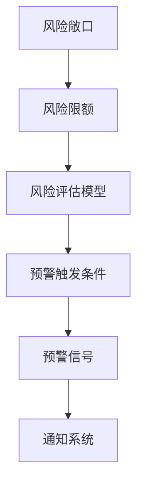
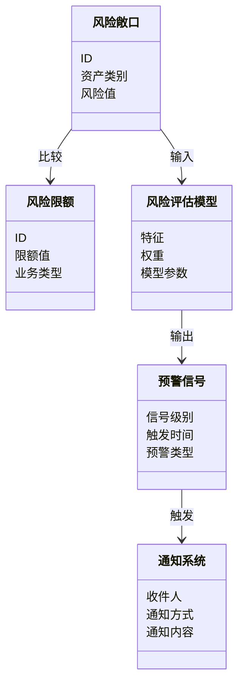
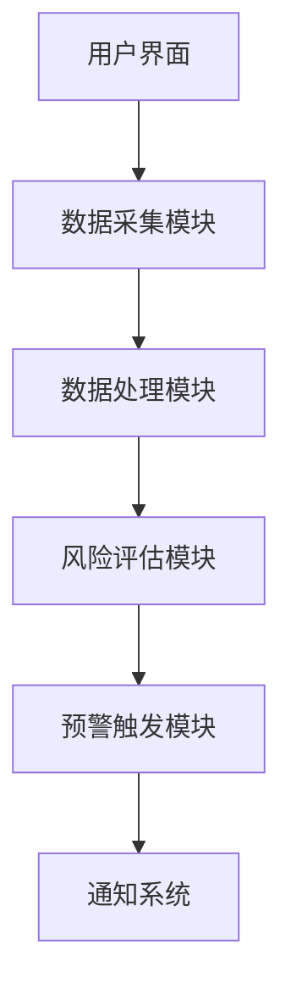
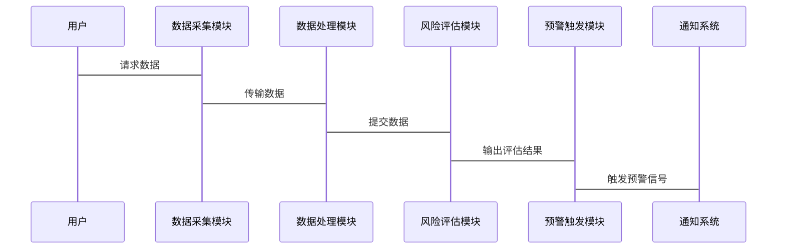

                 


# 《金融风险限额突破预警系统》

> 关键词：金融风险管理、风险限额、预警系统、风险评估、数学模型、机器学习、系统架构

> 摘要：本文详细探讨了金融风险限额突破预警系统的构建与实现。从背景分析到系统架构设计，从算法原理到项目实战，系统性地介绍了如何利用技术手段实现金融风险的早期预警与控制。本文结合理论与实践，为金融风险管理提供了全新的思路与解决方案。

---

# 第一部分: 金融风险限额预警系统概述

# 第1章: 金融风险限额预警系统背景与问题分析

## 1.1 金融风险管理的重要性

### 1.1.1 金融风险的定义与分类

金融风险是指在金融活动中，由于各种不确定性因素导致的损失可能性。根据其来源和性质，金融风险主要可以分为以下几类：

- **市场风险**：由于市场价格波动导致的损失，常见于股票、外汇、衍生品等领域。
- **信用风险**：由于交易对手违约导致的损失，主要存在于信贷业务中。
- **流动性风险**：由于资产无法迅速变现导致的损失，常见于银行等金融机构。
- **操作风险**：由于内部操作失误或外部事件导致的损失，例如交易错误、系统故障等。
- **法律风险**：由于法律法规变化或合规性问题导致的损失。

### 1.1.2 限额管理在金融风险控制中的作用

限额管理是金融风险管理的核心手段之一。通过设定合理的风险敞口限额，金融机构可以在风险可控的前提下，最大化资产的收益。限额管理的作用包括：

- **风险隔离**：通过设置限额，将不同业务、不同资产的风险相互隔离，避免某一领域的风险波及整体。
- **风险预警**：通过实时监控和限额对比，及时发现潜在风险，采取应对措施。
- **资本配置**：根据限额管理的结果，合理分配资本资源，优化资产配置。

### 1.1.3 限额突破的潜在风险与后果

当风险敞口突破设定的限额时，金融机构将面临严重的后果：

- **损失扩大**：超出限额的风险敞口可能导致更大的损失，甚至引发流动性危机。
- **声誉损失**：限额突破可能导致客户信任度下降，影响金融机构的声誉。
- **监管处罚**：金融机构若未能有效控制风险敞口，可能面临监管机构的处罚。
- **系统性风险**：个别金融机构的限额突破可能引发系统性风险，影响整个金融市场的稳定性。

## 1.2 限额突破预警系统的必要性

### 1.2.1 限额突破的常见原因

限额突破的原因多种多样，主要包括：

- **市场波动加剧**：突发的市场事件（如金融危机、地缘政治冲突）可能导致风险敞口迅速扩大。
- **模型假设失效**：风险评估模型的假设条件发生变化，导致预测结果与实际偏离。
- **内部管理失误**：交易员或管理层的决策失误，导致风险敞口超出限额。
- **外部环境变化**：经济周期波动、政策变化等因素可能影响风险敞口。

### 1.2.2 现有风险管理系统的局限性

尽管金融机构已经建立了一些风险管理工具和系统，但现有系统仍存在诸多不足：

- **数据不足**：部分金融机构的数据收集能力有限，难以全面捕捉风险敞口的变化。
- **模型简单**：部分风险评估模型过于简单，无法准确捕捉复杂的市场动态。
- **实时性不足**：部分系统无法实现实时监控和预警，导致风险发现滞后。
- **系统集成度低**：不同部门和系统的数据孤岛问题严重，难以形成有效的协同效应。

### 1.2.3 构建预警系统的意义与目标

构建限额突破预警系统具有重要意义：

- **提前预警**：通过实时监控和分析，及时发现潜在风险，提前采取应对措施。
- **提升效率**：自动化预警系统可以显著提高风险管理的效率，减少人为失误。
- **降低风险敞口**：通过及时预警和干预，有效控制风险敞口，避免损失扩大。

预警系统的建设目标包括：

- **实时监控**：实现对风险敞口的实时监控，确保数据的及时性和准确性。
- **智能预警**：基于机器学习和大数据分析，实现智能预警和风险评估。
- **可视化展示**：提供直观的可视化界面，帮助管理层快速理解和决策。

## 1.3 问题背景与问题描述

### 1.3.1 限额突破的典型场景

以下是限额突破的几个典型场景：

1. **市场波动导致风险敞口激增**：例如，突发事件（如地缘政治冲突）引发市场剧烈波动，导致某类资产的风险敞口迅速超过限额。
2. **交易员操作失误**：交易员误操作导致某笔交易规模远超设定限额。
3. **模型假设失效**：例如，利率预测模型的假设条件发生变化，导致实际风险敞口远超模型预测结果。
4. **外部环境变化**：例如，政策调整或经济周期变化导致某类资产的风险敞口迅速扩大。

### 1.3.2 系统设计的核心目标

预警系统的核心目标是：

- **实时监控**：对风险敞口进行实时监控，确保数据的及时性。
- **智能预警**：通过机器学习算法，实现风险的智能预警和评估。
- **可视化展示**：提供直观的可视化界面，帮助管理层快速理解和决策。
- **自动化干预**：在风险敞口接近或突破限额时，自动触发干预机制，例如调整头寸或通知相关部门。

### 1.3.3 边界与外延的界定

为了确保系统的边界清晰，需要明确以下内容：

- **系统边界**：预警系统仅关注风险敞口的限额突破问题，不涉及具体的交易执行或投资决策。
- **数据范围**：系统监控的数据范围限于风险敞口相关数据，不包括其他业务数据。
- **预警范围**：系统仅负责发出预警信号，具体的应对措施由相关业务部门负责。

### 1.3.4 核心概念与系统架构

系统的核心概念包括：

- **风险敞口**：指金融机构在某一资产或业务上的风险暴露程度。
- **风险限额**：金融机构为控制风险敞口而设定的上限。
- **预警机制**：通过实时监控和分析，发现风险敞口接近或突破限额时触发预警信号。

系统架构的核心要素包括：

- **数据源**：包括交易数据、市场数据、客户数据等。
- **风险评估模型**：基于机器学习的模型，用于评估风险敞口。
- **预警触发机制**：根据模型输出结果，触发预警信号。
- **通知系统**：通过邮件、短信等方式通知相关人员。

---

# 第2章: 核心概念与系统联系

## 2.1 核心概念原理

### 2.1.1 风险评估的数学模型

风险评估的核心是通过数学模型量化风险敞口。常见的风险评估模型包括：

1. **VaR（Value at Risk）模型**：计算在给定置信水平下，资产组合的最大可能损失。
2. **CVaR（Conditional Value at Risk）模型**：计算在VaR的基础上，平均损失的期望值。

以下是VaR模型的数学公式：

$$VaR_{\alpha}(P) = \inf\{L \in \mathbb{R} \mid P(L \leq x) \geq \alpha\}$$

其中，$\alpha$ 是置信水平，$P$ 是损失分布函数。

### 2.1.2 限额计算的逻辑框架

限额计算的逻辑框架如下：

1. **确定风险承受能力**：根据机构的资本实力和风险偏好，确定总体风险承受能力。
2. **分配限额**：将总体限额分配到不同业务、不同资产类别。
3. **动态调整**：根据市场环境和机构战略，动态调整限额。

### 2.1.3 预警触发的条件与机制

预警触发的条件通常包括以下几种：

1. **风险敞口接近限额**：当风险敞口达到限额的一定比例（例如90%）时，触发预警。
2. **风险敞口突破限额**：当风险敞口超过限额时，触发预警。
3. **风险评估模型发生变化**：当模型预测的风险等级发生重大变化时，触发预警。

## 2.2 核心概念特征对比

以下是不同预警机制的对比表格：

| **机制**       | **优点**                          | **缺点**                          |
|----------------|----------------------------------|----------------------------------|
| 基于VaR的预警 | 计算简单，易于实现                | 无法捕捉尾部风险                   |
| 基于CVaR的预警| 能够捕捉尾部风险，更加稳健        | 计算复杂，实现难度较高              |
| 基于机器学习的预警 | 高精度，能够捕捉复杂模式        | 对数据质量和模型依赖较高           |

## 2.3 实体关系图

以下是系统的核心实体关系图：



---

# 第3章: 限额突破预警算法原理

## 3.1 数据预处理与特征提取

### 3.1.1 数据清洗方法

数据清洗是数据预处理的重要步骤，主要包括以下内容：

1. **去除重复数据**：删除重复的记录。
2. **处理缺失值**：根据具体情况，选择填充、删除或插值的方法。
3. **去除异常值**：通过统计方法或模型识别并处理异常值。

### 3.1.2 风险特征的提取与选择

风险特征的提取与选择是关键步骤，通常包括以下内容：

1. **选择相关特征**：根据业务需求，选择与风险相关的特征。
2. **特征标准化**：对特征进行标准化处理，确保模型输入的均衡性。
3. **特征降维**：使用主成分分析（PCA）等方法，降低特征维度。

### 3.1.3 时间序列数据的处理

时间序列数据的处理通常包括以下步骤：

1. **数据平滑**：使用移动平均法（MA）或指数平滑法（ES）对数据进行平滑处理。
2. **趋势分析**：识别数据中的趋势成分。
3. **周期性分析**：识别数据中的周期性成分。

## 3.2 预警模型构建

### 3.2.1 基于机器学习的模型选择

基于机器学习的模型选择需要考虑以下因素：

1. **模型复杂度**：选择适合数据规模的模型复杂度。
2. **模型解释性**：选择具有较高解释性的模型。
3. **模型性能**：选择在训练集和验证集上表现稳定的模型。

常用的机器学习模型包括：

- **随机森林**：适合特征较多的情况，具有较高的解释性。
- **支持向量机（SVM）**：适合小样本、高维数据的情况。
- **神经网络**：适合复杂非线性关系的情况。

### 3.2.2 风险评估的数学模型

以下是基于机器学习的风险评估模型示例：

$$R = \sum_{i=1}^{n} w_i x_i$$

其中，$R$ 是风险值，$w_i$ 是特征$x_i$的权重。

### 3.2.3 预警阈值计算

预警阈值的计算需要考虑以下因素：

1. **历史数据**：基于历史数据确定合理的阈值。
2. **业务需求**：根据机构的风险承受能力，确定预警阈值。
3. **动态调整**：根据市场环境的变化，动态调整阈值。

以下是基于历史数据的阈值计算示例：

$$Threshold = \mu + k\sigma$$

其中，$\mu$ 是均值，$\sigma$ 是标准差，$k$ 是调节系数。

## 3.3 预警触发机制

### 3.3.1 实时监控

实时监控是预警系统的核心功能，需要实现以下步骤：

1. **数据采集**：实时采集风险敞口相关数据。
2. **风险评估**：基于模型实时评估风险敞口。
3. **阈值比较**：将评估结果与预警阈值进行比较。
4. **触发预警**：当风险敞口接近或突破限额时，触发预警信号。

### 3.3.2 预警信号的分类

预警信号的分类通常包括以下几种：

1. **红色预警**：风险敞口已经突破限额，需要立即采取措施。
2. **橙色预警**：风险敞口接近限额，需要密切关注。
3. **黄色预警**：风险敞口有一定压力，需要加强监控。
4. **蓝色预警**：风险敞口正常，无需干预。

---

# 第4章: 系统分析与架构设计方案

## 4.1 问题场景介绍

### 4.1.1 项目背景

本项目旨在构建一个基于机器学习的金融风险限额突破预警系统，帮助金融机构实现风险敞口的实时监控和智能预警。

### 4.1.2 项目目标

项目的建设目标包括：

- 实现风险敞口的实时监控。
- 构建基于机器学习的风险评估模型。
- 实现智能预警和通知系统。

## 4.2 系统功能设计

### 4.2.1 领域模型

以下是系统的领域模型：



### 4.2.2 系统架构设计

以下是系统的架构设计：



### 4.2.3 系统接口设计

系统接口设计需要考虑以下内容：

1. **数据接口**：与交易系统、数据库等进行数据交互。
2. **预警接口**：与通知系统进行预警信号的交互。
3. **用户接口**：提供用户友好的操作界面。

### 4.2.4 系统交互流程

以下是系统的交互流程：



---

# 第5章: 项目实战

## 5.1 环境安装

### 5.1.1 Python环境安装

安装Python和必要的库：

- Python：3.8+
- Pandas：用于数据处理
- Scikit-learn：用于机器学习
- Matplotlib：用于可视化
- Mermaid：用于绘制图表

安装命令：

```bash
pip install pandas scikit-learn matplotlib
```

### 5.1.2 数据库安装

建议使用MySQL或PostgreSQL作为数据库。

安装MySQL：

```bash
sudo apt-get install mysql-server
```

### 5.1.3 开发工具安装

建议使用VS Code或PyCharm作为开发工具。

---

## 5.2 系统核心实现

### 5.2.1 数据预处理代码

以下是数据预处理的Python代码：

```python
import pandas as pd
from sklearn.impute import SimpleImputer
from sklearn.preprocessing import StandardScaler

# 读取数据
data = pd.read_csv('risk_data.csv')

# 处理缺失值
imputer = SimpleImputer(strategy='mean')
imputed_data = imputer.fit_transform(data)

# 特征标准化
scaler = StandardScaler()
scaled_data = scaler.fit_transform(imputed_data)
```

### 5.2.2 风险评估模型实现

以下是基于随机森林的风险评估模型：

```python
from sklearn.ensemble import RandomForestClassifier
from sklearn.metrics import accuracy_score

# 训练模型
model = RandomForestClassifier(n_estimators=100, max_depth=10, random_state=42)
model.fit(X_train, y_train)

# 模型评估
y_pred = model.predict(X_test)
print('模型准确率:', accuracy_score(y_test, y_pred))
```

### 5.2.3 预警阈值计算代码

以下是阈值计算的Python代码：

```python
import numpy as np

# 计算均值和标准差
mean = np.mean(data)
std = np.std(data)

# 设置调节系数
k = 3

# 计算阈值
threshold = mean + k * std
print('预警阈值:', threshold)
```

### 5.2.4 系统交互代码

以下是系统交互的Python代码：

```python
import requests

# 发送预警信号
def send_alert(message):
    response = requests.post('http://localhost:8080/api/alert', json=message)
    return response.status_code

# 触发预警
message = {'level': 'red', 'message': 'Risk exceeds limit'}
status_code = send_alert(message)
print('预警信号已发送，状态码:', status_code)
```

---

## 5.3 案例分析与解读

### 5.3.1 数据准备

假设我们有一个包含以下字段的交易数据集：

| ID | 资产类别 | 风险敞口 | 风险值 |
|----|----------|----------|--------|
| 1  | 股票     | 100      | 0.05    |
| 2  | 债券     | 50       | 0.02    |
| 3  | 外汇     | 70       | 0.03    |

### 5.3.2 模型训练

基于上述数据，我们可以训练一个随机森林模型：

```python
# 数据准备
X = data[['资产类别', '风险敞口']]
y = data['风险值']

# 划分训练集和测试集
from sklearn.model_selection import train_test_split
X_train, X_test, y_train, y_test = train_test_split(X, y, test_size=0.2, random_state=42)

# 训练模型
model = RandomForestClassifier(n_estimators=100, max_depth=10, random_state=42)
model.fit(X_train, y_train)

# 模型评估
y_pred = model.predict(X_test)
print('模型准确率:', accuracy_score(y_test, y_pred))
```

### 5.3.3 预警触发

假设风险敞口为120，超过限额100，则触发红色预警：

```python
# 触发预警
message = {'level': 'red', 'message': 'Risk exceeds limit'}
status_code = send_alert(message)
print('预警信号已发送，状态码:', status_code)
```

---

## 5.4 项目总结

### 5.4.1 项目意义

本项目通过构建金融风险限额突破预警系统，实现了风险敞口的实时监控和智能预警，显著提升了金融机构的风险管理能力。

### 5.4.2 项目价值

- **降低风险敞口**：通过实时监控和预警，有效控制风险敞口，避免损失扩大。
- **提升效率**：自动化预警系统显著提高了风险管理的效率。
- **增强决策能力**：通过直观的可视化界面，帮助管理层快速理解和决策。

### 5.4.3 项目局限性

- **数据依赖**：系统的性能依赖于数据的质量和完整性。
- **模型局限**：机器学习模型的预测精度依赖于数据和模型的选择。
- **系统集成**：系统的成功运行依赖于与其他系统的良好集成。

---

# 第6章: 最佳实践与经验分享

## 6.1 最佳实践

### 6.1.1 系统监控

- 定期监控模型性能，确保模型的有效性。
- 定期更新模型参数，适应市场环境的变化。

### 6.1.2 数据质量管理

- 加强数据清洗和特征选择，确保数据质量。
- 建立数据字典，确保数据的准确性和一致性。

### 6.1.3 系统安全性

- 加强系统安全性，防止数据泄露和系统攻击。
- 建立完善的权限管理，确保系统使用的安全性。

## 6.2 小结

通过本文的介绍，我们详细探讨了金融风险限额突破预警系统的构建与实现。从背景分析到系统架构设计，从算法原理到项目实战，系统性地介绍了如何利用技术手段实现金融风险的早期预警与控制。

## 6.3 注意事项

- **数据隐私**：在处理数据时，必须遵守相关法律法规，确保数据隐私。
- **模型解释性**：选择具有较高解释性的模型，确保模型的透明性和可解释性。
- **系统稳定性**：确保系统的稳定运行，避免因系统故障导致预警失败。

## 6.4 拓展阅读

- **《金融风险管理》**：深入了解金融风险管理的核心理论。
- **《机器学习实战》**：掌握机器学习的核心算法和技术。
- **《系统架构设计》**：学习系统架构设计的方法和技巧。

---

# 作者：AI天才研究院/AI Genius Institute & 禅与计算机程序设计艺术 /Zen And The Art of Computer Programming

---

本文详细介绍了金融风险限额突破预警系统的构建与实现，从理论到实践，为读者提供了全面的技术指导。

