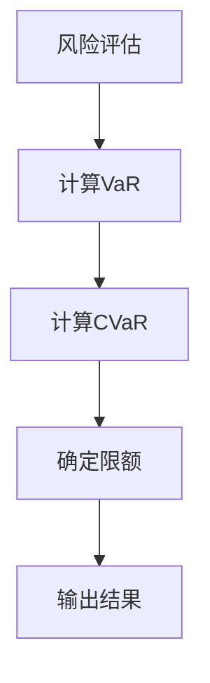
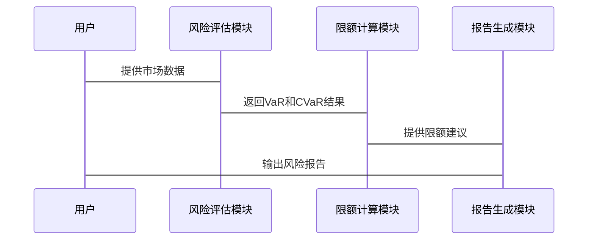

                 


# 《金融风险限额管理系统设计》

> 关键词：金融风险，限额管理，风险管理，系统设计，算法模型

> 摘要：本文详细探讨了金融风险限额管理系统的背景、核心概念、算法原理、系统架构以及实际应用。通过理论分析和实践案例的结合，阐述了如何设计一个高效、可靠的金融风险限额管理系统，帮助金融机构有效控制风险，确保业务稳健发展。

---

## 第一部分：金融风险限额管理系统的背景与核心概念

### 第1章：金融风险限额管理概述

#### 1.1 金融风险的基本概念
金融风险是指在金融活动中，由于市场波动、信用违约、流动性不足等因素，导致资金损失或无法实现预期收益的可能性。金融风险是金融机构运营中的核心挑战之一，需要通过科学的管理方法和工具进行有效控制。

#### 1.2 限额管理的必要性与重要性
限额管理是金融机构控制风险的重要手段。通过设定合理的风险敞口上限，金融机构能够在风险可控的范围内开展业务，避免因过度风险暴露而导致的重大损失。限额管理不仅是风险管理的核心环节，也是监管机构评估金融机构稳健性的重要指标。

#### 1.3 核心概念与联系
在金融风险限额管理系统中，核心概念包括风险敞口、风险评估指标、限额计算模型等。这些概念相互关联，共同构成了系统的理论基础。

- **风险敞口**：指金融机构在某一资产或业务上的潜在损失。
- **风险评估指标**：包括VaR（Value at Risk）、CVaR（Conditional Value at Risk）等。
- **限额计算模型**：基于风险评估结果，计算出合理的风险敞口上限。

---

## 第二部分：金融风险限额管理系统的算法原理

### 第2章：风险评估与限额计算的数学模型

#### 2.1 VaR（Value at Risk）模型
VaR模型是金融风险评估中常用的工具，用于衡量在给定置信水平下，资产组合可能面临的最大损失。

- **公式**：
  $$ VaR = \text{quantile}(p) $$
  其中，$p$是置信水平，quantile函数用于计算分位数。

- **应用场景**：适用于资产组合的风险评估，特别是在市场波动较大时。

#### 2.2 CVaR（Conditional Value at Risk）模型
CVaR模型是对VaR模型的补充，用于衡量在VaR超过阈值时的平均损失。

- **公式**：
  $$ CVaR = \frac{1}{n} \sum_{i=1}^{n} \text{VaR}_i $$
  其中，$n$是VaR超过阈值的次数。

- **应用场景**：适用于更精确的风险对冲和资本分配。

#### 2.3 风险因子的协方差矩阵
协方差矩阵用于衡量不同资产之间的相关性，是风险评估的重要工具。

- **公式**：
  $$ \text{协方差矩阵} = \frac{1}{N-1} \sum_{i=1}^{N} (x_i - \bar{x})(x_i - \bar{x})^T $$
  其中，$x_i$是资产收益，$\bar{x}$是收益均值，$N$是样本数量。

#### 2.4 算法流程图（Mermaid）


#### 2.5 算法实现代码
```python
import numpy as np

def calculate_var(risks, confidence_level):
    return np.percentile(risks, confidence_level)

def calculate_cvar(risks, confidence_level):
    var = calculate_var(risks, confidence_level)
    cvar = np.mean(risks[risks <= var])
    return cvar

# 示例数据
risks = np.random.normal(0, 1, 1000)
confidence_level = 95

var = calculate_var(risks, confidence_level)
cvar = calculate_cvar(risks, confidence_level)

print(f"VaR at {confidence_level}%: {var}")
print(f"CVaR at {confidence_level}%: {cvar}")
```

---

## 第三部分：金融风险限额管理系统的系统分析与架构设计

### 第3章：系统功能与架构设计

#### 3.1 系统功能模块划分
- **风险评估模块**：输入市场数据，计算VaR和CVaR。
- **限额计算模块**：根据风险评估结果，计算并调整风险敞口。
- **报告生成模块**：输出风险评估报告和限额建议。

#### 3.2 系统架构设计（Mermaid）


#### 3.3 系统接口设计
- **输入接口**：接收市场数据和用户输入。
- **输出接口**：生成风险报告和限额建议。
- **数据交互接口**：与数据库和外部系统进行数据交换。

#### 3.4 系统交互流程（Mermaid）


---

## 总结

通过以上分析，我们详细探讨了金融风险限额管理系统的背景、核心概念、算法原理和系统架构。结合实际案例和代码实现，帮助读者更好地理解和应用这些理论。金融机构可以通过本系统有效控制风险，确保业务的稳健发展。

---

**作者：AI天才研究院/AI Genius Institute & 禅与计算机程序设计艺术 /Zen And The Art of Computer Programming**

