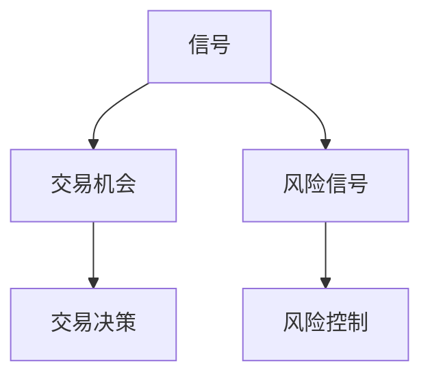
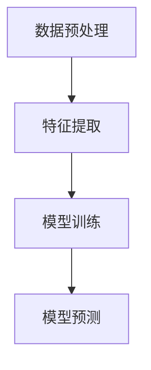
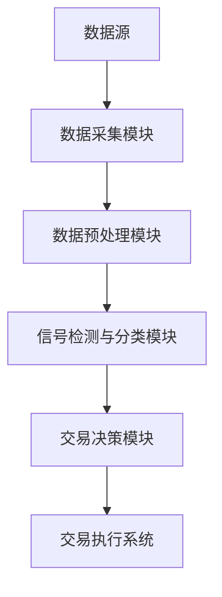

                 


# 《金融高频交易信号检测与分类》

> 关键词：金融高频交易、信号检测、信号分类、机器学习、深度学习、时间序列分析

> 摘要：本文系统地探讨了金融高频交易中的信号检测与分类方法，分析了统计学、机器学习和深度学习在这一领域的应用，通过实际案例展示了如何利用这些技术实现高效的信号检测与分类，最后总结了当前技术的优势与挑战，并展望了未来的发展方向。

---

# 第一章：金融高频交易信号检测与分类概述

## 1.1 金融高频交易的定义与特点

### 1.1.1 金融高频交易的定义
金融高频交易（High-Frequency Trading, HFT）是指在极短时间内进行大量金融资产交易的一种交易策略。其核心在于利用算法和计算机技术捕捉市场中的微小价格波动，通过高频交易系统快速执行交易。

### 1.1.2 高频交易的特点与优势
- **高速性**：高频交易依赖于高速的网络和计算机系统，能够在极短时间内完成交易。
- **自动化**：交易决策和执行过程高度自动化，减少人为干预。
- **低延迟**：从数据获取到交易执行的时间间隔极短，通常以毫秒甚至微秒为单位。
- **大数据处理**：高频交易需要处理海量数据，包括市场数据、历史数据等。

### 1.1.3 高频交易的市场影响
高频交易虽然提高了市场的流动性和价格发现效率，但也带来了一些负面影响，如加剧市场波动、增加系统性风险等。

## 1.2 信号检测与分类的背景

### 1.2.1 信号检测的定义
信号检测是指在金融市场中，通过分析市场数据，识别出异常的市场行为或模式的过程。这些异常可能是潜在的交易机会或风险信号。

### 1.2.2 信号分类的必要性
在高频交易中，信号分类是将检测到的信号进一步归类，以便交易系统能够根据不同的信号类型采取相应的交易策略。例如，将信号分为买入信号、卖出信号和观望信号。

### 1.2.3 高频交易中信号检测与分类的应用场景
- **市场异动监测**：检测市场中的异常波动，及时采取应对措施。
- **交易机会捕捉**：通过信号检测和分类，快速识别潜在的交易机会。
- **风险控制**：通过信号分类，识别潜在风险信号，及时调整交易策略。

## 1.3 问题背景与挑战

### 1.3.1 高频交易中的常见问题
- 数据量大：高频交易需要处理海量数据，对数据处理能力要求高。
- 数据延迟：数据获取的延迟可能导致交易决策失误。
- 市场微扰：高频交易可能加剧市场波动，影响市场稳定性。

### 1.3.2 信号检测与分类的主要挑战
- **数据噪声**：金融市场数据通常包含大量噪声，如何有效提取有用信号是一个难题。
- **模型过拟合**：在信号检测与分类中，模型容易过拟合训练数据，导致泛化能力差。
- **实时性要求**：高频交易要求信号检测与分类必须在极短的时间内完成。

### 1.3.3 技术与业务的结合点
信号检测与分类需要结合金融市场的特点，利用先进的技术手段，如大数据分析、机器学习等，才能有效解决高频交易中的问题。

## 1.4 本章小结
本章主要介绍了金融高频交易的定义、特点及其对市场的影响力，探讨了信号检测与分类的背景及其在高频交易中的应用场景，最后分析了信号检测与分类的主要挑战和技术与业务的结合点。

---

# 第二章：信号检测与分类的核心概念

## 2.1 信号检测的基本原理

### 2.1.1 统计学方法在信号检测中的应用
统计学方法通过分析数据的分布特性，判断是否存在异常情况。例如，利用均值、方差等统计量进行异常检测。

### 2.1.2 机器学习方法在信号检测中的应用
机器学习方法通过训练模型，学习数据的特征，从而实现信号检测。常用的机器学习方法包括支持向量机（SVM）、随机森林（Random Forest）等。

### 2.1.3 深度学习方法在信号检测中的应用
深度学习方法通过构建多层神经网络，自动提取数据的特征，从而实现信号检测。常用的深度学习方法包括卷积神经网络（CNN）、循环神经网络（RNN）等。

## 2.2 信号分类的核心原理

### 2.2.1 监督学习在信号分类中的应用
监督学习方法需要标注好的训练数据，通过训练模型，学习信号的分类规则。例如，利用逻辑回归、SVM等方法进行信号分类。

### 2.2.2 无监督学习在信号分类中的应用
无监督学习方法不需要标注数据，通过聚类等技术将信号分成不同的类别。例如，利用K-means、DBSCAN等方法进行信号分类。

### 2.2.3 强化学习在信号分类中的应用
强化学习方法通过与环境的交互，学习最优的信号分类策略。例如，利用Q-Learning等方法进行信号分类。

## 2.3 核心概念对比与ER图

### 2.3.1 信号检测与分类的核心概念对比
| 对比维度 | 信号检测 | 信号分类 |
|----------|-----------|-----------|
| 定义     | 判断是否存在异常信号 | 将信号分为不同的类别 |
| 方法     | 统计学、机器学习、深度学习 | 监督学习、无监督学习、强化学习 |
| 应用     | 异常检测、风险预警 | 交易策略、市场分析 |

### 2.3.2 实体关系图


## 2.4 本章小结
本章主要介绍了信号检测与分类的核心概念，包括统计学方法、机器学习方法和深度学习方法在信号检测中的应用，以及监督学习、无监督学习和强化学习在信号分类中的应用，并通过对比分析和ER图展示了信号检测与分类的核心概念。

---

# 第三章：信号检测与分类的算法原理

## 3.1 统计学方法

### 3.1.1 时间序列分析
时间序列分析是一种通过分析数据的时间特性，预测未来趋势的方法。常用的统计学方法包括ARIMA模型等。

### 3.1.2 假设检验
假设检验是一种通过统计方法，判断数据是否符合某种假设的检验方法。例如，利用t检验判断数据均值是否显著不同。

### 3.1.3 贝叶斯推断
贝叶斯推断是一种基于概率的统计推断方法，通过先验概率和似然函数计算后验概率，从而进行信号检测。

## 3.2 机器学习方法

### 3.2.1 支持向量机（SVM）
支持向量机通过构建超平面，将数据分为不同的类别，适用于信号分类问题。

### 3.2.2 随机森林
随机森林通过构建多棵决策树，进行投票或平均，适用于信号分类和回归问题。

### 3.2.3 线性回归
线性回归通过建立线性模型，预测目标变量的值，适用于信号检测中的回归问题。

## 3.3 深度学习方法

### 3.3.1 卷积神经网络（CNN）
卷积神经网络通过卷积操作提取数据的空间特征，适用于图像和时间序列数据的信号检测。

### 3.3.2 循环神经网络（RNN）
循环神经网络通过循环结构处理序列数据，适用于时间序列数据的信号检测与分类。

### 3.3.3 图神经网络（GNN）
图神经网络通过处理图结构数据，适用于复杂关系数据的信号检测与分类。

## 3.4 算法流程图


## 3.5 本章小结
本章主要介绍了信号检测与分类的算法原理，包括统计学方法、机器学习方法和深度学习方法的具体实现，以及算法流程图的展示。

---

# 第四章：数学模型与公式推导

## 4.1 统计学方法的数学模型

### 4.1.1 ARIMA模型
ARIMA模型是一种常用的时间序列分析模型，适用于预测未来的趋势。其数学公式为：
$$ ARIMA(p, d, q) $$
其中，p为自回归阶数，d为差分阶数，q为移动平均阶数。

### 4.1.2 贝叶斯推断
贝叶斯推断通过计算后验概率，判断数据是否符合某种假设。其概率公式为：
$$ P(A|B) = \frac{P(B|A)P(A)}{P(B)} $$

## 4.2 机器学习方法的数学模型

### 4.2.1 支持向量机（SVM）
支持向量机通过构建超平面，将数据分为不同的类别。其目标函数为：
$$ \min_{w,b,\xi} \frac{1}{2}||w||^2 + C\sum_{i=1}^n \xi_i $$
约束条件为：
$$ y_i(w \cdot x_i + b) \geq 1 - \xi_i $$
$$ \xi_i \geq 0 $$

### 4.2.2 随机森林
随机森林通过构建多棵决策树，进行投票或平均，其预测结果是各棵决策树预测结果的平均值。

### 4.2.3 线性回归
线性回归通过最小二乘法，建立线性模型，预测目标变量的值。其目标函数为：
$$ \min_{\theta} \sum_{i=1}^n (y_i - \theta^T x_i)^2 $$

## 4.3 深度学习方法的数学模型

### 4.3.1 卷积神经网络（CNN）
卷积神经网络通过卷积操作提取数据的特征，其卷积层的数学表达式为：
$$ f(x) = \sum_{i=1}^k w_i x_i $$

### 4.3.2 循环神经网络（RNN）
循环神经网络通过循环结构处理序列数据，其递推公式为：
$$ s_t = \sigma(W_s s_{t-1} + W_x x_t) $$
$$ y_t = W_y s_t $$

### 4.3.3 图神经网络（GNN）
图神经网络通过处理图结构数据，其聚合函数为：
$$ s_v = \sigma\left(\sum_{u \in N(v)} W_{vu} s_u\right) $$

## 4.4 本章小结
本章主要介绍了信号检测与分类的数学模型，包括统计学方法、机器学习方法和深度学习方法的具体公式和推导过程。

---

# 第五章：系统分析与架构设计

## 5.1 问题场景介绍
在金融高频交易中，信号检测与分类系统需要实时处理海量数据，快速识别异常信号，并根据信号类型采取相应的交易策略。

## 5.2 系统功能设计

### 5.2.1 数据采集模块
数据采集模块负责从金融市场获取实时数据，包括股票价格、交易量等。

### 5.2.2 数据预处理模块
数据预处理模块对获取的数据进行清洗、标准化等处理，为后续的信号检测与分类提供干净的数据。

### 5.2.3 信号检测与分类模块
信号检测与分类模块利用统计学、机器学习和深度学习算法，对数据进行检测与分类，识别出异常信号并进行分类。

### 5.2.4 交易决策模块
交易决策模块根据检测与分类的结果，生成交易信号，并指导交易系统执行交易。

## 5.3 系统架构设计

### 5.3.1 系统架构图


### 5.3.2 系统功能模块的交互图


## 5.4 系统接口设计
系统接口设计需要考虑模块之间的数据传递和交互，确保各模块协同工作，实现高效的信号检测与分类。

## 5.5 本章小结
本章主要介绍了信号检测与分类系统的功能设计和架构设计，包括模块划分、系统架构图和系统功能模块的交互图。

---

# 第六章：项目实战与案例分析

## 6.1 环境安装与配置

### 6.1.1 数据获取
使用Yahoo Finance API获取股票价格数据。

### 6.1.2 环境配置
安装必要的Python库，如Pandas、NumPy、Scikit-learn、Keras等。

## 6.2 系统核心实现

### 6.2.1 数据预处理
对获取的股票价格数据进行清洗和标准化处理。

### 6.2.2 信号检测与分类
利用ARIMA模型、随机森林和LSTM网络进行信号检测与分类。

## 6.3 代码实现与解读

### 6.3.1 数据预处理代码
```python
import pandas as pd
import numpy as np

# 数据获取
data = pd.read_csv('stock_prices.csv')

# 数据清洗
data.dropna(inplace=True)
data['date'] = pd.to_datetime(data['date'])
data.set_index('date', inplace=True)
```

### 6.3.2 信号检测与分类代码
```python
from sklearn.ensemble import RandomForestClassifier
from keras.models import Sequential
from keras.layers import LSTM, Dense

# 随机森林分类
model = RandomForestClassifier()
model.fit(X_train, y_train)
y_pred = model.predict(X_test)

# LSTM网络分类
model = Sequential()
model.add(LSTM(units=64, input_shape=(timesteps, features)))
model.add(Dense(1, activation='sigmoid'))
model.compile(loss='binary_crossentropy', optimizer='adam', metrics=['accuracy'])
model.fit(X_train, y_train, epochs=10, batch_size=32)
```

### 6.3.3 结果分析与解读
通过混淆矩阵、准确率、召回率等指标，评估信号检测与分类模型的性能。

## 6.4 案例分析

### 6.4.1 实际案例
以某只股票为例，展示信号检测与分类的具体过程。

### 6.4.2 案例分析结果
通过实际案例分析，验证信号检测与分类模型的有效性，并总结经验教训。

## 6.5 本章小结
本章通过实际项目案例，展示了信号检测与分类系统的实现过程，包括环境配置、数据预处理、模型训练和结果分析。

---

# 第七章：总结与展望

## 7.1 本章总结
本文系统地探讨了金融高频交易信号检测与分类的方法，分析了统计学、机器学习和深度学习在这一领域的应用，通过实际案例展示了如何利用这些技术实现高效的信号检测与分类。

## 7.2 未来展望
未来，随着人工智能技术的不断发展，信号检测与分类在金融高频交易中的应用将更加广泛和深入。可能的发展方向包括：
- 结合自然语言处理技术，分析新闻和社交媒体对市场的影响。
- 利用量子计算技术，进一步提高信号检测与分类的效率和准确性。

## 7.3 本章小结
本章总结了全文的主要内容，并展望了未来的发展方向。

---

# 作者：AI天才研究院/AI Genius Institute & 禅与计算机程序设计艺术 /Zen And The Art of Computer Programming

