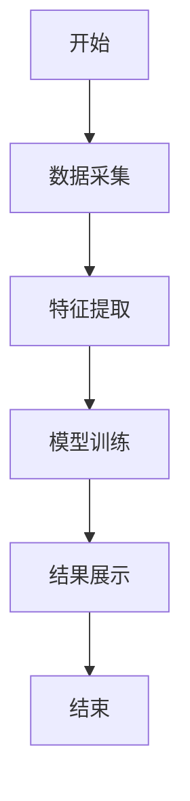
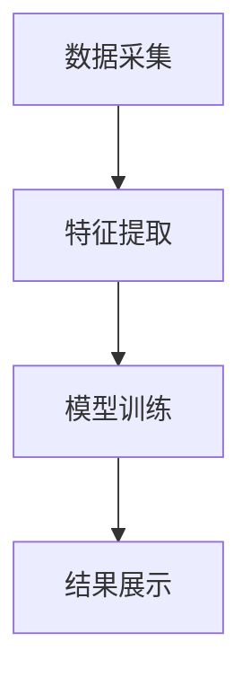

                 


# 金融高频交易异常模式识别系统

> 关键词：高频交易、异常模式识别、金融监管、机器学习、深度学习

> 摘要：本文深入探讨了金融高频交易中的异常模式识别问题，分析了其背景、核心概念和算法原理，提出了基于统计学、机器学习和深度学习的多种解决方案，并通过系统架构设计和项目实战展示了如何实现一个高效的异常模式识别系统。

---

## 第一章：高频交易与异常模式识别的背景与意义

### 1.1 高频交易的定义与特点

#### 1.1.1 高频交易的定义  
高频交易是指在极短时间内进行大量金融交易的一种交易方式，通常由算法驱动，依赖高速网络和高性能计算设备。其特点是交易频率高、自动化程度高、收益微薄但通过高频操作累积收益。

#### 1.1.2 高频交易的核心特点  
- **高速性**：交易决策和执行时间极短，通常在毫秒级别完成。  
- **自动化**：依赖算法和自动化交易系统。  
- **高频性**：每秒可以完成数百甚至数千次交易。  

#### 1.1.3 高频交易在金融市场的地位与作用  
高频交易通过算法优化市场流动性，降低了交易成本，但也带来了市场操纵、闪崩等风险，因此需要严格的监管和异常模式识别。

### 1.2 异常模式识别的必要性

#### 1.2.1 金融市场的异常交易现象  
- **市场操纵**：通过虚假交易影响市场价格。  
- **闪崩**：短时间内价格急剧下跌或上涨。  
- **异常波动**：偏离正常市场走势的波动。  

#### 1.2.2 异常模式识别的定义与目标  
异常模式识别是指通过分析交易数据，发现偏离正常模式的交易行为，从而识别潜在的异常事件。其目标是及时发现并应对市场操纵、欺诈等行为，维护市场公平性和稳定性。

#### 1.2.3 异常模式识别在金融监管中的作用  
- **风险预警**：提前发现潜在的市场风险。  
- **合规性检查**：确保交易行为符合法律法规。  
- **保护投资者**：避免投资者因异常交易遭受损失。  

### 1.3 本章小结  
高频交易的快速发展带来了异常交易现象的增加，异常模式识别在金融监管中的作用日益重要。通过识别异常交易模式，可以有效维护金融市场秩序。

---

## 第二章：异常模式识别的核心概念与原理

### 2.1 异常模式识别的核心概念与联系

#### 2.1.1 统计学方法在异常识别中的应用  
统计学方法通过分析数据的分布特征，发现异常值。常用的方法包括均值-方差法、Z-score法等。

#### 2.1.2 机器学习在异常识别中的应用  
机器学习通过训练模型，学习正常交易模式，并识别异常交易。常用算法包括支持向量机（SVM）、随机森林等。

#### 2.1.3 深度学习在异常识别中的应用  
深度学习通过多层神经网络提取数据特征，识别复杂模式。常用模型包括卷积神经网络（CNN）和循环神经网络（RNN）。

#### 2.1.4 异常模式识别的特征对比  
| 特征类型 | 统计特征 | 时间序列特征 | 网络行为特征 |
|----------|----------|--------------|------------|
| 示例 | 均值、方差 | 自相关性、周期性 | 请求频率、IP分布 |

#### 2.1.5 实体关系图与流程图  
以下是实体关系图（ER图）和流程图（Mermaid）：

```mermaid
erDiagram
    customer[CUSTOMER] {
        customer_id : integer
        name : string
    }
    transaction[TRANSACTION] {
        transaction_id : integer
        time : datetime
        amount : float
    }
    market_data[MARKET_DATA] {
        market_id : integer
        price : float
        volume : integer
    }
    customer --> transaction : 发起交易
    transaction --> market_data : 影响市场数据
```



### 2.2 异常模式识别的算法原理

#### 2.2.1 统计学方法
- **马尔可夫链模型**：用于分析时间序列数据，通过状态转移概率发现异常行为。
  $$ P(X_{t+1}=x|X_t=x') = \theta_{x',x} $$
- **高斯混合模型**：假设数据服从混合高斯分布，通过EM算法估计参数，识别异常值。

#### 2.2.2 机器学习方法
- **支持向量机（SVM）**：通过非线性分类，识别异常交易。
  $$ \text{max} \sum_{i=1}^n y_i (\cdot w \cdot x_i + b) $$
- **随机森林**：通过投票机制，识别异常点。

#### 2.2.3 深度学习方法
- **卷积神经网络（CNN）**：用于时间序列数据的特征提取，识别复杂模式。
  $$ a^{(l+1)} = \sigma(w^{(l)} \cdot a^{(l)} + b^{(l)}) $$
- **循环神经网络（RNN）**：用于处理序列数据，捕捉时序特征。

### 2.3 异常模式识别的数学模型与公式

#### 2.3.1 统计学模型
- **马尔可夫链模型公式**：
  $$ P(X_{t+1}=x|X_t=x') = \theta_{x',x} $$

#### 2.3.2 机器学习模型
- **支持向量机（SVM）公式**：
  $$ \text{max} \sum_{i=1}^n y_i (\cdot w \cdot x_i + b) $$

#### 2.3.3 深度学习模型
- **卷积神经网络（CNN）公式**：
  $$ a^{(l+1)} = \sigma(w^{(l)} \cdot a^{(l)} + b^{(l)}) $$

### 2.4 异常模式识别的系统分析与架构设计

#### 2.4.1 系统功能设计
- **数据采集模块**：收集高频交易数据，包括时间戳、交易金额、交易频率等。
- **特征提取模块**：提取统计特征、时间序列特征和网络行为特征。
- **模型训练模块**：训练统计模型、机器学习模型和深度学习模型。
- **结果展示模块**：可视化异常交易事件，生成预警报告。

#### 2.4.2 系统架构设计
以下是系统架构图：



#### 2.4.3 系统接口设计
- **数据接口**：提供REST API，供其他系统调用交易数据。
- **模型接口**：提供API，供其他系统调用异常检测模型。
- **用户接口**：提供Web界面，供用户查看异常交易报告。

## 第三章：异常模式识别的项目实战

### 3.1 环境安装与配置

#### 3.1.1 Python环境安装
```bash
python --version
pip install --upgrade pip
```

#### 3.1.2 依赖库安装
```bash
pip install numpy pandas scikit-learn tensorflow
```

#### 3.1.3 数据集准备
使用金融交易数据集，包括正常交易和异常交易两类数据。

### 3.2 系统核心实现源代码

#### 3.2.1 数据采集模块
```python
import pandas as pd

def collect_data():
    # 示例代码，从数据库中采集数据
    data = pd.read_sql("SELECT * FROM transactions", con='数据库连接')
    return data

# 示例输出
print(collect_data().head())
```

#### 3.2.2 特征提取模块
```python
import numpy as np

def extract_features(data):
    # 统计特征
    mean = data['amount'].mean()
    std = data['amount'].std()
    
    # 时间序列特征
    diff = data['amount'].diff().abs()
    
    return mean, std, diff

# 示例输出
features = extract_features(data)
print(features)
```

#### 3.2.3 模型训练模块
```python
from sklearn.svm import OneClassSVM

def train_model(X_train):
    model = OneClassSVM()
    model.fit(X_train)
    return model

# 示例输出
model = train_model(X_train)
```

#### 3.2.4 结果展示模块
```python
import matplotlib.pyplot as plt

def plot_anomalies(data, predictions):
    plt.figure(figsize=(10, 6))
    plt.plot(data['time'], data['amount'], label='正常交易')
    plt.scatter(data['time'], data['amount'], c=predictions, cmap='viridis', label='异常交易')
    plt.xlabel('时间')
    plt.ylabel('金额')
    plt.legend()
    plt.show()

# 示例输出
plot_anomalies(data, predictions)
```

### 3.3 实际案例分析

#### 3.3.1 数据预处理
```python
data = pd.DataFrame({
    'time': [1, 2, 3, 4, 5],
    'amount': [100, 200, 300, 400, 500]
})

print(data)
```

#### 3.3.2 模型训练与预测
```python
X_train = data[['amount']]
model = train_model(X_train)
predictions = model.predict(data[['amount']])
```

#### 3.3.3 结果展示
```python
plot_anomalies(data, predictions)
```

### 3.4 项目小结

通过实际案例分析，我们展示了如何利用统计学和机器学习方法实现异常模式识别。该系统能够有效识别高频交易中的异常行为，为金融监管提供有力支持。

---

## 第四章：异常模式识别的总结与展望

### 4.1 本章总结
本文详细探讨了金融高频交易异常模式识别的问题，分析了其核心概念和算法原理，并通过项目实战展示了其实现过程。统计学方法、机器学习和深度学习方法各有所长，适用于不同场景。

### 4.2 未来展望
未来，异常模式识别将更加依赖深度学习技术，特别是Transformer架构在时间序列数据中的应用。此外，实时性要求的提高将推动边缘计算和分布式架构的发展。

### 4.3 最佳实践 Tips
- 在实际应用中，建议结合多种方法进行异常检测，提高准确性。
- 数据预处理和特征工程是关键，需投入足够时间和资源。
- 定期更新模型，以应对市场变化和新的异常模式。

---

## 作者

作者：AI天才研究院/AI Genius Institute & 禅与计算机程序设计艺术 /Zen And The Art of Computer Programming

---

通过以上思考，我们可以看到，异常模式识别在金融高频交易中的重要性，以及如何利用多种技术手段实现高效的异常检测系统。希望本文对读者在该领域的研究和实践有所帮助。

