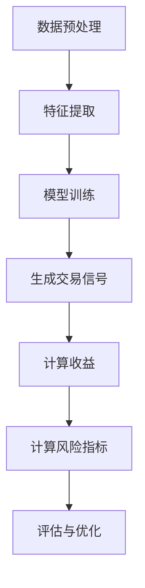
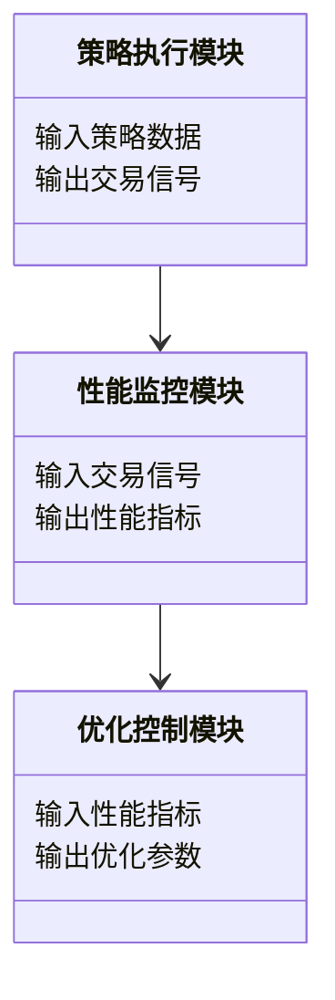
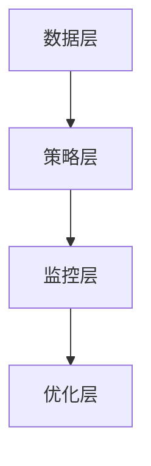

                 


# 《金融高频交易策略性能评估与优化框架》

> 关键词：金融高频交易、策略性能评估、优化框架、机器学习、算法优化、系统架构

> 摘要：本文系统地探讨了金融高频交易策略的性能评估与优化框架，从核心概念、算法原理到系统架构设计，结合实际案例，详细分析了如何构建高效、可靠的评估与优化体系，为金融交易领域的技术实践提供了深度指导。

---

# 第一部分: 背景介绍与核心概念

# 第1章: 高频交易与性能评估概述

## 1.1 高频交易的基本概念

### 1.1.1 高频交易的定义与特点

高频交易（High-Frequency Trading, HFT）是一种通过计算机算法在极短时间内进行大量金融交易的策略。其核心在于利用市场微小的价格差异，通过快速买卖操作获利。高频交易的特点包括：

- **高速性**：交易决策和执行时间极短，通常在 milliseconds 级别。
- **高频性**：每秒可执行数千次甚至数万次交易。
- **自动化**：依赖算法和自动化系统，减少人为干预。
- **低延迟**：对交易系统的延迟要求极高，通常在 microseconds 级别。

### 1.1.2 高频交易的市场影响

高频交易对金融市场的影响巨大，包括：

- 提高市场流动性：高频交易增加了市场的买卖深度，使得价格更接近真实价值。
- 降低交易成本：通过算法优化，减少了每笔交易的费用。
- 增加市场波动：高频交易可能导致市场的短期剧烈波动，引发“闪崩”等现象。

### 1.1.3 高频交易的核心要素

高频交易的核心要素包括：

1. **算法设计**：策略的逻辑和执行规则。
2. **数据源**：实时市场数据、历史数据等。
3. **交易系统架构**：包括数据获取、策略执行、订单提交等模块。
4. **延迟优化**：系统各环节的延迟必须极低。

## 1.2 性能评估的重要性

### 1.2.1 交易策略的性能评估目标

性能评估的目标在于量化策略的表现，并通过优化提升其收益与风险控制能力。主要目标包括：

1. **最大化收益**：在风险可控的前提下，提升策略的盈利能力。
2. **控制风险**：确保策略在极端市场条件下不会崩盘。
3. **稳定性与一致性**：策略在不同市场环境下的表现应稳定一致。

### 1.2.2 性能评估的常见指标

常用的性能评估指标包括：

1. **收益指标**：
   - 年化收益（Annualized Returns）
   - 夏普比率（Sharpe Ratio）
2. **风险指标**：
   - 最大回撤（Maximum Drawdown）
   - 波动率（Volatility）
3. **交易成本**：
   - 每笔交易的佣金、滑点等成本。
4. **执行效率**：
   - 策略的执行速度和延迟。

### 1.2.3 优化框架的必要性

优化框架的作用在于：

- 提供系统化的策略优化流程。
- 通过数据分析和算法优化，提升策略的性能。
- 降低人为干预，提高策略的可重复性和一致性。

## 1.3 本章小结

本章从高频交易的基本概念、市场影响以及性能评估的重要性入手，明确了优化框架的必要性，为后续章节奠定了基础。

---

# 第二部分: 核心概念与联系

# 第2章: 高频交易策略性能评估的核心概念

## 2.1 性能评估指标

### 2.1.1 盈利能力指标

盈利能力指标是衡量策略赚钱能力的关键。常用的指标包括：

- **年化收益**：策略在一年内的平均收益。
- **夏普比率**：衡量单位风险下的超额收益。
- **最大回撤**：策略在运行过程中从最高点到最低点的损失幅度。

### 2.1.2 风险控制指标

风险控制指标用于评估策略在面对市场波动时的稳定性。常见的指标包括：

- **波动率**：资产价格的波动程度。
- **VaR（Value at Risk）**：在一定置信水平下，可能的最大损失。
- **最大回撤恢复时间**：从最大回撤中恢复到原高点的时间。

### 2.1.3 稳定性与一致性指标

稳定性指标用于评估策略在不同市场环境下的表现一致性。常见的指标包括：

- **胜率**：策略交易中盈利的比例。
- **平均收益/损失比**：盈利交易的平均收益与亏损交易的平均损失的比值。
- **最大连续亏损**：策略在运行中出现的最大连续亏损次数。

## 2.2 优化方法与框架

### 2.2.1 策略优化的核心原理

策略优化的核心在于通过调整参数、改进算法或优化执行逻辑，提升策略的性能。常见的优化方法包括：

- **参数优化**：通过回测和调整策略参数，找到最优组合。
- **算法优化**：改进交易逻辑，减少无效交易，提高执行效率。
- **延迟优化**：降低系统各环节的延迟，确保快速响应。

### 2.2.2 优化框架的构建步骤

优化框架的构建通常包括以下几个步骤：

1. **需求分析**：明确优化目标和范围。
2. **数据采集**：获取足够的历史和实时数据。
3. **策略分析**：对现有策略进行分析，找出瓶颈。
4. **优化实施**：通过算法优化、参数调整等方式提升性能。
5. **测试与验证**：通过回测和实盘测试验证优化效果。
6. **持续优化**：根据市场变化和策略表现，持续优化框架。

### 2.2.3 框架的核心要素与模块

优化框架的核心要素包括：

- **数据采集模块**：负责实时数据的获取和处理。
- **策略执行模块**：负责策略的运行和交易执行。
- **性能监控模块**：实时监控策略的表现，提供反馈。
- **优化控制模块**：根据监控结果，自动调整策略参数或执行优化操作。

## 2.3 核心概念的联系

### 2.3.1 策略、性能与优化的关系

策略、性能与优化三者是相互关联的。策略的性能决定了优化的方向和目标，而优化则是提升策略性能的重要手段。

### 2.3.2 指标、算法与框架的协同作用

指标用于量化策略的表现，算法是优化的核心工具，框架则是整合这些工具的平台。三者协同作用，才能实现高效的优化。

### 2.3.3 实际场景中的应用案例

以一个简单的均值回归策略为例，假设我们发现策略的胜率较低，可以通过调整参数、改进算法或优化执行逻辑来提升其表现。例如，增加过滤条件，减少无效信号，或者优化订单执行速度。

## 2.4 本章小结

本章详细阐述了高频交易策略性能评估的核心概念，分析了各指标和优化方法的联系，并通过实际案例说明了其应用。

---

# 第三部分: 算法原理与数学模型

# 第3章: 性能评估的算法原理

## 3.1 算法概述

### 3.1.1 算法的输入与输出

- **输入**：
  - 历史价格数据
  - 交易信号
  - 策略参数
- **输出**：
  - 策略的收益曲线
  - 性能评估指标

### 3.1.2 算法的基本流程

1. **数据预处理**：清洗数据，处理缺失值和异常值。
2. **特征提取**：从原始数据中提取有用的特征，如技术指标、市场情绪指标等。
3. **模型训练**：基于特征数据，训练机器学习模型，生成交易信号。
4. **性能评估**：计算各项性能指标，评估策略的表现。
5. **优化调整**：根据评估结果，调整策略参数或算法，提升性能。

### 3.1.3 算法的复杂度分析

以机器学习模型为例，算法的复杂度通常包括：

- **时间复杂度**：模型训练和预测所需的时间。
- **空间复杂度**：模型所需存储空间。

例如，随机森林算法的时间复杂度为 O(n*m^2)，其中 n 是样本数量，m 是特征数量。

## 3.2 数学模型与公式

### 3.2.1 盈利能力模型

收益计算公式：

$$
\text{收益} = \sum_{i=1}^{n} (p_i - c_i) \times q_i
$$

其中，$p_i$ 是卖出价格，$c_i$ 是买入价格，$q_i$ 是交易数量。

### 3.2.2 风险控制模型

夏普比率公式：

$$
\text{夏普比率} = \frac{E[r_p - r_f]}{\sigma_p}
$$

其中，$E[r_p - r_f]$ 是策略的超额收益期望值，$\sigma_p$ 是策略收益的标准差。

### 3.2.3 稳定性评估模型

最大回撤计算公式：

$$
\text{最大回撤} = \max_{i} (M_i - m_i)
$$

其中，$M_i$ 是历史高点，$m_i$ 是当前回撤低点。

## 3.3 算法流程图



## 3.4 本章小结

本章详细讲解了高频交易策略性能评估的算法原理，包括输入输出、基本流程、复杂度分析以及数学模型。

---

# 第四部分: 系统分析与架构设计

# 第4章: 优化框架的系统分析

## 4.1 系统功能设计

### 4.1.1 领域模型设计

系统功能模块包括：

1. **数据采集模块**：实时获取市场数据。
2. **策略执行模块**：根据策略生成交易信号。
3. **性能监控模块**：实时监控策略表现。
4. **优化控制模块**：根据监控结果优化策略。

### 4.1.2 领域模型类图



## 4.2 系统架构设计

### 4.2.1 架构概述

优化框架的系统架构通常包括以下几个层次：

1. **数据层**：存储历史和实时数据。
2. **策略层**：实现具体的交易策略。
3. **监控层**：监控策略表现并提供反馈。
4. **优化层**：根据反馈优化策略。

### 4.2.2 架构图



## 4.3 本章小结

本章从系统功能设计和架构设计两个方面，详细分析了优化框架的构建过程。

---

# 第五部分: 项目实战

# 第5章: 优化框架的实现与应用

## 5.1 环境安装与配置

### 5.1.1 开发环境

- **编程语言**：Python
- **框架工具**：使用 QuantLib 或 backtrader 进行回测。
- **数据源**：接入实时数据源，如 Bloomberg 或 Thomson Reuters。

### 5.1.2 系统架构配置

- **数据采集模块**：使用 WebSocket 获取实时数据。
- **策略执行模块**：基于机器学习模型生成交易信号。
- **性能监控模块**：使用监控工具（如 Zabbix）实时监控。

## 5.2 核心实现代码

### 5.2.1 数据预处理

```python
import pandas as pd
import numpy as np

# 数据清洗
def preprocess_data(data):
    data = data.dropna()
    data = data[~data.isin([np.nan, np.inf, -np.inf]).any(axis=1)]
    return data
```

### 5.2.2 策略实现

```python
import backtrader as bt

class MyStrategy(bt.Strategy):
    def __init__(self):
        self.data = self.datas[0]
        self.order = None

    def next(self):
        if self.order:
            return
        if self.data.close > self.data.sma(20):
            self.order = self.buy()
        elif self.data.close < self.data.sma(20):
            self.order = self.sell()
```

### 5.2.3 性能评估

```python
from backtrader.analyzers import SharpeRatio

cerebro = bt.Cerebro()
cerebro.addstrategy(MyStrategy)
cerebro.broker = bt.Broker(meta_broker='InteractiveBrokers')
cerebro.add_analyzer(SharpeRatio)
```

## 5.3 案例分析与解读

以一个简单的均值回归策略为例，假设我们使用双均线策略，通过回测发现策略在某些市场环境下表现不佳。此时，我们可以通过优化模块调整均线的长度，或者引入更多的过滤条件，如成交量配合，来提升策略的胜率。

## 5.4 本章小结

本章通过实际项目的实现，详细讲解了优化框架的构建过程，包括环境配置、代码实现和案例分析。

---

# 第六部分: 最佳实践与总结

# 第6章: 最佳实践与小结

## 6.1 最佳实践

### 6.1.1 数据质量管理

确保数据的准确性、完整性和及时性是优化框架成功的关键。建议采用多种数据源进行交叉验证，并建立完善的数据清洗机制。

### 6.1.2 策略优化策略

- **参数优化**：通过网格搜索、随机搜索等方法寻找最优参数组合。
- **算法优化**：采用更高效的算法，如强化学习、遗传算法等。
- **延迟优化**：从硬件到软件各环节进行优化，减少交易延迟。

### 6.1.3 系统监控与维护

建立完善的监控体系，实时跟踪策略表现和系统健康状况。定期回顾和优化策略逻辑，以适应市场变化。

## 6.2 小结

通过本文的系统分析和实际案例，我们详细探讨了金融高频交易策略性能评估与优化框架的构建过程，为读者提供了从理论到实践的全面指导。

## 6.3 注意事项

- 高频交易对系统的要求极高，必须确保各环节的延迟控制在可接受范围内。
- 策略的优化需要结合市场实际情况，避免过度优化导致的过拟合问题。
- 在实盘交易前，建议进行充分的回测和模拟交易，确保策略的稳定性和可靠性。

## 6.4 拓展阅读

- 《Algorithmic Trading: Winning Strategies and Their Rationale》
- 《Python for Algorithmic Trading: Mastering Strategies Trading'
- 《Quantitative Trading with Python》

---

# 作者：AI天才研究院/AI Genius Institute & 禅与计算机程序设计艺术 /Zen And The Art of Computer Programming

---

这篇文章系统地探讨了金融高频交易策略性能评估与优化框架的构建与应用，从背景介绍到系统设计，再到项目实战，结合丰富的图表和代码示例，为读者提供了全面的技术指导。希望对从事金融高频交易的读者有所帮助！

