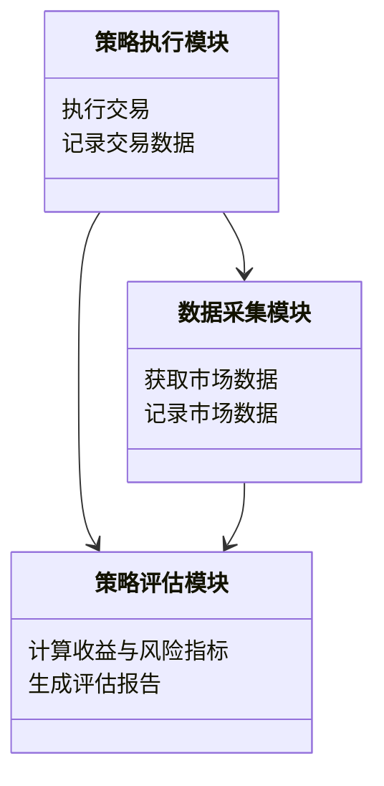
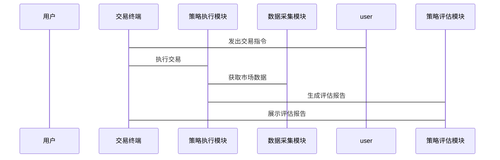

                 


# 《金融高频交易策略性能评估框架》

**关键词**：高频交易，性能评估，金融策略，算法交易，系统架构

**摘要**：本文系统性地探讨了金融高频交易策略的性能评估框架。首先介绍了高频交易的定义、特点及其在现代金融中的重要性。接着，详细阐述了高频交易策略性能评估的核心概念，包括评估维度、指标和方法。然后，深入分析了统计套利和机器学习模型在高频交易中的应用，并通过算法流程图和数学公式进行了详细讲解。随后，讨论了评估框架的系统架构设计，包括功能设计、架构图和交互流程。最后，通过项目实战展示了如何实现高频交易策略性能评估框架，并探讨了高级主题和最佳实践。

---

## 第一部分：金融高频交易策略概述

### 第1章：高频交易的定义与特点

#### 1.1 高频交易的定义
高频交易（High-Frequency Trading, HFT）是指在极短时间内以高频次进行的交易行为，其特点包括：
- **高频性**：交易执行速度极快，通常以毫秒为单位。
- **自动化**：依赖算法和自动化交易系统，减少人为干预。
- **低延迟**：对交易执行的延迟要求极低，通常在 microseconds 级别。
- **大数据驱动**：依赖实时数据和高频数据分析。

#### 1.2 高频交易在金融中的重要性
高频交易在现代金融中扮演着重要角色：
- **提升市场流动性**：通过高频交易，市场买卖价差缩小，提高流动性。
- **降低交易成本**：高频交易通过自动化和算法优化，降低交易成本。
- **风险控制**：高频交易系统能够实时监控和调整交易策略，有效控制风险。

---

## 第二部分：性能评估的核心概念

### 第2章：高频交易策略性能评估的基本维度

#### 2.1 评估维度的定义
高频交易策略的性能评估可以从以下几个维度进行：

| 评估维度 | 定义 | 关注点 |
|----------|------|--------|
| 收益性   | 策略的盈利能力 | Sharpe比率、最大回撤、夏普比率 |
| 风险性   | 策略的风险水平 | VaR（Value at Risk）、波动率、最大回撤 |
| 稳定性   | 策略在不同市场环境下的表现一致性 | 索提诺比率、一致性比率 |
| 执行效率 | 策略的执行速度和成本 | 交易延迟、滑点、交易费用 |

#### 2.2 评估指标对比
以下是一个评估指标对比的表格：

| 指标名称 | 定义 | 适用场景 | 优缺点 |
|----------|------|----------|--------|
| Sharpe比率 | 衡量收益与风险的比值 | 评估策略的长期盈利能力 | 考虑了风险因素，但假设资产回报呈正态分布 |
| 夏普比率 | 同上 | 同上 | 同上 |
| VaR | 在一定置信水平下，可能的最大损失 | 评估策略的风险承受能力 | 依赖于假设和模型准确性 |
| 最大回撤 | 策略在一定时间段内的最大亏损 | 评估策略的最大潜在损失 | 受极端事件影响较大 |

---

## 第三部分：评估框架的算法原理

### 第3章：高频交易策略性能评估的算法实现

#### 3.1 统计套利算法
统计套利是一种基于价格差异的套利策略，常见于高频交易中。

##### 3.1.1 统计套利的基本原理
统计套利的核心思想是利用同一资产在不同市场或不同交易平台之间的价格差异进行套利。

##### 3.1.2 统计套利的数学模型
假设两个市场的价格分别为 $p_1$ 和 $p_2$，统计套利的收益为：
$$ \text{收益} = \min(p_1, p_2) - \max(p_1, p_2) $$
当 $p_1 \neq p_2$ 时，存在套利机会。

##### 3.1.3 算法流程图（使用mermaid）
```mermaid
graph TD
    A[开始] -> B[收集市场数据]
    B -> C[计算价格差异]
    C -> D[判断是否存在套利机会]
    D -> E[执行交易]
    E -> F[结束]
```

#### 3.2 机器学习模型的应用
机器学习模型在高频交易中的应用主要集中在预测市场趋势和优化交易策略。

##### 3.2.1 常见机器学习模型
- 支持向量机（SVM）
- 随机森林（Random Forest）
- 神经网络（Neural Networks）

##### 3.2.2 神经网络模型的实现流程
```mermaid
graph TD
    A[输入市场数据] -> B[特征提取]
    B -> C[输入神经网络]
    C -> D[输出预测结果]
    D -> E[执行交易决策]
```

---

## 第四部分：系统分析与架构设计

### 第4章：评估框架的系统架构

#### 4.1 系统功能设计
系统功能设计主要围绕高频交易策略的执行和评估展开。

##### 4.1.1 领域模型（使用mermaid类图）


#### 4.2 系统架构设计
系统架构设计采用分层架构，包括数据层、业务逻辑层和用户界面层。

##### 4.2.1 系统架构图（使用mermaid架构图）
```mermaid
rectangle 数据层 {
    数据库
    接收市场数据
}
rectangle 业务逻辑层 {
    策略执行模块
    策略评估模块
}
rectangle 用户界面层 {
    交易终端
    评估报告展示
}
数据层 --> 业务逻辑层
业务逻辑层 --> 用户界面层
```

#### 4.3 系统接口与交互设计
系统接口主要涉及交易执行和数据采集。

##### 4.3.1 交互流程图（使用mermaid序列图）


---

## 第五部分：项目实战

### 第5章：高频交易策略性能评估框架的实现

#### 5.1 环境安装与配置
- 安装Python环境（如Anaconda）
- 安装必要的库（如Pandas、NumPy、Matplotlib）

#### 5.2 核心功能实现
##### 5.2.1 代码实现（统计套利示例）
```python
import pandas as pd
import numpy as np

# 示例数据
data = {
    'market1': [100, 101, 102, 103, 104],
    'market2': [102, 101, 100, 103, 105]
}

df = pd.DataFrame(data)

# 统计套利策略
max_profit = 0
for i in range(len(df)):
    for j in range(i+1, len(df)):
        spread = abs(df.iloc[i]['market1'] - df.iloc[j]['market2'])
        if spread > 0:
            profit = min(df.iloc[i]['market1'], df.iloc[j]['market2']) - max(df.iloc[i]['market1'], df.iloc[j]['market2'])
            if profit > max_profit:
                max_profit = profit

print(f"最大套利收益为: {max_profit}")
```

#### 5.2.2 代码解读
- 代码通过遍历数据，计算不同市场的价格差异，寻找套利机会。
- 使用简单的统计套利策略，计算最大套利收益。

#### 5.3 实际案例分析
假设我们有两个市场，市场A和市场B，数据如下：
| 时间 | 市场A价格 | 市场B价格 |
|------|----------|----------|
| t1   | 100      | 102      |
| t2   | 101      | 101      |
| t3   | 102      | 100      |
| t4   | 103      | 103      |
| t5   | 104      | 105      |

通过上述代码，我们可以计算出最大套利收益为 2（在t1时，市场A价格为100，市场B价格为102，套利收益为2）。

---

## 第六部分：高级主题与最佳实践

### 第6章：高级主题与最佳实践

#### 6.1 框架的优化与扩展
- **优化方向**：减少交易延迟，提高数据处理速度。
- **扩展方向**：引入更多数据源，增强模型的预测能力。

#### 6.2 实际应用中的注意事项
- **风险管理**：避免过度杠杆和极端风险。
- **系统稳定性**：确保交易系统在高负载下的稳定性。
- **合规性**：遵守相关金融监管规定。

#### 6.3 未来发展方向
- **AI与机器学习的结合**：利用深度学习技术提升交易策略的预测能力。
- **区块链技术的应用**：探索区块链在高频交易中的应用潜力。

---

## 作者信息

作者：AI天才研究院/AI Genius Institute & 禅与计算机程序设计艺术 /Zen And The Art of Computer Programming

---

# 结语
金融高频交易策略性能评估是一个复杂而重要的领域，需要结合金融知识、算法设计和系统架构的深入理解。通过本文的探讨，读者可以系统性地了解高频交易的定义、性能评估的核心概念、算法实现、系统架构设计以及实际项目中的应用。未来，随着技术的不断进步，高频交易策略的性能评估框架也将进一步优化和扩展。

