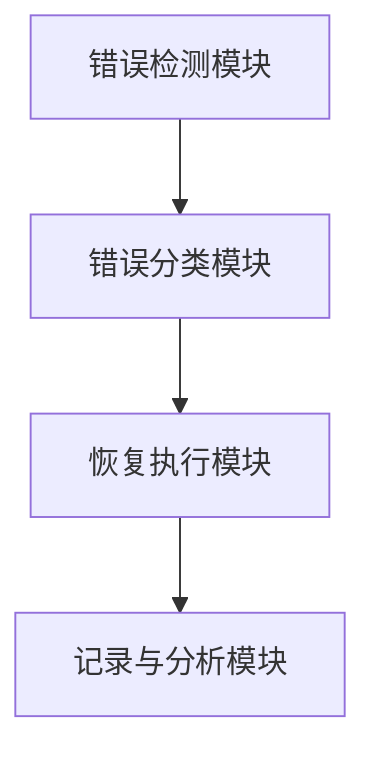
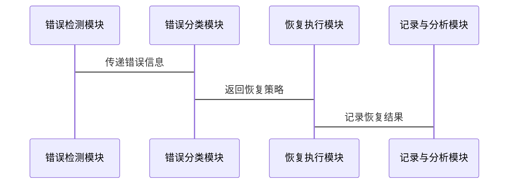

                 


# 错误处理与恢复：提高AI Agent的鲁棒性

> 关键词：错误处理、AI Agent、鲁棒性、恢复机制、系统架构

> 摘要：本文从AI Agent的错误处理与恢复机制出发，详细探讨了错误处理的核心概念、算法原理、系统架构设计以及项目实战。通过理论与实践相结合的方式，分析了如何设计和实现一个高效、可靠的错误处理与恢复系统，从而提高AI Agent的鲁棒性。

---

## 第一部分: 错误处理与恢复的基础概念

### 第1章: 错误处理与恢复的背景介绍

#### 1.1 错误处理的基本概念
##### 1.1.1 什么是错误
错误是系统运行中出现的异常情况，可能导致AI Agent的行为偏离预期目标。错误可以是输入错误、逻辑错误或外部环境变化引起的意外情况。

##### 1.1.2 错误的分类
错误可以分为以下几类：
1. **语法错误**：代码语法不符合编程语言规范。
2. **逻辑错误**：代码逻辑不符合预期，导致错误输出。
3. **输入错误**：输入数据不符合预期格式或范围。
4. **网络错误**：网络连接中断或超时。

##### 1.1.3 错误处理的目标
错误处理的目标是检测错误、隔离错误源、恢复系统到正常状态，并采取措施防止错误再次发生。

#### 1.2 AI Agent的定义与特点
##### 1.2.1 AI Agent的基本概念
AI Agent是一个智能代理，能够感知环境、执行任务并做出决策。AI Agent的核心特征包括自主性、反应性、目标导向性和社交能力。

##### 1.2.2 AI Agent的核心特点
1. **自主性**：AI Agent能够独立运行，无需外部干预。
2. **反应性**：能够实时感知环境并做出响应。
3. **目标导向性**：所有行为都围绕实现特定目标展开。
4. **社交能力**：能够与其他系统或人类进行交互。

#### 1.3 错误处理与恢复的重要性
##### 1.3.1 错误处理对系统鲁棒性的影响
错误处理是确保AI Agent在复杂环境中稳定运行的关键。良好的错误处理机制能够减少系统崩溃的可能性，提高系统的可用性。

##### 1.3.2 恢复机制对系统可用性的作用
恢复机制能够将系统从错误状态中恢复到正常状态，确保AI Agent的任务执行不受干扰。

##### 1.3.3 错误处理在AI Agent中的应用场景
1. **数据处理**：处理输入数据时可能出现格式错误或缺失。
2. **任务执行**：任务执行过程中可能出现资源不足或环境变化。
3. **人机交互**：用户输入错误或网络中断可能导致交互失败。

---

### 第2章: 错误处理的核心概念

#### 2.1 错误检测机制
##### 2.1.1 错误检测的基本原理
错误检测是通过监控系统运行状态，识别异常情况并触发相应的处理流程。

##### 2.1.2 错误检测的关键技术
1. **异常检测算法**：利用统计学或机器学习方法检测异常行为。
2. **日志分析**：通过分析系统日志发现潜在错误。
3. **状态监控**：实时监控系统状态，发现偏离预期的行为。

##### 2.1.3 错误检测的实现方法
1. **基于规则的检测**：定义预设规则，匹配日志或系统状态。
2. **基于统计的检测**：利用统计模型识别异常值。
3. **基于机器学习的检测**：训练模型识别异常模式。

#### 2.2 错误分类与处理策略
##### 2.2.1 错误的分类标准
错误可以根据严重性、来源和影响范围进行分类。

##### 2.2.2 常见错误类型及其特征
1. **致命错误**：导致系统崩溃的严重错误。
2. **非致命错误**：可以忽略或恢复的轻微错误。
3. **资源相关错误**：与资源不足或超限相关的错误。

##### 2.2.3 错误处理的优先级与策略
1. **优先级**：根据错误的影响范围和严重性确定处理顺序。
2. **处理策略**：隔离错误源、记录错误信息、触发恢复机制。

#### 2.3 错误恢复技术
##### 2.3.1 错误恢复的基本原理
错误恢复是将系统从错误状态转移到正常状态的过程，通常包括回滚、重试和替代方案。

##### 2.3.2 常见恢复方法
1. **回滚**：将系统状态恢复到最近的一致状态。
2. **重试**：重新执行失败的操作，直到成功或达到重试上限。
3. **替代方案**：采用备用策略或资源继续执行任务。

##### 2.3.3 恢复过程中的挑战与解决方案
1. **不可逆操作**：某些错误可能导致数据丢失，需要通过日志恢复。
2. **依赖冲突**：恢复过程中可能涉及多个组件，需要协调一致。

---

### 第3章: 错误处理与恢复的数学模型

#### 3.1 错误检测的数学模型
##### 3.1.1 错误概率模型
错误概率模型通过概率分布描述错误发生的可能性。

##### 3.1.2 错误检测的统计方法
利用统计方法分析系统日志，发现异常模式。

##### 3.1.3 错误检测的优化算法
1. **马尔可夫链模型**：用于建模系统状态转移，检测异常状态。
2. **贝叶斯网络**：用于分类错误类型，预测错误发生的概率。

#### 3.2 错误恢复的数学模型
##### 3.2.1 基于概率的恢复模型
利用概率论确定恢复策略的有效性。

##### 3.2.2 基于马尔可夫链的恢复过程
马尔可夫链模型用于描述恢复过程中的状态转移，优化恢复路径。

##### 3.2.3 恢复过程的优化方法
1. **动态规划**：用于选择最优恢复路径。
2. **贪心算法**：在每一步选择局部最优解，逐步接近全局最优。

---

### 第4章: 错误处理与恢复的算法实现

#### 4.1 错误检测算法
##### 4.1.1 基于监督学习的错误检测
利用分类算法（如SVM、随机森林）训练错误检测模型。

##### 4.1.2 基于无监督学习的错误检测
使用聚类算法（如K-means、DBSCAN）发现异常模式。

##### 4.1.3 基于强化学习的错误检测
通过强化学习算法训练智能体，识别异常状态。

#### 4.2 错误恢复算法
##### 4.2.1 基于上下文的恢复算法
根据错误发生时的上下文信息，选择合适的恢复策略。

##### 4.2.2 基于规则的恢复算法
根据预设规则恢复系统状态。

##### 4.2.3 基于机器学习的恢复算法
利用预测模型选择最优恢复路径。

---

### 第5章: 错误处理与恢复的系统架构设计

#### 5.1 系统功能设计
##### 5.1.1 错误检测模块
负责实时监控系统状态，识别异常情况。

##### 5.1.2 错误分类模块
对检测到的错误进行分类，确定错误类型和严重性。

##### 5.1.3 恢复执行模块
根据错误分类结果，执行相应的恢复策略。

##### 5.1.4 记录与分析模块
记录错误信息，分析错误发生的原因，优化错误处理机制。

#### 5.2 系统架构图


#### 5.3 系统接口设计
1. **错误检测接口**：提供系统状态监控和日志分析功能。
2. **错误分类接口**：接收错误信息，返回错误类型。
3. **恢复执行接口**：接收恢复策略，执行恢复操作。
4. **记录与分析接口**：记录错误信息，提供分析报告。

#### 5.4 系统交互序列图


---

### 第6章: 项目实战

#### 6.1 环境配置
1. **编程语言**：Python 3.8+
2. **框架与库**：TensorFlow 2.5+、Scikit-learn 0.24+
3. **开发工具**：Jupyter Notebook、PyCharm

#### 6.2 系统核心实现
##### 6.2.1 错误检测模块实现
```python
import logging
from sklearn.ensemble import IsolationForest

# 错误检测模型训练
def train_error_detector(X_train, y_train):
    model = IsolationForest(n_estimators=100, random_state=42)
    model.fit(X_train)
    return model

# 错误检测
def detect_error(X_test, model):
    y_pred = model.predict(X_test)
    return y_pred
```

##### 6.2.2 错误分类模块实现
```python
from sklearn.svm import SVC

# 错误分类模型训练
def train_error_classifier(X_train, y_train):
    model = SVC(gamma='auto', random_state=42)
    model.fit(X_train, y_train)
    return model

# 错误分类
def classify_error(X_test, model):
    y_pred = model.predict(X_test)
    return y_pred
```

##### 6.2.3 恢复执行模块实现
```python
def execute_recovery(recovery_strategy):
    if recovery_strategy == 'rollback':
        # 回滚到最近一致状态
        pass
    elif recovery_strategy == 'retry':
        # 重试操作
        pass
    elif recovery_strategy == 'fallback':
        # 使用备用策略
        pass
```

#### 6.3 案例分析
以股票交易AI Agent为例，说明如何设计错误处理与恢复机制。通过具体代码实现和数据分析，验证系统的鲁棒性。

#### 6.4 项目总结
总结项目实施过程中的经验和教训，提出改进建议。

---

## 第七章: 高级主题与最佳实践

### 7.1 错误处理的前沿技术
1. **自适应恢复机制**：根据环境动态调整恢复策略。
2. **分布式系统中的错误处理**：在微服务架构中实现分布式错误处理与恢复。

### 7.2 最佳实践
1. **日志管理**：建立完善的日志系统，便于错误分析和排查。
2. **监控与报警**：实时监控系统状态，及时发现错误。
3. **容错设计**：在系统设计阶段考虑容错机制，降低错误影响。
4. **定期演练**：模拟各种错误场景，验证恢复机制的有效性。

### 7.3 小结
通过本文的分析与实践，我们可以看到错误处理与恢复是提高AI Agent鲁棒性的关键。在实际应用中，需要结合理论与实践，设计高效的错误处理与恢复机制，确保系统的稳定运行。

---

作者：AI天才研究院 & 禅与计算机程序设计艺术

