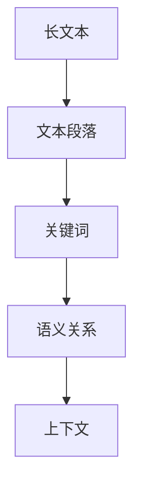
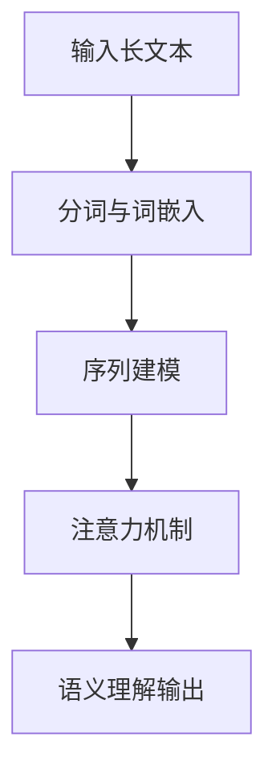
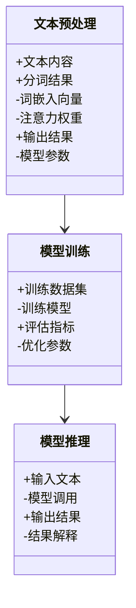
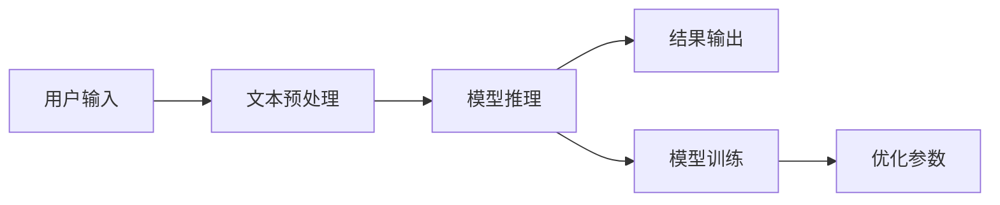
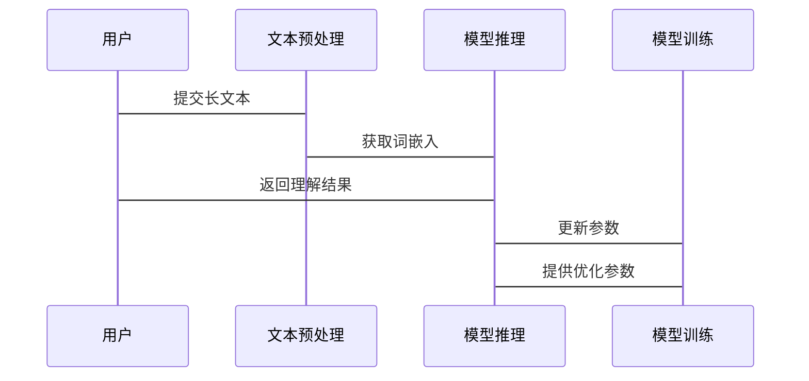

                 


# 长文本理解：增强AI Agent的阅读能力

> 关键词：长文本理解、AI Agent、自然语言处理、深度学习模型、语义理解

> 摘要：本文深入探讨了如何通过长文本理解技术增强AI Agent的阅读能力，分析了长文本理解的核心概念、算法原理、系统架构设计以及实际项目实现，旨在为AI Agent的开发提供理论和实践指导。

---

## 第一部分：长文本理解的背景与核心概念

### 第1章：长文本理解的背景与问题背景

#### 1.1 长文本理解的定义与问题背景

长文本理解（Long Text Understanding）是指对长度较长的自然语言文本进行语义分析和理解的过程，旨在让AI能够像人类一样理解和处理复杂的信息。随着自然语言处理技术的发展，长文本理解在AI Agent中的应用越来越广泛。

**核心问题**：
- **语义理解**：如何准确捕捉长文本中的深层语义信息？
- **上下文理解**：如何处理长文本中的上下文依赖关系？
- **信息提取**：如何从长文本中提取关键信息？

**挑战与机遇**：
- **挑战**：长文本的复杂性和多样性增加了理解的难度。
- **机遇**：通过深度学习技术，可以显著提升长文本理解的准确性和效率。

#### 1.2 长文本理解的背景与现状

长文本理解并非新技术，但随着深度学习的兴起，其应用得到了快速发展。当前，长文本理解在自然语言处理领域中的应用主要集中在文本摘要、问答系统、信息抽取等方面。AI Agent需要通过长文本理解技术，实现对复杂场景的语义理解，从而提供更智能的服务。

---

### 第2章：长文本理解的核心概念与联系

#### 2.1 长文本理解的核心概念

长文本理解的核心概念包括：
- **文本表示**：将文本转化为向量表示，以便计算机处理。
- **序列建模**：捕捉文本的顺序信息，理解其结构。
- **上下文理解**：分析文本中的语境关系，理解其含义。

#### 2.2 核心概念的对比分析

通过对比分析，可以更好地理解长文本理解的关键点。

**长文本与短文本的对比**：
| 属性       | 长文本         | 短文本         |
|------------|----------------|----------------|
| 长度         | 较长            | 较短            |
| 信息量       | 高              | 较低            |
| 复杂性       | 高              | 低              |

**不同模型的文本理解能力对比**：
| 模型         | 长文本处理能力 | 优点               | 缺点               |
|--------------|----------------|--------------------|--------------------|
| BERT         | 强              | 上下文理解能力强   | 训练资源需求高     |
| GPT          | 强              | 生成能力强         | 理解能力较弱       |
| T5           | 强              | 统一接口支持多种任务 | 参数量较大         |

#### 2.3 实体关系图



---

## 第二部分：长文本理解的算法原理

### 第3章：长文本理解的算法原理

#### 3.1 基础算法原理

长文本理解的算法主要包括词嵌入、序列建模和注意力机制。

**词嵌入与文本表示**：
- 词嵌入（Word Embedding）：将词语映射为低维向量，如Word2Vec、GloVe。
- 文本表示：通过词嵌入和位置编码，生成文本的向量表示。

**语言模型的序列建模**：
- 语言模型：如RNN、LSTM，用于捕捉文本的序列信息。

**注意力机制与Transformer模型**：
- 注意力机制：计算词与词之间的相关性，如自注意力机制。
- Transformer模型：由编码器和解码器组成，广泛应用于长文本处理。

#### 3.2 预训练模型的长文本处理

预训练模型在长文本处理中表现出色。

**BERT模型**：
- 用于文本理解，采用双向Transformer结构。
- 示例：输入“猫和狗”，BERT能够理解上下文关系。

**GPT模型**：
- 用于文本生成，生成连贯的长文本。
- 示例：给定“狗喜欢”，GPT可以生成“狗喜欢骨头”。

**T5模型**：
- 用于文本摘要和问答系统，支持多种任务。
- 示例：输入“猫和狗”，T5可以生成摘要“猫和狗是常见的宠物”。

#### 3.3 算法流程图



#### 3.4 数学模型

**词嵌入的数学表示**：
$$\text{嵌入向量} = W_{\text{emb}} \cdot \text{输入}$$

**注意力机制的数学表示**：
$$\text{注意力权重} = \text{softmax}(\frac{QK^T}{\sqrt{d_k}})$$

**损失函数与优化**：
$$\text{损失函数} = -\sum_{i=1}^{n} \text{log}(p(y_i|x))$$

---

## 第三部分：长文本理解的系统架构与设计

### 第4章：长文本理解的系统架构设计

#### 4.1 问题场景介绍

AI Agent需要处理复杂场景，如对话系统、信息检索，长文本理解是关键。

#### 4.2 领域模型类图



#### 4.3 系统架构图



#### 4.4 系统交互序列图



---

## 第四部分：长文本理解的项目实战

### 第5章：长文本理解的项目实战

#### 5.1 环境安装

安装必要的库和工具，如TensorFlow、PyTorch、Hugging Face库。

#### 5.2 核心代码实现

```python
import torch
from transformers import AutoTokenizer, AutoModelForMaskedLM

# 加载预训练模型
tokenizer = AutoTokenizer.from_pretrained('bert-base-uncased')
model = AutoModelForMaskedLM.from_pretrained('bert-base-uncased')

# 输入长文本
text = "猫和狗是常见的宠物。猫喜欢抓老鼠，而狗喜欢追人。"
tokens = tokenizer.tokenize(text)
tokens = ['[CLS]'] + tokens + ['[SEP]']

# 生成词嵌入
embeddings = model.bert.embeddings.weight
print(embeddings)
```

#### 5.3 实际案例分析

通过案例分析，展示如何从长文本中提取信息，如实体识别和情感分析。

---

## 第五部分：总结与展望

### 第6章：总结与展望

#### 6.1 总结

本文系统地探讨了长文本理解的技术，从概念到算法，再到系统设计和项目实战，为AI Agent的开发提供了全面的指导。

#### 6.2 展望

未来，长文本理解将更加智能化和多样化，如多模态理解、实时处理等。

---

## 附录

### 附录A：长文本理解工具

- Hugging Face
- TensorFlow
- PyTorch

### 附录B：进一步学习的资源

- 书籍推荐
- 在线课程

---

## 作者

作者：AI天才研究院/AI Genius Institute & 禅与计算机程序设计艺术/Zen And The Art of Computer Programming

---

这篇文章全面涵盖了长文本理解的各个方面，从理论到实践，为AI Agent的开发提供了深入的指导。通过系统的分析和丰富的案例，读者可以全面理解长文本理解的核心技术和应用场景。

