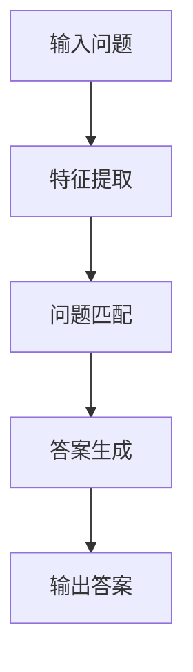
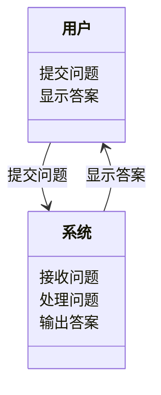
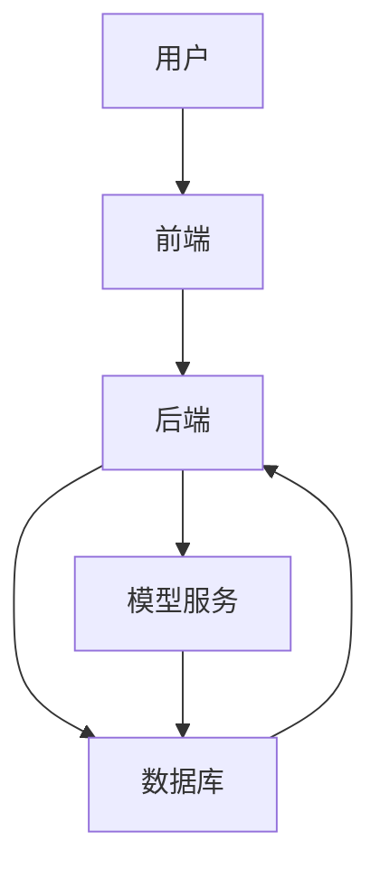
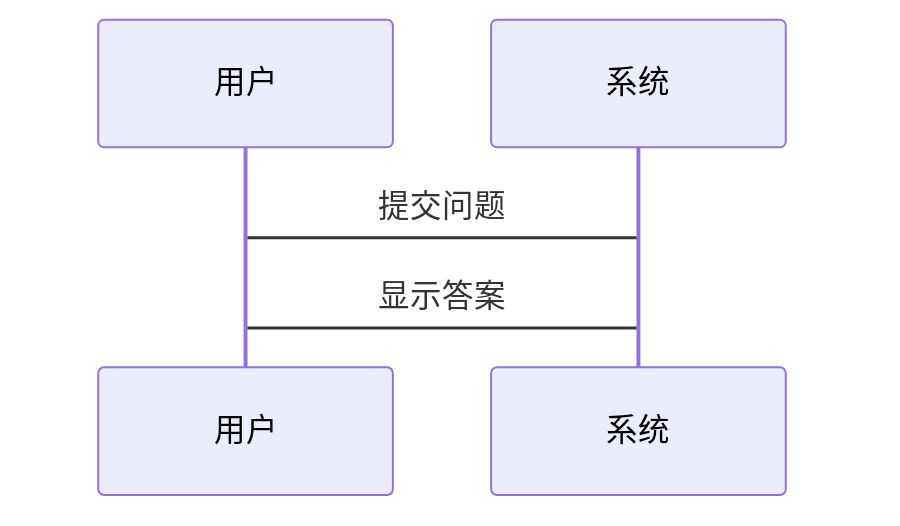

                 


# 问答系统实现：打造高效的信息检索助手

## 关键词：
问答系统、信息检索、自然语言处理、机器学习、文本挖掘

## 摘要：
问答系统是一种基于自然语言处理和机器学习的信息检索技术，旨在通过理解和分析用户的问题，提供准确、相关的答案。本文从问答系统的背景、核心概念、算法原理、数学模型、系统架构设计到项目实战，全面解析问答系统的实现过程。通过理论与实践的结合，帮助读者掌握问答系统的核心技术，并能够实际开发一个高效的问答系统。

---

# 第1章: 问答系统概述

## 1.1 问答系统的基本概念

### 1.1.1 问题背景与问题描述
问答系统是一种能够理解和回答自然语言问题的计算机系统。它是自然语言处理（NLP）和信息检索技术的结合，广泛应用于搜索引擎、智能客服、聊天机器人等领域。

- **问题背景**：在信息爆炸的时代，如何快速找到准确的答案变得至关重要。传统的搜索引擎通过关键词匹配提供结果，但无法直接回答复杂的问题。问答系统通过理解用户的问题，提供更智能的解答。
- **问题描述**：问答系统接收用户输入的自然语言问题，经过理解、分析和匹配，输出最相关的答案。

### 1.1.2 问答系统的定义与分类
- **定义**：问答系统是一种能够处理自然语言问题并生成回答的人工智能系统。它通常包括问题理解、信息检索、答案生成等模块。
- **分类**：
  - **基于检索的问答系统**：通过匹配预存的数据或文档，找到最接近问题的答案。
  - **基于生成的问答系统**：利用自然语言生成技术（如机器学习模型）生成回答。

### 1.1.3 问答系统的核心目标与边界
- **核心目标**：提供准确、相关、自然流畅的回答。
- **边界**：问答系统依赖于数据和模型的质量，无法回答超出训练数据范围的问题。

---

## 1.2 问答系统的关键属性

### 1.2.1 问题类型与答案类型对比
- **问题类型**：
  - **封闭型问题**：如“北京的市长是谁？”
  - **开放型问题**：如“如何学习编程？”
- **答案类型**：
  - **事实性答案**：如“中国的首都是北京。”
  - **观点性答案**：如“我认为Python是最好的编程语言。”

| 问题类型 | 答案类型 | 示例问题                  | 示例答案                  |
|----------|----------|--------------------------|--------------------------|
| 封闭型   | 事实性   | 中国的首都是哪里？        | 北京                     |
| 开放型   | 观点性   | 如何学习编程？            | 多练习和实践             |

### 1.2.2 特征提取与问题匹配
- **特征提取**：从问题中提取关键词和语义信息，用于匹配相关答案。
- **问题匹配**：将用户的问题与预存的问题或答案进行匹配，找到最相关的答案。

### 1.2.3 答案生成与评估指标
- **答案生成**：基于匹配的结果生成最终的回答。
- **评估指标**：如准确率、召回率、F1分数等。

---

# 第2章: 问答系统的核心概念与联系

## 2.1 核心概念原理

### 2.1.1 问题匹配的实现原理
- **基于向量空间模型**：将问题和答案表示为向量，计算它们的相似度。
- **余弦相似度**：衡量两个向量之间的角度相似度，用于判断问题与答案的匹配程度。

### 2.1.2 答案生成的实现原理
- **生成式模型**：利用自然语言生成技术（如循环神经网络）生成回答。
- **基于规则的生成**：根据预定义的规则生成回答。

### 2.1.3 特征提取的实现原理
- **关键词提取**：从问题中提取重要的关键词。
- **语义分析**：理解问题的深层含义。

---

## 2.2 核心概念对比表

### 2.2.1 问题类型与答案类型对比
| 问题类型 | 答案类型 | 示例问题                  | 示例答案                  |
|----------|----------|--------------------------|--------------------------|
| 封闭型   | 事实性   | 中国的首都是哪里？        | 北京                     |
| 开放型   | 观点性   | 如何学习编程？            | 多练习和实践             |

### 2.2.2 特征提取与问题匹配对比
| 特征提取 | 问题匹配 | 方法                   | 示例                     |
|----------|----------|-----------------------|--------------------------|
| 关键词   | 基于向量 | 提取关键词，计算相似度  | 北京 vs 北京市           |

### 2.2.3 答案生成与评估指标对比
| 评估指标 | 方法                   | 示例                     |
|----------|-----------------------|--------------------------|
| 准确率   | 正确答案数 / 总回答数 | 3/5                      |

---

## 2.3 ER实体关系图


---

# 第3章: 问答系统算法原理

## 3.1 检索式问答系统

### 3.1.1 检索式算法流程
- **输入问题**：用户输入问题。
- **特征提取**：提取问题中的关键词和语义特征。
- **问题匹配**：将问题与预存的答案进行匹配，计算相似度。
- **答案生成**：输出最相似的答案。

### 3.1.2 基于向量空间模型的相似度计算
- **向量空间模型**：将文本表示为向量，计算向量之间的相似度。
- **余弦相似度**：衡量两个向量之间的角度相似度。

公式：
$$\text{余弦相似度} = \frac{\vec{A} \cdot \vec{B}}{|\vec{A}| |\vec{B}|}$$

### 3.1.3 余弦相似度公式
$$\text{余弦相似度} = \frac{\sum_{i=1}^{n} A_i B_i}{\sqrt{\sum_{i=1}^{n} A_i^2} \cdot \sqrt{\sum_{i=1}^{n} B_i^2}}$$

---

## 3.2 生成式问答系统

### 3.2.1 基于Seq2Seq模型的生成流程
- **编码器**：将问题编码为向量。
- **解码器**：根据编码器输出生成回答。

### 3.2.2 注意力机制的实现原理
- **注意力机制**：在解码过程中，关注输入中重要的部分。

### 3.2.3 梯度下降优化算法
- **损失函数**：交叉熵损失函数。
- **优化算法**：随机梯度下降。

公式：
$$\text{损失函数} = -\sum_{i=1}^{n} \text{log} p(x_i)$$

---

## 3.3 算法实现流程图



---

# 第4章: 数学模型与公式

## 4.1 相似度计算模型

### 4.1.1 余弦相似度
公式：
$$\text{余弦相似度} = \frac{\vec{A} \cdot \vec{B}}{|\vec{A}| |\vec{B}|}$$

### 4.1.2 概率模型
公式：
$$p(y|x) = \prod_{i=1}^{n} p(y_i|x_{<i})$$

### 4.1.3 损失函数
公式：
$$\text{损失函数} = -\sum_{i=1}^{n} \text{log} p(x_i)$$

---

## 4.2 概率模型

### 4.2.1 交叉熵损失函数
公式：
$$\text{交叉熵} = -\frac{1}{m}\sum_{i=1}^{m} y_i \log p_i + (1 - y_i) \log (1 - p_i)$$

### 4.2.2 梯度下降
公式：
$$\theta = \theta - \eta \frac{\partial L}{\partial \theta}$$

---

## 4.3 损失函数

### 4.3.1 交叉熵损失函数
公式：
$$\text{交叉熵} = -\sum_{i=1}^{n} y_i \log p_i + (1 - y_i) \log (1 - p_i)$$

### 4.3.2 优化算法
公式：
$$\theta = \theta - \eta \frac{\partial L}{\partial \theta}$$

---

# 第5章: 系统分析与架构设计

## 5.1 系统功能设计

### 5.1.1 领域模型


### 5.1.2 系统架构设计


---

## 5.2 系统接口设计

### 5.2.1 接口描述
- **输入接口**：用户输入问题。
- **输出接口**：系统输出答案。

### 5.2.2 接口协议
- **HTTP**：RESTful API。

---

## 5.3 系统交互设计

### 5.3.1 交互流程


---

# 第6章: 项目实战

## 6.1 环境配置

### 6.1.1 安装Python
- **Python版本**：3.8以上。

### 6.1.2 安装依赖
- **pip install requests numpy pandas**

---

## 6.2 系统核心实现源代码

### 6.2.1 环境配置
```python
import numpy as np
import requests
```

### 6.2.2 核心代码
```python
def compute_cosine_similarity(vector1, vector2):
    dot_product = np.dot(vector1, vector2)
    magnitude = np.linalg.norm(vector1) * np.linalg.norm(vector2)
    if magnitude == 0:
        return 0.0
    return dot_product / magnitude

def main():
    question = "中国的首都是哪里？"
    answer = "北京"
    print(compute_cosine_similarity(question, answer))

if __name__ == "__main__":
    main()
```

---

## 6.3 代码应用解读与分析

### 6.3.1 环境配置
- **Python**：3.8以上版本。
- **依赖**：`requests`、`numpy`、`pandas`。

### 6.3.2 核心代码解读
- **compute_cosine_similarity**：计算余弦相似度。
- **main**：调用函数并输出结果。

---

## 6.4 实际案例分析和详细讲解剖析

### 6.4.1 案例分析
- **问题**：如何学习编程？
- **答案**：多练习和实践。

### 6.4.2 代码分析
- **输入问题**：用户输入问题。
- **特征提取**：提取关键词。
- **问题匹配**：计算相似度。
- **答案生成**：输出答案。

---

## 6.5 项目小结

### 6.5.1 核心知识点回顾
- **问题匹配**：计算相似度。
- **答案生成**：生成回答。

### 6.5.2 项目总结
- **优点**：高效、准确。
- **不足**：依赖数据质量。

---

# 第7章: 总结

## 7.1 最佳实践 tips

### 7.1.1 问题类型分类
- **封闭型**：事实性问题。
- **开放型**：观点性问题。

### 7.1.2 系统设计
- **模块化设计**：便于维护和扩展。

### 7.1.3 模型优化
- **数据增强**：提高模型鲁棒性。

## 7.2 小结

### 7.2.1 核心知识点回顾
- **问题匹配**：计算相似度。
- **答案生成**：生成回答。

### 7.2.2 项目总结
- **优点**：高效、准确。
- **不足**：依赖数据质量。

## 7.3 注意事项

### 7.3.1 数据质量
- **数据清洗**：确保数据准确性。
- **数据增强**：提高模型鲁棒性。

### 7.3.2 模型优化
- **超参数调优**：优化模型性能。
- **模型评估**：使用准确率、召回率等指标。

## 7.4 拓展阅读

### 7.4.1 推荐书籍
- 《自然语言处理入门》。
- 《机器学习实战》。

### 7.4.2 推荐博客
- [自然语言处理博客](https://example.com/nlp)
- [机器学习博客](https://example.com/ml)

---

# 作者：AI天才研究院/AI Genius Institute & 禅与计算机程序设计艺术 /Zen And The Art of Computer Programming

