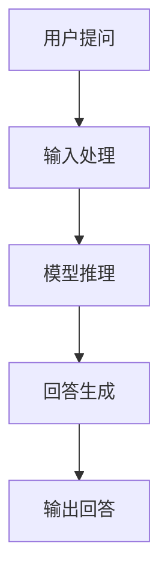
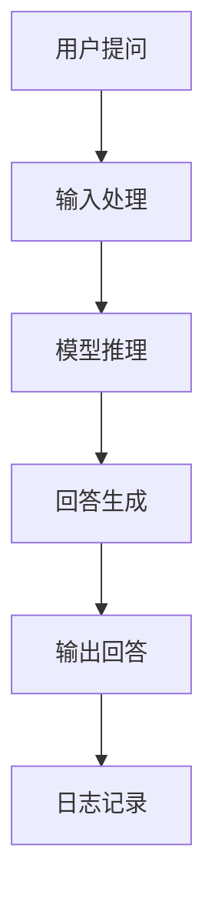
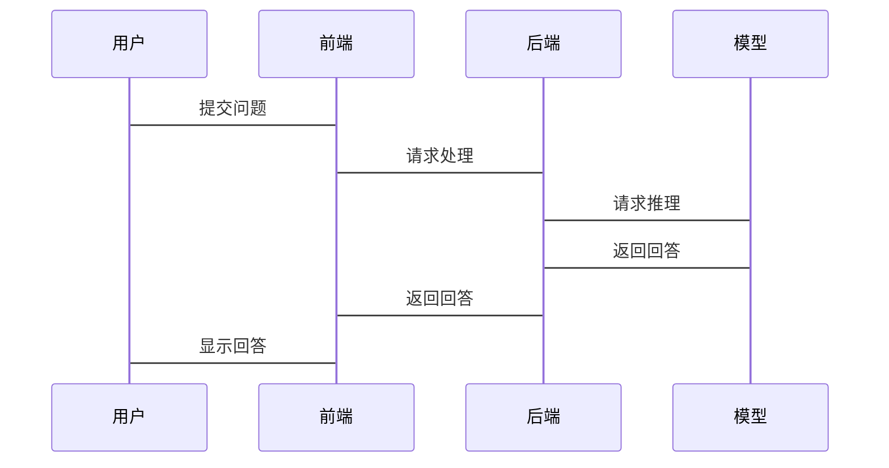

                 


```markdown
# 问答系统：构建基于LLM的智能问答Agent

> 关键词：问答系统，LLM，智能问答Agent，大语言模型，系统架构设计，项目实战

> 摘要：本文详细介绍了如何构建一个基于大语言模型的智能问答Agent系统。从背景知识到核心算法，从系统架构设计到项目实战，全面解析了问答系统的核心原理和实现方法。本文将带你从零开始，逐步掌握基于LLM的问答系统构建技术，包括系统设计、算法实现、项目部署和优化调优等关键环节。通过本文的学习，你将能够开发出一个高效、智能的问答系统，应用于各种实际场景。

---

## 第1章: 问答系统的发展历程与基于LLM的问答系统的优势

### 1.1 问答系统的发展历程
#### 1.1.1 从规则-based到基于深度学习的问答系统
- 传统规则-based问答系统的局限性
- 深度学习技术的引入及其优势
- 基于LLM的问答系统的崛起

#### 1.1.2 基于LLM的问答系统的核心优势
- 大语言模型的通用性和强大的理解能力
- 基于LLM的问答系统的灵活性和可扩展性
- 对复杂问题的处理能力

#### 1.1.3 智能问答Agent的定义与目标
- 智能问答Agent的核心功能
- 与传统问答系统的主要区别
- 构建智能问答Agent的目标和意义

### 1.2 构建基于LLM的问答系统的意义
#### 1.2.1 提升用户体验的核心要素
- 快速响应能力
- 准确性与相关性
- 多语言支持与跨领域适应性

#### 1.2.2 基于LLM的问答系统的应用场景
- 电商客服
- 健康咨询
- 金融投资建议
- 教育辅导

#### 1.2.3 问答系统在企业级应用中的价值
- 提高客户满意度
- 降低人工成本
- 增强品牌一致性

### 1.3 本章小结
- 总结本章内容
- 强调构建基于LLM的问答系统的重要性和必要性
- 为后续章节做铺垫

---

## 第2章: 基于LLM的问答系统核心概念

### 2.1 LLM的基本概念与工作原理
#### 2.1.1 大语言模型的基本概念
- 什么是大语言模型
- LLM的核心特点：大规模、多任务、可微调
- LLM的训练目标：最大化上下文理解和生成能力

#### 2.1.2 基于LLM的问答系统的工作流程
- 输入处理
- 模型推理
- 输出生成

#### 2.1.3 LLM在问答系统中的角色与作用
- 作为问答系统的核心推理引擎
- 提供多样化的生成能力
- 支持多轮对话

### 2.2 问答系统与智能Agent的关系
#### 2.2.1 问答系统的基本功能模块
- 提问解析
- 知识库检索
- 回答生成

#### 2.2.2 智能Agent的核心能力
- 自然语言理解
- 知识推理
- 行为决策

#### 2.2.3 基于LLM的问答系统如何实现智能Agent的功能
- 利用LLM进行意图识别
- 基于上下文理解生成回答
- 多轮对话管理

### 2.3 概念对比与ER实体关系图
#### 2.3.1 基于LLM的问答系统与传统问答系统的对比分析
| 特性         | 传统问答系统 | 基于LLM的问答系统 |
|--------------|--------------|-------------------|
| 知识表示方式 | 显式规则或知识库 | 隐式通过LLM学习 |
| 处理能力     | 有限的领域知识 | 广泛的通用能力    |
| 对话能力     | 单轮对话为主 | 支持多轮对话     |

#### 2.3.2 ER实体关系图展示
```mermaid
erDiagram
    user {
        id
        name
        question
    }
    agent {
        id
        model
        response
    }
    user -> agent : 提问
    agent -> user : 回答
```

### 2.4 本章小结
- 总结本章核心概念
- 强调LLM在问答系统中的关键作用
- 为后续章节奠定理论基础

---

## 第3章: 基于LLM的问答系统算法原理

### 3.1 LLM的工作原理
#### 3.1.1 编码器-解码器架构
- 编码器的作用：将输入文本转换为向量表示
- 解码器的作用：根据编码结果生成输出文本
- 注意力机制：提升模型对输入关键部分的关注

#### 3.1.2 注意力机制和Transformer模型
- 注意力机制的核心思想
- Transformer模型的结构：编码器和解码器
- 多头注意力机制的实现原理

#### 3.1.3 LLM的训练目标
- 交叉熵损失函数
- 基于大量语料库的预训练
- 微调任务特定的数据集

### 3.2 问答系统的算法实现
#### 3.2.1 基于LLM的问答系统算法流程


#### 3.2.2 基于LLM的问答系统的Python实现示例
```python
def process_question(question):
    # 输入处理
    inputs = tokenizer(question, return_tensors="pt")
    # 模型推理
    outputs = model.generate(**inputs, max_length=100)
    # 输出生成
    answer = tokenizer.decode(outputs[0], skip_special_tokens=True)
    return answer
```

### 3.3 数学模型与公式
#### 3.3.1 编码器的数学模型
$$
\text{编码器输入} = x_1, x_2, ..., x_n
$$
$$
\text{编码器输出} = z_1, z_2, ..., z_n
$$

#### 3.3.2 解码器的数学模型
$$
\text{解码器输入} = z_1, z_2, ..., z_n
$$
$$
\text{解码器输出} = y_1, y_2, ..., y_m
$$

#### 3.3.3 注意力机制的公式
$$
\text{注意力权重} = \text{softmax}(\frac{QK^T}{\sqrt{d}})
$$
其中，Q是查询向量，K是键向量，d是向量维度。

### 3.4 本章小结
- 总结算法原理
- 强调数学模型的重要性
- 为后续章节的系统设计做准备

---

## 第4章: 基于LLM的问答系统系统分析与架构设计

### 4.1 问题场景介绍
- 系统需要解决的问题
- 目标用户群体
- 使用场景描述

### 4.2 系统功能设计
#### 4.2.1 系统功能模块
- 用户输入模块
- 模型推理模块
- 输出生成模块
- 日志记录与监控模块

#### 4.2.2 系统功能流程


### 4.3 系统架构设计
#### 4.3.1 系统架构图
```mermaid
subgraph 前端
    Frontend --\> Backend
end

subgraph 后端
    Backend --\> Model
end

subgraph 模型
    Model --\> 数据库
end
```

#### 4.3.2 模块划分与职责
- 前端模块：接收用户输入，展示回答结果
- 后端模块：处理输入，调用模型进行推理
- 模型模块：负责生成回答
- 数据库模块：存储必要的数据

### 4.4 接口设计
#### 4.4.1 API接口定义
- 输入接口：接受文本提问
- 输出接口：返回文本回答

#### 4.4.2 API交互流程


### 4.5 本章小结
- 总结系统分析与架构设计
- 强调模块化设计的重要性
- 为后续章节的项目实战做准备

---

## 第5章: 基于LLM的问答系统项目实战

### 5.1 环境安装与配置
- 安装Python和必要的开发工具
- 安装Hugging Face Transformers库
- 安装其他依赖项

### 5.2 系统核心功能实现
#### 5.2.1 模型加载与初始化
```python
from transformers import AutoTokenizer, AutoModelForCausalLM

tokenizer = AutoTokenizer.from_pretrained("gpt2")
model = AutoModelForCausalLM.from_pretrained("gpt2")
```

#### 5.2.2 提问处理与回答生成
```python
def generate_answer(question):
    inputs = tokenizer(question, return_tensors="pt")
    outputs = model.generate(**inputs, max_length=100)
    answer = tokenizer.decode(outputs[0], skip_special_tokens=True)
    return answer
```

#### 5.2.3 多轮对话实现
```python
# 初始化对话历史
dialog_history = []
# 处理多轮对话
def handle_dialog(question, history):
    history.append(question)
    inputs = tokenizer("\n".join(history), return_tensors="pt")
    outputs = model.generate(**inputs, max_length=100)
    answer = tokenizer.decode(outputs[0], skip_special_tokens=True)
    history.append(answer)
    return answer, history
```

### 5.3 系统功能扩展
#### 5.3.1 知识库集成
- 预处理知识库数据
- 结合LLM进行知识检索与生成

#### 5.3.2 多语言支持
- 使用多语言模型
- 处理不同语言的输入输出

### 5.4 项目部署与测试
#### 5.4.1 系统部署
- 部署前端界面
- 部署后端服务
- 部署模型服务

#### 5.4.2 系统测试
- 功能测试
- 性能测试
- 安全测试

### 5.5 本章小结
- 总结项目实战的关键步骤
- 强调代码实现的重要性
- 提供进一步优化的方向

---

## 第6章: 基于LLM的问答系统最佳实践与优化

### 6.1 优化策略
#### 6.1.1 模型选择与调优
- 选择适合任务的模型
- 调整模型超参数
- 微调模型以适应特定领域

#### 6.1.2 系统性能优化
- 优化推理速度
- 降低资源消耗
- 提高响应速度

#### 6.1.3 知识库优化
- 构建高效的检索机制
- 更新维护知识库
- 提高知识覆盖度

### 6.2 注意事项
#### 6.2.1 模型选择的注意事项
- 模型大小与性能的平衡
- 模型的可解释性
- 模型的稳定性

#### 6.2.2 系统设计的注意事项
- 模块化设计的重要性
- 系统扩展性与维护性
- 系统安全与隐私保护

### 6.3 拓展阅读
#### 6.3.1 基于LLM的问答系统研究现状
- 最新研究进展
- 未来发展趋势
- 研究热点与挑战

#### 6.3.2 基于LLM的问答系统实际应用案例
- 电商行业的应用
- 教育行业的应用
- 金融行业的应用

### 6.4 本章小结
- 总结最佳实践
- 强调优化的重要性
- 展望未来发展方向

---

## 作者：AI天才研究院/AI Genius Institute & 禅与计算机程序设计艺术 /Zen And The Art of Computer Programming
```

