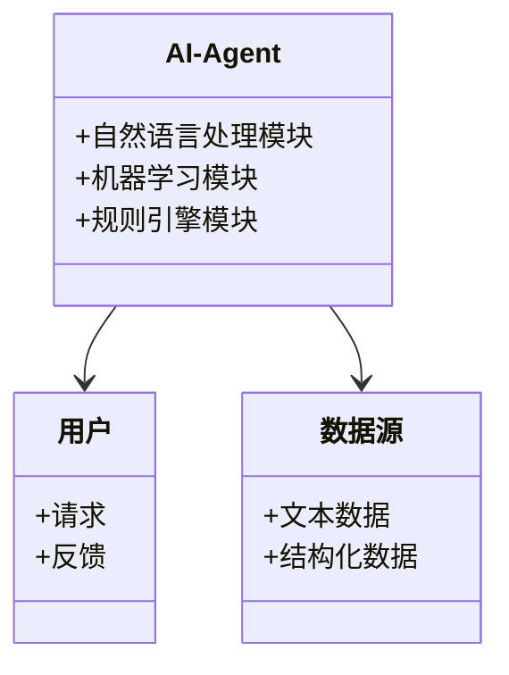
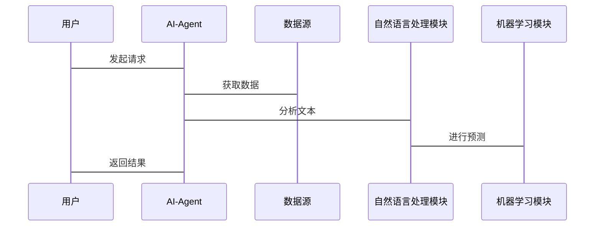

                 


# 零代码平台：快速构建AI Agent原型

---

## 关键词：
零代码平台, AI Agent, 自然语言处理, 机器学习, 可视化开发, 系统架构设计

---

## 摘要：
本文将详细介绍如何利用零代码平台快速构建AI Agent原型。通过分析零代码平台的核心概念、AI Agent的算法原理，以及系统架构设计，结合实际项目实战，帮助读者理解如何在零代码平台上高效开发和部署AI Agent。文章还将探讨零代码平台与AI Agent结合的最佳实践，为开发者和企业提供了从理论到实践的全面指导。

---

# 第1章 零代码平台与AI Agent的背景与概念

## 1.1 零代码平台的定义与特点

### 1.1.1 零代码平台的定义
零代码平台（Low-Code Application Platform，LCAP）是一种软件开发工具，允许用户通过可视化界面拖拽组件、配置参数和设置规则，而不是通过编写大量代码来构建应用程序。其核心目标是降低开发门槛，加速应用交付。

### 1.1.2 零代码平台的核心特点
- **可视化开发**：通过图形化界面进行应用设计和配置。
- **快速迭代**：支持敏捷开发，缩短开发周期。
- **扩展性**：支持与现有系统集成，灵活扩展功能。
- **无代码或低代码**：根据平台功能，用户可以选择无代码或少量代码开发。

### 1.1.3 零代码平台的优势与局限性
- **优势**：
  - 减少代码编写，降低开发成本。
  - 提高开发效率，缩短上市时间。
  - 支持非技术人员快速上手。
- **局限性**：
  - 功能受限，复杂需求可能无法满足。
  - 学习曲线较高，需要掌握平台特定语法。
  - 性能和安全性可能不如传统开发。

## 1.2 AI Agent的定义与特点

### 1.2.1 AI Agent的定义
AI Agent（人工智能代理）是指能够感知环境、自主决策并执行任务的智能实体。它可以是软件或硬件形式，广泛应用于自动驾驶、智能助手、推荐系统等领域。

### 1.2.2 AI Agent的核心特点
- **自主性**：能够在没有外部干预的情况下独立运作。
- **反应性**：能够实时感知环境并做出响应。
- **目标导向**：根据目标执行特定任务。
- **学习能力**：通过数据和经验不断优化自身行为。

## 1.3 零代码平台与AI Agent的结合

### 1.3.1 零代码平台在AI Agent开发中的作用
零代码平台为AI Agent的开发提供了可视化工具和配置界面，使得非技术人员也能快速构建和部署AI Agent。

### 1.3.2 AI Agent与零代码平台的协同工作模式
- **数据输入**：通过可视化界面配置数据源。
- **模型训练**：使用零代码平台内置的算法进行模型训练。
- **任务执行**：配置AI Agent的行为逻辑，执行具体任务。
- **结果输出**：通过可视化界面查看和分析结果。

### 1.3.3 零代码平台在AI Agent开发中的优势
- **降低开发门槛**：无需编写代码即可实现AI Agent的功能。
- **加速开发周期**：通过可视化配置快速搭建原型。
- **灵活性**：支持快速迭代和功能调整。

---

# 第2章 零代码平台与AI Agent的核心概念与联系

## 2.1 零代码平台的核心概念

### 2.1.1 零代码平台的开发流程
1. **需求分析**：明确AI Agent的功能需求。
2. **界面设计**：通过可视化工具设计用户界面。
3. **功能配置**：配置AI Agent的行为逻辑和数据流。
4. **测试与部署**：测试AI Agent的功能，并部署到目标环境。

### 2.1.2 零代码平台的主要组件
- **可视化设计器**：用于创建和配置应用界面。
- **数据源连接器**：支持多种数据源的连接和数据处理。
- **模型训练工具**：内置算法和机器学习模型，支持快速训练和部署。
- **运行时环境**：提供AI Agent运行所需的环境和资源。

### 2.1.3 零代码平台的开发模式
- **无代码开发**：完全通过可视化界面配置应用。
- **低代码开发**：允许少量代码自定义功能。
- **协作开发**：支持团队协作，分工明确。

## 2.2 AI Agent的核心概念

### 2.2.1 AI Agent的组成结构
AI Agent通常由以下部分组成：
- **感知层**：负责感知环境数据，例如传感器或API接口。
- **决策层**：基于感知数据进行分析和决策。
- **执行层**：根据决策结果执行具体任务。
- **学习层**：通过机器学习模型不断优化行为。

### 2.2.2 AI Agent的核心算法
- **自然语言处理（NLP）**：用于理解和生成人类语言，例如文本分类、实体识别。
- **机器学习（ML）**：用于模式识别和预测，例如分类、回归、聚类。
- **规则引擎**：基于预定义规则进行决策。

### 2.2.3 AI Agent与传统软件的区别
| 特性             | AI Agent                          | 传统软件                        |
|------------------|-----------------------------------|----------------------------------|
| 自主性           | 高                                 | 低                               |
| 反应性           | 高                                 | 低                               |
| 学习能力         | 高                                 | 无                               |
| 决策能力         | 高                                 | 低                               |

## 2.3 零代码平台与AI Agent的关系

### 2.3.1 零代码平台如何支持AI Agent的开发
- **可视化配置**：通过拖拽和配置的方式定义AI Agent的行为逻辑。
- **内置算法**：提供丰富的机器学习和NLP算法，支持快速部署。
- **数据处理**：支持多种数据源的连接和数据预处理。

### 2.3.2 AI Agent如何提升零代码平台的功能
- **自动化**：通过AI Agent实现自动化任务，提升平台的智能化水平。
- **数据分析**：利用AI Agent进行数据挖掘和分析，提供更深入的洞察。
- **用户体验**：通过AI Agent优化用户体验，例如智能推荐和个性化配置。

### 2.3.3 零代码平台在AI Agent开发中的优势
- **降低技术门槛**：非技术人员也能快速开发AI Agent。
- **加速开发周期**：通过可视化配置快速搭建原型。
- **灵活性**：支持快速迭代和功能调整。

---

# 第3章 零代码平台与AI Agent的算法原理

## 3.1 自然语言处理算法

### 3.1.1 分词算法
分词是将连续的文本分割成有意义的词汇。常用算法包括：
- **基于统计的分词**：通过统计词频和上下文信息进行分词。
- **基于规则的分词**：根据词典和规则进行分词。
- **结合统计与规则的分词**：综合考虑统计和规则。

### 3.1.2 实体识别
实体识别是将文本中的实体（如人名、地名、组织名）识别出来。常用算法包括：
- **CRF（条件随机场）**：基于统计学习的序列标注模型。
- **RNN（循环神经网络）**：用于序列标注任务。
- **BERT（预训练模型）**：基于深度学习的实体识别模型。

## 3.2 机器学习算法

### 3.2.1 分类算法
分类算法用于将数据分类到预定的类别中。常用算法包括：
- **决策树**：通过特征分裂构建决策树模型。
- **随机森林**：基于决策树的集成学习算法。
- **支持向量机（SVM）**：用于高维空间中的线性分类。

### 3.2.2 回归算法
回归算法用于预测连续型变量的值。常用算法包括：
- **线性回归**：通过最小二乘法拟合线性模型。
- **逻辑回归**：用于二分类问题。
- **神经网络回归**：基于深度学习的回归模型。

## 3.3 零代码平台中的算法实现

### 3.3.1 算法实现流程
1. **数据预处理**：清洗和归一化数据。
2. **模型训练**：选择合适的算法并进行训练。
3. **模型评估**：通过交叉验证评估模型性能。
4. **模型部署**：将训练好的模型部署到零代码平台上。

### 3.3.2 算法实现示例
```python
# 示例：使用决策树进行分类
from sklearn.tree import DecisionTreeClassifier
from sklearn.datasets import load_iris
from sklearn.model_selection import train_test_split

# 加载数据集
iris = load_iris()
X = iris.data
y = iris.target

# 划分训练集和测试集
X_train, X_test, y_train, y_test = train_test_split(X, y, test_size=0.2)

# 初始化决策树分类器
clf = DecisionTreeClassifier()

# 训练模型
clf.fit(X_train, y_train)

# 预测测试集
y_pred = clf.predict(X_test)
print("预测结果：", y_pred)
print("真实结果：", y_test)
```

---

# 第4章 系统分析与架构设计方案

## 4.1 项目背景与目标

### 4.1.1 项目背景
随着AI技术的快速发展，企业对AI Agent的需求日益增加。然而，传统开发模式周期长、成本高，难以满足快速迭代的需求。

### 4.1.2 项目目标
通过零代码平台快速构建一个具备自然语言处理和机器学习能力的AI Agent原型，验证零代码平台在AI Agent开发中的可行性和效率。

## 4.2 系统功能设计

### 4.2.1 领域模型设计


### 4.2.2 系统架构设计


### 4.2.3 系统交互设计


---

# 第5章 项目实战：基于零代码平台构建AI Agent原型

## 5.1 环境安装与配置

### 5.1.1 安装零代码平台
选择一个流行的零代码平台，例如OutSystems或 Mendix，并按照官方文档完成安装和配置。

### 5.1.2 安装必要的库和工具
根据AI Agent的功能需求，安装所需的Python库，例如：
```bash
pip install numpy scikit-learn transformers
```

## 5.2 系统核心实现

### 5.2.1 自然语言处理模块实现
使用预训练的NLP模型，例如BERT，进行文本分类和实体识别。

### 5.2.2 机器学习模块实现
训练一个分类模型，用于预测用户输入的类别。

### 5.2.3 规则引擎模块实现
配置规则引擎，根据预定义的规则进行决策。

## 5.3 代码实现与解读

### 5.3.1 自然语言处理模块代码
```python
from transformers import pipeline

# 初始化NLP pipeline
nlp = pipeline("text-classification", model="bert-base-cased")

# 处理文本
result = nlp("这是一个测试文本。")
print("预测结果：", result)
```

### 5.3.2 机器学习模块代码
```python
from sklearn.tree import DecisionTreeClassifier
from sklearn.datasets import load_iris
from sklearn.model_selection import train_test_split

# 加载数据集
iris = load_iris()
X = iris.data
y = iris.target

# 划分训练集和测试集
X_train, X_test, y_train, y_test = train_test_split(X, y, test_size=0.2)

# 初始化决策树分类器
clf = DecisionTreeClassifier()

# 训练模型
clf.fit(X_train, y_train)

# 预测测试集
y_pred = clf.predict(X_test)
print("预测结果：", y_pred)
print("真实结果：", y_test)
```

## 5.4 实际案例分析与解读

### 5.4.1 案例背景
假设我们开发一个客服自动响应系统，能够自动识别用户的问题并给出回复。

### 5.4.2 数据准备
从客服系统中获取历史对话数据，清洗并预处理数据。

### 5.4.3 模型训练
使用自然语言处理模块进行文本分类，识别用户的问题类型。

### 5.4.4 系统部署
将训练好的模型部署到零代码平台，配置规则引擎，实现自动响应功能。

## 5.5 项目小结

### 5.5.1 项目成果
成功构建了一个基于零代码平台的AI Agent原型，实现了自然语言处理和机器学习功能。

### 5.5.2 项目经验
- **可视化配置**：零代码平台大大降低了开发门槛。
- **快速迭代**：通过可视化工具快速调整功能。
- **团队协作**：支持多人协作，分工明确。

---

# 第6章 最佳实践与总结

## 6.1 最佳实践

### 6.1.1 工具选择
选择适合自身需求的零代码平台，评估其功能和性能。

### 6.1.2 数据管理
确保数据质量和完整性，合理处理数据隐私问题。

### 6.1.3 模型优化
通过持续优化模型和规则，提升AI Agent的性能和用户体验。

## 6.2 小结

### 6.2.1 核心内容回顾
本文详细介绍了零代码平台与AI Agent的结合，从概念、算法到实战，为读者提供了全面的指导。

### 6.2.2 未来展望
随着AI技术的不断进步，零代码平台在AI Agent开发中的应用将更加广泛，为更多行业带来创新和变革。

---

# 作者

作者：AI天才研究院/AI Genius Institute & 禅与计算机程序设计艺术 /Zen And The Art of Computer Programming

