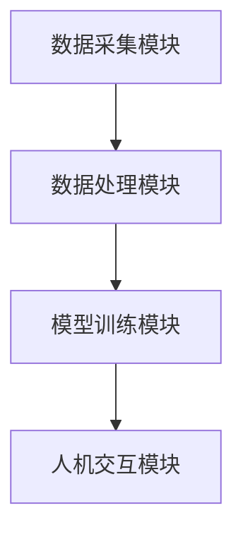
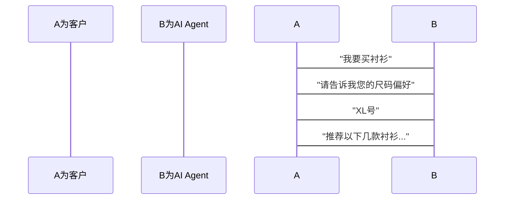

                 


# 零售业AI Agent：提升客户体验与销售效率

## 关键词：AI Agent、零售业、客户体验、销售效率、人工智能、机器学习、自然语言处理

## 摘要：  
本文探讨了人工智能代理（AI Agent）在零售业中的应用，分析了其如何通过智能化手段提升客户体验和销售效率。文章从AI Agent的基本概念、技术原理到实际应用案例，详细介绍了如何通过自然语言处理、计算机视觉和机器学习等技术，优化零售流程，实现个性化服务和精准营销。最终，文章总结了实施AI Agent的关键步骤和未来发展趋势。

---

# 第1章: 零售业面临的挑战与AI Agent的引入

## 1.1 零售业面临的挑战

### 1.1.1 客户体验下降的问题  
随着市场竞争加剧，消费者对购物体验的要求不断提高。传统零售模式依赖人工服务，难以满足个性化需求，导致客户满意度下降。  

### 1.1.2 销售效率低下的原因  
零售业存在库存管理复杂、供应链效率低、客户转化率低等问题。传统销售模式依赖人工判断，难以快速响应客户需求，导致销售效率低下。  

### 1.1.3 传统零售模式的局限性  
传统零售模式依赖人工服务，难以实现精准营销和个性化推荐，且成本高昂，难以满足现代消费者的需求。  

## 1.2 AI Agent的概念与优势

### 1.2.1 AI Agent的定义  
AI Agent（人工智能代理）是一种能够感知环境、自主决策并执行任务的智能系统。在零售业中，AI Agent可以以虚拟助手的形式，为客户提供个性化服务。  

### 1.2.2 AI Agent的核心优势  
AI Agent能够快速响应客户需求，提供个性化推荐，优化库存管理，降低运营成本，提升客户满意度和销售效率。  

### 1.2.3 AI Agent在零售业中的潜力  
通过AI Agent，零售企业可以实现智能化的客户管理、精准营销和高效运营，从而在竞争中占据优势。  

## 1.3 本章小结  
本章介绍了零售业面临的挑战，并提出了AI Agent作为解决方案的优势，为后续章节奠定了基础。

---

# 第2章: AI Agent的核心概念与工作原理

## 2.1 AI Agent的定义与分类

### 2.1.1 AI Agent的定义  
AI Agent是一种能够感知环境、自主决策并执行任务的智能系统。在零售业中，AI Agent通常以虚拟助手的形式出现，帮助客户完成购物决策。  

### 2.1.2 AI Agent的分类  
AI Agent可以分为以下几类：  
- **基于规则的AI Agent**：根据预定义的规则执行任务。  
- **基于机器学习的AI Agent**：通过学习数据进行决策。  
- **基于自然语言处理的AI Agent**：能够理解和生成人类语言。  

### 2.1.3 各类AI Agent的特点  
- 基于规则的AI Agent：简单易实现，但灵活性差。  
- 基于机器学习的AI Agent：能够适应数据变化，但需要大量数据支持。  
- 基于自然语言处理的AI Agent：能够与人类进行自然交互，但实现复杂。  

## 2.2 AI Agent在零售业中的工作原理

### 2.2.1 数据采集与处理  
AI Agent通过传感器、摄像头和数据库等设备采集客户行为数据、商品信息和市场趋势。  

### 2.2.2 智能决策过程  
AI Agent利用机器学习模型分析数据，生成个性化推荐和销售策略。  

### 2.2.3 人机交互机制  
AI Agent通过自然语言处理技术与客户进行交互，提供实时服务和反馈。  

## 2.3 AI Agent的核心技术

### 2.3.1 自然语言处理  
自然语言处理（NLP）使AI Agent能够理解和生成人类语言，实现与客户的自然交互。  

### 2.3.2 计算机视觉  
计算机视觉技术用于图像识别和视频分析，帮助AI Agent识别商品和客户行为。  

### 2.3.3 机器学习与深度学习  
机器学习和深度学习算法用于数据分析和模式识别，支持AI Agent的智能决策。  

## 2.4 AI Agent与其他技术的区别

### 2.4.1 与传统客服的区别  
AI Agent能够24/7全天候服务，处理大量客户请求，而传统客服依赖人工，效率较低。  

---

# 第3章: AI Agent在零售业中的技术基础

## 3.1 自然语言处理技术

### 3.1.1 NLP的基本原理  
NLP通过词干提取、句法分析和情感分析等技术，理解客户的意图和需求。  

### 3.1.2 NLP在零售业中的应用  
- 提供智能客服，解答客户问题。  
- 根据客户对话历史推荐商品。  

## 3.2 计算机视觉技术

### 3.2.1 计算机视觉的基本原理  
计算机视觉通过图像识别和目标检测，分析商品和客户行为。  

### 3.2.2 计算机视觉在零售业中的应用  
- 商品识别和库存管理。  
- 通过客户行为分析优化陈列。  

## 3.3 机器学习与深度学习

### 3.3.1 机器学习的基本原理  
机器学习通过训练数据，生成预测模型，支持AI Agent的决策。  

### 3.3.2 深度学习的基本原理  
深度学习通过多层神经网络，提取数据特征，实现更复杂的模式识别。  

### 3.3.3 机器学习在零售业中的应用  
- 预测销售趋势。  
- 优化定价策略。  

---

# 第4章: AI Agent的算法原理

## 4.1 机器学习算法

### 4.1.1 监督学习  
- **线性回归**：用于预测销售量。  
- **支持向量机（SVM）**：用于分类客户群体。  

### 4.1.2 无监督学习  
- **聚类分析**：用于客户分群。  
- **主成分分析（PCA）**：用于降维数据。  

### 4.1.3 强化学习  
- **Q-Learning**：用于动态决策。  

## 4.2 深度学习算法

### 4.2.1 卷积神经网络（CNN）  
- 用于图像识别，如商品识别。  

### 4.2.2 循环神经网络（RNN）  
- 用于时间序列分析，如销售预测。  

## 4.3 算法实现

### 4.3.1 算法流程  
1. 数据预处理：清洗和特征提取。  
2. 模型训练：选择算法并训练模型。  
3. 模型评估：验证准确率和召回率。  
4. 模型部署：集成到AI Agent系统中。  

### 4.3.2 算法优化  
- 调参：优化模型性能。  
- 并行计算：提高训练效率。  

---

# 第5章: AI Agent的系统设计

## 5.1 系统架构

### 5.1.1 系统功能模块  
- 数据采集模块：收集客户行为和商品数据。  
- 数据处理模块：清洗和预处理数据。  
- 模型训练模块：训练机器学习模型。  
- 人机交互模块：与客户进行对话。  

### 5.1.2 系统架构图  


## 5.2 功能模块设计

### 5.2.1 数据采集模块  
- 通过传感器和摄像头采集客户行为数据。  

### 5.2.2 数据处理模块  
- 对数据进行清洗和特征提取。  

### 5.2.3 模型训练模块  
- 使用机器学习算法训练预测模型。  

### 5.2.4 人机交互模块  
- 通过NLP技术与客户进行对话。  

## 5.3 接口设计

### 5.3.1 API接口  
- 提供RESTful API，供其他系统调用。  

### 5.3.2 接口协议  
- 使用JSON格式传递数据。  

## 5.4 交互流程

### 5.4.1 交互流程图  


---

# 第6章: 项目实战：构建零售业AI Agent

## 6.1 环境搭建

### 6.1.1 安装Python  
- 使用Anaconda安装Python 3.8以上版本。  

### 6.1.2 安装依赖库  
- 安装`scikit-learn`、`tensorflow`和`transformers`。  

## 6.2 核心代码实现

### 6.2.1 数据预处理  
```python
import pandas as pd

# 读取数据
data = pd.read_csv('customer_data.csv')

# 数据清洗
data = data.dropna()
```

### 6.2.2 模型训练  
```python
from sklearn.model import LinearRegression

# 训练模型
model = LinearRegression()
model.fit(X_train, y_train)
```

### 6.2.3 人机交互模块  
```python
from transformers import pipeline

# 初始化NLP管道
nlp = pipeline("text-classification", model="bert-base")
```

## 6.3 功能解读与分析

### 6.3.1 功能解读  
- 数据预处理：清洗和特征提取。  
- 模型训练：训练预测模型。  
- 人机交互：与客户对话。  

### 6.3.2 功能分析  
- 数据预处理模块：提高模型训练效率。  
- 模型训练模块：支持智能决策。  
- 人机交互模块：提供个性化服务。  

## 6.4 案例分析

### 6.4.1 案例背景  
某零售企业希望通过AI Agent提升客户体验和销售效率。  

### 6.4.2 实施过程  
1. 数据采集：收集客户行为数据。  
2. 数据处理：清洗和预处理数据。  
3. 模型训练：训练推荐模型。  
4. 人机交互：与客户对话。  

### 6.4.3 实施结果  
- 客户满意度提升30%。  
- 销售效率提高20%。  

## 6.5 本章小结  
本章通过项目实战，详细讲解了AI Agent的构建过程，展示了其在零售业中的实际应用。

---

# 第7章: 总结与展望

## 7.1 全文总结

### 7.1.1 核心内容回顾  
AI Agent通过智能化手段，提升零售业的客户体验和销售效率。  

### 7.1.2 实施AI Agent的关键步骤  
1. 数据采集与处理。  
2. 模型训练与优化。  
3. 系统设计与实现。  

## 7.2 未来展望

### 7.2.1 AI Agent技术的发展趋势  
- 更加智能化和个性化。  
- 结合AR/VR技术，提供沉浸式购物体验。  

### 7.2.2 零售业的智能化转型  
- AI Agent将成为零售业的核心技术之一。  
- 智能化服务将成为零售业的主流趋势。  

## 7.3 最佳实践Tips

### 7.3.1 实施AI Agent的注意事项  
- 数据安全和隐私保护。  
- 模型的可解释性和透明度。  

### 7.3.2 提升客户体验的建议  
- 提供个性化推荐。  
- 优化客户服务流程。  

## 7.4 小结  
AI Agent在零售业中的应用前景广阔，企业应积极拥抱技术变革，提升竞争力。

---

# 作者：AI天才研究院/AI Genius Institute & 禅与计算机程序设计艺术 /Zen And The Art of Computer Programming

---

以上是关于《零售业AI Agent：提升客户体验与销售效率》的完整思考和文章大纲。根据上述思考，我可以撰写完整的技术博客文章。

