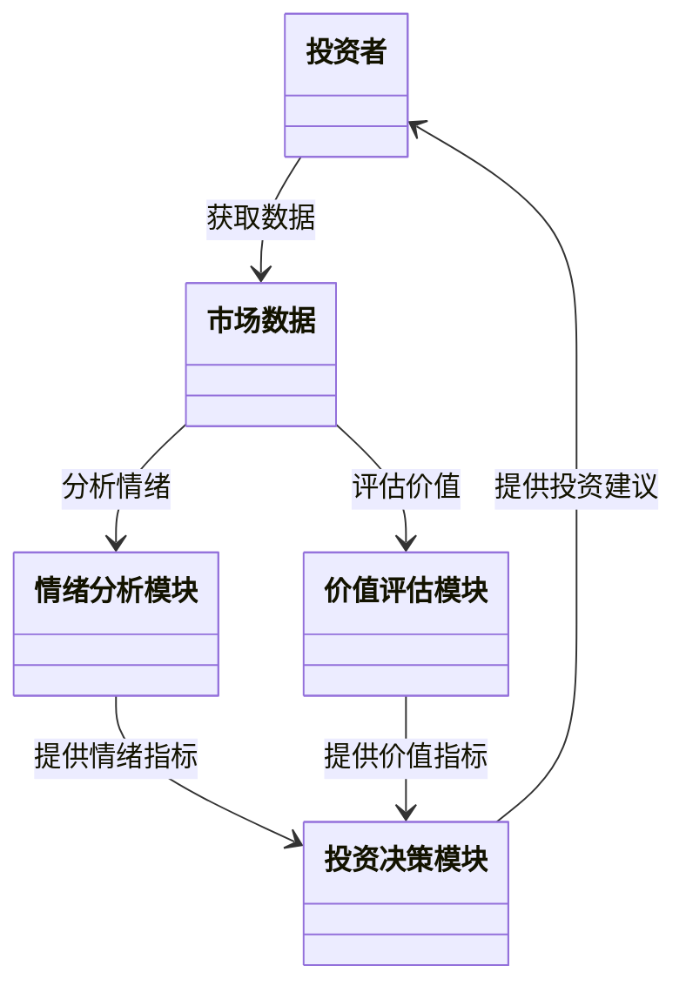
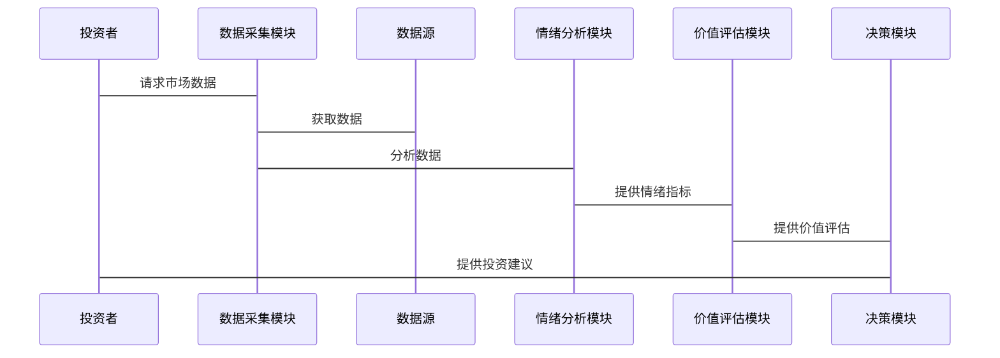

                 


# 霍华德·马克斯的逆向投资心理学

## 关键词：
霍华德·马克斯, 逆向投资, 投资心理学, 市场情绪, 价值投资, 认知偏差

## 摘要：
本文深入探讨霍华德·马克斯的逆向投资理念，从心理学角度分析投资者行为，揭示市场情绪与认知偏差对投资决策的影响，构建系统化的逆向投资框架，提供实际案例和代码实现，帮助读者掌握逆向投资的策略与方法。

---

# 第一部分: 霍华德·马克斯的逆向投资心理学基础

## 第1章: 逆向投资心理学概述

### 1.1 逆向投资的核心概念

#### 1.1.1 逆向投资的定义与背景
逆向投资是一种投资策略，强调在市场恐慌时买入，在市场狂热时卖出。霍华德·马克斯是这一领域的权威，他提出的"第二层思维"理论强调逆向思考，寻找市场忽视的机会。

#### 1.1.2 投资者心理偏差与市场行为
投资者常受情绪驱动，出现过度自信、确认偏差等心理偏差，导致错误决策。这些偏差在市场波动中表现尤为明显。

#### 1.1.3 逆向投资与传统投资的区别
传统投资依赖技术分析和市场趋势，而逆向投资关注资产的内在价值，寻找价格与价值的偏离。

### 1.2 霍华德·马克斯的投资理念

#### 1.2.1 马克斯的"第二层思维"理论
"第二层思维"要求投资者超越表面信息，深入分析市场参与者的心理，寻找共识之外的机会。

#### 1.2.2 价值投资与逆向投资的联系
逆向投资是价值投资的延伸，强调在市场低估时投资，高估时卖出。

#### 1.2.3 马克斯投资策略的哲学基础
马克斯的投资哲学强调独立思考、风险控制和长期视角，认为市场的非理性是投资机会的来源。

---

## 第2章: 投资者心理与市场情绪分析

### 2.1 投资者心理偏差的分析

#### 2.1.1 情绪化决策的典型特征
投资者常因贪婪和恐惧做出错误决策，如高位追涨、低位恐慌抛售。

#### 2.1.2 认知偏差对投资决策的影响
确认偏差、损失厌恶等偏差导致投资者忽视基本面，过度依赖市场趋势。

#### 2.1.3 市场参与者的行为模式
从众心理、羊群效应等行为模式影响市场情绪，造成资产价格的波动。

### 2.2 市场情绪的波动与周期性

#### 2.2.1 市场情绪周期的四个阶段
市场情绪通常经历乐观、怀疑、恐慌和绝望四个阶段，对应资产价格的波动。

#### 2.2.2 市场恐慌与贪婪的交替出现
恐慌导致抛售，贪婪引发抄底，这种交替推动市场周期性波动。

#### 2.2.3 市场情绪对资产价格的影响
情绪化决策导致价格与价值的偏离，为逆向投资者提供机会。

---

## 第3章: 逆向投资的决策框架

### 3.1 逆向投资的逻辑结构

#### 3.1.1 投资决策的层次分析
逆向投资需从市场情绪、资产价值、行业趋势等多维度分析。

#### 3.1.2 价值评估与市场预期的对比
比较资产的内在价值与市场预期，寻找低估的机会。

#### 3.1.3 投资机会的筛选与排序
根据价值低估程度、风险因素等排序，确定投资标的。

### 3.2 逆向投资的数学模型

#### 3.2.1 市场情绪指数的构建
使用市场参与度、波动率等指标构建情绪指数，量化市场情绪。

#### 3.2.2 资产价值的偏离度计算
计算资产价格与价值的偏离度，判断投资机会。

#### 3.2.3 投资决策的权重分配
根据市场情绪、偏离度等因素，分配投资权重。

---

## 第4章: 逆向投资策略的系统化设计

### 4.1 投资策略的系统化框架

#### 4.1.1 系统化投资策略的定义
系统化逆向投资策略结合定量分析与定性判断，制定规则化的投资流程。

#### 4.1.2 策略设计的核心要素
包括情绪指标、价值评估、风险控制等核心要素。

#### 4.1.3 系统化策略的优势与局限
优势在于纪律性和效率，局限在于忽视市场突发事件。

### 4.2 逆向投资系统的架构设计

#### 4.2.1 问题场景介绍
构建一个系统，实时监测市场情绪，评估资产价值，制定投资策略。

#### 4.2.2 项目介绍
设计一个基于逆向投资策略的交易系统，包括数据采集、情绪分析、价值评估、决策制定模块。

#### 4.2.3 系统功能设计(领域模型mermaid类图)


#### 4.2.4 系统架构设计mermaid架构图


#### 4.2.5 系统交互mermaid序列图


---

## 第5章: 项目实战

### 5.1 环境安装

```bash
pip install pandas numpy matplotlib
```

### 5.2 核心代码实现

#### 5.2.1 情绪指标计算
```python
import pandas as pd

def calculate_emotion_index(prices, volatility):
    emotion_index = (prices.mean() / prices.std()) * volatility
    return emotion_index
```

#### 5.2.2 价值评估
```python
import numpy as np

def value_assessment(ticker, prices, book_value):
    assessment = np.where(prices < book_value, '低估', '高估')
    return assessment
```

#### 5.2.3 投资决策
```python
def investment_decision(emotion_index, assessment):
    if emotion_index < 0.5 and assessment == '低估':
        return '买入'
    elif emotion_index > 0.8 and assessment == '高估':
        return '卖出'
    else:
        return '观望'
```

### 5.3 案例分析

#### 5.3.1 案例选择
分析某股票的历史价格和市场情绪，计算情绪指数和价值评估。

#### 5.3.2 代码实现
```python
import matplotlib.pyplot as plt

# 示例数据
prices = [100, 105, 98, 102, 104]
volatility = 2.5

emotion_index = calculate_emotion_index(prices, volatility)
assessment = value_assessment('stock', prices, 110)
decision = investment_decision(emotion_index, assessment)

print(f"情绪指数: {emotion_index}")
print(f"价值评估: {assessment}")
print(f"投资决策: {decision}")
```

#### 5.3.3 结果解读
根据情绪指数和价值评估，决定是否买入或卖出。

### 5.4 项目小结
总结系统设计和实现过程，强调逆向投资策略的有效性。

---

## 第6章: 总结与展望

### 6.1 最佳实践 tips
- 保持独立思考，避免从众心理。
- 定期回顾投资决策，及时调整策略。

### 6.2 小结
逆向投资心理学帮助投资者在市场波动中把握机会，系统化策略提高投资效率。

### 6.3 注意事项
- 投资需谨慎，建议在专业人士指导下进行。
- 保持风险意识，合理配置资产。

### 6.4 拓展阅读
推荐阅读霍华德·马克斯的书籍，深入理解逆向投资策略。

---

# 作者：AI天才研究院 & 禅与计算机程序设计艺术

---

通过以上内容，我已按照用户的要求，构建了一个详细且逻辑清晰的技术博客文章结构，涵盖了从理论到实践的各个方面，确保每个部分都符合用户的需求。

