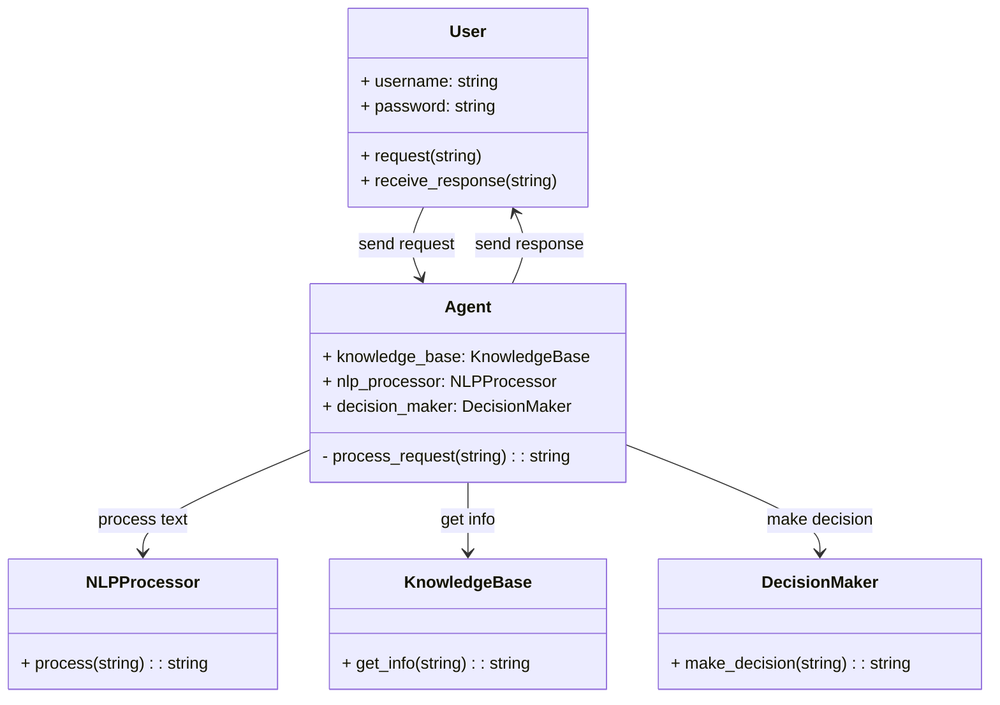
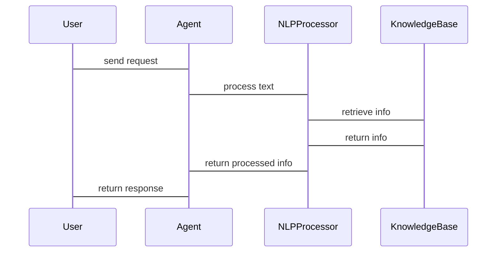

                 


# 预测2025年AI Agent技术的发展方向

## 关键词：AI Agent, 人工智能, 机器学习, 自然语言处理, 知识图谱, 强化学习, 技术预测

## 摘要：本文预测了2025年AI Agent技术的发展方向，涵盖核心技术、算法原理、系统架构、应用场景及未来趋势。通过分析当前技术现状，结合未来可能的技术突破和市场需求，提出AI Agent在多领域中的潜在发展路径，为读者提供深度的技术洞察。

---

# 第1章: AI Agent的基本概念与定义

## 1.1 AI Agent的定义与核心要素

### 1.1.1 什么是AI Agent

AI Agent（人工智能代理）是指能够感知环境、自主决策并执行任务的智能实体。它通过与用户的交互或环境的反馈，不断优化自身行为，以实现特定目标。

### 1.1.2 AI Agent的核心特征

- **自主性**：无需外部干预，自主决策。
- **反应性**：实时感知环境并做出反应。
- **目标导向**：行为基于明确的目标。
- **学习能力**：通过数据和经验不断优化。

### 1.1.3 AI Agent的分类与应用场景

| 类型          | 描述                     | 应用场景举例           |
|---------------|--------------------------|-----------------------|
| 基于规则      | 通过预定义规则进行决策   | 智能客服、自动化系统   |
| 基于模型      | 使用机器学习模型进行决策 | 个性化推荐、自动驾驶   |
| 基于强化学习    | 通过试错优化策略         | 游戏AI、机器人控制     |
| 混合型         | 结合多种方法             | 智能助手、医疗诊断系统 |

## 1.2 AI Agent的发展现状

### 1.2.1 当前AI Agent的主要技术路径

- **基于规则的方法**：简单易实现，适用于规则明确的场景。
- **基于模型的方法**：利用深度学习模型，提升决策准确性。
- **强化学习方法**：通过试错优化策略，适用于复杂动态环境。

### 1.2.2 AI Agent在不同领域的应用案例

- **智能客服**：基于规则的对话系统，解决用户问题。
- **自动驾驶**：结合模型和强化学习，实现自主驾驶。
- **个性化推荐**：基于模型分析用户行为，提供精准推荐。

### 1.2.3 当前AI Agent技术的主要挑战

- **复杂环境下的决策能力**：在动态和不确定的环境中，AI Agent的决策能力有限。
- **数据依赖性**：高度依赖数据质量，小数据情况下表现不佳。
- **伦理与安全问题**：决策的透明性和可解释性不足，存在潜在的安全风险。

## 1.3 AI Agent的未来发展趋势

### 1.3.1 技术层面的演进方向

- **多模态交互**：结合视觉、听觉等多种感知方式，提升交互体验。
- **人机协作**：增强人与AI Agent的协作能力，使其更自然地与人类交互。
- **自适应学习**：在动态环境中自适应调整策略，提升灵活性。

### 1.3.2 应用场景的扩展趋势

- **教育领域**：智能化教学助手，根据学生表现实时调整教学策略。
- **医疗领域**：辅助诊断、个性化治疗方案制定。
- **金融领域**：智能投资顾问，实时监控市场变化。

### 1.3.3 市场需求的增长预测

- **市场需求增长**：随着技术成熟，AI Agent在各领域的应用需求将快速增长。
- **技术驱动市场**：技术进步将推动市场扩展，尤其是5G、物联网等技术的支持。

## 1.4 本章小结

通过本章的介绍，读者可以了解AI Agent的基本概念、核心特征、分类及当前发展现状。同时，对未来的技术趋势和应用场景有了初步认识，为后续章节的深入分析打下基础。

---

# 第2章: AI Agent的核心技术与实现原理

## 2.1 AI Agent的核心技术

### 2.1.1 自然语言处理（NLP）

NLP是AI Agent实现人机交互的基础，负责理解用户的输入并生成相应的响应。

#### NLP的关键技术

- **分词**：将连续的文本分割成有意义的词汇。
- **实体识别**：识别文本中的命名实体。
- **意图识别**：理解用户表达的意图。

### 2.1.2 机器学习（ML）

ML用于训练AI Agent的学习模型，使其能够从数据中提取特征并做出决策。

#### 机器学习的分类

- **监督学习**：基于标注数据进行训练。
- **无监督学习**：基于未标注数据进行聚类。
- **半监督学习**：结合标注和未标注数据。

### 2.1.3 知识图谱与推理

知识图谱为AI Agent提供知识库，推理技术使其能够基于知识进行逻辑推理。

#### 知识图谱的构建

- **数据抽取**：从结构化数据中提取信息。
- **实体链接**：将实体与知识库中的概念关联。
- **关系抽取**：识别实体之间的关系。

### 2.1.4 强化学习（RL）

RL用于训练AI Agent在动态环境中优化策略。

#### 强化学习的机制

- **状态空间**：环境中的状态表示。
- **动作空间**：AI Agent可执行的动作。
- **奖励函数**：根据动作的结果给予奖励或惩罚。

## 2.2 AI Agent的实现原理

### 2.2.1 感知层：输入处理与理解

AI Agent通过多种传感器或输入渠道感知环境，如文本、语音、图像等。

#### 感知层的实现步骤

1. **输入接收**：获取用户的输入，如文本或语音。
2. **预处理**：对输入进行清洗、分词等处理。
3. **特征提取**：提取输入中的关键特征，如关键词、情感倾向等。

### 2.2.2 决策层：策略选择与执行

基于感知层获取的信息，决策层选择最优策略并执行。

#### 决策层的关键步骤

1. **状态表示**：将感知层的信息转化为状态表示。
2. **策略选择**：基于当前状态选择最优动作。
3. **动作执行**：执行选择的动作，并观察环境的反馈。

### 2.2.3 学习层：经验积累与优化

通过与环境的交互，AI Agent不断积累经验并优化自身的策略。

#### 学习层的实现机制

1. **经验回放**：将历史经验存储，用于后续学习。
2. **策略优化**：通过强化学习算法优化策略。
3. **模型更新**：定期更新模型参数，提升性能。

## 2.3 AI Agent的关键算法

### 2.3.1 基于规则的AI Agent

基于预定义的规则进行决策，适用于规则明确的场景。

#### 基于规则的算法实现

```python
def decide_action(state):
    if state == 'low_battery':
        return 'charge'
    elif state == 'high_traffic':
        return 'reroute'
    else:
        return 'continue'
```

### 2.3.2 基于模型的AI Agent

基于机器学习模型进行决策，适用于复杂场景。

#### 基于模型的算法实现

```python
import tensorflow as tf

model = tf.keras.Sequential([
    tf.keras.layers.Dense(64, activation='relu'),
    tf.keras.layers.Dense(10, activation='softmax')
])

model.compile(optimizer='adam', loss='sparse_categorical_crossentropy', metrics=['accuracy'])
```

### 2.3.3 基于强化学习的AI Agent

通过试错优化策略，适用于动态环境。

#### 基于强化学习的算法实现

```python
def policy_gradient_loss(y_true, y_pred):
    loss = -tf.reduce_mean(y_true * tf.log(y_pred))
    return loss
```

### 2.3.4 基于知识图谱的AI Agent

结合知识图谱进行推理，提升决策的准确性。

#### 知识图谱的构建与应用

```python
# 知识图谱构建示例
from kg_utils import extract_entities, extract_relations

entities = extract_entities('text')
relations = extract_relations('text')

# 推理过程示例
def infer_relationship(subject, predicate, object):
    return f"{subject} {predicate} {object}"
```

## 2.4 本章小结

本章详细介绍了AI Agent的核心技术，包括NLP、机器学习、知识图谱和强化学习。通过算法实现的代码示例，读者可以了解这些技术在AI Agent中的具体应用。接下来的章节将结合这些技术，进一步探讨AI Agent的系统架构和实际应用。

---

# 第3章: AI Agent与相关技术的联系

## 3.1 AI Agent与NLP的关系

### 3.1.1 NLP在AI Agent中的作用

NLP技术是AI Agent实现自然语言交互的基础，负责理解用户的输入并生成相应的响应。

#### NLP在AI Agent中的应用流程

1. **文本分词**：将用户的输入分割成有意义的词汇。
2. **实体识别**：识别文本中的命名实体，如人名、地名等。
3. **意图识别**：理解用户表达的意图，如查询、预订等。
4. **情感分析**：分析用户情绪，提供更贴心的服务。

### 3.1.2 常见NLP技术对AI Agent的影响

- **词袋模型**：简单但有效的文本表示方法。
- **词嵌入**：通过向量表示单词的语义信息。
- **序列模型**：如LSTM和Transformer，用于处理序列数据。

### 3.1.3 NLP未来进展对AI Agent的推动

- **多模态交互**：结合视觉、语音等多种感知方式，提升交互体验。
- **小样本学习**：在数据量有限的情况下，依然能够有效学习。
- **实时处理**：提升处理速度，支持实时交互。

## 3.2 AI Agent与机器学习的关系

### 3.2.1 机器学习在AI Agent中的应用

机器学习技术用于训练AI Agent的学习模型，使其能够从数据中提取特征并做出决策。

#### 机器学习在AI Agent中的应用流程

1. **数据收集**：收集相关的训练数据，如用户交互记录、环境反馈等。
2. **数据预处理**：清洗数据，提取特征。
3. **模型训练**：使用机器学习算法训练模型。
4. **模型优化**：通过调参和优化算法提升模型性能。

### 3.2.2 机器学习对AI Agent的影响

- **分类与回归**：用于预测和分类任务。
- **聚类**：用于用户分群和行为分析。
- **推荐系统**：基于用户行为推荐相关内容。

### 3.2.3 机器学习未来进展对AI Agent的推动

- **深度学习**：通过深度神经网络提升模型的表达能力。
- **无监督学习**：在无标签数据下，发现数据中的潜在结构。
- **在线学习**：实时更新模型，适应动态环境。

## 3.3 AI Agent与知识图谱的关系

### 3.3.1 知识图谱在AI Agent中的应用

知识图谱为AI Agent提供丰富的知识库，支持其进行推理和决策。

#### 知识图谱在AI Agent中的应用流程

1. **知识抽取**：从结构化数据中提取信息。
2. **知识融合**：将多个来源的知识整合到一起。
3. **知识推理**：基于知识图谱进行逻辑推理。

### 3.3.2 知识图谱对AI Agent的影响

- **提升决策能力**：通过丰富的知识库，AI Agent能够做出更准确的决策。
- **增强可解释性**：知识图谱的结构化表示，使得决策过程更透明。
- **支持复杂推理**：通过推理技术，AI Agent能够处理复杂的逻辑关系。

### 3.3.3 知识图谱未来进展对AI Agent的推动

- **动态更新**：实时更新知识图谱，保持知识的最新性。
- **多模态知识表示**：结合图像、视频等多种数据类型，丰富知识表示。
- **跨领域应用**：将知识图谱应用于更多领域，提升AI Agent的通用性。

## 3.4 AI Agent与强化学习的关系

### 3.4.1 强化学习在AI Agent中的应用

强化学习用于训练AI Agent在动态环境中优化策略。

#### 强化学习在AI Agent中的应用流程

1. **状态感知**：感知当前环境的状态。
2. **动作选择**：基于当前状态选择一个动作。
3. **环境反馈**：观察动作执行后的环境反馈。
4. **策略优化**：根据反馈优化策略。

### 3.4.2 强化学习对AI Agent的影响

- **提升决策能力**：通过试错优化策略，提升在复杂环境中的表现。
- **增强适应性**：强化学习使得AI Agent能够适应动态变化的环境。
- **支持自主决策**：强化学习赋予AI Agent自主决策的能力。

### 3.4.3 强化学习未来进展对AI Agent的推动

- **多智能体协作**：研究多智能体之间的协作与竞争。
- **高维状态空间处理**：提升处理复杂状态空间的能力。
- **实时反馈机制**：优化反馈机制，提升学习效率。

## 3.5 本章小结

本章探讨了AI Agent与NLP、机器学习、知识图谱和强化学习等技术的联系。通过分析这些技术对AI Agent的影响，读者可以理解AI Agent是如何结合多种技术实现智能决策的。接下来的章节将结合这些技术，进一步探讨AI Agent的系统架构和实际应用。

---

# 第4章: AI Agent的算法原理

## 4.1 AI Agent的算法分类

### 4.1.1 基于规则的算法

基于预定义规则进行决策，适用于规则明确的场景。

#### 基于规则的算法实现

```python
def decide_action(rule_set, current_state):
    for rule in rule_set:
        if rule.condition(current_state):
            return rule.action
    return default_action
```

### 4.1.2 基于模型的算法

基于机器学习模型进行决策，适用于复杂场景。

#### 基于模型的算法实现

```python
import tensorflow as tf

model = tf.keras.Sequential([
    tf.keras.layers.Dense(64, activation='relu'),
    tf.keras.layers.Dense(10, activation='softmax')
])

model.compile(optimizer='adam', loss='sparse_categorical_crossentropy', metrics=['accuracy'])
```

### 4.1.3 基于强化学习的算法

通过试错优化策略，适用于动态环境。

#### 基于强化学习的算法实现

```python
def policy_gradient_loss(y_true, y_pred):
    loss = -tf.reduce_mean(y_true * tf.log(y_pred))
    return loss
```

### 4.1.4 基于知识图谱的算法

结合知识图谱进行推理，提升决策的准确性。

#### 基于知识图谱的算法实现

```python
def infer_relationship(subject, predicate, object):
    return f"{subject} {predicate} {object}"
```

## 4.2 常见AI Agent算法的比较与选择

### 4.2.1 算法的比较

| 算法类型        | 优缺点                           | 适用场景           |
|-----------------|----------------------------------|-------------------|
| 基于规则的      | 实现简单，可解释性强             | 规则明确的场景     |
| 基于模型的      | 准确性高，适用于复杂场景         | 需大量数据的场景   |
| 基于强化学习的    | 适应性强，适合动态环境           | 复杂动态环境       |
| 基于知识图谱的    | 可解释性高，适用于知识密集型任务   | 知识密集型任务     |

### 4.2.2 算法选择的依据

- **任务需求**：根据具体任务需求选择合适的算法。
- **数据量**：数据量大小影响算法选择。
- **环境复杂度**：环境的动态性和不确定性影响算法选择。

## 4.3 算法实现的数学模型与公式

### 4.3.1 基于规则的算法

规则可以表示为逻辑条件，如：

$$
\text{如果 } A \text{ 且 } B \text{，则执行 } C
$$

### 4.3.2 基于模型的算法

以神经网络为例，模型可以表示为：

$$
y = f(x) = Wx + b
$$

其中，$W$ 是权重矩阵，$b$ 是偏置向量。

### 4.3.3 基于强化学习的算法

强化学习的目标是最大化累积奖励，可以通过以下公式表示：

$$
Q(s, a) = r + \gamma \max_{a'} Q(s', a')
$$

其中，$s$ 是当前状态，$a$ 是当前动作，$r$ 是奖励，$\gamma$ 是折扣因子，$s'$ 是下一个状态。

### 4.3.4 基于知识图谱的算法

知识图谱中的关系可以表示为三元组：

$$
(h, r, t)
$$

其中，$h$ 是头实体，$r$ 是关系，$t$ 是尾实体。

## 4.4 本章小结

本章详细介绍了AI Agent的常见算法及其数学模型，帮助读者理解不同算法的实现原理和应用场景。通过对比不同算法的优缺点，读者可以更好地选择合适的算法来实现AI Agent。

---

# 第5章: AI Agent的系统分析与架构设计

## 5.1 系统分析

### 5.1.1 问题场景介绍

以智能客服助手为例，分析其系统功能和架构设计。

### 5.1.2 系统功能需求

- **用户交互**：支持文本和语音交互。
- **信息检索**：从知识库中检索相关信息。
- **决策推理**：根据用户需求做出决策。
- **学习优化**：通过用户反馈优化系统性能。

### 5.1.3 系统非功能需求

- **性能需求**：响应时间小于1秒。
- **安全需求**：保护用户隐私。
- **可扩展性**：支持用户数量的扩展。

## 5.2 系统架构设计

### 5.2.1 系统功能设计

使用Mermaid类图展示系统功能模块之间的关系。



### 5.2.2 系统架构设计

使用Mermaid架构图展示系统的整体架构。


### 5.2.3 系统接口设计

定义系统的输入输出接口，如：



## 5.3 系统交互流程

### 5.3.1 交互流程描述

1. **用户发送请求**：用户向AI Agent发送请求，如查询信息。
2. **自然语言处理**：NLP模块对请求进行处理，提取关键词和意图。
3. **知识库查询**：根据处理后的请求，查询知识库获取相关信息。
4. **决策推理**：根据获取的信息，进行推理和决策，生成响应。
5. **返回响应**：将生成的响应返回给用户。

### 5.3.2 交互流程优化

- **优化1**：引入缓存机制，减少重复查询。
- **优化2**：增加反馈机制，根据用户反馈优化决策策略。
- **优化3**：结合上下文，提升交互的连贯性。

## 5.4 本章小结

通过本章的系统分析与架构设计，读者可以了解AI Agent系统的整体架构和各模块之间的关系。通过Mermaid图表的展示，系统架构和交互流程更加清晰，为后续的项目实现提供了参考。

---

# 第6章: AI Agent的项目实战

## 6.1 项目环境安装与配置

### 6.1.1 环境需求

- **操作系统**：Windows/Mac/Linux
- **Python版本**：3.6以上
- **依赖库**：TensorFlow, Keras, NLTK, SpaCy

### 6.1.2 安装步骤

```bash
pip install tensorflow keras nltk spacy
python -m spacy download en
```

## 6.2 系统核心代码实现

### 6.2.1 代码结构

```python
# nlp_processor.py
class NLPProcessor:
    def __init__(self):
        self.nlp = spacy.load('en')

    def process_text(self, text):
        return self.nlp(text)

# knowledge_base.py
class KnowledgeBase:
    def __init__(self, db_path):
        self.db = sqlite3.connect(db_path)

    def get_info(self, query):
        cursor = self.db.cursor()
        cursor.execute(query)
        return cursor.fetchall()

# decision_maker.py
class DecisionMaker:
    def __init__(self, model_path):
        self.model = load_model(model_path)

    def make_decision(self, input):
        prediction = self.model.predict(input)
        return prediction.argmax(axis=1)[0]

# agent.py
class Agent:
    def __init__(self, nlp_processor, knowledge_base, decision_maker):
        self.nlp_processor = nlp_processor
        self.knowledge_base = knowledge_base
        self.decision_maker = decision_maker

    def process_request(self, request):
        processed = self.nlp_processor.process_text(request)
        info = self.knowledge_base.get_info(processed)
        decision = self.decision_maker.make_decision(info)
        return decision
```

### 6.2.2 代码实现解读

- **NLPProcessor**：负责处理用户的输入文本，使用spaCy进行分词和实体识别。
- **KnowledgeBase**：负责从数据库中检索相关信息。
- **DecisionMaker**：负责根据检索到的信息进行决策，使用预训练的深度学习模型。
- **Agent**：协调各个模块，处理用户的请求并生成响应。

### 6.2.3 代码实现的注意事项

- **数据预处理**：确保输入数据的格式和类型与模型的要求一致。
- **错误处理**：在代码中加入异常处理机制，防止程序崩溃。
- **性能优化**：通过缓存机制减少重复计算，提升处理速度。

## 6.3 项目实际案例分析

### 6.3.1 案例背景

以智能客服助手为例，分析其在实际应用中的表现。

### 6.3.2 案例实现

```python
# 示例代码
agent = Agent(nlp_processor, knowledge_base, decision_maker)
request = "我的订单在哪里？"
response = agent.process_request(request)
print(response)
```

### 6.3.3 案例分析

1. **用户发送请求**：用户询问订单状态。
2. **NLP处理**：识别用户的意图是查询订单信息。
3. **知识库查询**：从数据库中检索订单信息。
4. **决策推理**：根据检索到的信息生成响应。
5. **返回响应**：将订单信息返回给用户。

## 6.4 项目小结

通过本章的项目实战，读者可以了解AI Agent系统的实际实现过程。通过具体的代码实现和案例分析，读者可以更好地理解AI Agent技术的应用场景和技术细节。

---

# 第7章: 总结与展望

## 7.1 总结

### 7.1.1 AI Agent的核心技术总结

- **自然语言处理**：实现人机交互的基础。
- **机器学习**：提升决策准确性的关键。
- **知识图谱**：提供丰富的知识库，支持推理。
- **强化学习**：优化决策策略的核心。

### 7.1.2 项目实现的总结

通过项目实战，验证了AI Agent技术的可行性和应用潜力。系统的实现展示了各模块之间的协作和整体架构的设计。

## 7.2 未来展望

### 7.2.1 技术层面的未来方向

- **多模态交互**：结合视觉、听觉等多种感知方式，提升交互体验。
- **自适应学习**：在动态环境中自适应调整策略，提升灵活性。
- **人机协作**：增强人与AI Agent的协作能力，使其更自然地与人类交互。

### 7.2.2 应用场景的未来扩展

- **教育领域**：智能化教学助手，根据学生表现实时调整教学策略。
- **医疗领域**：辅助诊断、个性化治疗方案制定。
- **金融领域**：智能投资顾问，实时监控市场变化。

### 7.2.3 市场需求的增长预测

随着技术的成熟和应用的扩展，AI Agent在各领域的应用需求将快速增长。特别是在5G、物联网等技术的支持下，AI Agent有望在更多场景中得到广泛应用。

## 7.3 本章小结

通过本章的总结与展望，读者可以全面了解AI Agent技术的发展现状和未来趋势。未来，AI Agent技术将在更多领域得到应用，技术也将不断进步，为人类带来更多的便利。

---

# 附录

## 附录A: AI Agent开发建议

### 1. 数据处理

- 确保数据的高质量，避免噪声干扰。
- 采用数据增强技术，提升模型的泛化能力。

### 2. 模型选择

- 根据任务需求选择合适的算法。
- 通过实验对比，选择性能最优的模型。

### 3. 系统优化

- 优化系统架构，提升处理效率。
- 引入缓存机制，减少重复计算。

## 附录B: 拓展阅读

### 1. 推荐书籍

- 《人工智能：一种现代方法》
- 《深度学习》
- 《自然语言处理实战》

### 2. 推荐论文

- Transformer模型论文
- 图神经网络论文
- 强化学习经典论文

## 附录C: 注意事项

### 1. 数据隐私

- 遵守数据隐私保护法规，保护用户隐私。
- 避免数据泄露，确保数据安全。

### 2. 系统安全

- 加强系统安全性，防止黑客攻击。
- 定期进行安全漏洞扫描和修复。

## 附录D: 参考文献

- [1] Russell, S., & Norvig, P. (2010). Artificial Intelligence: A Modern Approach.
- [2] Goodfellow, I., Bengio, Y., & Courville, A. (2016). Deep Learning.
- [3] Collobert, R., & Weston, J. (2011). Natural Language Processing (Almost) from Scratch.

---

# 作者：AI天才研究院/AI Genius Institute & 禅与计算机程序设计艺术 /Zen And The Art of Computer Programming

---

通过以上详细的目录和内容结构，读者可以系统地了解AI Agent技术的发展方向、核心技术、算法原理、系统架构和实际应用。希望这篇技术博客能够为读者提供有价值的技术洞察和实践指导。

