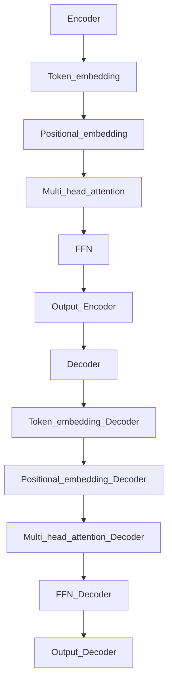
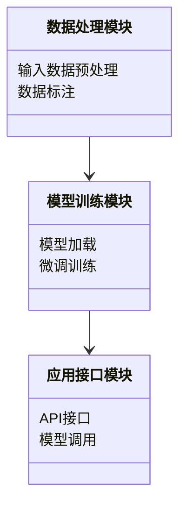

                 


```markdown
# 领域特定AI Agent：LLM在垂直行业的深度应用

## 关键词：大语言模型（LLM）、领域特定AI Agent、垂直行业、深度应用、AI解决方案

## 摘要：
随着大语言模型（LLM）的快速发展，其在垂直行业的深度应用成为可能。本文从领域特定AI Agent的定义出发，深入探讨LLM的模型结构与训练原理，详细分析领域特定AI Agent的构建流程，并通过金融、医疗等行业的具体案例，展示LLM在这些领域的深度应用。同时，本文还将讨论系统架构设计、项目实战以及未来发展方向，为读者提供全面而深入的分析。

---

# 第一部分: 领域特定AI Agent与LLM概述

## 第1章: 领域特定AI Agent与LLM概述

### 1.1 领域特定AI Agent的定义与背景

#### 1.1.1 从传统AI到领域特定AI的演变
传统AI主要依赖规则和专家系统，但在复杂领域中表现有限。随着深度学习的兴起，AI逐渐从通用化向领域特定化发展。领域特定AI Agent专注于特定领域，能够更好地处理复杂问题。

#### 1.1.2 大语言模型（LLM）的核心概念
大语言模型通过大量数据训练，能够理解和生成人类语言。其核心在于Transformer架构，包括编码器和解码器，能够捕捉上下文信息。

#### 1.1.3 领域特定AI Agent的背景与意义
领域特定AI Agent结合了大语言模型和领域知识，能够提供更精准的解决方案，提升效率和准确性。

### 1.2 LLM在垂直行业的应用前景

#### 1.2.1 垂直行业的特点与挑战
垂直行业具有专业性强、数据复杂等特点，传统AI难以应对复杂场景。

#### 1.2.2 LLM在垂直行业的潜在价值
LLM能够处理复杂文本，提供智能辅助和自动化解决方案，降低人工成本。

#### 1.2.3 领域特定AI Agent的优势与局限
优势包括高精度、高效性，但存在数据依赖性强、模型更新成本高等局限。

### 1.3 本章小结
本章介绍了领域特定AI Agent和LLM的基本概念，分析了其在垂直行业的应用前景及优缺点。

---

# 第二部分: 大语言模型（LLM）的原理与技术

## 第2章: LLM的模型结构与训练原理

### 2.1 模型结构解析

#### 2.1.1 Transformer架构的核心组件
- **编码器**：将输入序列映射到固定长度的向量。
- **解码器**：根据编码器输出生成目标序列。



#### 2.1.2 注意力机制的数学模型
- **注意力权重计算**：$QK^T$
- **注意力值计算**：$\text{softmax}(QK^T / \sqrt{d_k})V$

#### 2.1.3 深度学习中的并行计算
并行计算通过GPU加速模型训练，提升效率。

### 2.2 LLM的训练方法

#### 2.2.1 监督学习与无监督学习的区别
- **监督学习**：有标签数据，模型通过优化损失函数学习。
- **无监督学习**：无标签数据，模型通过生成内容学习。

#### 2.2.2 大规模数据的预训练策略
- 预训练：在大规模通用数据上训练模型。
- 微调：在特定领域数据上进一步训练。

#### 2.2.3 微调（Fine-tuning）的实现方式
通过调整模型参数，优化在特定领域的表现。

### 2.3 模型优化与推理加速

#### 2.3.1 剪枝与蒸馏技术
- **剪枝**：减少模型参数，降低计算成本。
- **蒸馏**：通过教师模型指导学生模型，减少计算量。

#### 2.3.2 模型压缩与量化
- **量化**：将模型参数从浮点数转换为低比特数整数，减少存储和计算成本。

#### 2.3.3 分布式推理的实现方案
通过分布式计算，提高推理效率。

### 2.4 本章小结
本章详细讲解了LLM的模型结构和训练原理，分析了优化与推理加速的方法。

---

# 第三部分: 领域特定AI Agent的构建与应用

## 第3章: 领域特定AI Agent的构建流程

### 3.1 领域特定问题的定义与分析

#### 3.1.1 领域特定问题的特点
- 专业性强
- 数据复杂
- 解决方案需要领域知识

#### 3.1.2 问题建模的步骤与方法
- 明确问题
- 收集数据
- 建立模型

#### 3.1.3 领域知识库的构建与管理
- 知识抽取
- 知识表示
- 知识存储

### 3.2 领域特定数据的准备与处理

#### 3.2.1 数据清洗与预处理
- 去除噪声
- 标准化处理
- 数据增强

#### 3.2.2 数据标注的策略与工具
- 标注工具：使用标注平台进行数据标注。
- 标注策略：制定统一的标注规则。

#### 3.2.3 数据增强的技术与应用
- 同义词替换
- 数据重排
- 数据虚拟化

### 3.3 领域特定AI Agent的训练与部署

#### 3.3.1 模型微调的实现步骤
- 数据准备
- 模型加载
- 微调训练

#### 3.3.2 模型部署的环境配置
- 硬件配置：GPU服务器
- 软件配置：深度学习框架

#### 3.3.3 模型监控与迭代优化
- 性能监控
- 模型迭代
- 持续优化

### 3.4 本章小结
本章详细讲解了领域特定AI Agent的构建流程，包括问题定义、数据准备和模型训练。

---

## 第4章: 金融行业的深度应用

### 4.1 金融行业的特点与挑战

#### 4.1.1 金融行业的复杂性
- 产品多样
- 市场波动大
- 监管严格

#### 4.1.2 金融领域的知识体系
- 金融术语
- 产品结构
- 市场分析

#### 4.1.3 金融行业的监管要求
- 合规性要求
- 风险控制
- 信息披露

### 4.2 LLM在金融领域的应用案例

#### 4.2.1 金融文本分析与信息提取
- 信息抽取：从金融报告中提取关键数据。
- 情感分析：分析市场情绪。

#### 4.2.2 金融风险评估与预测
- 风险建模：预测违约风险。
- 风险监控：实时监控市场风险。

#### 4.2.3 金融交易自动化与优化
- 自动化交易：基于模型生成交易策略。
- 交易优化：优化交易成本。

### 4.3 本章小结
本章通过金融行业的案例，展示了LLM在金融领域的深度应用。

---

## 第5章: 医疗行业的深度应用

### 5.1 医疗行业的特点与挑战

#### 5.1.1 医疗行业的专业性强
- 知识复杂
- 数据隐私
- 标准化低

#### 5.1.2 医疗领域的知识体系
- 医学术语
- 疾病诊断
- 治疗方案

#### 5.1.3 医疗行业的数据隐私
- 数据安全
- 合规性要求
- 数据共享

### 5.2 LLM在医疗领域的应用案例

#### 5.2.1 医疗文本分析与信息提取
- 病历分析：从电子健康记录中提取诊断信息。
- 文本分类：分类医疗文档类型。

#### 5.2.2 医疗风险评估与预测
- 疾病预测：预测患者患病风险。
- 风险监控：实时监控患者健康状况。

#### 5.2.3 医疗决策支持与优化
- 诊断建议：基于模型生成诊断建议。
- 治疗方案优化：优化治疗方案。

### 5.3 本章小结
本章通过医疗行业的案例，展示了LLM在医疗领域的深度应用。

---

## 第6章: 系统架构与设计

### 6.1 系统功能设计

#### 6.1.1 功能模块划分
- 数据处理模块
- 模型训练模块
- 应用接口模块



#### 6.1.2 功能设计图
- 数据流图
- 模块交互图

### 6.2 系统架构设计

#### 6.2.1 系统架构图
```mermaid
graph TD
    Client --> API Gateway
    API Gateway --> Model Service
    Model Service --> Database
```

#### 6.2.2 接口设计
- RESTful API
- 输入输出格式

### 6.3 本章小结
本章详细讲解了系统架构设计，包括功能模块划分和系统架构图。

---

## 第7章: 项目实战

### 7.1 环境安装

#### 7.1.1 安装Python
- 安装Python 3.x
- 安装pip

#### 7.1.2 安装深度学习框架
- 安装TensorFlow/PyTorch

#### 7.1.3 安装其他依赖
- 安装Jieba（中文分词工具）

### 7.2 系统核心实现源代码

#### 7.2.1 数据处理代码
```python
import jieba

def preprocess(text):
    tokens = jieba.lcut(text)
    return tokens
```

#### 7.2.2 模型微调代码
```python
import torch
from transformers import AutoTokenizer, AutoModelForMaskedLM

tokenizer = AutoTokenizer.from_pretrained('bert-base-chinese')
model = AutoModelForMaskedLM.from_pretrained('bert-base-chinese')
model.train()
```

#### 7.2.3 接口实现代码
```python
from flask import Flask, request, jsonify

app = Flask(__name__)

@app.route('/api/predict', methods=['POST'])
def predict():
    data = request.json
    text = data['text']
    # 调用模型进行预测
    return jsonify({'result': model.predict(text)})
```

### 7.3 实际案例分析与详细讲解

#### 7.3.1 金融案例
- 应用场景：股票预测
- 数据来源：股票历史数据
- 模型实现：时间序列预测

#### 7.3.2 医疗案例
- 应用场景：疾病诊断
- 数据来源：电子健康记录
- 模型实现：疾病分类

### 7.4 本章小结
本章通过实际案例，展示了系统的实现和应用。

---

## 第8章: 总结与展望

### 8.1 本章总结
- 领域特定AI Agent的优势
- LLM在垂直行业的应用前景
- 系统架构设计的重要性

### 8.2 未来发展方向
- 更高效的模型优化技术
- 更强的领域适应性
- 更多垂直行业的应用探索

### 8.3 最佳实践 tips
- 数据准备要充分
- 模型微调要精准
- 系统架构要合理

### 8.4 本章小结
本章总结了全文，并展望了未来发展方向。

---

## 作者：AI天才研究院 & 禅与计算机程序设计艺术

---

感谢您的阅读！如需进一步探讨或获取代码示例，请随时与我们联系。
```

