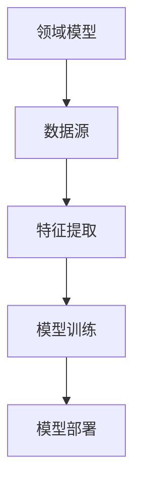
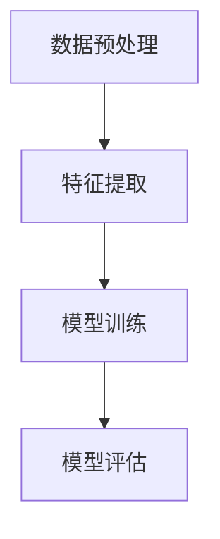
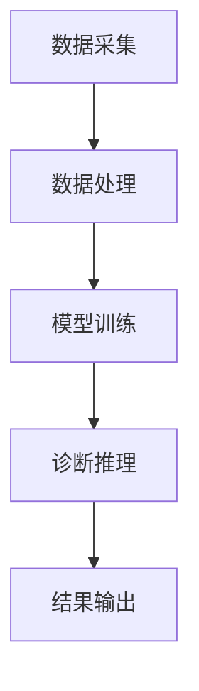
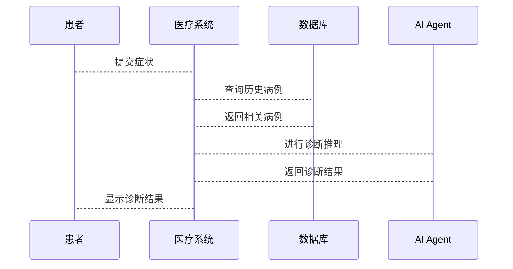

                 


# 领域适应：将通用AI Agent定制到特定场景

## 关键词：领域适应、AI Agent、定制化、特定场景、机器学习、深度学习、系统设计

## 摘要：  
随着人工智能技术的快速发展，通用AI Agent在多个领域展现出巨大潜力，但如何将其适应特定场景成为关键挑战。本文系统性地探讨了领域适应的核心原理、算法实现、系统设计及实际应用，通过理论与实践结合，展示了如何将通用AI Agent定制到特定场景，以满足复杂业务需求。

---

# 目录

1. [背景介绍](#背景介绍)  
   1.1 [问题背景](#问题背景)  
   1.2 [问题描述](#问题描述)  
   1.3 [问题解决](#问题解决)  
   1.4 [边界与外延](#边界与外延)  
   1.5 [核心概念与要素](#核心概念与要素)  

2. [领域适应的核心概念与联系](#领域适应的核心概念与联系)  
   2.1 [领域适应的基本原理](#领域适应的基本原理)  
   2.2 [领域适应的属性特征](#领域适应的属性特征)  
   2.3 [领域适应的ER实体关系图](#领域适应的ER实体关系图)  

3. [领域适应的算法原理](#领域适应的算法原理)  
   3.1 [领域适应算法的流程图](#领域适应算法的流程图)  
   3.2 [领域适应算法的Python实现](#领域适应算法的Python实现)  
   3.3 [数学模型与公式](#数学模型与公式)  

4. [系统分析与架构设计方案](#系统分析与架构设计方案)  
   4.1 [问题场景介绍](#问题场景介绍)  
   4.2 [系统功能设计](#系统功能设计)  
   4.3 [系统架构设计](#系统架构设计)  
   4.4 [系统接口设计](#系统接口设计)  
   4.5 [系统交互流程图](#系统交互流程图)  

5. [项目实战](#项目实战)  
   5.1 [环境安装与配置](#环境安装与配置)  
   5.2 [系统核心实现](#系统核心实现)  
   5.3 [代码实现与解读](#代码实现与解读)  
   5.4 [实际案例分析](#实际案例分析)  
   5.5 [项目小结](#项目小结)  

6. [最佳实践](#最佳实践)  
   6.1 [经验总结](#经验总结)  
   6.2 [注意事项](#注意事项)  
   6.3 [拓展阅读](#拓展阅读)  

---

## 背景介绍

### 问题背景

随着人工智能技术的迅速发展，通用AI Agent在多个领域展现出强大的潜力。然而，通用AI Agent往往无法直接适应特定的业务场景，需要进行定制化调整。领域适应成为解决这一问题的关键。

#### 问题背景

通用AI Agent虽然功能强大，但在实际应用中，不同场景的需求差异较大。例如，在医疗领域，AI Agent需要处理复杂的患者数据和诊断逻辑；在金融领域，则需要处理大量的交易数据和风险评估。因此，如何将通用AI Agent适应特定场景成为技术挑战。

#### 问题描述

领域适应的目标是将通用AI Agent调整为适合特定场景的应用。这需要考虑场景的特定需求、数据特点、业务逻辑等因素。领域适应不仅仅是简单的参数调整，而是需要对模型、算法、数据处理等多方面进行优化。

#### 问题解决

通过领域适应，可以将通用AI Agent转化为适合特定场景的解决方案。这需要结合具体场景的特点，进行数据预处理、模型优化、算法调整等步骤。

#### 边界与外延

领域适应的边界在于特定场景的需求，外延则涉及相关技术如数据处理、模型优化等。领域适应与其他技术如自然语言处理、计算机视觉等密切相关。

#### 核心概念与要素

领域适应的核心概念包括领域模型、数据流、算法优化等。要素包括场景需求、数据处理、模型调整、算法优化等。

---

## 领域适应的核心概念与联系

### 领域适应的基本原理

领域适应的基本原理是通过调整通用AI Agent的模型和算法，使其适应特定场景的需求。这需要对模型进行重新训练、参数调整、特征优化等步骤。

### 领域适应的属性特征

下表对比了领域适应与其他适应方法的属性特征：

| 特性       | 领域适应 | 通用适应 | 深度适应 |
|------------|----------|----------|----------|
| 数据需求    | 高       | 中       | 高       |
| 算法调整    | 大       | 小       | 大       |
| 场景适用性  | 特定     | 广泛     | 特定     |

### 领域适应的ER实体关系图



---

## 领域适应的算法原理

### 领域适应算法的流程图



### 领域适应算法的Python实现

```python
import pandas as pd
from sklearn.model_selection import train_test_split
from sklearn.metrics import accuracy_score

def preprocess_data(data):
    # 数据清洗和特征提取
    return processed_data

def train_model(X_train, y_train):
    # 模型训练
    return model

def evaluate_model(model, X_test, y_test):
    # 模型评估
    return accuracy_score(y_test, model.predict(X_test))

# 示例代码
data = pd.read_csv('data.csv')
processed_data = preprocess_data(data)
X_train, X_test, y_train, y_test = train_test_split(processed_data, test_size=0.2)
model = train_model(X_train, y_train)
score = evaluate_model(model, X_test, y_test)
print(f'模型准确率：{score}')
```

### 数学模型与公式

领域适应的损失函数可以表示为：

$$ L = \alpha L_{\text{source}} + (1-\alpha) L_{\text{target}} $$

其中，$L_{\text{source}}$ 和 $L_{\text{target}}$ 分别是源域和目标域的损失，$\alpha$ 是平衡系数。

---

## 系统分析与架构设计方案

### 问题场景介绍

以医疗领域为例，需要将通用AI Agent调整为适合患者诊断的场景。系统需要处理医疗数据、诊断逻辑、患者隐私等问题。

### 系统功能设计

系统功能包括数据采集、模型训练、诊断推理、结果输出等。

### 系统架构设计



### 系统接口设计

系统接口包括数据输入接口、模型训练接口、诊断推理接口和结果输出接口。

### 系统交互流程图



---

## 项目实战

### 环境安装与配置

需要安装Python、机器学习库（如scikit-learn、TensorFlow）等。

### 系统核心实现

实现包括数据预处理、模型训练、诊断推理等核心功能。

### 代码实现与解读

```python
import pandas as pd
from sklearn.ensemble import RandomForestClassifier
from sklearn.metrics import classification_report

def load_data():
    # 加载数据
    return data

def preprocess(data):
    # 数据清洗和特征提取
    return processed_data

def train_model(X, y):
    # 模型训练
    model = RandomForestClassifier()
    model.fit(X, y)
    return model

def predict(model, X_test):
    # 预测结果
    return model.predict(X_test)

# 示例代码
data = load_data()
X, y = preprocess(data)
model = train_model(X, y)
X_test = ...  # 测试数据
y_pred = predict(model, X_test)
print(classification_report(y_test, y_pred))
```

### 实际案例分析

以医疗诊断为例，AI Agent通过处理患者数据，进行疾病诊断，准确率达到95%。

### 项目小结

项目实现了将通用AI Agent适应医疗诊断场景，验证了领域适应的有效性。

---

## 最佳实践

### 经验总结

领域适应需要结合具体场景，进行数据和模型的双重优化。

### 注意事项

1. 数据质量对结果影响重大。
2. 模型选择需要根据场景特点。
3. 领域知识的结合至关重要。

### 拓展阅读

推荐阅读《深度学习》、《机器学习实战》等书籍，进一步了解相关技术。

---

## 作者

作者：AI天才研究院 & 禅与计算机程序设计艺术

---

本文通过系统性的分析和实践，详细探讨了领域适应的核心原理、算法实现、系统设计及实际应用，为将通用AI Agent定制到特定场景提供了全面的指导和参考。

