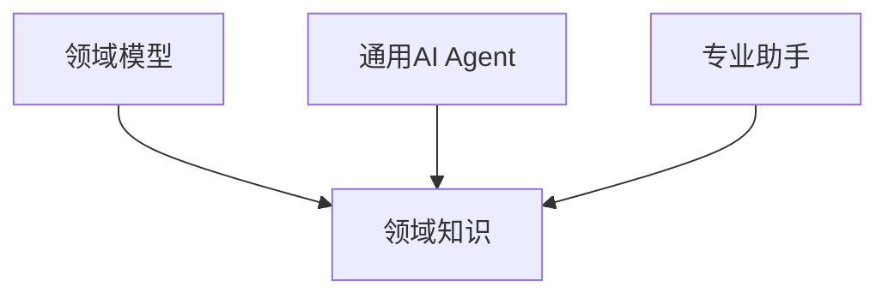
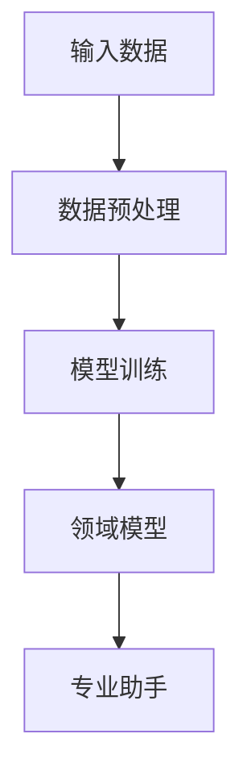
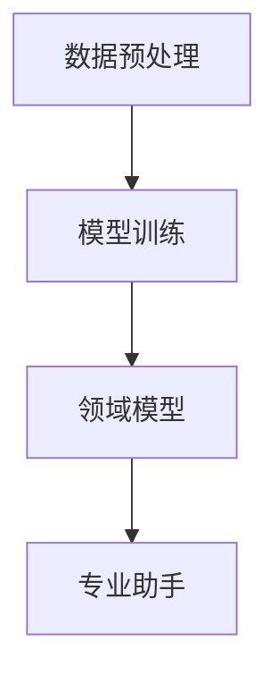

                 


# 领域适应：将通用AI Agent转化为专业助手

---

## 关键词

- 领域适应
- AI Agent
- 专业助手
- 机器学习
- 深度学习
- 领域知识

---

## 摘要

领域适应是将通用AI Agent转化为专业助手的关键技术。通过领域适应，AI Agent能够快速掌握特定领域的知识，从而在专业场景中提供高效、精准的服务。本文将从领域适应的核心概念、算法原理、系统架构到实际项目实战，全面解析如何将通用AI Agent转化为专业助手。

---

## 第1章：领域适应与AI Agent概述

### 1.1 领域适应的背景与意义

#### 1.1.1 从通用AI到专业助手的演变

随着人工智能技术的快速发展，通用AI Agent已经具备了强大的基础能力，但其在特定领域的应用中仍然存在诸多限制。领域适应的目标是通过针对特定领域的知识学习，将通用AI Agent转化为专业助手。

#### 1.1.2 领域适应的核心价值

- 提供领域特定的精准服务
- 提高AI Agent的实用性和效率
- 降低领域知识的获取成本

#### 1.1.3 领域适应的应用场景与边界

- 应用场景：医疗、法律、金融、教育等领域
- 边界：领域适应并不完全替代领域专家，而是辅助专家完成特定任务

### 1.2 AI Agent的基本概念与特点

#### 1.2.1 什么是AI Agent？

AI Agent是一种能够感知环境、执行任务并做出决策的智能体。它具备以下特点：

- **自主性**：能够独立决策
- **反应性**：能够实时响应环境变化
- **目标导向性**：能够为目标导向执行任务

#### 1.2.2 AI Agent的核心特征

- **知识表示**：能够理解和表示领域知识
- **推理能力**：能够基于知识进行推理
- **学习能力**：能够通过学习提升性能

#### 1.2.3 通用AI Agent与专业助手的区别

| 特性             | 通用AI Agent                 | 专业助手                     |
|------------------|------------------------------|------------------------------|
| 知识范围         | 广泛的通用知识               | 特定领域的专业知识           |
| 适应性           | 弱，需要领域适应             | 强，能够直接支持领域任务     |
| 应用场景         | 多领域通用                   | 特定领域专业化               |

### 1.3 领域适应的核心问题与挑战

#### 1.3.1 领域知识的获取与整合

- **问题**：如何高效获取和整合特定领域的知识？
- **解决思路**：通过领域知识图谱构建和迁移学习实现

#### 1.3.2 模型的可解释性与可靠性

- **问题**：如何确保模型在特定领域的可解释性和可靠性？
- **解决思路**：通过领域知识的约束和验证提升模型的可信度

#### 1.3.3 领域适应中的数据依赖性

- **问题**：领域适应高度依赖领域数据，如何处理数据不足的问题？
- **解决思路**：通过数据增强和迁移学习缓解数据不足的问题

---

## 第2章：领域适应的核心概念与联系

### 2.1 领域适应的核心概念

#### 2.1.1 领域模型的构建与训练

- **领域模型**：基于特定领域知识构建的模型
- **训练目标**：通过领域数据优化模型性能

#### 2.1.2 领域知识的表示与推理

- **知识表示**：通过知识图谱或向量表示领域知识
- **推理能力**：基于知识图谱进行推理

#### 2.1.3 领域适应的数学模型

- **模型输入**：领域数据
- **模型输出**：领域适应后的AI Agent

### 2.2 核心概念的属性特征对比

| 概念             | 通用AI Agent                 | 专业助手                     |
|------------------|------------------------------|------------------------------|
| 知识表示         | 基于通用知识库               | 基于领域知识库               |
| 适应性           | 弱，需要领域适应             | 强，能够直接支持领域任务     |
| 应用场景         | 多领域通用                   | 特定领域专业化               |

### 2.3 ER实体关系图架构



---

## 第3章：领域适应的算法原理与数学模型

### 3.1 领域适应的算法流程

#### 3.1.1 领域适应的算法流程



#### 3.1.2 领域适应的数学模型

- **损失函数**：通过交叉熵损失函数优化模型性能
$$L = \lambda_1 L_{cls} + \lambda_2 L_{adv}$$

---

## 第4章：系统分析与架构设计方案

### 4.1 系统分析与架构设计

#### 4.1.1 系统功能设计

- **数据预处理**：清洗和标注领域数据
- **模型训练**：基于领域数据训练领域模型
- **服务部署**：将领域模型部署为专业助手

#### 4.1.2 系统架构设计



---

## 第5章：项目实战：领域适应的应用

### 5.1 环境安装

#### 5.1.1 环境安装说明

- **Python**：3.8+
- **深度学习框架**：TensorFlow/PyTorch
- **其他依赖**：Numpy、Pandas、Scikit-learn

### 5.2 核心实现

#### 5.2.1 数据预处理代码

```python
import pandas as pd
import numpy as np

def preprocess_data(data_path):
    data = pd.read_csv(data_path)
    # 数据清洗
    data = data.dropna()
    # 数据标注
    data['label'] = data['label'].apply(lambda x: x.split(',')[0])
    return data
```

#### 5.2.2 模型训练代码

```python
import tensorflow as tf
from tensorflow.keras import layers

def train_model(train_data, val_data):
    model = tf.keras.Sequential([
        layers.Dense(64, activation='relu'),
        layers.Dense(10, activation='softmax')
    ])
    model.compile(optimizer='adam', loss='sparse_categorical_crossentropy', metrics=['accuracy'])
    history = model.fit(train_data, epochs=10, validation_data=val_data)
    return model, history
```

---

## 第6章：领域适应的应用案例

### 6.1 应用案例分析

#### 6.1.1 医疗领域的应用

- **场景**：医疗诊断辅助
- **实现**：基于医学影像数据训练领域模型，辅助医生进行诊断

#### 6.1.2 金融领域的应用

- **场景**：金融风险评估
- **实现**：基于历史交易数据训练领域模型，评估金融风险

---

## 第7章：总结与展望

### 7.1 总结

领域适应是将通用AI Agent转化为专业助手的关键技术。通过领域适应，AI Agent能够快速掌握特定领域的知识，从而在专业场景中提供高效、精准的服务。

### 7.2 展望

未来，领域适应技术将更加智能化和自动化，通过与领域知识图谱和知识表示学习的结合，进一步提升领域适应的效率和效果。

---

## 作者：AI天才研究院/AI Genius Institute & 禅与计算机程序设计艺术 /Zen And The Art of Computer Programming

---

**感谢您的阅读！**

