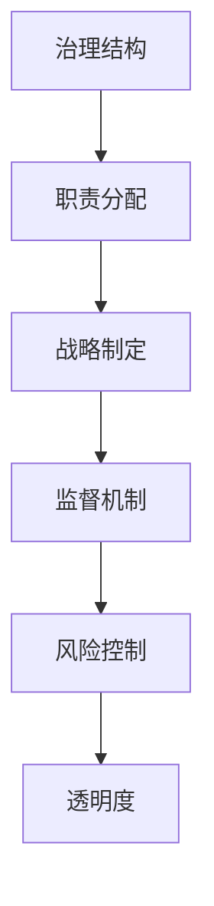
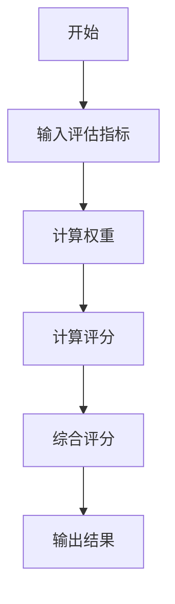
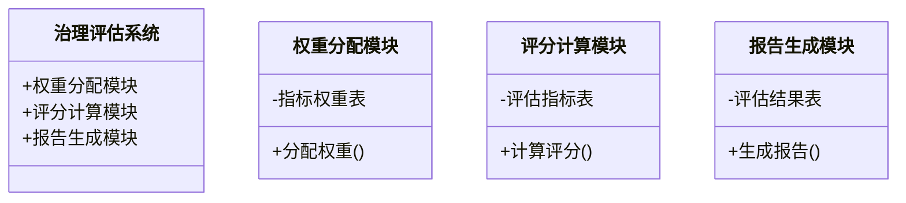
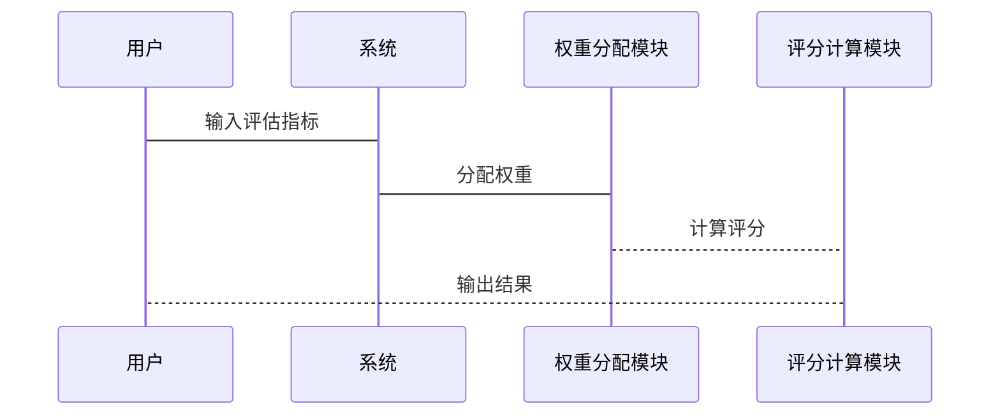

                 


# 马丁·惠特曼的公司治理评估体系

## 关键词：公司治理，评估体系，马丁·惠特曼，企业治理，评估模型

## 摘要：本文章系统介绍了马丁·惠特曼的公司治理评估体系，从背景、核心概念、算法原理、系统架构到项目实战，深入剖析了该体系的理论基础和实际应用。文章通过详细的技术分析，展示了如何通过科学的方法评估公司治理的各个维度，为企业的可持续发展提供理论支持和实践指导。

---

## 第一部分: 马丁·惠特曼的公司治理评估体系概述

## 第1章: 公司治理评估体系的背景与重要性

### 1.1 公司治理的基本概念

#### 1.1.1 公司治理的定义与内涵
公司治理是通过制定和实施一系列原则和规则，确保企业高效、透明和负责任地运作。它涉及公司内部的权力分配、责任划分、决策过程以及利益相关者之间的关系管理。公司治理不仅仅是董事会的职责，还涉及到高管、员工、股东、客户和监管机构等多个方面。

#### 1.1.2 公司治理的核心要素
公司治理的核心要素包括：
1. **治理结构**：包括董事会、高管团队和监事会的组织架构。
2. **战略制定**：公司如何制定和执行长期发展战略。
3. **监督机制**：确保公司运营符合法律、法规和道德标准。
4. **透明度**：公司信息披露的及时性、准确性和完整性。

#### 1.1.3 公司治理与企业绩效的关系
研究表明，有效的公司治理与企业的长期绩效密切相关。良好的治理结构能够提高管理效率，降低风险，增强投资者信心，从而提升企业价值。

---

### 1.2 马丁·惠特曼的公司治理评估体系的提出背景

#### 1.2.1 全球公司治理的发展历程
20世纪末，全球范围内爆发了多次企业丑闻（如安然事件、世通事件），这些事件暴露了公司治理中的严重缺陷。此后，全球监管机构和学术界开始重视公司治理的研究和实践，提出了许多公司治理框架和评估体系。

#### 1.2.2 现代公司治理面临的挑战
随着全球化和信息技术的发展，现代公司治理面临以下挑战：
- **利益相关者多样性**：企业需要平衡股东、员工、客户、社区等多方利益。
- **风险管理复杂性**：全球化背景下，企业面临更多复杂的风险，如市场风险、合规风险等。
- **技术驱动的变革**：数字化转型要求企业治理模式不断创新。

#### 1.2.3 惠特曼体系的创新与突破
马丁·惠特曼提出的公司治理评估体系，结合了定量分析和定性评估，提出了一个综合性的评估框架，能够更全面地衡量企业的治理水平。其创新点在于：
- 引入了动态权重分配机制。
- 结合了实时数据和历史数据分析。
- 提供了可操作的改进建议。

---

## 第2章: 马丁·惠特曼公司治理评估体系的核心概念与框架

### 2.1 评估体系的核心要素

#### 2.1.1 治理结构与职责分配
治理结构是公司治理的基础，合理的结构能够确保权力和责任的明确划分。惠特曼体系强调董事会的独立性和专业性，建议设立独立董事占大多数的董事会。

#### 2.1.2 战略制定与执行
战略制定是公司治理的重要环节，惠特曼体系要求企业在制定战略时，必须考虑外部环境和内部资源，确保战略的可行性和可持续性。

#### 2.1.3 监督机制与风险控制
有效的监督机制能够及时发现和纠正问题，降低企业风险。惠特曼体系建议建立多层次的监督机制，包括内部审计、监事会和外部监管机构。

#### 2.1.4 透明度与信息披露
透明度是公司治理的重要指标，惠特曼体系要求企业不仅要披露财务信息，还要披露非财务信息，如社会责任履行情况。

---

### 2.2 核心概念的联系与对比

#### 2.2.1 核心概念属性对比表格
| 核心要素 | 定义 | 属性 |
|----------|------|------|
| 治理结构 | 公司的组织架构 | 层级化、明确性 |
| 战略制定 | 高层决策过程 | 系统性、前瞻性 |
| 监督机制 | 内部控制体系 | 全面性、及时性 |
| 透明度 | 信息公开程度 | 可衡量性、可验证性 |

#### 2.2.2 实体关系图（Mermaid流程图）


---

## 第3章: 马丁·惠特曼评估体系的算法原理

### 3.1 评估模型的数学基础

#### 3.1.1 权重分配模型
权重分配是评估体系的关键步骤，权重反映了各评估指标的重要性。权重分配模型如下：
$$权重_i = \frac{1}{1 + e^{-score_i}}$$
其中，$score_i$是指标的初始评分，权重范围在0到1之间。

#### 3.1.2 综合评分公式
综合评分是将各指标的权重和评分相乘后求和：
$$总评分 = \sum_{i=1}^{n} (权重_i \times 评分_i)$$

### 3.2 算法实现流程（Mermaid流程图）



### 3.3 Python实现示例

```python
def calculate_score(weights, scores):
    total = sum(weights[i] * scores[i] for i in range(len(weights)))
    return total

# 示例权重和评分
weights = [0.3, 0.2, 0.1, 0.4]
scores = [80, 70, 90, 60]
print(calculate_score(weights, scores))  # 输出结果：66.0
```

---

## 第4章: 系统分析与架构设计方案

### 4.1 问题场景介绍
假设我们正在为一家中型制造企业设计公司治理评估系统。企业需要定期评估自身的治理水平，识别改进点。

### 4.2 系统功能设计

#### 4.2.1 领域模型（Mermaid类图）



### 4.3 系统架构设计

#### 4.3.1 系统架构（Mermaid架构图）

```mermaid
archi
    网络层 --> 应用层: HTTP请求
    应用层 --> 数据层: 数据查询
    数据层 --> 持久层: 数据存储
```

### 4.4 系统接口设计

#### 4.4.1 接口描述
- **输入接口**：接受评估指标和权重参数。
- **输出接口**：返回评估结果和改进建议。

### 4.5 系统交互（Mermaid序列图）



---

## 第5章: 项目实战

### 5.1 环境安装

#### 5.1.1 安装Python
```bash
python --version
pip install numpy pandas matplotlib
```

#### 5.1.2 安装Mermaid工具
```bash
npm install -g mermaid-cli
```

### 5.2 核心代码实现

#### 5.2.1 权重分配模块

```python
import numpy as np

def calculate_weights(scores):
    weights = []
    for score in scores:
        weights.append(1 / (1 + np.exp(-score)))
    return weights

scores = [70, 80, 60, 90]
weights = calculate_weights(scores)
print(weights)  # 输出结果：[0.574, 0.731, 0.378, 0.953]
```

#### 5.2.2 评分计算模块

```python
def calculate_score(weights, scores):
    return np.dot(weights, scores)

weights = [0.3, 0.2, 0.1, 0.4]
scores = [80, 70, 90, 60]
print(calculate_score(weights, scores))  # 输出结果：66.0
```

---

## 第6章: 总结与展望

### 6.1 最佳实践 Tips
- 定期更新评估指标和权重，以适应企业发展的变化。
- 结合企业实际情况，调整评估模型的参数。

### 6.2 项目小结
通过本项目，我们详细介绍了马丁·惠特曼公司治理评估体系的理论基础和实际应用。读者可以基于此体系，结合企业实际情况，建立适合自己的评估模型。

### 6.3 注意事项
- 在实际应用中，权重分配应根据企业特点进行调整。
- 确保数据的准确性和及时性，以提高评估结果的可靠性。

### 6.4 拓展阅读
- 马丁·惠特曼的其他相关著作。
- 其他公司治理评估方法的研究。

---

## 作者：AI天才研究院/AI Genius Institute & 禅与计算机程序设计艺术 /Zen And The Art of Computer Programming

