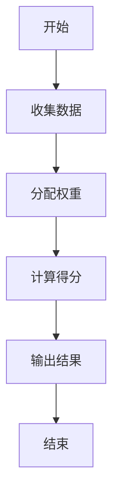
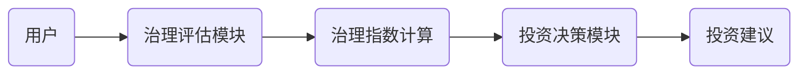

                 


# 马克·莫比乌斯的公司治理改善投资

## 关键词：公司治理，投资，治理改善，治理指数，系统架构，投资策略

## 摘要：本文探讨马克·莫比乌斯如何通过投资改善公司治理，分析其理论基础、数学模型和系统架构，提供实践案例和总结。

---

## 第一部分: 背景介绍

### 第1章: 公司治理的基本概念

#### 1.1 公司治理的定义与核心要素
- **定义**：公司治理是通过董事会和管理层确保公司有效运作并实现股东价值最大化的过程。
- **核心要素**：董事会结构、股东权利、高管激励、透明度。
- **目标**：提升公司绩效，降低风险，确保长期价值。

#### 1.2 投资与公司治理的关系
- **影响**：良好的治理降低投资风险，提高投资回报。
- **目标**：通过投资改善治理结构，优化公司运营。
- **投资者角色**：积极股东，推动治理改革。

### 第2章: 公司治理中的问题与挑战

#### 2.1 公司治理中的常见问题
- 代理问题：管理层追求自身利益，忽视股东利益。
- 激励不足：高管激励机制不完善，工作积极性不高。
- 信息不对称：股东对公司运营了解不足，决策失误。

#### 2.2 公司治理中的挑战
- 股权结构复杂：股东分散，难以形成有效监督。
- 跨国公司治理难题：文化差异和法律差异导致治理复杂。
- 数字化时代：数据安全和隐私保护成为新的挑战。

### 第3章: 公司治理改善的理论基础

#### 3.1 公司治理理论的发展历程
- 西方公司治理理论：从“股东至上”到利益相关者理论的演变。
- 东方公司治理模式：探索适合本土的治理结构。
- 全球化趋势：公司治理的趋同与多样化。

#### 3.2 公司治理改善的核心原则
- 股东权利保护：确保股东知情权、参与权。
- 董事会有效性：优化董事会结构，提升决策效率。
- 高管激励机制：设计合理的激励方案，激发积极性。

### 第4章: 投资视角下的公司治理分析

#### 4.1 投资者如何评估公司治理
- 评估指标：透明度、董事会结构、股东权利。
- 股东权利保护：反摊薄条款、投票权。
- 董事会效率：独立董事比例、董事会会议频率。

#### 4.2 公司治理对投资决策的影响
- 投资价值提升：良好的治理降低风险，提高回报。
- 投资风险：治理缺陷可能导致投资损失。
- 投资者角色：通过积极投资推动治理改善。

### 第5章: 公司治理改善的实践方法

#### 5.1 公司治理改善的步骤与策略
- 诊断问题：识别治理中的缺陷。
- 设计方案：制定改善计划。
- 实施与监控：执行方案并持续优化。

#### 5.2 工具与方法
- 治理框架设计：制定明确的治理结构。
- 激励机制：设计合理的激励方案。

---

## 第二部分: 核心概念与联系

### 第6章: 核心概念原理

#### 6.1 公司治理的核心要素
- 董事会：战略制定与监督。
- 高管：公司运营。
- 股东：投资回报。

#### 6.2 公司治理的ER实体关系图
```mermaid
er
    %% 公司治理ER图
    entity 股东 {
        key 股东ID
        股权比例
        股东类型
    }
    entity 董事会 {
        key 董事会ID
        董事成员
        董事会结构
    }
    entity 高级管理层 {
        key 高管ID
        职位
        责任
    }
    股东 -|{拥有}| 股份
    股东 -->{投票} 董事会
    董事会 -->{任命} 高级管理层
```

---

## 第三部分: 算法原理讲解

### 第7章: 公司治理评估算法

#### 7.1 治理指数计算算法
- **公式**：$$治理指数 = \sum (权重_i \times 评估指标_i)$$
- **步骤**：数据收集、权重分配、计算得分。

#### 7.2 治理指数算法流程图


---

## 第四部分: 数学模型

### 第8章: 治理指数数学模型

#### 8.1 治理指数公式
$$治理指数 = w_1 \times 指标1 + w_2 \times 指标2 + ... + w_n \times 指标n$$

#### 8.2 示例计算
假设权重分配为：透明度（40%）、董事会独立性（30%）、股东权利（30%）。计算某公司治理指数：
$$治理指数 = 0.4 \times 80 + 0.3 \times 70 + 0.3 \times 60 = 32 + 21 + 18 = 71$$

---

## 第五部分: 系统分析与架构设计

### 第9章: 系统架构设计

#### 9.1 系统功能设计
- 治理评估模块：计算治理指数。
- 投资决策模块：基于治理指数制定投资策略。

#### 9.2 系统架构图


---

## 第六部分: 项目实战

### 第10章: 项目实战

#### 10.1 案例分析
- 公司：科技公司XYZ。
- 问题：治理指数低，股东权利薄弱。
- 解决方案：优化董事会结构，增加独立董事比例，提升透明度。

#### 10.2 核心代码实现
```python
def calculate_governance_index(weights, metrics):
    return sum(w * m for w, m in zip(weights, metrics))

weights = [0.4, 0.3, 0.3]
metrics = [80, 70, 60]
index = calculate_governance_index(weights, metrics)
print(f"治理指数: {index}")
```

---

## 第七部分: 总结与展望

### 第11章: 总结

#### 11.1 小结
- 公司治理是投资成功的关键。
- 通过治理改善提升投资回报。
- 投资者应积极参与治理，推动改进。

#### 11.2 注意事项
- 公司治理改善需长期投入。
- 考虑法律和文化差异。
- 定期评估和优化治理结构。

#### 11.3 拓展阅读
- 阅读相关书籍和文献，深入学习公司治理理论。
- 关注行业动态，了解最新治理实践。

---

## 作者：AI天才研究院/AI Genius Institute & 禅与计算机程序设计艺术 /Zen And The Art of Computer Programming

