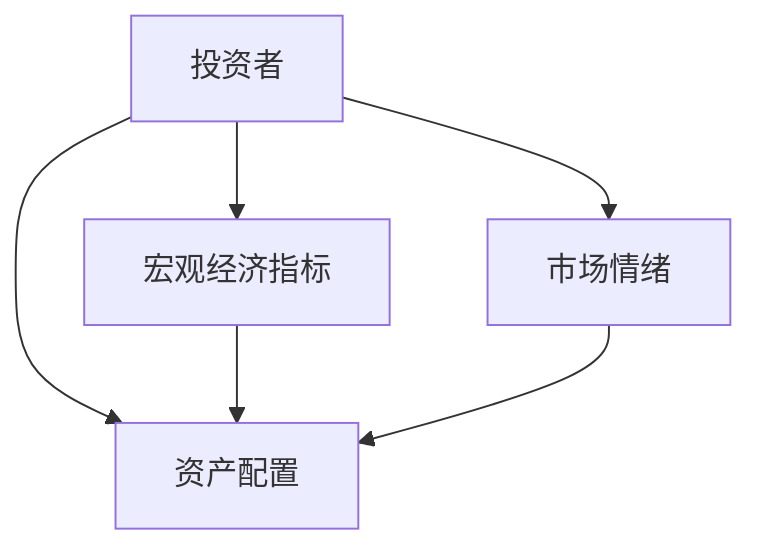
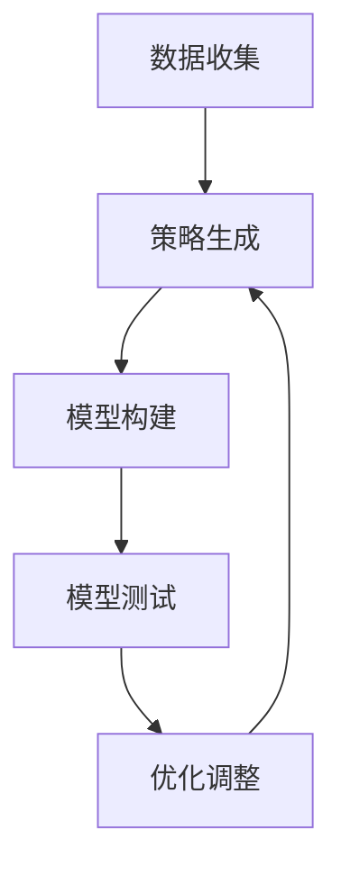
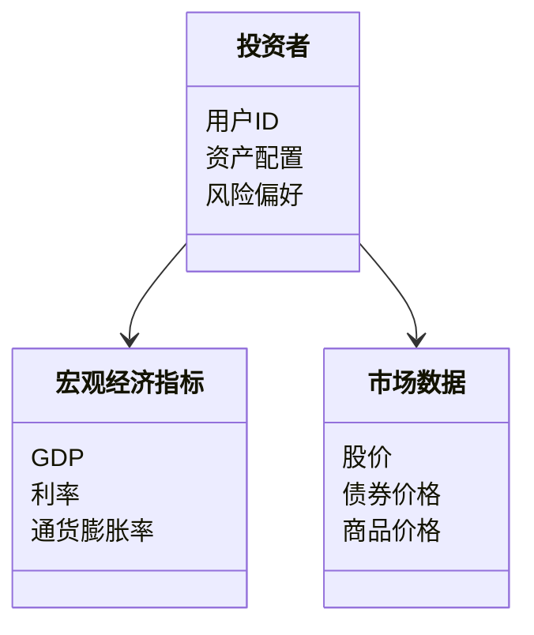
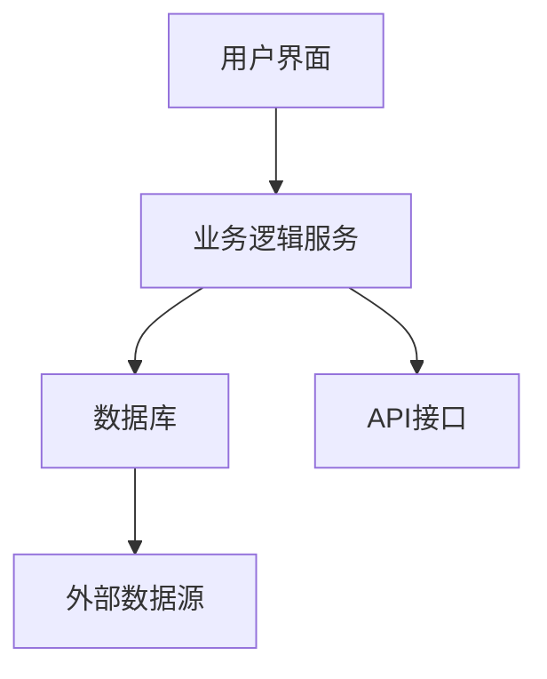

                 


# 《马里奥·加贝利的全球宏观价值投资》

## 关键词：全球宏观价值投资、资产定价模型、宏观经济指标、投资策略、风险控制

## 摘要：  
《马里奥·加贝利的全球宏观价值投资》是一本深入探讨宏观价值投资理论与实践的经典著作。本文将从背景、核心概念、算法原理、系统架构设计、项目实战以及最佳实践等多个维度，全面解析全球宏观价值投资的精髓。通过结合理论与实际案例，帮助读者理解如何在全球化市场中运用宏观视角进行投资决策，掌握风险控制和资产优化配置的策略。

---

## 第一部分: 全球宏观价值投资的背景与核心概念

### 第1章: 全球宏观价值投资的定义与背景

#### 1.1 全球宏观价值投资的定义
- **宏观价值投资**：一种以宏观经济分析为基础，结合资产定价模型和市场行为学理论的投资策略，旨在通过识别市场失衡和经济周期波动，实现长期超额收益。
- **全球化视角**：在跨国市场中，投资者需要考虑全球经济、地缘政治、货币政策等宏观因素对资产价格的影响。

#### 1.2 宏观价值投资的背景
- **全球化进程加速**：跨国资本流动频繁，投资者需要具备全球视野。
- **经济周期波动**：通过分析宏观经济指标（如GDP、利率、通货膨胀率等）来预测市场走势。
- **传统投资的局限性**：传统投资策略往往忽视宏观因素，难以应对复杂多变的市场环境。

#### 1.3 宏观价值投资的重要性
- **风险控制**：通过宏观分析识别潜在风险，避免重大损失。
- **资产配置优化**：在不同资产类别之间动态调整，提高投资效率。
- **长期收益**：通过把握宏观经济趋势，实现长期稳定的收益增长。

---

### 第2章: 宏观价值投资的核心概念与联系

#### 2.1 宏观价值投资的原理
- **资产定价模型**：通过宏观经济指标和市场情绪分析，确定资产的公允价值。
- **市场有效性的分析**：评估市场是否存在结构性失衡，捕捉短期套利机会。
- **投资组合构建**：根据宏观经济预测，动态调整资产配置比例。

#### 2.2 宏观价值投资的核心要素
- **宏观经济指标**：GDP增长率、利率、通货膨胀率、失业率等。
- **市场情绪与行为**：投资者情绪、市场流动性、资金流向等。
- **资产配置策略**：股票、债券、商品等资产的权重分配。

#### 2.3 宏观价值投资的ER实体关系图


---

## 第二部分: 宏观价值投资的算法原理

### 第3章: 宏观价值投资的算法原理

#### 3.1 宏观价值投资的数学模型
- **资本资产定价模型（CAPM）**
$$ E(r_i) = r_f + \beta_i (E(r_m) - r_f) $$
- **多因子模型**
$$ E(r_i) = \alpha + \beta_1 F_1 + \beta_2 F_2 + ... + \beta_n F_n + \epsilon $$

#### 3.2 宏观价值投资的算法流程


#### 3.3 宏观价值投资的Python实现
```python
import numpy as np
import pandas as pd

# 示例数据
data = pd.DataFrame({'GDP': [2, 3, 4, 5, 6],
                      'Inflation': [1.5, 2.0, 1.8, 2.2, 1.6],
                      'Interest': [0.05, 0.06, 0.05, 0.07, 0.06]})

# 计算宏观经济因子
data['GDP_Growth'] = data['GDP'].pct_change()
data['Inflation_Rate'] = data['Inflation'].mean()
```

---

## 第三部分: 宏观价值投资的系统架构设计

### 第4章: 系统分析与架构设计

#### 4.1 问题场景介绍
- **数据来源**：宏观经济指标、市场数据、公司财报。
- **目标**：构建一个基于宏观经济分析的投资决策支持系统。

#### 4.2 系统功能设计


#### 4.3 系统架构设计


---

## 第四部分: 项目实战

### 第5章: 项目实战与经验总结

#### 5.1 环境安装
```bash
pip install numpy pandas scikit-learn
```

#### 5.2 核心代码实现
```python
from sklearn.linear_model import LinearRegression

# 示例数据
X = pd.DataFrame({'GDP': [2, 3, 4, 5, 6],
                  'Inflation': [1.5, 2.0, 1.8, 2.2, 1.6]})
y = pd.Series([0.05, 0.06, 0.05, 0.07, 0.06])

# 模型训练
model = LinearRegression()
model.fit(X, y)

# 预测
new_data = pd.DataFrame({'GDP': [7],
                          'Inflation': [1.4]})
print(model.predict(new_data))
```

#### 5.3 案例分析
- **案例背景**：2020年全球经济衰退背景下，如何通过宏观分析调整资产配置。
- **分析步骤**：分析GDP、利率、通货膨胀率，预测市场走势，制定投资策略。

#### 5.4 项目经验总结
- **关键点**：宏观经济分析的重要性，数据的准确性和及时性，模型的灵活性。
- **挑战**：如何处理数据缺失和模型过拟合问题。
- **解决方案**：结合多因子模型和实时数据反馈，定期优化投资策略。

---

## 第五部分: 最佳实践与总结

### 第6章: 最佳实践与总结

#### 6.1 小结
- 宏观价值投资是一种以宏观经济分析为基础的投资策略，能够帮助投资者在全球化市场中捕捉结构性机会，控制风险。

#### 6.2 注意事项
- 数据质量是关键，需确保数据的准确性和完整性。
- 模型需要定期优化，以适应市场变化。
- 风险控制是投资成功的重要保障。

#### 6.3 拓展阅读
- 马里奥·加贝利的其他著作
- 相关学术论文
- 宏观经济分析工具

---

## 作者：AI天才研究院/AI Genius Institute & 禅与计算机程序设计艺术 /Zen And The Art of Computer Programming

