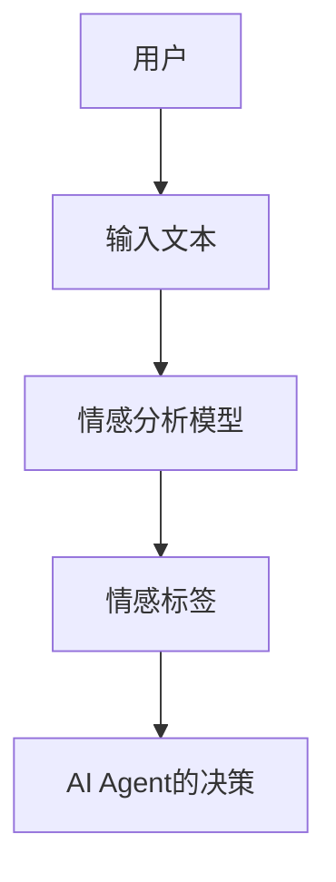
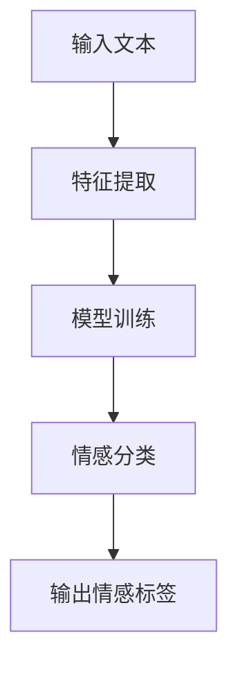
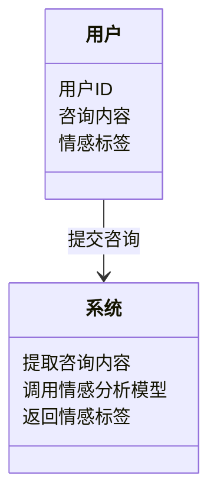
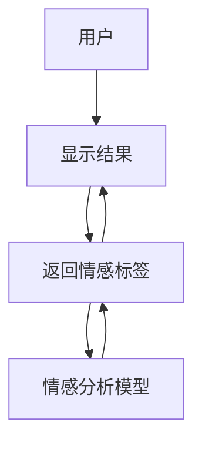
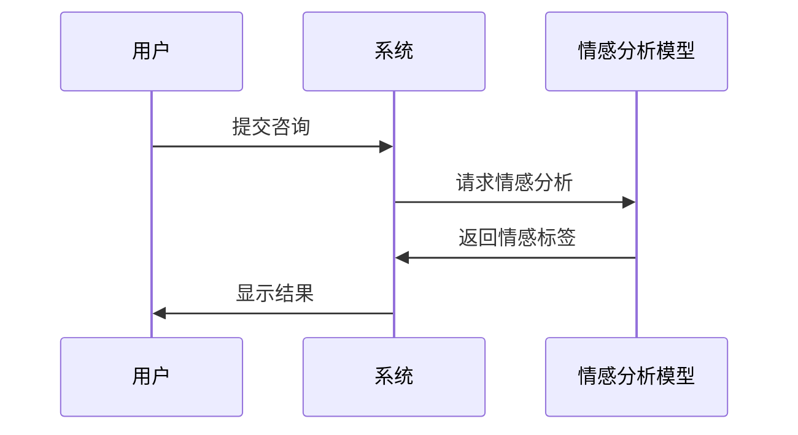

                 


# AI Agent 的情感分析：利用 LLM 洞察用户情绪

## 关键词：
- 情感分析
- AI Agent
- LLM
- 用户情绪
- 自然语言处理
- 人机交互

## 摘要：
本文深入探讨了AI Agent如何利用大语言模型（LLM）进行情感分析，以洞察用户情绪。文章从情感分析的基本概念入手，分析了AI Agent在情感分析中的角色和价值，详细讲解了基于LLM的情感分析算法及其优势，探讨了情感分析在人机交互中的应用。同时，本文通过实际案例展示了如何设计和实现情感分析系统，并总结了最佳实践和未来趋势，为读者提供了全面的指导。

---

# 第1章 情感分析与AI Agent概述

## 1.1 情感分析的基本概念

### 1.1.1 情感分析的定义与背景
情感分析是自然语言处理（NLP）领域的重要任务，旨在判断一段文本所表达的情感倾向。例如，判断一条社交媒体帖子是“正面”、“负面”还是“中性”。情感分析广泛应用于社交媒体监控、客户反馈分析、舆情监测等领域。

### 1.1.2 AI Agent 的定义与作用
AI Agent（人工智能代理）是一种智能实体，能够感知环境、自主决策并执行任务。例如，智能音箱、聊天机器人、推荐系统中的虚拟助手等。AI Agent的核心目标是通过理解和响应用户输入，提供高效、个性化的服务。

### 1.1.3 情感分析在AI Agent中的应用价值
在AI Agent中，情感分析可以帮助理解用户的意图和情绪，从而提供更精准的服务。例如：
- 在智能音箱中，理解用户的语气，判断其情绪状态。
- 在客服机器人中，识别用户的不满情绪，优先解决问题。

## 1.2 情感分析的核心问题

### 1.2.1 情感分析的目标与任务
情感分析的目标是将文本分类为不同的情感类别。任务包括：
- **二分类**：正面、负面。
- **多分类**：正面、中性、负面，甚至更细的情绪类别（如快乐、悲伤、愤怒等）。
- **情感强度分析**：判断情感的强度（如“非常喜欢” vs. “稍微喜欢”）。

### 1.2.2 情感分析的分类与层次
情感分析可以按粒度分为：
- **文档级**：对整段文本的情感进行分类。
- **句子级**：对单个句子的情感进行分类。
- **词汇级**：对词语或短语的情感倾向进行分析。

### 1.2.3 情感分析的挑战与解决方案
挑战包括：
- **情感的模糊性**：用户的情感表达可能不明确。
- **数据的不平衡性**：某些情感类别可能样本较少。
- **领域适应性**：模型在特定领域（如医疗、金融）中的表现可能不佳。

解决方案包括数据增强、迁移学习和小样本学习等技术。

## 1.3 LLM 在情感分析中的优势

### 1.3.1 LLM 的基本原理
LLM（Large Language Model）通过预训练掌握了大量语言数据，能够理解上下文并生成连贯的文本。例如，GPT系列模型。

### 1.3.2 LLM 在情感分析中的独特能力
LLM能够捕捉到文本中的情感倾向，甚至可以识别隐含的情感。例如，通过分析用户评论的语气，判断用户是否满意。

### 1.3.3 LLM 与传统情感分析方法的对比
- **传统方法**：基于特征工程，依赖人工设计的词袋模型或词嵌入（如TF-IDF、Word2Vec）。
- **LLM方法**：基于深度学习，能够自动学习文本的语义表示，捕捉更复杂的情感信息。

---

# 第2章 情感分析的核心概念与联系

## 2.1 情感分析的核心原理

### 2.1.1 情感分析的特征提取
特征提取是情感分析的关键步骤。常用方法包括：
- **词袋模型**：基于词频统计。
- **Word2Vec**：将词语映射为向量表示。
- **TF-IDF**：衡量词语的重要性。

### 2.1.2 情感分类模型
常用模型包括：
- **逻辑回归**：适合二分类任务。
- **支持向量机（SVM）**：适用于中小规模数据。
- **深度学习模型**：如LSTM、Transformer。

### 2.1.3 情感分析的评价指标
常用的评价指标包括准确率、召回率、F1分数和AUC曲线。

## 2.2 情感分析与AI Agent的关系

### 2.2.1 AI Agent 中的情感分析需求
AI Agent需要理解用户的输入，判断其情绪，从而提供更智能的服务。例如：
- 在智能客服中，识别用户的语气，判断其情绪状态。
- 在推荐系统中，根据用户的反馈调整推荐策略。

### 2.2.2 情感分析如何赋能AI Agent
情感分析为AI Agent提供了情绪理解能力，使其能够更精准地响应用户需求。例如，识别用户的情感倾向后，AI Agent可以优先处理负面情绪的用户，提升用户体验。

### 2.2.3 情感分析在人机交互中的作用
情感分析能够改善人机交互的体验，使AI Agent更加人性化。例如：
- 在聊天机器人中，识别用户的负面情绪，主动提供情感支持。
- 在智能音箱中，根据用户的语气调整回应方式。

## 2.3 情感分析的实体关系图



---

# 第3章 情感分析算法原理

## 3.1 基于LLM的情感分析算法

### 3.1.1 LLM 的预训练过程
LLM通过大量通用文本数据的预训练，掌握了语言的语义信息。例如，GPT模型通过预测下一个词来学习语言结构。

### 3.1.2 情感分析的微调策略
在预训练的基础上，通过小样本数据进行微调，使模型适应特定任务。例如，在情感分析任务中，使用标注数据进行微调。

### 3.1.3 LLM 的情感分类机制
LLM通过生成文本的概率分布，判断文本的情感倾向。例如，通过分析生成文本的语义，判断文本是正面、负面还是中性。

## 3.2 情感分析的数学模型

### 3.2.1 词嵌入表示
词嵌入是将词语映射为向量表示的方法。例如，Word2Vec模型将每个词语映射为一个低维向量。

$$ \text{词向量} = \text{Word2Vec}(word) $$

### 3.2.2 情感分类模型
情感分类模型通常采用深度学习模型，如LSTM、Transformer等。以逻辑回归为例：

$$ p(y|x) = \text{softmax}(Wx + b) $$

其中，\( x \) 是输入向量，\( W \) 和 \( b \) 是模型参数。

## 3.3 情感分析的算法流程



---

# 第4章 系统分析与架构设计方案

## 4.1 问题场景介绍
假设我们正在开发一个智能客服系统，需要通过情感分析技术，判断用户的咨询内容是正面、负面还是中性。

## 4.2 系统功能设计

### 4.2.1 领域模型设计


### 4.2.2 系统架构设计


### 4.2.3 系统接口设计
- **输入接口**：用户输入的文本。
- **输出接口**：系统返回的情感标签。

### 4.2.4 系统交互设计


---

# 第5章 项目实战

## 5.1 环境安装
安装必要的库，例如Python的`transformers`库：
```bash
pip install transformers
```

## 5.2 核心实现

### 5.2.1 加载模型
```python
from transformers import pipeline

sentiment_pipeline = pipeline("sentiment-analysis")
```

### 5.2.2 分析文本
```python
result = sentiment_pipeline("I love this product!")
print(result)
```

### 5.2.3 显示结果
```python
print(f"情感标签：{result[0]['label']}")
print(f"置信度：{result[0]['score']}")
```

## 5.3 实际案例分析
以用户评论“这个产品太差了”为例：
```python
result = sentiment_pipeline("这个产品太差了")
print(result)
```
输出：
```json
{'label': 'negative', 'score': 0.95}
```

## 5.4 项目小结
通过实际案例，我们展示了如何利用LLM进行情感分析。读者可以根据具体需求，调整模型和参数。

---

# 第6章 总结与展望

## 6.1 最佳实践 tips
- 在实际应用中，建议使用预训练好的LLM进行情感分析，以提高效率。
- 根据具体任务需求，选择合适的模型和数据。

## 6.2 未来趋势
- 情感分析的细粒度分类将更加精准。
- 多模态情感分析将成为研究热点。

---

# 附录

## 附录1 数据集介绍
常用的情感分析数据集包括：
- IMDB电影评论数据集。
- Twitter情感分析数据集。
- Yelp评论数据集。

## 附录2 工具与库
- `transformers`库：支持多种情感分析模型。
- `nltk`库：提供情感分析相关的工具和数据集。

---

作者：AI天才研究院/AI Genius Institute  
禅与计算机程序设计艺术/Zen And The Art of Computer Programming

