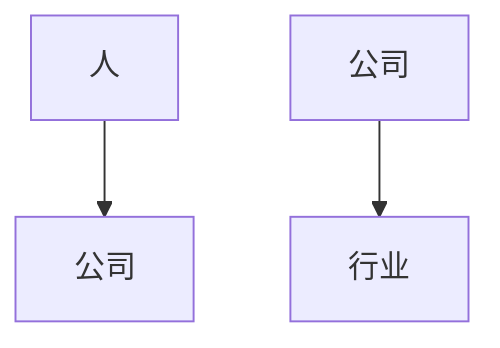
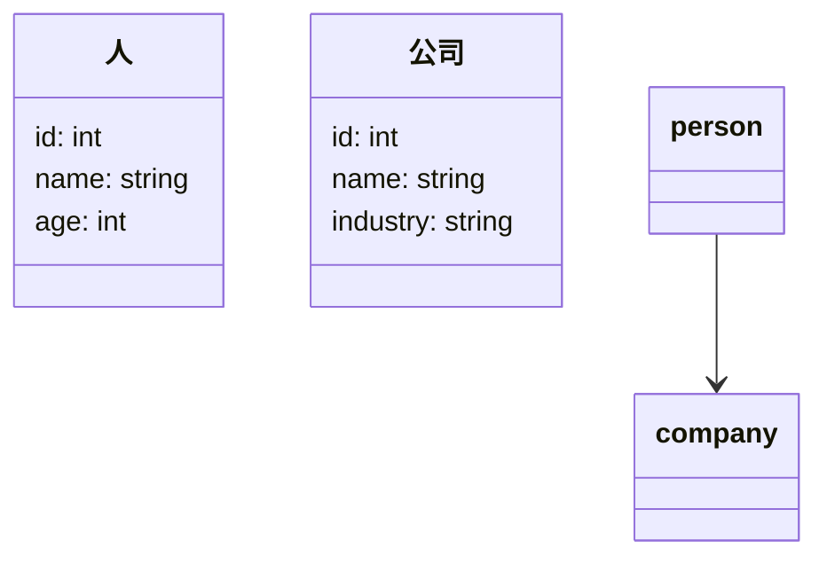
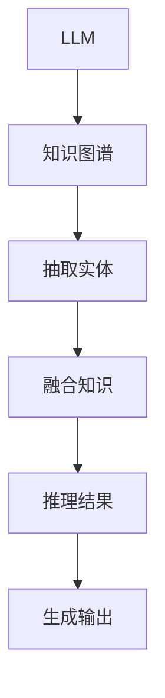
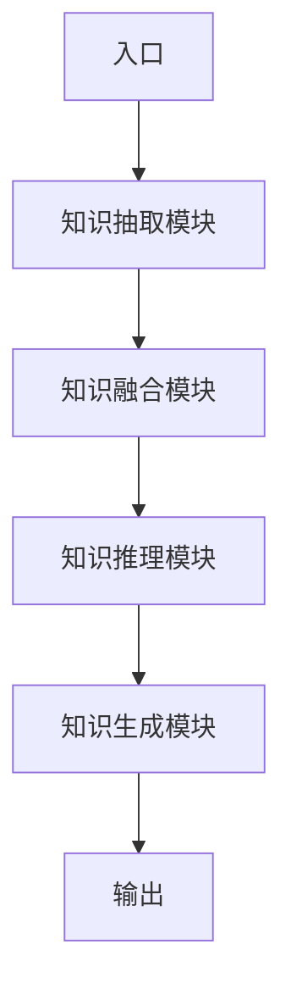

                 


# AI Agent 的知识图谱集成：增强 LLM 的结构化知识

> 关键词：AI Agent, 知识图谱, 大语言模型, 结构化知识, 知识表示

> 摘要：本文探讨了如何将知识图谱集成到AI Agent中，以增强大语言模型（LLM）的结构化知识。通过分析知识图谱与LLM的关系，提出了一种基于知识图谱的AI Agent设计方法，并详细介绍了相关算法和系统架构，最后通过一个实际案例展示了该方法的应用效果。

---

# 第一部分: AI Agent 的知识图谱集成基础

## 第1章: 知识图谱与大语言模型概述

### 1.1 知识图谱的基本概念

#### 1.1.1 知识图谱的定义与特点
知识图谱是一种以图结构形式表示知识的语义网络，节点表示实体或概念，边表示实体之间的关系。其特点包括：

- **结构化**：知识以节点和边的形式组织，便于计算机理解和推理。
- **语义丰富**：节点和边的属性承载了丰富的语义信息。
- **可扩展性**：支持动态扩展和更新，适应不同领域的需求。

#### 1.1.2 知识图谱的构建方法
知识图谱的构建包括数据抽取、实体识别、关系抽取和知识融合等步骤。常用方法包括：

- **基于规则的方法**：通过预定义的规则从结构化数据中抽取实体和关系。
- **基于统计的方法**：利用统计学习模型从文本中提取实体和关系。
- **基于深度学习的方法**：采用神经网络模型（如BERT）进行端到端的知识抽取。

#### 1.1.3 知识图谱的应用场景
知识图谱广泛应用于搜索引擎、智能问答、推荐系统等领域。例如，在智能问答中，知识图谱可以提供准确的知识支持，提升回答的准确性和相关性。

### 1.2 大语言模型（LLM）的核心原理

#### 1.2.1 LLM 的基本概念
大语言模型是一种基于深度学习的自然语言处理模型，具有大规模的参数和丰富的上下文理解能力。典型的模型包括GPT、BERT等。

#### 1.2.2 LLM 的训练与推理机制
- **训练**：通过监督学习，模型在大量文本数据上进行微调，学习语言的规律和语义。
- **推理**：基于输入的上下文，生成连贯且合理的文本输出。

#### 1.2.3 LLM 的优势与局限性
- **优势**：强大的语义理解和生成能力，能够处理复杂的语言任务。
- **局限性**：缺乏结构化知识，难以处理需要精确推理的任务。

### 1.3 AI Agent 的基本概念与功能

#### 1.3.1 AI Agent 的定义
AI Agent是一种智能主体，能够感知环境、执行任务并做出决策。它通常具备以下功能：

- **感知**：通过传感器或数据接口获取环境信息。
- **推理**：基于获取的信息进行逻辑推理，做出决策。
- **执行**：通过执行器或API与外部系统交互，完成任务。

#### 1.3.2 AI Agent 的核心功能
- **知识表示**：将知识以结构化形式存储，便于推理和决策。
- **推理与决策**：基于知识库和当前状态，进行推理并做出决策。
- **学习与自适应**：通过与环境的交互，不断优化自身的知识和行为。

#### 1.3.3 AI Agent 的应用场景
AI Agent广泛应用于智能助手、机器人控制、自动驾驶等领域。例如，在智能助手中，AI Agent可以通过理解和执行用户的指令，提供个性化的服务。

### 1.4 知识图谱与 AI Agent 的结合

#### 1.4.1 知识图谱在 AI Agent 中的作用
知识图谱为AI Agent提供了丰富的结构化知识，帮助其更好地理解任务背景、推理问题答案，并做出更准确的决策。

#### 1.4.2 知识图谱增强 LLM 的必要性
大语言模型虽然具有强大的生成能力，但缺乏结构化知识的支持。通过集成知识图谱，可以弥补这一不足，提升模型的推理能力和准确性。

#### 1.4.3 知识图谱与 LLM 的协同工作模式
知识图谱为LLM提供结构化的知识支持，LLM则利用其强大的生成能力，将知识图谱中的信息转化为自然语言输出，实现知识的表达和推理。

### 1.5 本章小结
本章介绍了知识图谱和大语言模型的基本概念，分析了它们的特点和应用场景，最后探讨了知识图谱与AI Agent结合的必要性和协同工作模式。

---

## 第2章: 知识图谱与 LLM 的核心概念与联系

### 2.1 知识图谱的属性特征对比

| 特性       | 知识图谱                     | LLM                          |
|------------|------------------------------|-------------------------------|
| 结构化      | 高                          | 低                           |
| 可解释性    | 高                          | 低                           |
| 动态更新    | 支持                        | 部分支持                     |
| 知识深度    | 深                          | 浅                           |

### 2.2 AI Agent 的知识表示模型

#### 2.2.1 知识图谱的实体关系图
知识图谱的实体关系图通过节点和边表示实体及其关系，例如：

- 实体：人、地点、组织等。
- 关系：位于、属于、包含等。



#### 2.2.2 知识图谱的领域模型
领域模型通过类图形式表示领域内的实体和关系，例如：



#### 2.2.3 知识图谱的存储与查询
知识图谱通常存储在图数据库中，支持高效的查询和推理操作。

### 2.3 知识图谱与 LLM 的实体关系图

#### 2.3.1 知识图谱与 LLM 的交互流程
知识图谱与LLM的交互流程包括知识抽取、知识融合、知识推理和知识生成。



#### 2.3.2 知识图谱在 LLM 中的应用
知识图谱可以为LLM提供上下文知识，帮助其生成更准确和连贯的文本。

#### 2.3.3 知识图谱与 LLM 的协同优化
通过结合知识图谱和LLM，可以实现知识的结构化存储和自然语言生成的协同优化。

### 2.4 本章小结
本章通过对比分析，明确了知识图谱和LLM的核心概念及其联系，为后续的算法设计奠定了基础。

---

## 第3章: 知识图谱构建与融合算法

### 3.1 知识图谱构建算法

#### 3.1.1 基于规则的知识抽取算法
基于规则的抽取方法通过预定义的规则从文本中提取实体和关系。

#### 3.1.2 基于统计的实体识别算法
统计方法利用频率和概率模型进行实体识别。

#### 3.1.3 基于深度学习的关系抽取算法
深度学习方法（如BERT）通过上下文信息进行关系抽取。

### 3.2 知识图谱融合算法

#### 3.2.1 基于本体的融合方法
基于本体的融合方法通过本体论模型进行知识融合。

#### 3.2.2 基于图的融合方法
基于图的融合方法通过图结构进行知识匹配和合并。

#### 3.2.3 基于学习的融合方法
基于学习的融合方法利用机器学习模型进行知识融合。

### 3.3 知识图谱推理算法

#### 3.3.1 基于规则的推理算法
基于规则的推理算法通过预定义的规则进行推理。

#### 3.3.2 基于符号的推理算法
基于符号的推理算法通过符号逻辑进行推理。

#### 3.3.3 基于概率的推理算法
基于概率的推理算法通过概率模型进行推理。

---

## 第4章: 知识图谱与 LLM 的协同优化

### 4.1 知识图谱增强 LLM 的必要性
知识图谱为LLM提供了结构化知识支持，弥补了其在推理能力上的不足。

### 4.2 知识图谱与 LLM 的协同工作模式
知识图谱与LLM的协同工作模式包括知识抽取、知识融合、知识推理和知识生成。

### 4.3 知识图谱与 LLM 的协同优化算法
通过结合知识图谱和LLM，可以实现知识的结构化存储和自然语言生成的协同优化。

---

## 第5章: 系统分析与架构设计

### 5.1 问题场景介绍
系统需要实现一个基于知识图谱的AI Agent，支持知识抽取、融合、推理和生成功能。

### 5.2 系统功能设计

#### 5.2.1 领域模型设计
领域模型包括实体和关系，例如：


#### 5.2.2 系统架构设计
系统架构包括知识抽取模块、知识融合模块、知识推理模块和知识生成模块。



#### 5.2.3 系统接口设计
系统接口包括知识抽取接口、知识融合接口、知识推理接口和知识生成接口。

#### 5.2.4 系统交互设计
系统交互流程包括知识抽取、融合、推理和生成。

---

## 第6章: 项目实战

### 6.1 环境安装
需要安装图数据库（如Neo4j）、深度学习框架（如TensorFlow）和大语言模型（如GPT）。

### 6.2 系统核心实现

#### 6.2.1 知识抽取模块
实现从文本中抽取实体和关系的代码。

```python
import spacy

nlp = spacy.load("en_core_web_sm")
text = "Apple is located in Cupertino, California."
doc = nlp(text)
```

#### 6.2.2 知识融合模块
实现知识融合的代码。

```python
from spacy.pipeline import EntityRuler

nlp = spacy.load("en_core_web_sm")
ruler = EntityRuler(nlp, overwrite=True)
ruler.add_patterns([("Apple", "ORG", {"ORG": "Technology Company"})])
```

#### 6.2.3 知识推理模块
实现知识推理的代码。

```python
from neo4j import GraphDatabase

driver = GraphDatabase.driver("bolt://localhost:7687", auth=("user", "password"))
session = driver.session()
```

#### 6.2.4 知识生成模块
实现知识生成的代码。

```python
import torch
from transformers import AutoModelForCausalLM, AutoTokenizer

tokenizer = AutoTokenizer.from_pretrained("gpt2")
model = AutoModelForCausalLM.from_pretrained("gpt2")
```

### 6.3 代码应用解读与分析
详细解读代码实现，并分析其在系统中的作用。

### 6.4 实际案例分析
通过一个实际案例，展示系统的实现和应用效果。

### 6.5 项目小结
总结项目实现的关键点和经验教训。

---

## 第7章: 最佳实践与小结

### 7.1 最佳实践 tips
- 知识图谱与LLM的结合可以显著提升AI Agent的性能。
- 在实际应用中，需要根据具体需求选择合适的知识图谱构建和融合方法。

### 7.2 小结
本文详细介绍了AI Agent的知识图谱集成方法，包括知识图谱与LLM的结合、系统架构设计和项目实战。通过本文的指导，读者可以掌握知识图谱集成的核心技术和实现方法。

### 7.3 注意事项
- 知识图谱的构建和维护需要投入大量资源。
- 在实际应用中，需要考虑知识图谱的动态更新和扩展性。

### 7.4 拓展阅读
推荐相关领域的优秀书籍和论文，供读者进一步学习和研究。

---

# 作者：AI天才研究院/AI Genius Institute & 禅与计算机程序设计艺术 /Zen And The Art of Computer Programming

---

**以上是《AI Agent 的知识图谱集成：增强 LLM 的结构化知识》的技术博客文章，希望对您有所帮助！**

