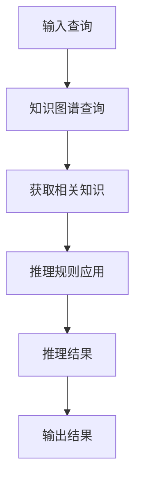
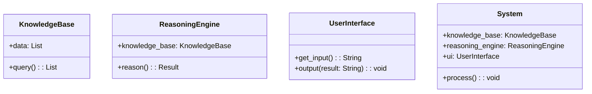
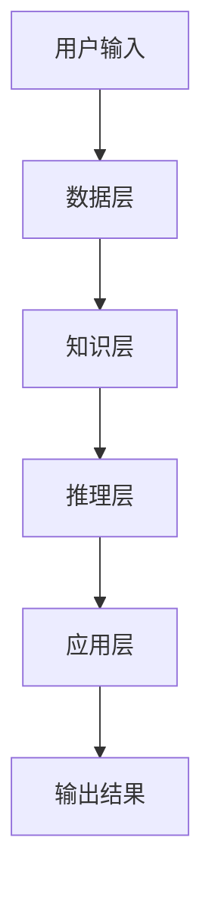

                 


# AI Agent 的知识推理：增强 LLM 的逻辑分析能力

> 关键词：AI Agent，知识推理，大语言模型，逻辑分析，自然语言处理

> 摘要：本文详细探讨了如何通过AI Agent的知识推理能力来增强大语言模型（LLM）的逻辑分析能力。首先介绍了AI Agent和知识推理的基本概念，接着分析了知识图谱和逻辑推理的方法，详细讲解了如何将知识推理与大语言模型结合的算法原理，并通过实际案例展示了系统的实现过程和应用。

---

## 第一部分：背景介绍

### 第1章：AI Agent与知识推理概述

#### 1.1 AI Agent的基本概念

AI Agent（人工智能代理）是指能够感知环境并采取行动以实现目标的智能实体。它可以分为简单反射型、基于模型的反射型、目标驱动型和效用驱动型四种类型。AI Agent的核心特点包括自主性、反应性、目标导向性和社交能力。

**AI Agent的核心要素：**

- **自主性**：能够在没有外部干预的情况下独立运行。
- **反应性**：能够感知环境并实时调整行为。
- **目标导向性**：具有明确的目标，并采取行动以实现这些目标。
- **社交能力**：能够与其他Agent或人类进行交互和协作。

#### 1.2 大语言模型（LLM）的基本原理

大语言模型（LLM）是一种基于深度学习的自然语言处理模型，通过大量的文本数据进行训练，能够理解和生成人类语言。其核心原理包括：

1. **预训练**：利用大规模的无监督学习，在通用文本数据上进行预训练。
2. **微调**：在特定任务或领域上进行微调，以适应具体需求。
3. **生成机制**：通过解码器生成自然语言文本，支持多种任务如翻译、问答、文本摘要等。

#### 1.3 知识推理的重要性

知识推理是AI Agent实现智能决策的关键能力。通过知识推理，AI Agent能够基于已有知识库进行逻辑推理，解决复杂问题并做出合理决策。在实际应用中，知识推理能够提升LLM的逻辑分析能力，使其在处理复杂任务时表现更佳。

---

## 第二部分：知识推理的理论基础

### 第2章：知识图谱与语义理解

#### 2.1 知识图谱的概念与构建

知识图谱是一种结构化的知识表示形式，由实体和关系组成，能够有效地表示和组织海量知识。构建知识图谱的主要步骤包括：

1. **数据采集**：从多种来源（如文本、数据库）获取数据。
2. **数据清洗**：去除噪声和冗余信息。
3. **实体识别**：识别文本中的实体。
4. **关系抽取**：提取实体之间的关系。
5. **知识融合**：整合多来源的知识。
6. **知识存储**：存储结构化的知识。

**知识图谱的表示方法：**

- **RDF（资源描述框架）**：使用三元组（主语、谓词、宾语）表示知识。
- **OWL（Web本体语言）**：一种基于RDF的语义网络表示语言。

#### 2.2 语义理解与知识表示

语义理解是通过自然语言处理技术，理解文本的深层含义。知识表示则是将理解后的信息以结构化的形式存储。知识表示的主要方法包括：

- **符号表示法**：使用符号和规则表示知识。
- **向量表示法**：通过向量空间模型表示词语或短语的语义。
- **图结构表示法**：使用图结构表示实体和关系。

### 第3章：逻辑推理与不确定性推理

#### 3.1 逻辑推理的基本原理

逻辑推理是基于逻辑规则，从已知前提推导出结论的过程。主要的逻辑推理方法包括：

- **命题逻辑**：研究命题之间的关系，使用逻辑连接词（如AND、OR、NOT）构建逻辑表达式。
- **谓词逻辑**：使用谓词和量词（如存在量词和全称量词）进行更精确的推理。
- **推理规则**：如演绎推理和归纳推理。

**命题逻辑与谓词逻辑对比表**

| 特性           | 命题逻辑               | 谓词逻辑               |
|----------------|------------------------|------------------------|
| 基础元素       | 命题                   | 谓词和个体             |
| 表达能力       | 适合简单事实           | 适合复杂事实和关系     |
| 应用场景       | 逻辑门电路设计         | 知识库推理             |

#### 3.2 不确定性推理方法

不确定性推理是处理不完整或不精确信息的推理方法。常用的方法包括：

- **概率推理**：基于概率论进行推理，如贝叶斯网络。
- **模糊推理**：处理模糊信息，如使用模糊逻辑。
- **证据推理**：综合多个证据进行推理。

**概率推理与模糊推理对比表**

| 特性           | 概率推理               | 模糊推理               |
|----------------|------------------------|------------------------|
| 基础理论       | 概率论                 | 模糊逻辑               |
| 处理对象       | 概率事件               | 模糊事件               |
| 应用场景       | 医疗诊断、金融风险评估 | 自然语言处理中的歧义消解 |

---

## 第三部分：算法原理

### 第4章：知识推理与大语言模型结合的算法

#### 4.1 注意力机制

注意力机制是一种基于上下文信息的加权机制，用于处理序列数据。其核心思想是将输入序列中的每个元素的重要性进行加权，以生成更有效的表示。

**注意力机制的公式：**

$$
\text{Attention}(Q, K, V) = \text{softmax}\left( \frac{QK^T}{\sqrt{d_k}} \right)V
$$

其中，$Q$ 是查询向量，$K$ 是键向量，$V$ 是值向量，$d_k$ 是维度。

#### 4.2 推理网络的设计

推理网络用于将知识图谱中的结构化知识与自然语言处理任务结合起来。其设计主要包括知识编码、推理规则编码和融合策略设计。

**推理网络的流程图**



#### 4.3 端到端的知识推理模型

端到端的知识推理模型将知识图谱嵌入到LLM中，通过端到端的训练提升推理能力。其主要步骤包括知识嵌入、推理网络构建和模型训练。

**端到端推理模型的代码示例**

```python
class KnowledgeReasoningModel:
    def __init__(self, knowledge_base):
        self.knowledge_base = knowledge_base

    def forward(self, input_text):
        # 查询知识库
        knowledge = self.knowledge_base.query(input_text)
        # 进行推理
        result = self.reasoning(knowledge)
        return result

    def reasoning(self, knowledge):
        # 基于知识进行推理
        pass
```

---

## 第四部分：系统架构与设计

### 第5章：支持知识推理的LLM系统架构

#### 5.1 系统功能设计

系统功能设计包括知识库管理、推理引擎、用户交互和结果输出四个模块。

**系统功能模块的类图**



#### 5.2 系统架构设计

系统架构采用分层设计，包括数据层、知识层、推理层和应用层。

**系统架构的流程图**



---

## 第五部分：项目实战

### 第6章：构建支持知识推理的LLM系统

#### 6.1 环境搭建

主要工具包括Python 3.8+、TensorFlow 2.0+、Keras和必要的NLP库（如spaCy）。

#### 6.2 核心代码实现

```python
from tensorflow.keras import layers
import tensorflow as tf

def build_model(vocab_size, embedding_dim, sequence_length):
    model = tf.keras.Sequential()
    model.add(layers.Embedding(vocab_size, embedding_dim, input_length=sequence_length))
    model.add(layers.LSTM(128))
    model.add(layers.Dense(256, activation='relu'))
    model.add(layers.Dense(1, activation='sigmoid'))
    model.compile(optimizer='adam', loss='binary_crossentropy', metrics=['accuracy'])
    return model
```

---

## 第六部分：最佳实践与总结

### 第7章：总结与展望

#### 7.1 最佳实践

- **数据质量**：确保知识图谱的数据准确性和完整性。
- **模型优化**：通过数据增强和超参数调整提升模型性能。
- **实时推理**：优化推理引擎以提高响应速度。

#### 7.2 小结

本文详细探讨了AI Agent的知识推理技术及其在增强LLM逻辑分析能力中的应用。通过理论与实践的结合，展示了如何构建一个高效的知识推理系统。

#### 7.3 注意事项

- 在实际应用中，需注意模型的可解释性和安全性。
- 定期更新知识库以保持模型的最新性。

#### 7.4 拓展阅读

建议进一步阅读《Large Language Models: A Survey》和《Knowledge Graph Construction: Methods and Applications》。

---

## 作者

作者：AI天才研究院/AI Genius Institute & 禅与计算机程序设计艺术 /Zen And The Art of Computer Programming

