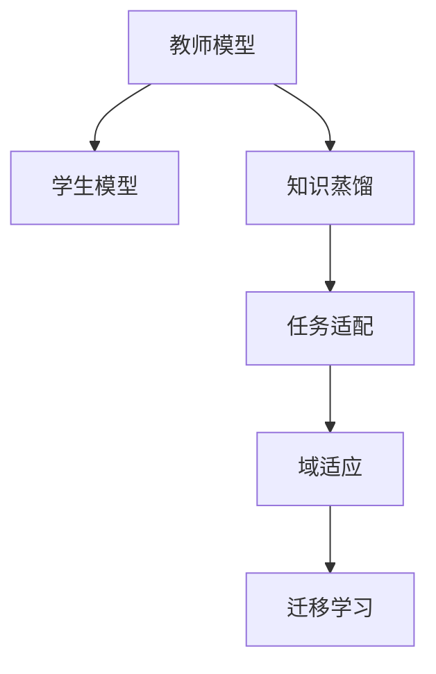

                 


# AI Agent 的知识蒸馏与迁移：从通用 LLM 到专业领域模型

## 关键词：AI Agent, 知识蒸馏, 知识迁移, 通用 LLM, 专业领域模型, 迁移学习

## 摘要：  
本文深入探讨了AI Agent的知识蒸馏与迁移技术，从通用大型语言模型（LLM）到专业领域模型的迁移过程。通过分析知识蒸馏与迁移的核心原理、算法实现、系统架构设计以及实际案例，本文为读者提供了从理论到实践的全面指南。文章内容涵盖背景介绍、核心技术、算法原理、系统分析、项目实战、最佳实践等多个方面，帮助读者理解如何通过知识蒸馏与迁移提升AI Agent在专业领域的性能。

---

## 第一章: AI Agent 的知识蒸馏与迁移概述

### 1.1 AI Agent 的基本概念

#### 1.1.1 AI Agent 的定义与特点
- AI Agent 的定义：AI Agent 是一种能够感知环境、自主决策并执行任务的智能体，具备学习、推理和自适应能力。
- AI Agent 的特点：
  - 智能性：能够理解上下文并做出合理决策。
  - 自主性：无需外部干预，自主完成任务。
  - 适应性：能够根据环境变化调整行为。

#### 1.1.2 通用 LLM 的概念与特点
- 通用 LLM 的定义：大型语言模型（如GPT、BERT）经过海量数据训练，具备广泛的知识和语言理解能力。
- 通用 LLM 的特点：
  - 多任务能力：适用于多种任务（文本生成、问答、翻译等）。
  - 高效性：基于Transformer架构，具备强大的并行计算能力。
  - 通用性：适用于多种领域，但缺乏专业领域深度。

#### 1.1.3 知识蒸馏与迁移的背景与意义
- 知识蒸馏的背景：随着AI技术的发展，如何高效地将知识从大模型传递到小模型成为研究热点。
- 知识迁移的背景：AI Agent需要在不同领域间迁移知识，以适应多样化的需求。
- 知识蒸馏与迁移的意义：
  - 降低计算成本：通过蒸馏技术减少模型规模，降低推理成本。
  - 提高适应性：通过迁移学习，使AI Agent能够快速适应新领域。
  - 推动AI普及：使小模型也能具备大模型的能力，推动AI技术的广泛应用。

---

## 第二章: 知识蒸馏与迁移的核心技术

### 2.1 知识蒸馏的实现机制

#### 2.1.1 知识蒸馏的定义与原理
- 知识蒸馏的定义：通过教师模型（Teacher）指导学生模型（Student），将知识从大模型传递到小模型的技术。
- 知识蒸馏的原理：
  - 教师模型输出概率分布（软标签）。
  - 学生模型通过模仿教师模型的输出进行学习。
  - 蒸馏过程优化目标函数，使学生模型逼近教师模型。

#### 2.1.2 蒸馏过程中的关键参数
- 温度系数（Temperature）：
  - 温度越高，软标签越平滑，学生模型学习更鲁棒。
  - 温度越低，软标签越尖锐，学生模型学习更具体。
- 惩罚系数（Distillation Loss Weight）：
  - 控制蒸馏损失与任务损失的平衡。
  - 高权重：蒸馏损失占主导，强调知识传递。
  - 低权重：任务损失占主导，强调任务完成。

#### 2.1.3 蒸馏效果的评估方法
- 评估指标：
  - 分类准确率：蒸馏后模型在目标任务上的准确率。
  - 知识保持度：蒸馏后模型是否保持了教师模型的知识。
  - 模型压缩率：蒸馏后模型的参数量与原模型的比值。

---

### 2.2 知识迁移的实现机制

#### 2.2.1 迁移学习的定义与特点
- 迁移学习的定义：将一个领域学到的知识迁移到另一个领域，以提升新领域的性能。
- 迁移学习的特点：
  - 域适应（Domain Adaptation）：适应不同数据分布。
  - 任务适配（Task Adaptation）：适应不同任务需求。
  - 特征共享（Feature Sharing）：利用跨领域共享的特征。

#### 2.2.2 域适应与任务适配的原理
- 域适应：
  - 对齐源域和目标域的特征分布。
  - 使用对抗训练、重加权等方法减少域偏移。
- 任务适配：
  - 适配目标任务的特征和标签。
  - 使用任务损失函数指导优化。

#### 2.2.3 迁移过程中特征提取的重要性
- 特征提取的目标：
  - 提取与任务相关的特征，去除与任务无关的特征。
  - 使提取的特征在目标域中具有更好的表达能力。
- 常见的特征提取方法：
  - 使用预训练模型提取特征。
  - 设计领域特定的特征提取网络。

---

### 2.3 从通用到专业的模型适配策略

#### 2.3.1 通用模型的特征提取
- 通用模型的特征提取：
  - 利用预训练的通用模型提取高层语义特征。
  - 对特征进行降维或变换，使其适合目标任务。
- 通用模型的局限性：
  - 缺乏领域特定知识。
  - 特征表达可能存在领域偏差。

#### 2.3.2 专业领域数据的预处理
- 数据清洗：
  - 去除噪声数据，确保数据质量。
  - 处理领域特有的数据格式和术语。
- 数据增强：
  - 通过数据增强技术扩展训练数据。
  - 生成领域相关的虚拟数据。

#### 2.3.3 模型适配的优化方法
- 知识蒸馏与迁移的结合：
  - 使用蒸馏技术将通用模型的知识传递给领域模型。
  - 使用迁移学习技术适应目标领域的数据分布。
- 模型微调：
  - 在目标领域数据上进行微调，优化模型参数。
  - 使用小批量数据训练，减少计算成本。

---

## 第三章: 知识蒸馏的数学模型与算法实现

### 3.1 知识蒸馏的数学模型

#### 3.1.1 蒸馏损失函数的定义
- 蒸馏损失函数公式：
  $$ L_{\text{distill}} = -\sum_{i=1}^{n} p_i \log p_i^{\text{teacher}} $$
  - \( p_i \)：学生模型的预测概率。
  - \( p_i^{\text{teacher}} \)：教师模型的预测概率。
- 温度系数 \( T \) 的引入：
  $$ p_i^{\text{teacher}} = \text{Softmax}(\frac{z_i}{T}) $$
  - 温度 \( T \) 越高，软标签越平滑。

#### 3.1.2 KL散度的计算公式
- KL散度公式：
  $$ \text{KL}(p \parallel q) = \sum_{i=1}^{n} p_i \log \frac{p_i}{q_i} $$
  - \( p \)：教师模型的分布。
  - \( q \)：学生模型的分布。

#### 3.1.3 蒸馏过程中的优化目标
- 蒸馏过程优化目标：
  $$ \min_{\theta} \left( L_{\text{task}} + \lambda L_{\text{distill}} \right) $$
  - \( L_{\text{task}} \)：任务损失函数。
  - \( \lambda \)：蒸馏损失的权重。

---

### 3.2 知识蒸馏的算法流程

#### 3.2.1 教师模型的输出提取
- 教师模型的输出：
  - 概率分布 \( p^{\text{teacher}} \)。
  - 高层特征 \( f^{\text{teacher}} \)。

#### 3.2.2 学生模型的训练过程
- 学生模型的输入：
  - 原始输入数据。
  - 教师模型的输出特征。
- 学生模型的输出：
  - 预测结果。
  - 高层特征。

#### 3.2.3 蒸馏效果的评估指标
- 分类准确率（Accuracy）。
- 知识保持度（Knowledge Retention Rate）。
- 模型压缩率（Compression Rate）。

---

## 第四章: 知识迁移的数学模型与算法实现

### 4.1 知识迁移的数学模型

#### 4.1.1 域适应的数学模型
- 对齐源域和目标域的特征分布：
  $$ D_{\text{source}}(x) \rightarrow D_{\text{target}}(x) $$
- 使用对抗训练对齐特征分布：
  $$ \min_{\theta} \max_{\phi} \mathbb{E}_{x \sim D_{\text{source}}}[f(x)] - \mathbb{E}_{x \sim D_{\text{target}}}[f(x)] $$

#### 4.1.2 任务适配的数学模型
- 适配目标任务的特征和标签：
  $$ \min_{\theta} \mathbb{E}_{(x,y) \sim D_{\text{target}}}[\mathcal{L}(f(x), y)] $$
  - \( \mathcal{L} \)：任务损失函数。

#### 4.1.3 迁移过程中的特征提取
- 提取领域特定的特征：
  $$ f(x) = g_{\theta}(x) $$
  - \( g_{\theta} \)：特征提取网络。

---

### 4.2 知识迁移的算法流程

#### 4.2.1 域适应的实现
- 对抗训练：
  - 使用判别器 \( D \) 区分源域和目标域的特征。
  - 最小化判别器的混淆目标。
- 重加权：
  - 使用重加权策略平衡源域和目标域的样本权重。

#### 4.2.2 任务适配的实现
- 特征对齐：
  - 使用归一化、对齐等技术使特征适合目标任务。
- 模型微调：
  - 在目标领域数据上微调模型参数。

#### 4.2.3 迁移效果的评估
- 分类准确率（Accuracy）。
- 域适应效果（Domain Adaptation Effectiveness）。
- 迁移学习的收敛速度（Convergence Speed）。

---

## 第五章: 系统分析与架构设计

### 5.1 问题场景介绍

#### 5.1.1 系统功能需求
- 知识蒸馏与迁移的系统需求：
  - 支持多种模型的蒸馏与迁移。
  - 支持多领域的知识迁移。
  - 提供高效的训练与推理性能。

#### 5.1.2 系统性能需求
- 训练效率：快速完成蒸馏与迁移过程。
- 推理效率：低延迟，高吞吐量。
- 可扩展性：支持大规模数据和模型。

---

### 5.2 系统功能设计

#### 5.2.1 系统功能模块划分
- 教师模型模块：
  - 提供知识蒸馏的教师模型。
  - 支持多种模型的输出提取。
- 学生模型模块：
  - 提供知识蒸馏的学生模型。
  - 支持多种任务的迁移学习。
- 迁移学习模块：
  - 提供域适应和任务适配功能。
  - 支持多种迁移策略。

#### 5.2.2 系统功能设计图


---

## 第六章: 项目实战

### 6.1 环境安装

#### 6.1.1 安装依赖
- 安装Python环境：
  ```bash
  python --version
  ```
- 安装必要的库：
  ```bash
  pip install numpy pandas torch transformers
  ```

#### 6.1.2 下载数据集
- 下载通用模型权重：
  ```bash
  wget https://example.com/teacher_model.pth
  ```
- 下载目标领域数据集：
  ```bash
  wget https://example.com/target_dataset.zip
  ```

---

### 6.2 核心实现

#### 6.2.1 教师模型的定义与训练
- 教师模型代码：
  ```python
  import torch
  class TeacherModel(torch.nn.Module):
      def __init__(self):
          super().__init__()
          self.fc = torch.nn.Linear(100, 10)
      def forward(self, x):
          return torch.nn.functional.softmax(x, dim=1)
  ```

#### 6.2.2 学生模型的定义与训练
- 学生模型代码：
  ```python
  import torch
  class StudentModel(torch.nn.Module):
      def __init__(self):
          super().__init__()
          self.fc = torch.nn.Linear(100, 10)
      def forward(self, x):
          return torch.nn.functional.softmax(x, dim=1)
  ```

---

### 6.3 应用案例分析

#### 6.3.1 医疗领域的知识蒸馏与迁移
- 医疗领域的数据特点：
  - 数据量小，领域特定。
  - 数据标注成本高。
- 应用效果：
  - 提高诊断准确率。
  - 减少对小数据的依赖。

---

## 第七章: 最佳实践与总结

### 7.1 小结
- 知识蒸馏与迁移的核心思想：
  - 通过教师模型传递知识。
  - 通过迁移学习适应新领域。
- 实现的关键点：
  - 合理选择蒸馏参数。
  - 设计有效的迁移策略。

### 7.2 注意事项
- 数据质量：
  - 确保数据的代表性和多样性。
- 模型选择：
  - 根据任务需求选择合适的模型。
- 超参数调优：
  - 优化温度系数和蒸馏损失权重。

### 7.3 未来展望
- 知识蒸馏与迁移的未来方向：
  - 多领域知识蒸馏。
  - 自适应迁移学习。
  - 跨模态知识迁移。

---

## 作者：AI天才研究院/AI Genius Institute & 禅与计算机程序设计艺术 /Zen And The Art of Computer Programming

