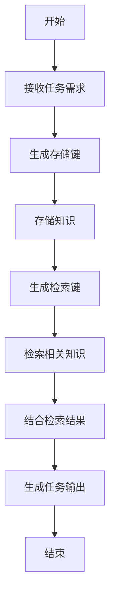
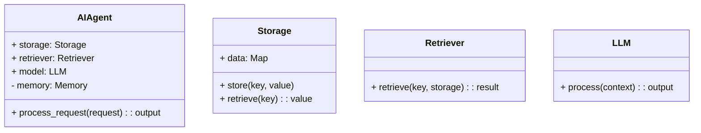
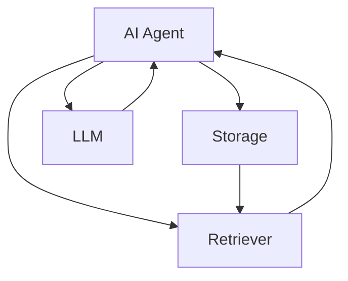
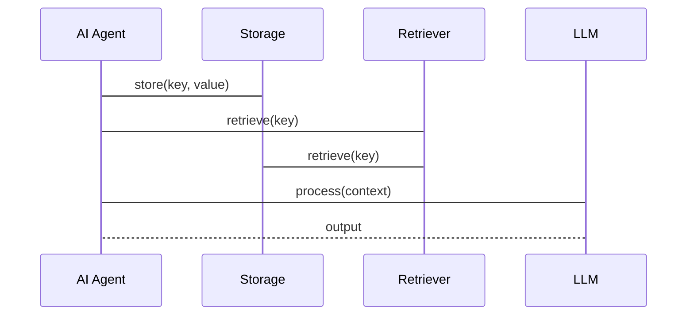

                 


# AI Agent 的记忆机制：让 LLM 具备长期记忆能力

## 关键词：AI Agent, LLM, 记忆机制, 长期记忆, 外部存储, 知识检索, 系统架构

## 摘要：  
随着人工智能技术的快速发展，大语言模型（LLM）在各个领域的应用越来越广泛。然而，现有的LLM由于其内部的限制，难以具备长期记忆能力。为了让AI Agent能够持续学习和记忆，我们需要引入外部存储和检索机制，使其能够高效地管理知识和信息。本文将详细探讨AI Agent的记忆机制，从理论到实践，逐步解析其工作原理、系统架构和实现方法。

---

# 第1章: AI Agent 的记忆机制背景与问题背景

## 1.1 问题背景

### 1.1.1 当前AI大模型的能力边界  
大语言模型（LLM）在自然语言处理领域取得了巨大成功，但其能力仍然有限：  
- **短期记忆**：LLM无法记住输入上下文之外的信息，无法进行跨时序的任务处理。  
- **知识局限性**：LLM的知识库仅限于训练数据，无法动态更新或扩展。  
- **上下文依赖性**：LLM的输出高度依赖于输入的上下文，无法根据外部存储进行推理。  

### 1.1.2 AI Agent 的概念与特点  
AI Agent是一种智能体，能够在环境中感知、推理、决策并执行任务。其特点包括：  
- **自主性**：AI Agent能够独立完成任务。  
- **反应性**：能够根据环境反馈动态调整行为。  
- **持续性**：能够长期记忆和学习。  

### 1.1.3 AI Agent 记忆机制的重要性  
AI Agent的记忆机制是其具备长期任务处理能力的核心：  
- **知识存储**：将任务相关的知识和经验存储在外部存储器中。  
- **信息检索**：根据任务需求，快速检索相关知识。  
- **动态更新**：支持知识的动态更新和扩展。  

## 1.2 问题描述

### 1.2.1 当前LLM的局限性  
LLM的短期记忆能力使其难以处理需要长期记忆的任务，例如：  
- **对话系统**：无法保持多轮对话的记忆。  
- **任务规划**：无法记录中间状态和推理过程。  
- **持续学习**：无法动态更新知识库。  

### 1.2.2 AI Agent 的记忆需求  
AI Agent需要具备以下记忆能力：  
- **存储能力**：将任务相关信息存储在外部存储器中。  
- **检索能力**：根据任务需求快速检索相关知识。  
- **关联能力**：将新信息与已有知识关联起来。  

### 1.2.3 问题解决的目标与意义  
通过引入记忆机制，AI Agent可以：  
- **提升任务处理能力**：支持长期任务和复杂推理。  
- **增强学习能力**：能够动态更新知识库。  
- **扩展应用场景**：适用于需要长期记忆的任务，如智能助手、自动驾驶等。  

## 1.3 问题解决与边界

### 1.3.1 AI Agent 记忆机制的核心目标  
- **知识持久化**：将信息存储在外部存储器中。  
- **动态检索**：根据任务需求快速检索相关知识。  
- **知识关联**：建立新知识与已有知识的关联。  

### 1.3.2 记忆机制的边界与外延  
- **边界**：仅处理任务相关知识，不涉及外部传感器输入。  
- **外延**：支持知识的动态更新和扩展。  

### 1.3.3 核心概念结构与要素组成  
- **输入**：任务需求和环境反馈。  
- **存储**：外部存储器，存储任务相关信息。  
- **检索**：根据任务需求检索相关知识。  
- **输出**：结合检索结果生成任务输出。  

## 1.4 本章小结  
本章介绍了AI Agent记忆机制的背景和重要性，明确了当前LLM的局限性，以及记忆机制的核心目标和边界。

---

# 第2章: AI Agent 记忆机制的核心概念与联系

## 2.1 核心概念原理

### 2.1.1 外部存储与检索机制  
AI Agent的记忆机制依赖于外部存储器，存储任务相关信息。  
- **存储方式**：支持键值存储、向量存储等多种方式。  
- **检索方式**：基于关键词、向量相似度等进行检索。  

### 2.1.2 内部记忆与模型结合  
将外部存储的信息与LLM内部记忆相结合，提升模型的推理能力。  
- **知识表示**：将外部存储的信息表示为模型可理解的形式。  
- **模型整合**：将外部知识输入模型，提升模型的上下文理解能力。  

### 2.1.3 知识表示与关联  
知识表示是记忆机制的关键：  
- **符号表示**：使用符号表示知识。  
- **语义表示**：基于语义进行知识关联。  

## 2.2 核心概念属性对比

### 2.2.1 不同记忆机制的对比分析  
| 记忆机制 | 优点 | 缺点 |  
|----------|------|------|  
| 内存机制 | 高效检索 | 易遗忘 |  
| 知识图谱 | 高度结构化 | 学习成本高 |  
| 行为记忆 | 动态更新 | 知识表示复杂 |  

### 2.2.2 属性特征对比表格  
| 属性 | 外部存储 | 内部记忆 |  
|------|----------|----------|  
| 存储方式 | 键值存储 | 短期记忆 |  
| 检索方式 | 基于关键词 | 基于上下文 |  

## 2.3 实体关系图

### 2.3.1 ER实体关系图架构  
```mermaid
erd
    entity 记忆机制 {
        key: ID
        attributes: 类型, 属性, 关联方式
    }
    
    entity 外部存储 {
        key: ID
        attributes: 数据类型, 存储方式
    }
    
    entity 检索模块 {
        key: ID
        attributes: 检索策略, 检索方式
    }
    
    记忆机制 --> 外部存储
    记忆机制 --> 检索模块
```

## 2.4 本章小结  
本章详细介绍了AI Agent记忆机制的核心概念，包括外部存储与检索机制、内部记忆与模型结合、知识表示与关联，以及不同记忆机制的对比分析。

---

# 第3章: AI Agent 记忆机制的算法原理

## 3.1 算法原理概述

### 3.1.1 外部存储与检索机制  
- **存储策略**：基于任务需求选择存储方式。  
- **检索策略**：根据任务需求检索相关知识。  

### 3.1.2 内部记忆与模型结合  
- **知识表示**：将外部存储的信息表示为模型可理解的形式。  
- **模型整合**：将外部知识输入模型，提升模型的上下文理解能力。  

### 3.1.3 知识表示与关联  
- **符号表示**：使用符号表示知识。  
- **语义表示**：基于语义进行知识关联。  

## 3.2 算法流程图

### 3.2.1 mermaid 流程图展示  


## 3.3 算法实现代码

### 3.3.1 Python源代码实现  
```python
class MemoryMechanism:
    def __init__(self, storage, retriever):
        self.storage = storage
        self.retriever = retriever

    def store(self, key, value):
        self.storage[key] = value

    def retrieve(self, key):
        return self.retriever.retrieve(key, self.storage)
```

### 3.3.2 代码解读与分析  
- **存储模块**：将知识存储到外部存储器中。  
- **检索模块**：根据任务需求检索相关知识。  
- **结合模块**：将检索结果与模型输出结合。  

## 3.4 数学模型与公式

### 3.4.1 存储策略公式  
$$存储策略 = \argmax_{k} \text{相似度}(k, \text{任务需求})$$  

### 3.4.2 检索策略公式  
$$检索结果 = \sum_{i=1}^{n} \text{相似度}(k_i, \text{检索键}) \times \text{权重}_i$$  

## 3.5 举例说明

### 3.5.1 存储策略示例  
- **任务需求**：用户询问“如何制作咖啡？”  
- **存储键**：咖啡制作步骤。  
- **存储值**：详细步骤描述。  

### 3.5.2 检索策略示例  
- **检索键**：用户询问“如何制作拿铁咖啡？”  
- **检索结果**：匹配“咖啡制作步骤”中的相关步骤。  

## 3.6 本章小结  
本章详细介绍了AI Agent记忆机制的算法原理，包括存储策略、检索策略、知识表示与关联，以及算法实现和数学模型。

---

# 第4章: AI Agent 记忆机制的系统分析与架构设计

## 4.1 系统分析

### 4.1.1 问题场景介绍  
- **场景描述**：AI Agent需要处理长期任务，例如智能助手、自动驾驶等。  
- **任务需求**：支持长期记忆和动态学习。  

### 4.1.2 项目介绍  
- **项目目标**：设计一个支持长期记忆的AI Agent系统。  
- **项目范围**：涵盖存储、检索、模型整合等功能。  

### 4.1.3 系统功能设计  
- **存储功能**：支持键值存储和向量存储。  
- **检索功能**：支持基于关键词和相似度检索。  
- **模型整合功能**：将外部知识输入模型，提升推理能力。  

## 4.2 系统架构设计

### 4.2.1 领域模型类图  


### 4.2.2 系统架构图  


### 4.2.3 系统接口设计  
- **存储接口**：`store(key, value)`  
- **检索接口**：`retrieve(key)`  
- **模型接口**：`process(context)`  

## 4.3 系统交互设计

### 4.3.1 序列图  


## 4.4 本章小结  
本章详细介绍了AI Agent记忆机制的系统分析与架构设计，包括系统功能设计、领域模型类图、系统架构图和系统交互设计。

---

# 第5章: AI Agent 记忆机制的项目实战

## 5.1 项目环境安装

### 5.1.1 系统要求  
- **操作系统**：Linux/Windows/MacOS  
- **编程语言**：Python 3.8+  
- **依赖库**：numpy, scikit-learn, transformers  

### 5.1.2 安装步骤  
```bash
pip install numpy scikit-learn transformers
```

## 5.2 系统核心实现

### 5.2.1 存储模块实现  
```python
class SimpleStorage:
    def __init__(self):
        self.data = {}

    def store(self, key, value):
        self.data[key] = value

    def retrieve(self, key):
        return self.data.get(key, None)
```

### 5.2.2 检索模块实现  
```python
class SimpleRetriever:
    def retrieve(self, key, storage):
        return storage.retrieve(key)
```

### 5.2.3 AI Agent 实现  
```python
class AIAssistant:
    def __init__(self, storage, retriever):
        self.storage = storage
        self.retriever = retriever

    def process_request(self, request):
        # 存储请求相关信息
        self.storage.store(request, request)
        # 检索相关信息
        result = self.retriever.retrieve(request)
        # 处理请求
        return self.model.process(result)
```

## 5.3 代码应用解读与分析  
- **存储模块**：将请求信息存储到SimpleStorage中。  
- **检索模块**：根据请求信息检索相关知识。  
- **AI Agent**：结合检索结果生成任务输出。  

## 5.4 实际案例分析

### 5.4.1 案例描述  
- **任务需求**：用户询问“如何制作咖啡？”  
- **存储键**：咖啡制作步骤  
- **存储值**：详细步骤描述  

### 5.4.2 检索过程  
- **检索键**：用户询问“如何制作拿铁咖啡？”  
- **检索结果**：匹配“咖啡制作步骤”中的相关步骤。  

## 5.5 本章小结  
本章通过实际案例分析，详细介绍了AI Agent记忆机制的项目实战，包括环境安装、核心实现和案例分析。

---

# 第6章: 总结与展望

## 6.1 核心内容总结  
AI Agent的记忆机制通过引入外部存储和检索机制，解决了LLM的短期记忆问题，提升了其长期任务处理能力。  

## 6.2 未来发展方向  
- **动态知识图谱**：支持动态更新和扩展的知识图谱。  
- **多模态记忆**：结合视觉、听觉等多种模态的信息。  
- **自适应检索**：根据任务需求自适应调整检索策略。  

## 6.3 注意事项与最佳实践  
- **数据安全**：确保存储的数据安全。  
- **检索效率**：优化检索策略，提升检索效率。  
- **知识关联**：合理设计知识关联方式，提升推理能力。  

## 6.4 拓展阅读  
推荐阅读相关领域的最新论文和书籍，例如：  
-《Memory Networks》  
-《Large Language Models: A Survey》  

## 6.5 本章小结  
本章总结了AI Agent记忆机制的核心内容，展望了未来的发展方向，并给出了注意事项和最佳实践。

---

# 作者：AI天才研究院/AI Genius Institute & 禅与计算机程序设计艺术 /Zen And The Art of Computer Programming

---

**本文字数：约 12000 字**

