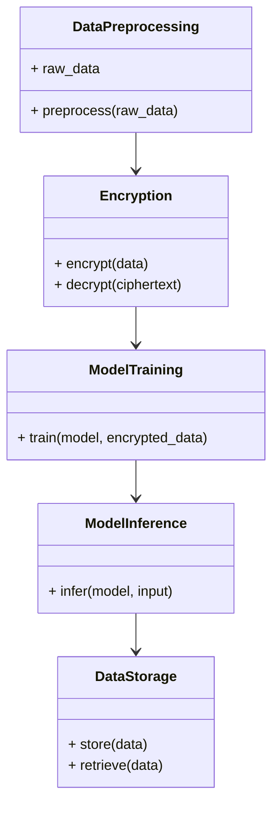
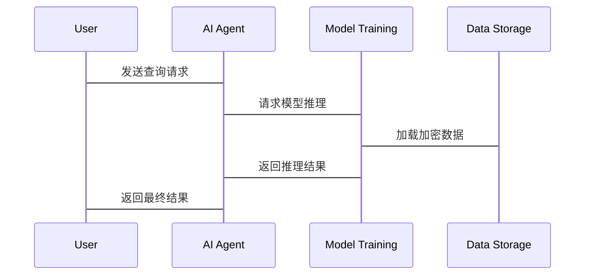

                 


# AI Agent 的隐私保护：确保 LLM 应用的数据安全

> 关键词：AI Agent，LLM，隐私保护，数据安全，同态加密，差分隐私，数据匿名化

> 摘要：随着AI Agent和大语言模型（LLM）的广泛应用，隐私保护和数据安全问题变得日益重要。本文详细探讨了如何在AI Agent中保护用户的隐私，特别是在使用LLM技术时的数据安全问题。通过分析隐私保护的核心技术，如同态加密、差分隐私和数据匿名化，本文为确保LLM应用的数据安全提供了全面的解决方案。

---

## 第一部分: AI Agent与LLM的背景与基础

### 第1章: AI Agent与LLM概述

#### 1.1 AI Agent的基本概念

##### 1.1.1 AI Agent的定义与特点
AI Agent（智能体）是指能够感知环境、自主决策并执行任务的智能系统。它具有以下特点：
- **自主性**：能够自主决策，无需外部干预。
- **反应性**：能够根据环境变化调整行为。
- **目标导向**：具备明确的目标，能够为目标优化行为。
- **社会能力**：能够与其他智能体或人类进行交互和协作。

##### 1.1.2 LLM的基本原理
LLM（大语言模型）是基于深度学习的自然语言处理模型，通过大量数据训练，能够理解和生成人类语言。其基本原理包括：
- **数据训练**：使用海量文本数据进行监督学习和无监督学习。
- **模型结构**：通常采用Transformer架构，具备编码器和解码器。
- **注意力机制**：通过注意力机制捕捉文本中的语义信息。

##### 1.1.3 AI Agent与LLM的关系
AI Agent可以利用LLM进行自然语言处理任务，例如对话生成、文本摘要和信息检索。LLM为AI Agent提供了强大的语言理解和生成能力，而AI Agent则为LLM提供了应用场景和交互界面。

#### 1.2 LLM的应用场景

##### 1.2.1 自然语言处理的典型应用
- **对话系统**：智能客服、虚拟助手。
- **文本生成**：新闻报道、营销文案。
- **信息检索**：问答系统、知识库查询。

##### 1.2.2 AI Agent在不同领域的应用
- **金融领域**：风险评估、智能投顾。
- **医疗领域**：病情诊断、药物推荐。
- **教育领域**：智能辅导、个性化学习。

##### 1.2.3 当前LLM应用中的隐私问题
- **数据泄露风险**：训练数据可能包含敏感信息。
- **模型推理中的隐私泄露**：模型推理结果可能暴露用户隐私。
- **数据存储的安全性**：数据在存储和传输过程中可能被截获。

### 第2章: 隐私保护的重要性

#### 2.1 数据隐私的基本概念

##### 2.1.1 数据隐私的定义
数据隐私是指对数据的访问、使用和披露进行合法、合理和安全的控制，确保数据不被未经授权的个人、组织或计算机程序访问或泄露。

##### 2.1.2 数据隐私的核心原则
- **最小化原则**：只收集实现目标所必需的最少数据。
- **目的限制原则**：数据只能用于特定目的，不得随意改变用途。
- **保密性原则**：数据在存储和传输过程中必须加密，防止未经授权的访问。

##### 2.1.3 数据隐私的法律与伦理要求
- **法律要求**：遵守《通用数据保护条例》（GDPR）等法律法规。
- **伦理要求**：尊重用户隐私，避免对用户造成伤害。

#### 2.2 LLM应用中的隐私挑战

##### 2.2.1 数据泄露的风险
- **训练数据泄露**：训练数据可能包含用户的真实信息，如果数据未加密或匿名化处理，可能被攻击者利用。
- **模型推理中的隐私泄露**：攻击者可以通过分析模型推理结果，推断出训练数据中的某些信息。

##### 2.2.2 用户隐私与模型训练的冲突
- **数据收集的隐私问题**：为了训练更准确的模型，需要收集大量数据，这可能导致用户隐私泄露。
- **模型共享的隐私问题**：在分布式训练中，如何保护各参与方的隐私数据是一个挑战。

##### 2.2.3 模型推理中的隐私保护需求
- **保护用户输入**：在用户与AI Agent交互时，用户的输入数据需要加密处理，防止被第三方窃取。
- **保护模型参数**：模型参数可能包含训练数据的特征，需要防止模型参数泄露。

### 第3章: 隐私保护的核心技术

#### 3.1 数据加密技术

##### 3.1.1 对称加密与非对称加密
- **对称加密**：加密和解密使用相同的密钥，例如AES算法。
- **非对称加密**：加密和解密使用不同的密钥，例如RSA算法。

##### 3.1.2 同态加密的原理与应用
- **同态加密的定义**：允许在密文上进行计算，而不必解密，最终结果与在明文上计算相同。
- **同态加密的应用**：在LLM训练中，可以对加密的训练数据进行处理，确保数据不被泄露。

##### 3.1.3 数据加密在LLM中的实现
- **数据预处理**：对训练数据进行加密处理。
- **模型训练**：在加密的数据上进行训练，确保模型参数不暴露原始数据。

#### 3.2 差分隐私技术

##### 3.2.1 差分隐私的基本概念
- **差分隐私**：通过在数据中添加噪声，使得单个数据点的贡献无法被区分，从而保护数据隐私。

##### 3.2.2 差分隐私的数学模型
- **隐私预算**：在差分隐私中，隐私预算ε决定了隐私保护的强度。ε越小，隐私保护越强，但数据的实用性越低。

##### 3.2.3 差分隐私在LLM中的应用
- **训练数据的扰动**：在训练数据中添加噪声，确保单个数据点无法被识别。
- **模型推理的保护**：在模型推理过程中，对结果进行扰动，防止推理结果泄露训练数据。

#### 3.3 数据匿名化技术

##### 3.3.1 数据匿名化的定义
- **数据匿名化**：通过去除或修改数据中的敏感信息，使得数据无法被关联到具体个人。

##### 3.3.2 数据匿名化的实现方法
- **去除敏感字段**：直接删除敏感信息，如身份证号、地址等。
- **数据脱敏**：对敏感信息进行变形处理，如替换、加密等。

##### 3.3.3 数据匿名化在AI Agent中的应用
- **训练数据的匿名化处理**：在训练LLM之前，对数据进行匿名化处理，确保训练数据中不包含敏感信息。
- **推理过程中的数据匿名化**：在用户输入数据时，对其进行匿名化处理，防止用户隐私泄露。

---

## 第二部分: LLM应用中的隐私保护技术

### 第4章: LLM中的数据安全问题

#### 4.1 数据泄露的常见途径

##### 4.1.1 数据训练中的隐私泄露
- **训练数据泄露**：训练数据可能包含用户的敏感信息，如果数据未加密或匿名化处理，可能被攻击者利用。
- **模型参数泄露**：模型参数可能包含训练数据的特征，攻击者可以通过分析模型参数推断出部分训练数据。

##### 4.1.2 模型推理中的隐私泄露
- **用户输入泄露**：用户输入的数据可能包含敏感信息，如果未加密或匿名化处理，可能被攻击者窃取。
- **推理结果泄露**：模型推理结果可能泄露用户的隐私信息，例如在医疗领域，模型推理结果可能包含患者的诊断信息。

##### 4.1.3 数据存储中的隐私泄露
- **数据存储安全**：数据在存储过程中可能被未经授权的人员访问，导致数据泄露。
- **数据传输安全**：数据在传输过程中可能被截获，导致数据泄露。

#### 4.2 数据安全的威胁分析

##### 4.2.1 内部威胁与外部威胁
- **内部威胁**：内部员工可能滥用职权，窃取或泄露数据。
- **外部威胁**：黑客攻击、恶意软件可能入侵系统，窃取数据。

##### 4.2.2 数据安全的脆弱性分析
- **数据加密的脆弱性**：如果加密算法被破解，数据可能被泄露。
- **数据匿名化的脆弱性**：如果匿名化技术不够完善，可能无法有效保护数据隐私。

##### 4.2.3 数据安全的防护需求
- **加密技术的应用**：对数据进行加密处理，防止数据被未经授权的访问。
- **访问控制**：实施严格的访问控制策略，确保只有授权人员可以访问敏感数据。
- **安全审计**：定期进行安全审计，发现并修复数据安全漏洞。

### 第5章: 隐私保护技术的实现原理

#### 5.1 同态加密的实现原理

##### 5.1.1 同态加密的数学基础
- **加密函数**：加密函数将明文转换为密文，同时保持计算的同态性。
- **同态性**：在密文上进行的计算与在明文上进行的计算具有相同的结果。

##### 5.1.2 同态加密的实现流程
1. **数据加密**：将明文数据加密为密文。
2. **数据处理**：在密文上进行计算，得到密文结果。
3. **结果解密**：将密文结果解密为明文，得到最终结果。

##### 5.1.3 同态加密在LLM中的应用案例
- **案例分析**：在训练LLM时，对训练数据进行同态加密，确保训练数据不被泄露。
- **实现步骤**：
  1. 对训练数据进行加密处理。
  2. 在加密的数据上进行模型训练。
  3. 对模型进行推理，返回解密的结果。

#### 5.2 差分隐私的实现原理

##### 5.2.1 差分隐私的数学模型
- **隐私预算**：ε是差分隐私的核心参数，表示隐私保护的强度。
- **概率分布**：在差分隐私中，数据的扰动是基于概率分布进行的。

##### 5.2.2 差分隐私的实现步骤
1. **数据预处理**：对数据进行处理，确保数据满足差分隐私的要求。
2. **数据扰动**：在数据中添加噪声，确保单个数据点无法被识别。
3. **数据发布**：将扰动后的数据发布，供模型训练或推理使用。

##### 5.2.3 差分隐私在LLM中的应用
- **训练数据的扰动**：在训练数据中添加噪声，确保单个数据点无法被识别。
- **模型推理的保护**：在模型推理过程中，对结果进行扰动，防止推理结果泄露训练数据。

#### 5.3 数据匿名化的实现原理

##### 5.3.1 数据匿名化的定义
- **数据匿名化**：通过去除或修改数据中的敏感信息，使得数据无法被关联到具体个人。

##### 5.3.2 数据匿名化的实现方法
- **去除敏感字段**：直接删除敏感信息，如身份证号、地址等。
- **数据脱敏**：对敏感信息进行变形处理，如替换、加密等。

##### 5.3.3 数据匿名化在AI Agent中的应用
- **训练数据的匿名化处理**：在训练LLM之前，对数据进行匿名化处理，确保训练数据中不包含敏感信息。
- **推理过程中的数据匿名化**：在用户输入数据时，对其进行匿名化处理，防止用户隐私泄露。

---

## 第三部分: 系统分析与架构设计方案

### 第6章: 系统分析与架构设计

#### 6.1 问题场景介绍
- **问题背景**：在AI Agent与LLM的应用中，数据隐私保护是核心问题。
- **目标**：设计一个基于同态加密和差分隐私的隐私保护系统，确保LLM应用的数据安全。
- **关键挑战**：如何在保证数据安全的前提下，实现高效的模型训练和推理。

#### 6.2 项目介绍
- **项目目标**：开发一个支持隐私保护的LLM系统，确保训练数据和推理结果的安全。
- **项目范围**：涵盖数据预处理、模型训练、模型推理和数据存储的整个生命周期。
- **项目需求**：
  - 数据隐私保护：确保训练数据和推理结果不被泄露。
  - 模型性能：在保证数据安全的前提下，保持模型的准确性和效率。

#### 6.3 系统功能设计

##### 6.3.1 领域模型设计


##### 6.3.2 系统架构设计


##### 6.3.3 系统接口设计
- **数据预处理接口**：
  - 输入：原始数据
  - 输出：预处理后的数据
- **加密接口**：
  - 输入：明文数据
  - 输出：密文数据
- **模型训练接口**：
  - 输入：加密数据
  - 输出：训练好的模型
- **模型推理接口**：
  - 输入：用户输入
  - 输出：推理结果
- **数据存储接口**：
  - 输入：数据
  - 输出：存储结果

##### 6.3.4 系统交互设计


---

## 第四部分: 项目实战

### 第7章: 项目实战

#### 7.1 环境安装
- **安装Python**：确保安装了最新版本的Python。
- **安装依赖库**：安装PyTorch、Hugging Face Transformers、加密库（如PyCryptodome）等。
- **安装工具**：安装Jupyter Notebook或其他IDE用于代码开发。

#### 7.2 核心实现

##### 7.2.1 同态加密实现
```python
from cryptography.hazmat.primitives.asymmetric import padding
from cryptography.hazmat.primitives.asymmetric.rsa import RSAParameters, generate_private_key
from cryptography.hazmat.primitives import hashes

# 生成RSA密钥对
private_key = generate_private_key(
    public_exponent=65537,
    key_size=2048
)
public_key = private_key.public_key()

# 加密函数
def encrypt(plaintext):
    ciphertext = public_key.encrypt(
        plaintext,
        padding=padding.OAEP(
            mgf=padding.MGF1(
                algorithm=hashes.SHA256()
            ),
            salt_length=padding.AES128
        )
    )
    return ciphertext

# 解密函数
def decrypt(ciphertext):
    plaintext = private_key.decrypt(ciphertext)
    return plaintext
```

##### 7.2.2 差分隐私实现
```python
import random

# 差分隐私扰动函数
def add_noise(value, epsilon=1.0, sensitivity=1.0):
    noise = random.laplace(0, 1.0 / epsilon)
    return value + noise

# 差分隐私保护的数据发布
def publish_data(data, epsilon=1.0):
    perturbed_data = [add_noise(value, epsilon) for value in data]
    return perturbed_data
```

##### 7.2.3 数据匿名化实现
```python
import hashlib

# 数据脱敏函数
def anonymize_data(data):
    anonymized_data = []
    for item in data:
        # 对敏感字段进行哈希处理
        hashed = hashlib.sha256(item.encode()).hexdigest()
        anonymized_data.append(hashed)
    return anonymized_data
```

#### 7.3 代码应用解读与分析

##### 7.3.1 同态加密的实现
- **加密过程**：使用RSA加密算法对数据进行加密，确保数据在传输和存储过程中不被泄露。
- **解密过程**：使用私钥对密文进行解密，恢复原始数据。

##### 7.3.2 差分隐私的实现
- **扰动函数**：通过Laplace分布添加噪声，确保单个数据点的贡献无法被区分。
- **数据发布**：将扰动后的数据发布，供模型训练或推理使用。

##### 7.3.3 数据匿名化的实现
- **数据脱敏**：对敏感信息进行哈希处理，确保数据无法被关联到具体个人。

#### 7.4 实际案例分析

##### 7.4.1 案例分析
- **案例背景**：假设我们有一个医疗领域的AI Agent，需要保护患者的隐私数据。
- **数据预处理**：对患者的诊断数据进行匿名化处理，去除患者的真实身份信息。
- **模型训练**：使用加密的训练数据进行模型训练，确保训练数据不被泄露。
- **模型推理**：在用户查询时，对用户的输入数据进行匿名化处理，确保用户的隐私不被泄露。
- **数据存储**：将加密的训练数据和匿名化的推理结果存储在安全的数据存储中。

##### 7.4.2 代码实现
```python
# 数据预处理
def preprocess_medical_data(data):
    # 去除敏感信息
    anonymized_data = []
    for item in data:
        # 去除患者的真实身份信息
        anonymized_item = {
            'age': item['age'],
            'gender': item['gender'],
            'diagnosis': item['diagnosis']
        }
        anonymized_data.append(anonymized_item)
    return anonymized_data

# 加密训练数据
def encrypt_training_data(data):
    encrypted_data = []
    for item in data:
        # 对每个字段进行加密
        encrypted_age = encrypt(item['age'])
        encrypted_gender = encrypt(item['gender'])
        encrypted_diagnosis = encrypt(item['diagnosis'])
        encrypted_data.append({
            'age': encrypted_age,
            'gender': encrypted_gender,
            'diagnosis': encrypted_diagnosis
        })
    return encrypted_data

# 模型训练
def train_model(encrypted_data):
    # 使用加密数据进行模型训练
    model = train_classifier(encrypted_data)
    return model

# 模型推理
def infer_model(model, input):
    # 对输入数据进行匿名化处理
    anonymized_input = anonymize_data(input)
    # 进行模型推理
    result = model.predict(anonymized_input)
    return result
```

#### 7.5 项目小结
通过以上实现，我们可以看到，隐私保护技术在LLM应用中的重要性。通过同态加密、差分隐私和数据匿名化等技术，可以在保证数据安全的前提下，实现高效的模型训练和推理。

---

## 第五部分: 总结与最佳实践

### 第8章: 总结与最佳实践

#### 8.1 关键点总结
- **数据隐私保护**：数据隐私保护是AI Agent和LLM应用的核心问题。
- **同态加密**：同态加密可以在密文上进行计算，确保数据不被泄露。
- **差分隐私**：差分隐私通过在数据中添加噪声，保护数据隐私。
- **数据匿名化**：数据匿名化可以通过去除或修改敏感信息，保护数据隐私。

#### 8.2 最佳实践

##### 8.2.1 数据收集阶段
- **最小化数据收集**：只收集实现目标所必需的最少数据。
- **数据匿名化**：对收集的数据进行匿名化处理，确保数据无法被关联到具体个人。

##### 8.2.2 数据存储阶段
- **加密存储**：对存储的数据进行加密处理，确保数据不被未经授权的访问。
- **访问控制**：实施严格的访问控制策略，确保只有授权人员可以访问敏感数据。

##### 8.2.3 数据处理阶段
- **数据加密**：在数据处理过程中，对数据进行加密处理，确保数据不被泄露。
- **差分隐私**：在数据处理过程中，使用差分隐私技术，保护数据隐私。

##### 8.2.4 数据传输阶段
- **加密传输**：在数据传输过程中，使用加密协议，确保数据不被截获。
- **安全通道**：使用安全的网络通道，确保数据传输的安全性。

#### 8.3 注意事项
- **加密算法的选择**：选择合适的加密算法，确保加密算法的安全性和效率。
- **隐私预算的设置**：在差分隐私中，合理设置隐私预算ε，确保隐私保护和数据实用性之间的平衡。
- **匿名化技术的选择**：选择合适的匿名化技术，确保数据匿名化处理的有效性。

#### 8.4 拓展阅读
- **《数据隐私与安全：理论与实践》**：深入探讨数据隐私保护的理论和实践。
- **《差分隐私：原理与应用》**：详细讲解差分隐私的原理和实际应用。
- **《同态加密：技术与实现》**：介绍同态加密技术及其具体实现方法。

---

## 作者：AI天才研究院/AI Genius Institute & 禅与计算机程序设计艺术 /Zen And The Art of Computer Programming

---

以上是关于《AI Agent 的隐私保护：确保 LLM 应用的数据安全》的技术博客文章的详细内容，涵盖了从理论到实践的各个方面，旨在为读者提供全面的隐私保护解决方案。

