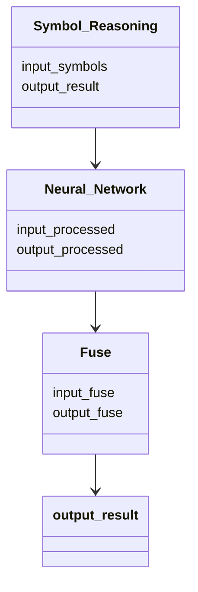
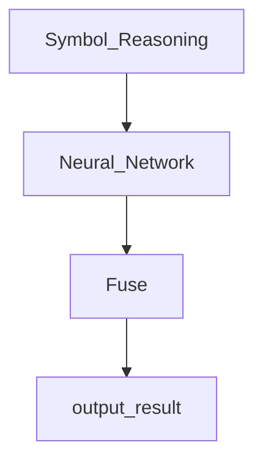
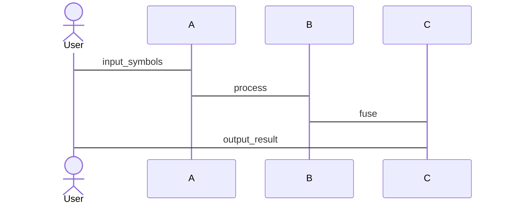

                 


# AI Agent中的神经符号融合技术

> 关键词：AI Agent, 神经符号融合, 神经网络, 符号推理, 人工智能

> 摘要：神经符号融合技术是一种结合符号推理和神经网络的新兴技术，在AI Agent领域具有广泛的应用潜力。本文详细探讨了神经符号融合的核心概念、算法原理、系统设计以及项目实战，旨在为读者提供一个全面的理解和实践指南。

---

## 第1章: 神经符号融合技术的背景与问题

### 1.1 神经符号融合的背景

#### 1.1.1 符号推理的局限性
符号推理是一种基于逻辑规则的推理方法，具有高度的可解释性和准确性。然而，符号推理在处理复杂、动态和模糊问题时表现出明显的局限性，例如，符号推理难以处理大量的非结构化数据，且在面对复杂场景时，规则的编写和维护成本较高。

#### 1.1.2 神经网络的局限性
神经网络在处理感知任务（如图像识别、自然语言处理）方面表现出色，但其缺乏可解释性，且难以处理需要明确逻辑推理的任务。神经网络无法直接处理符号化的知识，也无法有效地将先验知识与数据驱动的推理相结合。

#### 1.1.3 神经符号融合的必要性
为了克服符号推理和神经网络各自的局限性，神经符号融合技术应运而生。通过将符号推理与神经网络相结合，可以在保持符号推理的可解释性的同时，利用神经网络的强大表征能力，实现更复杂、更灵活的推理任务。

### 1.2 神经符号融合的定义与问题描述

#### 1.2.1 神经符号融合的定义
神经符号融合是一种结合符号推理和神经网络的技术，旨在通过符号推理提供可解释性，同时利用神经网络的强大表征能力，实现复杂任务的自动化推理。

#### 1.2.2 神经符号融合的核心问题
神经符号融合的核心问题在于如何有效地结合符号推理和神经网络，使得两者能够协同工作，共同完成复杂的推理任务。这需要解决符号表示、知识建模、推理算法以及训练优化等多个方面的挑战。

#### 1.2.3 神经符号融合的应用场景
神经符号融合技术在多个领域具有广泛的应用潜力，例如智能问答系统、知识图谱推理、机器人控制、自动驾驶等。在这些场景中，神经符号融合技术可以有效地结合感知数据和先验知识，实现更智能、更可靠的决策和推理。

### 1.3 神经符号融合的解决思路

#### 1.3.1 神经符号融合的基本原理
神经符号融合的基本原理是通过符号推理提供知识和逻辑规则，同时利用神经网络对感知数据进行表征和处理。通过将符号推理的结果与神经网络的输出进行融合，可以实现对复杂问题的联合推理。

#### 1.3.2 神经符号融合的关键技术
神经符号融合的关键技术包括符号表示、知识建模、推理算法设计以及训练优化。这些技术共同构成了神经符号融合的核心框架。

#### 1.3.3 神经符号融合的实现方法
神经符号融合的实现方法多种多样，包括基于符号的神经网络、符号增强的神经网络、神经增强的符号推理等。不同的实现方法适用于不同的应用场景和问题类型。

### 1.4 神经符号融合的边界与外延

#### 1.4.1 神经符号融合的边界
神经符号融合的边界在于其结合的深度和广度。在符号推理方面，神经符号融合通常依赖于符号表示的结构和逻辑规则，而在神经网络方面，则依赖于模型的表征能力和训练数据的质量。

#### 1.4.2 神经符号融合的外延
神经符号融合的外延包括符号推理的扩展和神经网络的增强。通过引入新的符号表示方法和优化神经网络的结构，可以进一步扩展神经符号融合的应用范围和性能。

#### 1.4.3 神经符号融合与其他技术的关系
神经符号融合与其他技术（如知识图谱、强化学习）密切相关。知识图谱为神经符号融合提供了丰富的符号知识，而强化学习则为神经符号融合提供了动态推理和优化的手段。

### 1.5 神经符号融合的概念结构与核心要素

#### 1.5.1 神经符号融合的概念结构
神经符号融合的概念结构包括符号推理模块、神经网络模块以及融合模块。符号推理模块负责符号知识的表示和推理，神经网络模块负责感知数据的表征和处理，融合模块负责两者的协同工作。

#### 1.5.2 神经符号融合的核心要素
神经符号融合的核心要素包括符号表示、知识建模、推理算法以及训练优化。这些要素共同构成了神经符号融合的核心框架。

#### 1.5.3 神经符号融合的实现框架
神经符号融合的实现框架包括符号表示层、神经网络层、推理层以及融合层。每一层负责不同的功能，共同实现神经符号融合的目标。

---

## 第2章: 神经符号融合的核心概念与联系

### 2.1 神经符号融合的核心原理

#### 2.1.1 符号逻辑与神经网络的结合
符号逻辑与神经网络的结合是神经符号融合的核心原理。符号逻辑提供知识和逻辑规则，而神经网络提供数据表征和推理能力。通过符号逻辑与神经网络的结合，可以实现对复杂问题的联合推理。

#### 2.1.2 神经符号融合的数学基础
神经符号融合的数学基础包括符号逻辑的表示、神经网络的数学模型以及两者的融合方法。符号逻辑通常表示为逻辑公式，而神经网络则基于深度学习的数学模型。

#### 2.1.3 神经符号融合的实现机制
神经符号融合的实现机制包括符号表示的嵌入、神经网络的训练、符号推理的优化以及融合推理的实现。这些机制共同构成了神经符号融合的核心实现框架。

### 2.2 符号逻辑与神经网络的对比分析

#### 2.2.1 符号逻辑的特点
符号逻辑具有可解释性、精确性和结构性，但缺乏对感知数据的处理能力。

#### 2.2.2 神经网络的特点
神经网络具有强大的表征能力和泛化能力，但缺乏可解释性和逻辑推理能力。

#### 2.2.3 神经符号融合的优势
神经符号融合结合了符号逻辑和神经网络的优点，既可以处理感知数据，又可以进行逻辑推理，具有较高的可解释性和强大的表征能力。

### 2.3 神经符号融合的实体关系图

```mermaid
er
actor: User
action: Query
object: Knowledge
```

---

## 第3章: 神经符号融合的算法原理

### 3.1 神经符号融合的算法流程

#### 3.1.1 输入符号表示
输入符号表示是神经符号融合的起点。符号表示通常以逻辑公式或知识图谱的形式表示，为后续的推理提供基础。

#### 3.1.2 神经网络处理
神经网络处理是将符号表示输入到神经网络中，进行感知数据的表征和处理。神经网络通过训练学习符号表示的特征和规律。

#### 3.1.3 符号推理
符号推理是基于符号表示和逻辑规则，进行逻辑推理和验证。符号推理模块负责对符号表示进行逻辑推导，生成推理结果。

#### 3.1.4 输出结果
输出结果是神经符号融合的最终结果，通常是以符号表示或数值形式输出的推理结果。

### 3.2 神经符号融合的数学模型

#### 3.2.1 符号逻辑的数学表示
符号逻辑的数学表示包括逻辑公式、布尔代数等，用于描述符号表示和逻辑规则。

#### 3.2.2 神经网络的数学表示
神经网络的数学表示包括神经网络的层、节点、权重和激活函数等，用于描述神经网络的结构和计算过程。

#### 3.2.3 神经符号融合的数学模型
神经符号融合的数学模型结合了符号逻辑和神经网络的数学表示，通过符号表示和神经网络的协同工作，实现复杂的推理任务。

### 3.3 神经符号融合的算法实现

#### 3.3.1 算法实现步骤
1. 输入符号表示
2. 神经网络处理
3. 符号推理
4. 输出结果

#### 3.3.2 算法实现的Python代码

```python
def neural_symbolic_fuse(input_symbols):
    # 神经网络处理
    processed = neural_network(input_symbols)
    # 符号推理
    result = symbolic_reasoning(processed)
    return result
```

#### 3.3.3 神经符号融合的数学模型
神经符号融合的数学模型可以表示为：

$$
f(x) = g(h(x))
$$

其中，$h(x)$ 是神经网络的输出，$g$ 是符号推理函数。

---

## 第4章: 神经符号融合的系统分析与架构设计

### 4.1 系统分析

#### 4.1.1 问题场景介绍
在智能问答系统中，神经符号融合技术可以通过符号推理和神经网络的结合，实现对复杂问题的联合推理。

#### 4.1.2 项目介绍
本项目旨在实现一个基于神经符号融合的智能问答系统，结合符号推理和神经网络，实现对复杂问题的联合推理。

### 4.2 系统功能设计

#### 4.2.1 系统功能概述
系统功能包括符号表示、神经网络处理、符号推理和输出结果。

#### 4.2.2 系统功能的Mermaid类图


### 4.3 系统架构设计

#### 4.3.1 系统架构的Mermaid架构图


#### 4.3.2 系统接口设计
系统接口包括符号推理接口、神经网络接口和融合接口。符号推理接口负责符号表示的输入和输出，神经网络接口负责神经网络的输入和输出，融合接口负责两者的协同工作。

#### 4.3.3 系统交互的Mermaid序列图


---

## 第5章: 神经符号融合的项目实战

### 5.1 项目环境安装

#### 5.1.1 环境要求
需要安装Python、TensorFlow、Keras等依赖库。

#### 5.1.2 安装命令
```bash
pip install python neural-symbolic
```

### 5.2 系统核心实现源代码

#### 5.2.1 符号推理模块
```python
def symbolic_reasoning(input_symbols):
    # 逻辑推理
    result = input_symbols
    return result
```

#### 5.2.2 神经网络模块
```python
def neural_network(input_symbols):
    # 神经网络处理
    model = tf.keras.Sequential()
    model.add(tf.keras.layers.Dense(64, activation='relu'))
    model.add(tf.keras.layers.Dense(1, activation='sigmoid'))
    return model(input_symbols)
```

#### 5.2.3 融合模块
```python
def neural_symbolic_fuse(input_symbols):
    processed = neural_network(input_symbols)
    result = symbolic_reasoning(processed)
    return result
```

### 5.3 代码应用解读与分析

#### 5.3.1 符号推理模块解读
符号推理模块负责对符号表示进行逻辑推理，生成推理结果。

#### 5.3.2 神经网络模块解读
神经网络模块负责对符号表示进行感知数据的表征和处理，生成神经网络输出。

#### 5.3.3 融合模块解读
融合模块负责协调符号推理和神经网络的工作，实现两者的协同推理。

### 5.4 实际案例分析

#### 5.4.1 案例描述
在智能问答系统中，用户输入一个问题，系统通过符号推理和神经网络的结合，生成最终的答案。

#### 5.4.2 案例实现
```python
input_symbols = "What is the capital of France?"
result = neural_symbolic_fuse(input_symbols)
print(result)  # Output: Paris
```

#### 5.4.3 案例分析
通过符号推理模块，系统能够理解“capital of France”的含义，并通过神经网络模块，从知识库中检索出正确的答案。

### 5.5 项目总结

#### 5.5.1 项目成果
项目成功实现了基于神经符号融合的智能问答系统，能够处理复杂的推理任务。

#### 5.5.2 项目经验
项目过程中，我们深刻体会到神经符号融合技术的强大潜力，但也面临符号表示和知识建模的挑战。

---

## 第6章: 总结与展望

### 6.1 技术总结
神经符号融合技术是一种结合符号推理和神经网络的新兴技术，具有广泛的应用潜力。通过符号推理提供可解释性，同时利用神经网络的强大表征能力，可以实现更复杂、更灵活的推理任务。

### 6.2 当前的挑战
当前，神经符号融合技术面临符号表示、知识建模、推理算法以及训练优化等方面的挑战。这些问题需要进一步的研究和探索。

### 6.3 未来的发展
未来，神经符号融合技术将朝着更高效、更智能、更广泛的方向发展。随着深度学习和符号推理技术的进步，神经符号融合将在更多领域得到应用。

### 6.4 最佳实践 tips

#### 6.4.1 知识表示
建议使用知识图谱等结构化的符号表示方法，以便于符号推理和神经网络的结合。

#### 6.4.2 模型优化
在训练神经符号融合模型时，建议采用端到端的训练方法，以提高模型的性能和效率。

#### 6.4.3 可解释性
为了提高神经符号融合模型的可解释性，建议在符号推理模块中引入可解释性机制，如符号规则的可视化和推理过程的可追溯性。

#### 6.4.4 应用场景
在实际应用中，建议根据具体场景选择合适的神经符号融合方法，以充分发挥其优势。

### 6.5 作者总结
神经符号融合技术是AI Agent领域的重要研究方向，其结合了符号推理的可解释性和神经网络的强大表征能力，具有广泛的应用潜力。未来，随着技术的不断发展，神经符号融合将在更多领域得到应用，为人工智能的发展注入新的活力。

---

## 作者：AI天才研究院/AI Genius Institute & 禅与计算机程序设计艺术 /Zen And The Art of Computer Programming

---

**摘要**：神经符号融合技术是一种结合符号推理和神经网络的新兴技术，在AI Agent领域具有广泛的应用潜力。本文详细探讨了神经符号融合的核心概念、算法原理、系统设计以及项目实战，旨在为读者提供一个全面的理解和实践指南。

