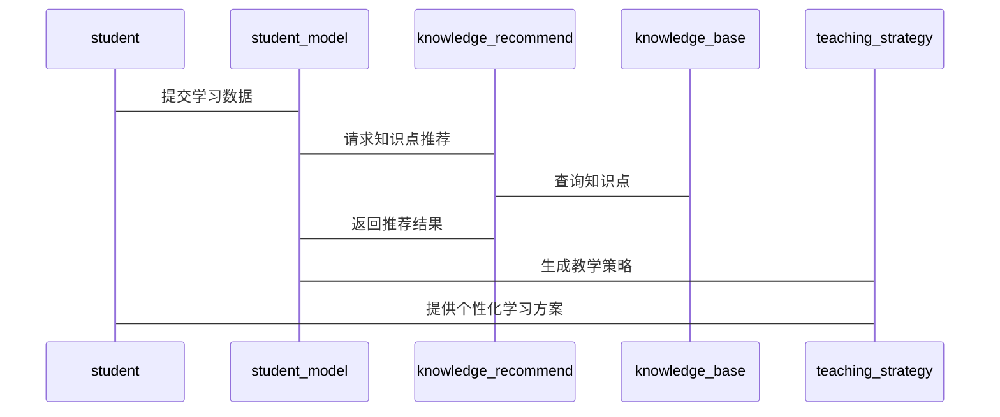

                 


# AI Agent在智能个性化教育中的应用

> 关键词：AI Agent, 个性化教育, 教学策略, 自然语言处理, 推荐系统, 知识图谱

> 摘要：AI Agent在教育领域的应用正在改变传统的教学模式，特别是在个性化教育方面。通过分析学习者的行为数据，AI Agent能够实时调整教学策略，推荐个性化学习资源，并与学习者进行自然交互。本文将深入探讨AI Agent在个性化教育中的核心概念、算法原理、系统架构及项目实现，揭示其在智能教育中的潜力与应用前景。

---

## 第一部分：AI Agent与个性化教育的背景与基础

### 第1章：AI Agent的基本概念与原理

#### 1.1 AI Agent的定义与核心特征
- **1.1.1 什么是AI Agent**
  AI Agent（人工智能代理）是指能够感知环境、做出决策并采取行动以实现目标的智能实体。它通过数据输入、模型分析和策略执行，帮助用户完成特定任务或提供智能化服务。

- **1.1.2 AI Agent的核心特征**
  - **自主性**：AI Agent能够自主决策和行动。
  - **反应性**：能够实时感知环境变化并做出响应。
  - **目标导向**：所有行动都围绕实现特定目标展开。
  - **学习能力**：通过数据和经验不断优化自身性能。

- **1.1.3 AI Agent的分类与应用场景**
  - **按智能水平**：分为反应式、基于模型的和混合型AI Agent。
  - **按功能类型**：包括推荐系统、对话系统、自动化系统等。
  - **典型应用场景**：教育、医疗、金融、交通等。

#### 1.2 个性化教育的需求与挑战
- **1.2.1 个性化教育的定义与目标**
  个性化教育是指根据每个学习者的兴趣、能力、学习风格和进度，提供定制化的教学资源和方法，以最大化学习效果。

- **1.2.2 传统教育模式的局限性**
  - 教学资源和进度统一，难以满足个体差异。
  - 教师精力有限，难以进行一对一辅导。
  - 学习者反馈难以及时应用于教学策略调整。

- **1.2.3 个性化教育的技术挑战**
  - 如何高效收集和分析学习者数据。
  - 如何构建个性化推荐算法。
  - 如何实现自然的人机交互。

#### 1.3 AI Agent与个性化教育的结合
- **1.3.1 AI Agent在个性化教育中的作用**
  - 数据采集与分析：通过传感器和学习平台收集学习者的行为数据。
  - 智能推荐：基于数据为学习者推荐个性化学习资源。
  - 自适应教学：实时调整教学策略以满足学习者需求。

- **1.3.2 个性化教育中的关键问题**
  - 学生特征建模：如何准确捕捉学习者的兴趣、能力、学习风格等特征。
  - 学习目标分解：如何将复杂的知识目标分解为可操作的小目标。
  - 教学策略生成：如何根据学习者特征生成有效的教学策略。

- **1.3.3 AI Agent如何解决这些问题**
  - 通过机器学习算法分析学习者数据，构建精准的特征模型。
  - 使用推荐系统和知识图谱技术，实现个性化资源推荐。
  - 基于强化学习优化教学策略，确保学习效果最大化。

---

## 第二部分：AI Agent的核心概念与原理

### 第2章：AI Agent的核心概念与原理

#### 2.1 AI Agent的感知、决策与执行
- **2.1.1 感知阶段：数据采集与分析**
  - 数据采集：通过传感器、摄像头、麦克风等设备获取环境数据。
  - 数据分析：使用自然语言处理（NLP）和计算机视觉（CV）技术分析数据，提取有用信息。

- **2.1.2 决策阶段：基于数据的决策算法**
  - 决策算法：使用机器学习模型，如随机森林、神经网络等，进行预测和分类。
  - 示例：基于学习者的知识点掌握情况，预测其最适合的学习资源。

- **2.1.3 执行阶段：行动与反馈**
  - 行动：根据决策结果执行具体操作，如推荐学习材料、调整教学进度。
  - 反馈：收集学习者的反馈，优化模型和策略。

#### 2.2 个性化教育中的关键概念
- **2.2.1 学生特征建模**
  - 特征提取：使用自然语言处理技术分析学习者的文本数据，提取情感倾向、关键词等。
  - 特征工程：将提取的特征转化为可用于机器学习模型的数值形式。

- **2.2.2 学习目标分解**
  - 知识点分解：将复杂的学习目标分解为多个小的知识点，便于个性化教学。
  - 示例：将“掌握高等数学”分解为“极限与连续”、“导数与积分”等多个知识点。

- **2.2.3 教学策略生成**
  - 策略生成：基于学习者的特征和知识点掌握情况，生成个性化的教学策略。
  - 策略优化：使用强化学习不断优化教学策略，确保学习效果最大化。

#### 2.3 AI Agent与个性化教育的实体关系图
- **2.3.1 实体关系图（ER图）展示**

```mermaid
erd
    student
    ----|1..n|---- knowledge_point
    student
    ----|1..n|---- learning_resource
    student
    ----|1..n|---- learning_strategy
```

---

## 第三部分：AI Agent的算法原理与实现

### 第3章：AI Agent的算法原理与实现

#### 3.1 协同过滤推荐算法
- **3.1.1 算法概述**
  协同过滤是一种基于用户行为数据的推荐算法，分为基于用户的协同过滤和基于物品的协同过滤。

- **3.1.2 基于用户的协同过滤**
  - 相似度计算：使用余弦相似度计算用户之间的相似度。
  - 推荐生成：基于相似用户的偏好推荐学习资源。

- **3.1.3 基于物品的协同过滤**
  - 相似度计算：计算知识点之间的相似度。
  - 推荐生成：基于知识点的相似度推荐相关学习资源。

- **3.1.4 混合推荐模型**
  - 组合基于用户的和基于物品的推荐结果，以提高推荐准确性。

#### 3.2 协同过滤推荐算法的数学模型
- **3.2.1 余弦相似度公式**

$$ \text{相似度} = \frac{\sum_{i=1}^{n} u_i v_i}{\sqrt{\sum_{i=1}^{n} u_i^2} \cdot \sqrt{\sum_{i=1}^{n} v_i^2}} $$

- **3.2.2 矩阵分解模型**
  - 矩阵分解：将用户-物品评分矩阵分解为用户因子矩阵和物品因子矩阵。
  - 示例代码：

```python
import numpy as np
from sklearn.metrics.pairwise import cosine_similarity

# 示例数据：用户-知识点评分矩阵
userKnowledge = np.array([[4, 3, 0],
                           [2, 0, 3],
                           [1, 0, 0]])

# 计算余弦相似度
similarity = cosine_similarity(userKnowledge)

print(similarity)
```

---

## 第四部分：AI Agent的系统架构与设计

### 第4章：AI Agent的系统架构与设计

#### 4.1 系统功能设计
- **4.1.1 学生建模模块**
  - 功能：收集和分析学生的行为数据，构建学生特征模型。
  - 示例：通过自然语言处理技术分析学生的作业文本，提取情感倾向和关键词。

- **4.1.2 知识点推荐模块**
  - 功能：基于学生特征模型，推荐个性化知识点。
  - 示例：为数学基础薄弱的学生推荐基础代数课程。

- **4.1.3 教学策略生成模块**
  - 功能：根据学生特征和知识点推荐结果，生成个性化教学策略。
  - 示例：为学习者制定每日学习计划，包括重点知识点、练习题和复习任务。

#### 4.2 系统架构设计
- **4.2.1 微服务架构**
  - 各功能模块独立部署，通过API进行通信。
  - 示例：学生建模模块通过API调用知识点推荐模块。

- **4.2.2 模块交互流程**
  - 流程：学生数据 → 学生建模 → 知识点推荐 → 教学策略生成。

- **4.2.3 系统接口设计**
  - 接口1：学生建模模块提供学生特征数据接口。
  - 接口2：知识点推荐模块提供推荐结果接口。

#### 4.3 系统交互流程
- **4.3.1 交互流程图**



---

## 第五部分：AI Agent的项目实战与应用

### 第5章：AI Agent的项目实战与应用

#### 5.1 项目环境与工具安装
- **5.1.1 开发环境**
  - 操作系统：Linux/MacOS/Windows
  - 开发工具：PyCharm、VS Code
  - 依赖管理工具：pip、conda

- **5.1.2 项目所需库**
  - Python库：numpy、pandas、scikit-learn、spacy
  - 机器学习框架：TensorFlow、PyTorch

#### 5.2 系统核心实现源代码
- **5.2.1 协同过滤推荐算法实现**

```python
from sklearn.metrics.pairwise import cosine_similarity

# 示例数据：用户-知识点评分矩阵
userKnowledge = [
    [4, 3, 0],
    [2, 0, 3],
    [1, 0, 0]
]

# 计算余弦相似度
similarity = cosine_similarity(userKnowledge)

print(similarity)
```

- **5.2.2 知识点推荐模块实现**

```python
import spacy

# 加载英文语言模型
nlp = spacy.load("en_core_web_sm")

# 示例文本：学生作业文本
text = "I have trouble understanding derivatives."

# 分析文本
doc = nlp(text)
for token in doc:
    print(token.text, token.pos_, token.dep_)
```

#### 5.3 项目实战案例分析
- **5.3.1 案例背景**
  某学生在学习高等数学时遇到困难，系统通过分析其作业文本，推荐相关知识点和练习题。

- **5.3.2 实施步骤**
  1. 收集学生作业数据。
  2. 使用NLP技术分析文本，提取关键词和情感倾向。
  3. 基于协同过滤算法推荐相关知识点。
  4. 生成个性化学习计划。

#### 5.4 项目小结
- **项目总结**
  通过AI Agent技术，实现了个性化知识点推荐和教学策略生成，显著提高了学习效率。

---

## 第六部分：AI Agent的优化与扩展

### 第6章：AI Agent的优化与扩展

#### 6.1 系统优化与改进
- **6.1.1 算法优化**
  - 使用深度学习模型（如GNN）提高推荐准确性。
  - 示例：改进协同过滤算法，引入用户行为的时间因素。

- **6.1.2 系统性能优化**
  - 优化数据存储结构，提高数据查询速度。
  - 使用分布式计算技术，提升系统处理能力。

#### 6.2 知识图谱与智能教育
- **6.2.1 知识图谱的构建**
  - 使用知识图谱技术，构建领域知识图谱。
  - 示例：构建数学知识图谱，帮助学生理解知识点之间的关系。

- **6.2.2 知识图谱在教育中的应用**
  - 用于知识点推荐、学习路径规划和知识关联分析。

#### 6.3 智能教育的未来发展
- **6.3.1 未来趋势**
  - AI Agent将更加智能化和个性化。
  - 教育将更加注重人机协作，实现真正的个性化学习。

- **6.3.2 拓展阅读**
  - 推荐书籍：《教育中的人工智能》、《知识图谱与智能教育》。

---

## 第七部分：总结与展望

### 第7章：总结与展望

#### 7.1 小结
- AI Agent在个性化教育中的应用前景广阔。
- 通过数据采集、算法推荐和策略生成，AI Agent能够有效提升学习效果。

#### 7.2 注意事项
- 数据隐私保护：确保学生数据的安全性和隐私性。
- 算法可解释性：确保推荐结果的透明性和可解释性。
- 系统稳定性：确保系统在高并发情况下的稳定性。

#### 7.3 拓展阅读
- 推荐阅读：《机器学习实战》、《深度学习》、《教育技术研究》。

---

## 作者

作者：AI天才研究院/AI Genius Institute & 禅与计算机程序设计艺术 /Zen And The Art of Computer Programming

---

**注：由于篇幅限制，本文档未展示完整内容，实际文章需要根据上述大纲进行详细扩展。**

