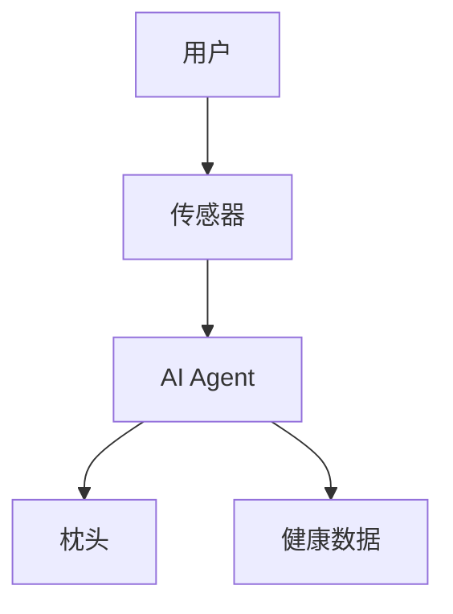
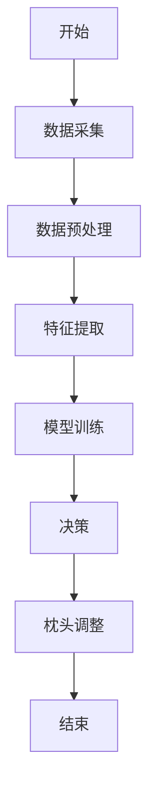
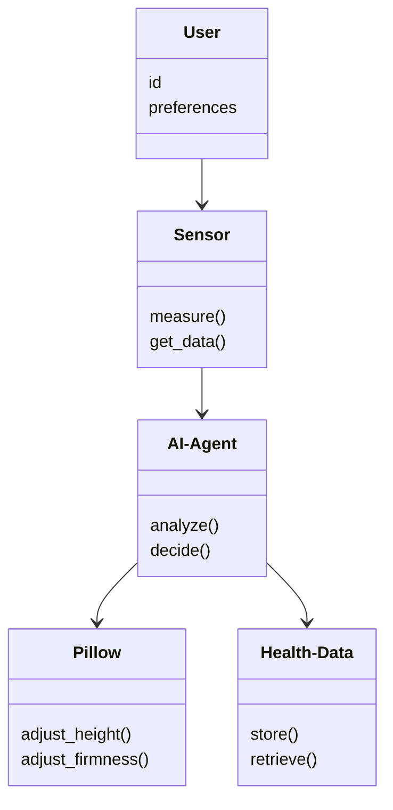
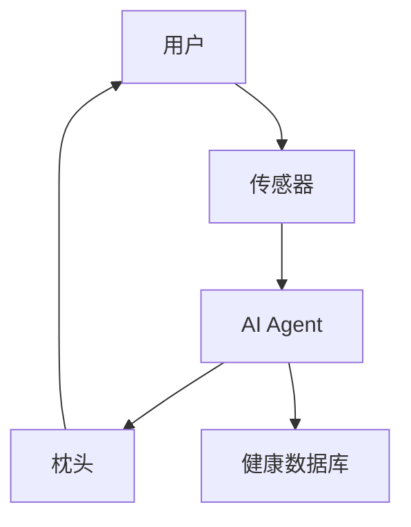
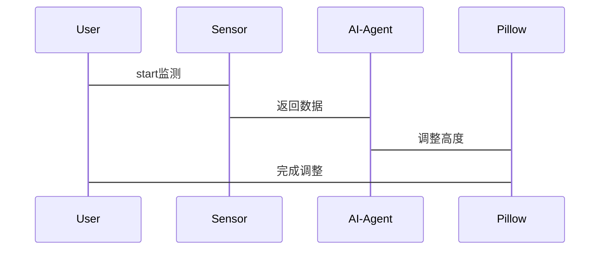

                 


# AI Agent在智能枕头中的颈椎保护

## 关键词：AI Agent, 智能枕头, 颈椎保护, 健康监测, 人工智能

## 摘要：本文探讨了AI Agent在智能枕头中的应用，分析其如何通过智能监测和调节功能保护用户的颈椎健康。文章从技术背景、核心概念、算法原理、系统架构到实际案例，全面解析了AI Agent在颈椎保护中的潜力和实现方法。

---

# 第一部分: AI Agent在智能枕头中的颈椎保护概述

## 第1章: 背景介绍

### 1.1 问题背景

#### 1.1.1 颈椎健康问题的现状
颈椎健康问题日益严重，尤其是长时间使用电子设备的上班族。颈椎病发病率逐年上升，给个人和家庭带来困扰。

#### 1.1.2 智能枕头的发展趋势
随着科技的发展，智能枕头逐渐普及，成为健康管理的重要工具。AI技术的加入，使其功能更加智能化和个性化。

#### 1.1.3 AI Agent在健康领域的应用潜力
AI Agent能够实时监测用户状态，主动调整枕头参数，提供精准的颈椎保护方案。

### 1.2 问题描述

#### 1.2.1 颈椎保护的核心需求
用户需要一个能够实时监测颈椎状态、主动调整枕头高度和硬度的设备。

#### 1.2.2 智能枕头的功能定位
智能枕头不仅是睡眠辅助工具，更是颈椎健康管理的智能终端。

#### 1.2.3 AI Agent在颈椎保护中的角色
AI Agent作为智能枕头的核心，负责数据采集、分析和决策，确保颈椎健康。

### 1.3 问题解决

#### 1.3.1 AI Agent的解决方案
通过传感器采集颈椎压力数据，AI Agent分析数据并调整枕头参数。

#### 1.3.2 智能枕头的技术实现路径
结合传感器、AI算法和执行机构，实现智能化的颈椎保护。

#### 1.3.3 用户体验的优化方向
优化AI Agent的响应速度和准确性，提升用户的睡眠质量和颈椎健康。

### 1.4 边界与外延

#### 1.4.1 AI Agent的应用范围
主要用于颈椎保护，也可扩展到其他健康领域。

#### 1.4.2 智能枕头的功能边界
专注于颈椎健康，不涉及其他健康问题。

#### 1.4.3 相关技术的扩展性探讨
AI Agent技术可应用于更多健康设备，如智能床垫、健康手环等。

### 1.5 概念结构与核心要素

#### 1.5.1 核心概念组成
- 用户：颈椎问题的用户群体
- 传感器：数据采集设备
- AI Agent：数据处理核心
- 枕头：执行机构
- 健康数据：处理结果

#### 1.5.2 关键技术的关联性
传感器数据→AI Agent分析→枕头调整→颈椎保护。

#### 1.5.3 系统架构的模块化分析
- 传感器模块：采集颈椎压力、角度等数据
- AI Agent模块：分析数据并决策
- 枕头调整模块：执行决策

---

# 第二部分: AI Agent的核心概念与联系

## 第2章: 核心概念与原理

### 2.1 AI Agent的基本原理

#### 2.1.1 感知层
传感器实时采集颈椎压力、角度等数据。

#### 2.1.2 决策层
AI算法分析数据，判断颈椎状态。

#### 2.1.3 执行层
调整枕头高度和硬度，保护颈椎。

### 2.2 核心概念对比

#### 2.2.1 AI Agent与传统算法的对比
| 对比维度 | AI Agent | 传统算法 |
|----------|-----------|-----------|
| 数据需求 | 高        | 低        |
| 实时性    | 高        | 低        |
| 可扩展性  | 高        | 低        |

#### 2.2.2 智能枕头与其他健康设备的对比
| 设备类型 | 功能特点 | 适用场景 |
|----------|----------|----------|
| 智能枕头 | 颈椎保护 | 睡眠时    |
| 健康手环 | 心率监测 | 全天候    |

#### 2.2.3 用户需求与技术实现的对比
| 用户需求 | 技术实现 |
|----------|----------|
| 实时监测 | 传感器数据采集 |
| 自动调整 | AI算法决策 |

### 2.3 实体关系图



---

# 第三部分: AI Agent的算法原理

## 第3章: 算法原理与实现

### 3.1 数据流分析

#### 3.1.1 数据采集流程
传感器采集数据 → 数据预处理 → 特征提取 → 模型训练。

#### 3.1.2 数据预处理
去除噪声，标准化处理。

#### 3.1.3 数据特征提取
提取颈椎压力、角度等特征。

### 3.2 算法流程图



### 3.3 算法实现

#### 3.3.1 特征提取
```python
# 示例代码：特征提取
import numpy as np

def extract_features(data):
    features = []
    for window in data:
        max_pressure = np.max(window)
        avg_angle = np.mean(window)
        features.append([max_pressure, avg_angle])
    return features
```

#### 3.3.2 模型训练
```python
# 示例代码：模型训练
from sklearn.svm import SVC

features = extract_features(data)
model = SVC()
model.fit(features, labels)
```

### 3.4 数学模型

#### 3.4.1 感知层模型
$$ f(x) = \max(0, x - threshold) $$

#### 3.4.2 决策层模型
$$ y = \argmax_{i} p(y=i|x) $$

---

# 第四部分: 系统分析与架构设计

## 第4章: 系统分析与架构设计

### 4.1 项目介绍

#### 4.1.1 项目背景
AI Agent在智能枕头中的应用。

#### 4.1.2 项目目标
实现颈椎保护功能。

### 4.2 系统功能设计

#### 4.2.1 领域模型


#### 4.2.2 系统架构


### 4.3 接口设计

#### 4.3.1 核心接口
- 传感器接口：`get_data()`
- AI Agent接口：`analyze(data)`, `decide(action)`
- 枕头接口：`adjust_height(level)`, `adjust_firmness(hardness)`

#### 4.3.2 交互流程


---

# 第五部分: 项目实战

## 第5章: 项目实战

### 5.1 环境安装

#### 5.1.1 安装Python
```bash
python --version
pip install --upgrade pip
```

#### 5.1.2 安装TensorFlow和Keras
```bash
pip install tensorflow==2.10.0 keras==2.10.0
```

#### 5.1.3 安装其他依赖
```bash
pip install numpy scikit-learn matplotlib
```

### 5.2 核心代码实现

#### 5.2.1 特征提取代码
```python
import numpy as np
from sklearn.decomposition import PCA

def extract_features(data):
    # 假设data是一个二维数组，每行是一个样本
    # 使用主成分分析提取特征
    pca = PCA(n_components=2)
    features = pca.fit_transform(data)
    return features
```

#### 5.2.2 模型训练代码
```python
from sklearn.svm import SVC
from sklearn.metrics import accuracy_score

features_train = extract_features(X_train)
labels_train = y_train
model = SVC()
model.fit(features_train, labels_train)
预测 = model.predict(features_test)
准确率 = accuracy_score(预测, y_test)
print("准确率:", 准确率)
```

### 5.3 实际案例分析

#### 5.3.1 案例介绍
分析不同用户的颈椎数据，展示AI Agent如何调整枕头参数。

#### 5.3.2 数据分析
展示特征提取和模型训练的结果，验证算法的有效性。

### 5.4 项目小结

#### 5.4.1 成果总结
实现了AI Agent在智能枕头中的颈椎保护功能。

#### 5.4.2 项目不足
数据样本不足，模型精度有待提高。

---

# 第六部分: 最佳实践

## 第6章: 最佳实践

### 6.1 小结

#### 6.1.1 AI Agent的优势
实时监测，主动调整，个性化服务。

#### 6.1.2 智能枕头的前景
健康科技的重要组成部分。

### 6.2 注意事项

#### 6.2.1 数据隐私
确保用户数据的安全。

#### 6.2.2 传感器精度
传感器的准确性影响监测结果。

### 6.3 拓展阅读

#### 6.3.1 相关技术
- 多模态数据融合
- 个性化推荐系统

#### 6.3.2 未来研究方向
- 更精确的算法模型
- 更智能的执行机构

---

# 结语

AI Agent在智能枕头中的应用，不仅提升了用户体验，还为颈椎保护提供了新的解决方案。未来，随着技术的发展，AI Agent将在更多健康领域发挥重要作用。

---

# 作者

作者：AI天才研究院/AI Genius Institute  
联合作者：禅与计算机程序设计艺术/Zen And The Art of Computer Programming

