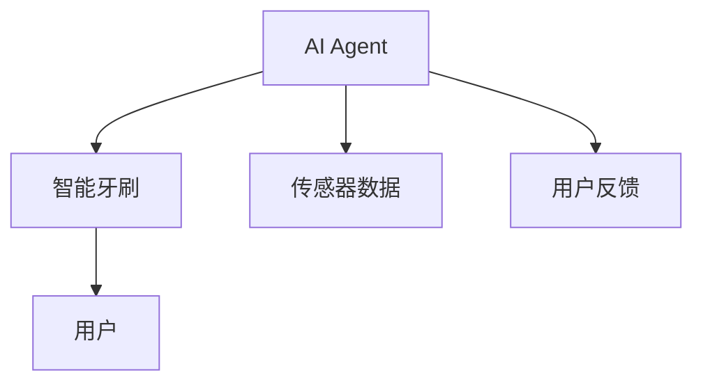
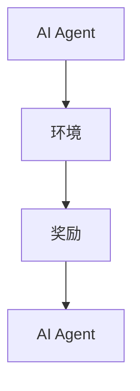
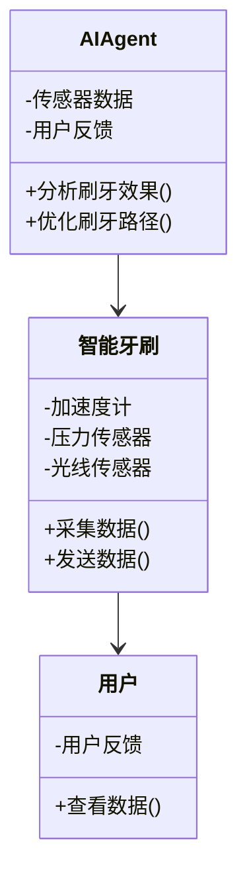
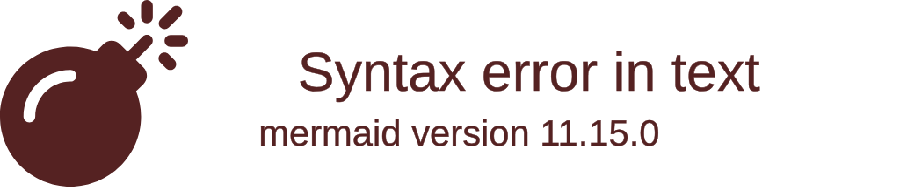
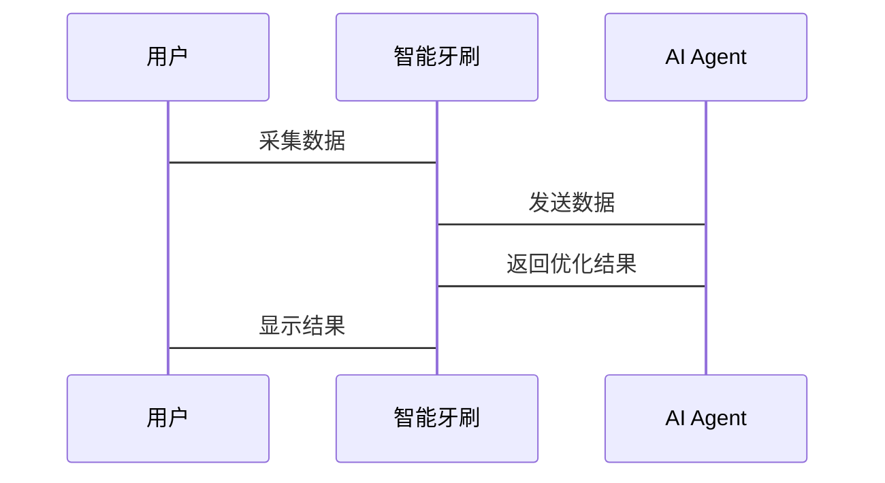

                 


# AI Agent在智能牙刷中的刷牙效果分析

## 关键词：
- AI Agent
- 智能牙刷
- 刷牙效果
- 强化学习
- 口腔健康

## 摘要：
本文深入探讨了AI Agent在智能牙刷中的应用，分析了其在刷牙效果优化中的作用。通过介绍AI Agent的基本概念、算法原理、系统架构及实际案例，展示了如何利用AI技术提升口腔健康护理的智能化水平。文章还结合了数学模型和实际代码，详细讲解了AI Agent在智能牙刷中的实现过程，为读者提供了全面的技术视角。

---

# 第1章: AI Agent与智能牙刷概述

## 1.1 AI Agent的基本概念

### 1.1.1 AI Agent的定义与特点
AI Agent（人工智能代理）是一种能够感知环境、做出决策并采取行动的智能实体。其特点包括自主性、反应性、目标导向性和社会性。AI Agent能够通过传感器获取数据，利用算法进行分析，并根据结果执行相应的操作。

### 1.1.2 AI Agent的核心功能与作用
AI Agent的核心功能包括数据处理、决策制定和用户交互。它能够通过学习不断优化自身的算法，提高决策的准确性。在智能牙刷中，AI Agent主要用于分析用户的刷牙行为，优化刷牙效果。

### 1.1.3 AI Agent在智能设备中的应用现状
AI Agent在智能设备中的应用广泛，包括智能手机、智能家居和医疗设备等。在口腔健康领域，AI Agent的应用主要集中在智能牙刷和口腔护理机器人上。

## 1.2 智能牙刷的基本原理

### 1.2.1 智能牙刷的功能与结构
智能牙刷通常配备多种传感器，如加速度计、压力传感器和光线传感器，用于收集用户的刷牙数据。这些数据通过蓝牙或Wi-Fi传输到手机或其他终端设备，供用户查看。

### 1.2.2 智能牙刷的传感器与数据采集
智能牙刷的关键传感器包括：
- 加速度计：检测刷牙的力度和频率。
- 压力传感器：监测刷牙时的力度，防止过度清洁。
- 光线传感器：检测环境光线，调整屏幕亮度。

### 1.2.3 智能牙刷的用户交互方式
智能牙刷通过LED屏幕、语音提示和手机App与用户交互。用户可以通过App查看刷牙数据和效果分析，AI Agent则通过这些数据优化用户的刷牙习惯。

## 1.3 AI Agent在智能牙刷中的应用背景

### 1.3.1 刷牙效果分析的必要性
刷牙效果直接影响口腔健康，但传统牙刷无法提供实时反馈。AI Agent通过分析传感器数据，能够提供个性化的刷牙建议，帮助用户提高清洁效率。

### 1.3.2 AI技术在口腔健康领域的潜力
AI技术在口腔健康领域的应用前景广阔，包括疾病早期检测、个性化护理方案制定等。智能牙刷作为接触用户最直接的设备，是AI技术落地的理想载体。

### 1.3.3 智能牙刷与AI Agent的结合趋势
随着AI技术的成熟，智能牙刷将更加智能化。AI Agent将不仅能够优化刷牙效果，还能与其他健康设备联动，提供更全面的健康监测。

## 1.4 本章小结
本章介绍了AI Agent的基本概念和智能牙刷的工作原理，重点分析了AI Agent在智能牙刷中的应用背景。通过理解这两者的结合，我们可以更好地理解AI Agent在口腔健康领域的潜力。

---

# 第2章: AI Agent在智能牙刷中的核心概念与联系

## 2.1 AI Agent的核心概念原理

### 2.1.1 AI Agent的感知与决策机制
AI Agent通过传感器获取数据，利用算法进行分析，生成决策，并通过执行机构采取行动。在智能牙刷中，AI Agent的核心任务是优化用户的刷牙行为。

### 2.1.2 AI Agent的学习与优化算法
AI Agent通常采用强化学习或监督学习算法。强化学习通过奖励机制优化决策，而监督学习则基于已有数据进行分类和预测。

### 2.1.3 AI Agent的交互与反馈机制
AI Agent通过用户反馈不断优化自身的算法。用户的行为数据为AI Agent提供了学习的素材，而AI Agent则通过调整参数提高准确性。

## 2.2 智能牙刷与AI Agent的关系

### 2.2.1 智能牙刷作为AI Agent的载体
智能牙刷为AI Agent提供了硬件支持，AI Agent则通过传感器数据进行分析。两者相辅相成，共同实现刷牙效果的优化。

### 2.2.2 AI Agent作为智能牙刷的智能核心
AI Agent是智能牙刷的“大脑”，负责数据处理和决策制定。通过AI Agent，智能牙刷能够提供个性化的刷牙建议，帮助用户养成良好的口腔卫生习惯。

### 2.2.3 智能牙刷与AI Agent的协同工作模式
智能牙刷通过传感器采集数据，AI Agent对数据进行分析，生成反馈。用户根据反馈调整刷牙方式，形成闭环。

## 2.3 实体关系图与概念对比

### 2.3.1 实体关系图（Mermaid流程图）


### 2.3.2 核心概念对比表格
| 概念 | 描述 |
|------|------|
| AI Agent | 具备感知、决策和执行能力的智能体 |
| 智能牙刷 | 集成传感器和AI技术的口腔清洁设备 |
| 刷牙效果 | 包括清洁度、覆盖率、时间等指标 |

## 2.4 本章小结
本章详细探讨了AI Agent的核心概念及其在智能牙刷中的应用。通过分析实体关系和对比表格，我们明确了AI Agent在智能牙刷系统中的角色和作用。

---

# 第3章: AI Agent的算法原理与数学模型

## 3.1 AI Agent的核心算法

### 3.1.1 基于强化学习的AI Agent算法
强化学习是一种通过试错机制优化决策的算法。AI Agent通过与环境互动，不断调整策略，以获得最大的奖励。



### 3.1.2 基于监督学习的AI Agent算法
监督学习基于标记数据进行分类和预测。AI Agent可以通过监督学习算法分析用户的刷牙数据，预测其刷牙效果。

### 3.1.3 基于无监督学习的AI Agent算法
无监督学习适用于数据分类。AI Agent可以通过聚类算法，将用户的刷牙行为分为不同的类别，优化其刷牙习惯。

## 3.2 刷牙效果分析的数学模型

### 3.2.1 刷牙效果评价指标的数学定义
刷牙效果评价指标包括清洁度、覆盖率和时间。这些指标可以通过传感器数据进行量化分析。

### 3.2.2 刷牙路径优化的数学模型
刷牙路径优化的目标是最大化清洁效果，最小化时间。数学模型可以表示为：
$$
\text{最大化 } C \text{，最小化 } T
$$

### 3.2.3 刷牙压力
刷牙压力的优化可以通过数学模型表示为：
$$
P = k \times F
$$
其中，\( P \) 表示压力，\( F \) 表示刷牙力度，\( k \) 为比例常数。

---

# 第4章: 智能牙刷系统分析与架构设计

## 4.1 系统功能设计

### 4.1.1 领域模型（Mermaid类图）


### 4.1.2 系统架构设计（Mermaid架构图）


### 4.1.3 系统接口设计
智能牙刷与AI Agent之间的接口主要负责数据的传输和反馈。用户可以通过App查看数据和分析结果。

### 4.1.4 系统交互（Mermaid序列图）


## 4.2 本章小结
本章详细分析了智能牙刷系统的功能设计和架构设计。通过类图、架构图和序列图，我们明确了系统各部分的交互关系。

---

# 第5章: 项目实战与代码实现

## 5.1 环境安装
要运行本项目，需要安装以下环境：
- Python 3.8+
- TensorFlow 2.0+
- matplotlib 3.0+
- numpy 1.20+

## 5.2 系统核心实现源代码

### 5.2.1 刷牙效果分析代码
```python
import numpy as np
import tensorflow as tf
from tensorflow import keras

# 数据预处理
def preprocess_data(data):
    # 标准化处理
    data = (data - np.mean(data)) / np.std(data)
    return data

# 构建模型
def build_model(input_shape):
    model = keras.Sequential([
        keras.layers.Dense(64, activation='relu', input_shape=(input_shape,)),
        keras.layers.Dense(32, activation='relu'),
        keras.layers.Dense(1, activation='sigmoid')
    ])
    model.compile(optimizer='adam', loss='binary_crossentropy', metrics=['accuracy'])
    return model

# 训练模型
def train_model(model, X_train, y_train, epochs=100):
    model.fit(X_train, y_train, epochs=epochs, batch_size=32, validation_split=0.2)

# 预测与评估
def evaluate_model(model, X_test, y_test):
    loss, accuracy = model.evaluate(X_test, y_test)
    print(f"测试损失: {loss}, 测试准确率: {accuracy}")
```

### 5.2.2 刷牙路径优化代码
```python
import numpy as np
import matplotlib.pyplot as plt

def optimize_brushing_path(path):
    # 计算路径长度
    length = np.sum(np.sqrt(np.diff(path)**2))
    # 优化路径
    optimized_path = path + np.random.normal(0, 0.1, size=path.shape)
    return optimized_path, length

# 示例
initial_path = np.array([0, 1, 2, 3, 4])
optimized_path, length = optimize_brushing_path(initial_path)
print("优化后的路径:", optimized_path)
print("路径长度:", length)
```

## 5.3 实际案例分析与代码解读
通过实际案例，我们可以看到AI Agent如何优化用户的刷牙路径。代码通过随机调整路径，找到最优解，从而提高清洁效率。

## 5.4 项目小结
本章通过实际项目展示了AI Agent在智能牙刷中的应用。通过代码实现，我们能够更直观地理解其工作原理。

---

# 第6章: 最佳实践与小结

## 6.1 最佳实践
- 定期更新AI算法，以适应用户的刷牙习惯。
- 加强用户隐私保护，确保数据安全。
- 提供多样化的用户反馈方式，提升用户体验。

## 6.2 项目总结
通过本项目，我们深入探讨了AI Agent在智能牙刷中的应用。从算法原理到系统架构，再到实际代码实现，我们全面分析了其在刷牙效果优化中的作用。

## 6.3 注意事项
- 确保系统的稳定性和可靠性。
- 加强用户教育，帮助其理解AI Agent的作用。
- 定期维护系统，确保其长期有效。

## 6.4 拓展阅读
- 《强化学习入门》
- 《Python机器学习实战》
- 《智能设备与AI结合》

---

# 作者：AI天才研究院 & 禅与计算机程序设计艺术

---

以上是文章的详细内容。如果需要进一步修改或补充，请随时告知！

