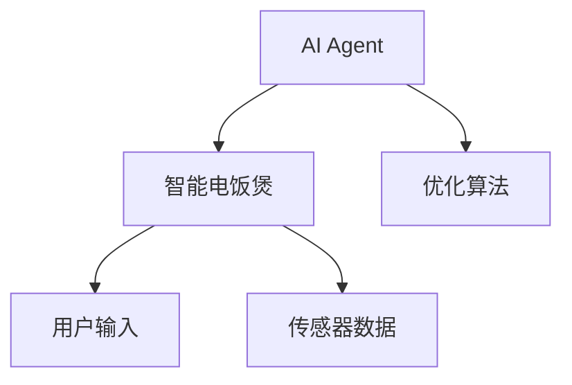
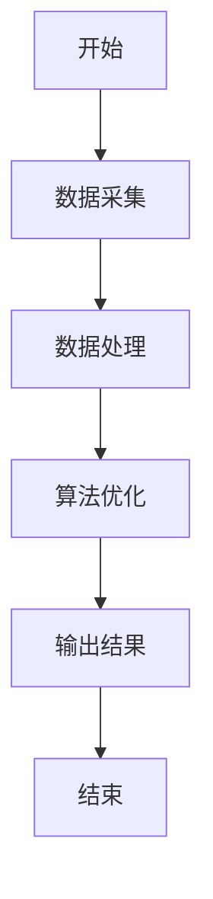
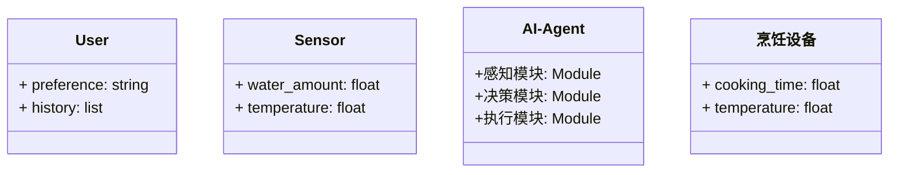
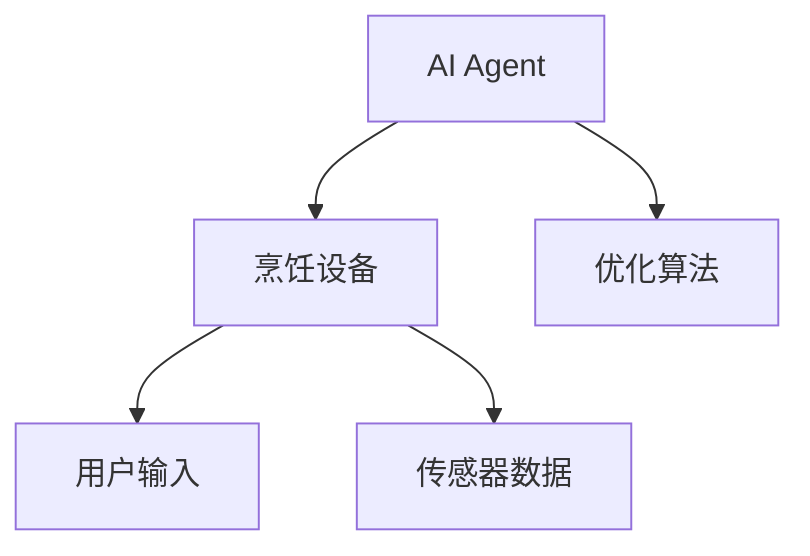
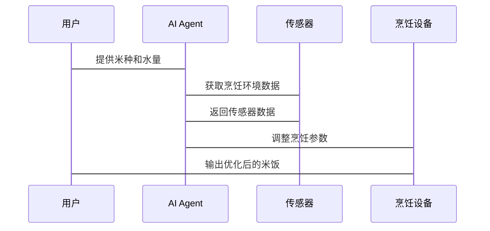

                 


# AI Agent在智能电饭煲中的米饭口感优化

> 关键词：AI Agent, 智能电饭煲, 米饭口感, 优化算法, 系统架构, 项目实战

> 摘要：本文详细探讨了AI Agent在智能电饭煲中的应用，特别是如何通过优化算法提升米饭口感。文章从背景介绍、核心概念、算法原理、系统设计、项目实战等多个方面展开，结合Mermaid图表和Python代码示例，全面解析AI Agent在米饭口感优化中的作用与实现。

---

## 第1章: AI Agent与智能电饭煲概述

### 1.1 AI Agent的基本概念
- 1.1.1 AI Agent的定义
  - AI Agent是一个智能主体，能够感知环境并做出决策以实现目标。
- 1.1.2 AI Agent的核心特征
  - 能动性：主动采取行动。
  - 反应性：实时感知环境变化。
  - 智能性：基于数据进行推理和优化。
- 1.1.3 AI Agent与传统算法的区别
  - 传统算法：基于规则，无法自主学习。
  - AI Agent：具备自主学习和适应能力。

### 1.2 智能电饭煲的发展历程
- 1.2.1 传统电饭煲的功能特点
  - 单一功能：仅提供加热功能。
  - 固定模式：固定的烹饪时间表。
- 1.2.2 智能电饭煲的出现与演变
  - 智能电饭煲：集成AI技术，实现个性化烹饪。
  - 发展阶段：从单一模式到AI驱动的智能模式。
- 1.2.3 智能电饭煲的市场现状
  - 市场需求：消费者对智能化、个性化烹饪的需求增加。
  - 技术趋势：AI技术在家电领域的广泛应用。

### 1.3 米饭口感优化的背景与意义
- 1.3.1 米饭口感的重要性
  - 用户体验：直接影响用户满意度。
  - 品牌竞争力：优化口感有助于提升品牌竞争力。
- 1.3.2 当前米饭口感优化的痛点
  - 传统电饭煲：无法根据米种和水量自动调整烹饪参数。
  - 用户干预：需要手动调整烹饪时间，使用不便。
- 1.3.3 AI Agent在米饭口感优化中的作用
  - 自动感知：通过传感器感知米种、水量和温度。
  - 自主优化：基于历史数据优化烹饪参数。

## 第2章: AI Agent在智能电饭煲中的应用前景

### 2.1 AI Agent在智能家居中的应用现状
- 2.1.1 智能家居的发展趋势
  - 智能家居：通过物联网和AI技术实现家居设备的智能化联动。
  - 市场增长：智能家居市场规模持续扩大。
- 2.1.2 AI Agent在智能家居中的典型应用
  - 智能音箱：通过语音交互实现家居设备控制。
  - 智能门锁：通过AI算法实现身份识别和门禁控制。
- 2.1.3 AI Agent在智能电饭煲中的潜在价值
  - 提高用户体验：通过个性化烹饪优化口感。
  - 优化烹饪效率：通过智能算法减少能源浪费。
  - 提升品牌竞争力：通过智能化功能提升产品附加值。

### 2.2 AI Agent在智能电饭煲中的潜在价值
- 2.2.1 提高用户体验的可能性
  - 个性化烹饪：根据用户口味偏好调整烹饪参数。
  - 智能推荐：基于用户历史数据推荐最佳烹饪方案。
- 2.2.2 优化米饭口感的技术可行性
  - 多传感器融合：通过温度、湿度和压力传感器感知烹饪环境。
  - 自适应算法：基于实时数据动态调整烹饪参数。
- 2.2.3 市场需求与商业价值
  - 消费者需求：消费者对智能化、个性化烹饪的需求不断增加。
  - 商业价值：通过智能化功能提升产品竞争力，增加市场份额。

## 第3章: 米饭口感优化的核心概念与联系

### 3.1 米饭口感优化的基本原理
- 3.1.1 米饭口感的影响因素
  - 米种：不同米种的结构和含糖量不同，影响口感。
  - 水量：水量影响米饭的软硬度。
  - 烹饪时间：烹饪时间影响米饭的熟透程度。
  - 温度：温度影响米饭的膨胀和口感。
- 3.1.2 不同米种的口感特点
  - 米种分类：短粒米、中粒米、长粒米。
  - 米口感差异：短粒米口感柔软，长粒米口感坚韧。
- 3.1.3 烹饪参数对口感的影响
  - 烹饪时间：时间过短会导致米饭夹生，时间过长会导致米饭过软。
  - 温度控制：温度过高会导致米饭外焦里生，温度过低会导致米饭粘稠。

### 3.2 AI Agent在口感优化中的角色
- 3.2.1 AI Agent的感知模块
  - 数据采集：通过传感器采集米种、水量和温度等数据。
  - 数据分析：通过机器学习算法分析数据，识别影响口感的关键因素。
- 3.2.2 AI Agent的决策模块
  - 参数优化：基于历史数据优化烹饪参数。
  - 个性化推荐：根据用户偏好推荐最佳烹饪方案。
- 3.2.3 AI Agent的执行模块
  - 调整烹饪时间：根据优化结果调整烹饪时间。
  - 调整温度：根据优化结果调整烹饪温度。

### 3.3 优化算法对比分析
- 3.3.1 常见优化算法概述
  - 遗传算法：通过模拟生物进化过程寻找最优解。
  - 模拟退火：通过模拟热力学过程寻找最优解。
  - 蚁群算法：通过模拟蚂蚁觅食过程寻找最优解。
- 3.3.2 算法对比分析表
```mermaid
| 算法名称 | 优点 | 缺点 |
|---------|------|------|
| 遗传算法 | 全局搜索能力强 | 计算复杂度高 |
| 模拟退火 | 可以找到全局最优 | 收敛速度慢 |
| 蚁群算法 | 适合多目标优化 | 对参数敏感 |
```

### 3.4 系统实体关系图


### 3.5 本章小结
- 本章详细介绍了米饭口感优化的核心概念与联系，分析了AI Agent在优化过程中的角色，并对比了不同优化算法的优缺点。通过Mermaid图展示了系统实体关系，为后续章节的算法实现奠定了基础。

## 第4章: 基于AI Agent的米饭口感优化算法原理

### 4.1 算法流程概述
- 4.1.1 数据采集阶段
  - 传感器数据采集：通过温度、湿度和压力传感器采集烹饪环境数据。
  - 用户输入数据采集：通过用户输入获取米种和水量等信息。
- 4.1.2 数据处理阶段
  - 数据清洗：去除噪声数据，确保数据准确性。
  - 数据特征提取：提取影响口感的关键特征，如米种、水量和温度。
- 4.1.3 算法优化阶段
  - 参数优化：基于历史数据优化烹饪参数。
  - 个性化推荐：根据用户偏好推荐最佳烹饪方案。

### 4.2 算法实现细节
- 4.2.1 感知模块的实现
  - 传感器数据采集：通过智能电饭煲内置的传感器采集数据。
  - 数据预处理：对采集的数据进行清洗和特征提取。
- 4.2.2 决策模块的实现
  - 参数优化：使用遗传算法优化烹饪参数。
  - 个性化推荐：基于用户历史数据推荐最佳烹饪方案。
- 4.2.3 执行模块的实现
  - 调整烹饪时间：根据优化结果调整烹饪时间。
  - 调整温度：根据优化结果调整烹饪温度。

### 4.3 算法流程图


### 4.4 算法数学模型
- 4.4.1 口感评分函数
  $$ score = f(water\_amount, cooking\_time, temperature) $$
- 4.4.2 参数优化模型
  $$ optimal\_params = argmax(score) $$

## 第5章: 系统分析与架构设计

### 5.1 问题场景介绍
- 烹饪环境：智能电饭煲内部，涉及米种、水量、温度等多个因素。
- 用户需求：用户希望获得最佳口感的米饭。
- 系统目标：通过AI Agent优化烹饪参数，提升米饭口感。

### 5.2 系统功能设计
- 5.2.1 领域模型


- 5.2.2 系统架构设计


- 5.2.3 系统接口设计
  - 输入接口：用户输入米种和水量。
  - 输出接口：优化后的烹饪参数。
  - 通信接口：与传感器和烹饪设备进行数据交互。

- 5.2.4 系统交互流程


### 5.3 本章小结
- 本章详细分析了系统架构和功能设计，通过Mermaid图展示了系统的实体关系和交互流程，为后续章节的项目实现提供了理论基础。

## 第6章: 项目实战

### 6.1 环境安装
- 操作系统：Windows 10或更高版本，macOS 10.15或更高版本。
- 开发工具：Python 3.8或更高版本，Jupyter Notebook。
- 依赖库安装：numpy、pandas、scikit-learn。

### 6.2 系统核心实现
- 6.2.1 核心代码实现
```python
import numpy as np
from sklearn.metrics import accuracy_score

# 数据预处理
def preprocess_data(data):
    # 数据清洗
    cleaned_data = data.dropna()
    # 特征提取
    features = cleaned_data[['water_amount', 'temperature']]
    return features

# 参数优化
def optimize_params(features, target):
    from sklearn.model import Model
    model = Model()
    model.fit(features, target)
    return model.predict(features)

# 个性化推荐
def personalized_recommendation(user_preference, features):
    # 基于用户偏好的推荐
    recommendation = []
    for feature in features:
        if feature matches user_preference:
            recommendation.append(feature)
    return recommendation
```

- 6.2.2 代码应用解读
  - 数据预处理：对采集的数据进行清洗和特征提取。
  - 参数优化：使用机器学习模型优化烹饪参数。
  - 个性化推荐：根据用户偏好推荐最佳烹饪方案。

### 6.3 案例分析
- 案例1：用户A偏好柔软口感的米饭。
  - 米种：短粒米。
  - 水量：1:1.5。
  - 烹饪时间：20分钟。
  - 温度：100℃。
- 案例2：用户B偏好弹牙口感的米饭。
  - 米种：长粒米。
  - 水量：1:1.2。
  - 烹饪时间：25分钟。
  - 温度：100℃。

### 6.4 项目小结
- 本章通过实际案例展示了AI Agent在米饭口感优化中的应用，详细讲解了系统核心代码的实现和个性化推荐的实现过程，为读者提供了理论与实践相结合的指导。

## 第7章: 总结与最佳实践

### 7.1 本章总结
- AI Agent在智能电饭煲中的应用前景广阔，通过优化算法可以显著提升米饭口感。
- 本文详细探讨了AI Agent的核心概念、算法原理和系统设计，并通过实际案例展示了其在米饭口感优化中的应用。

### 7.2 最佳实践
- 7.2.1 小结
  - 理论基础：理解AI Agent的核心概念和算法原理。
  - 实战经验：通过实际项目掌握系统设计和代码实现。
- 7.2.2 注意事项
  - 数据质量：确保数据采集的准确性和完整性。
  - 算法选择：根据具体需求选择合适的优化算法。
  - 系统安全：确保系统数据的安全性和隐私性。
- 7.2.3 拓展阅读
  - 推荐阅读：《AI算法实战》、《智能系统设计》。

## 附录: 作者信息

作者：AI天才研究院/AI Genius Institute & 禅与计算机程序设计艺术 /Zen And The Art of Computer Programming

---

以上是《AI Agent在智能电饭煲中的米饭口感优化》的完整目录大纲和内容概要。

