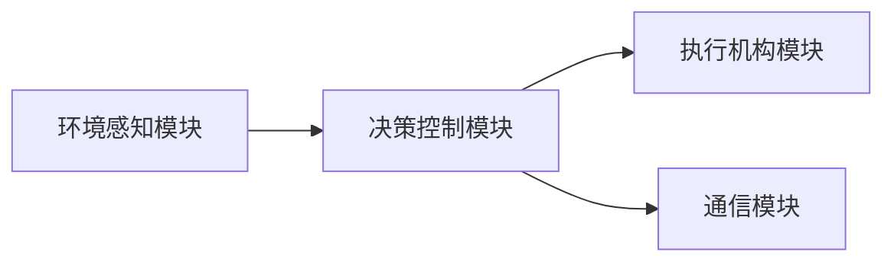
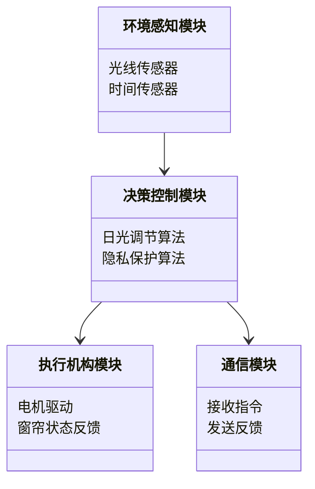

                 


---

# AI Agent在智能窗帘中的日光与隐私平衡

> 关键词：AI Agent, 智能窗帘, 日光调节, 隐私保护, 物联网, 人工智能, 窗帘控制系统

> 摘要：  
本文探讨了AI Agent在智能窗帘中的应用，重点分析了如何在日光调节和隐私保护之间实现平衡。通过介绍AI Agent的基本原理、日光调节算法的设计、隐私保护技术的实现，以及系统架构的设计，本文详细阐述了AI Agent在智能窗帘中的核心作用，并通过实际案例展示了如何在实际场景中实现日光与隐私的动态平衡。文章还提供了数学模型、算法流程图和代码示例，帮助读者深入理解技术实现。

---

# 第一部分: AI Agent与智能窗帘概述

## 第1章: AI Agent与智能窗帘概述

### 1.1 AI Agent的基本概念

AI Agent（智能代理）是一种能够感知环境、自主决策并执行任务的智能系统。在智能窗帘中，AI Agent负责接收环境数据（如光线强度、温度、时间等），分析用户需求，并通过执行机构（如电机驱动）调节窗帘的开合状态。

#### AI Agent的特点：
- **自主性**：能够自主决策和执行任务。
- **反应性**：能够实时感知环境变化并做出响应。
- **学习能力**：通过机器学习不断优化决策模型。
- **隐私保护**：确保数据采集和处理过程中的隐私安全。

### 1.2 智能窗帘的技术特点

智能窗帘是一种结合物联网和人工智能技术的智能家居设备。其核心组成包括：
- **环境传感器**：用于采集光线强度、温度、湿度等环境数据。
- **执行机构**：如电机驱动系统，用于调节窗帘的开合。
- **通信模块**：支持Wi-Fi或蓝牙通信，与智能家居系统联动。
- **用户交互界面**：包括手机APP或语音助手（如Alexa、Google Home）。

### 1.3 日光与隐私平衡的核心问题

在智能窗帘中，AI Agent需要在以下几个方面实现平衡：
1. **日光调节**：根据光线强度和时间智能调节窗帘开合，优化室内光线。
2. **隐私保护**：防止未经授权的用户或系统访问隐私数据。
3. **用户需求**：根据用户的偏好（如隐私优先或光照优先）动态调整策略。

---

## 第2章: AI Agent的核心技术与原理

### 2.1 AI Agent的感知能力

AI Agent通过多种传感器和数据源感知环境信息：
- **光线传感器**：实时监测室内光线强度。
- **时间传感器**：通过时间信息判断日出日落规律。
- **用户行为传感器**：分析用户的日常习惯，如起床时间、睡眠时间等。

### 2.2 AI Agent的决策算法

AI Agent的决策算法分为以下几类：
1. **基于规则的决策算法**：根据预设规则（如“光照强度低于50 lux时关闭窗帘”）进行决策。
2. **基于机器学习的决策算法**：通过训练数据优化决策模型，例如使用回归算法预测最佳窗帘开合角度。
3. **基于强化学习的决策算法**：通过奖励机制优化决策策略，例如在隐私保护和日光调节之间找到平衡点。

### 2.3 AI Agent的执行机制

AI Agent通过以下步骤实现对智能窗帘的控制：
1. **接收环境数据**：采集光线强度、时间、用户行为等数据。
2. **决策计算**：根据数据计算最佳窗帘开合角度或状态。
3. **执行指令**：通过通信模块发送指令到执行机构，驱动窗帘动作。

---

## 第3章: 日光调节算法的设计与实现

### 3.1 日光调节的核心算法

日光调节算法的目标是在不同时间段动态调整窗帘开合状态，以优化室内光线。以下是算法的数学模型：

$$
\text{光照强度} = \text{室外光照强度} \times \text{窗帘开合角度} \times \text{环境因子}
$$

其中，环境因子包括室内反射光、天气状况等。

#### 算法实现步骤：
1. 采集室外光照强度。
2. 根据当前时间计算日出日落时间。
3. 调整窗帘开合角度，优化室内光照强度。

### 3.2 算法的优化与实现

为了实现动态调节，AI Agent可以根据用户偏好和环境变化调整算法参数。以下是基于时间的自适应调节算法：

$$
\text{窗帘开合角度} = \text{基准角度} + \text{偏移量}
$$

偏移量根据光照强度和用户偏好动态调整。

---

## 第4章: 隐私保护的实现

### 4.1 隐私保护的核心技术

AI Agent在处理用户数据时，需要采取以下隐私保护措施：
1. **数据加密**：对采集的用户数据进行加密处理。
2. **匿名化处理**：去除用户数据中的敏感信息。
3. **访问控制**：限制未经授权的用户或系统访问隐私数据。

### 4.2 隐私保护的数学模型

隐私保护模型可以通过访问控制矩阵表示：

$$
\text{访问权限} = \text{用户角色} \times \text{数据类型}
$$

---

## 第5章: 系统架构与设计

### 5.1 系统架构设计

智能窗帘系统的架构包括以下模块：
1. **环境感知模块**：负责采集环境数据。
2. **决策控制模块**：负责数据分析和决策。
3. **执行机构模块**：负责执行窗帘开合指令。
4. **通信模块**：负责与智能家居系统联动。

以下是系统架构的Mermaid图：



### 5.2 系统功能设计

以下是系统功能的Mermaid类图：



---

## 第6章: 项目实战与案例分析

### 6.1 项目环境搭建

需要以下工具和库：
- **Python**：用于算法实现。
- **Raspberry Pi**：用于硬件控制。
- **OpenCV**：用于图像处理。
- ** MQTT**：用于设备间通信。

### 6.2 核心代码实现

以下是AI Agent的核心代码示例：

```python
import time
import math

class AIAgent:
    def __init__(self):
        self.brightness = 0
        self.time = 0

    def get_brightness(self):
        # 读取光线传感器数据
        return self.brightness

    def get_time(self):
        # 读取时间数据
        return self.time

    def calculate_window_angle(self, target_brightness):
        # 计算窗帘开合角度
        angle = math.sqrt(target_brightness)
        return angle

    def execute_action(self, angle):
        # 执行窗帘开合动作
        print(f"窗帘开合角度：{angle} 度")
        
agent = AIAgent()
target_brightness = 50  # 目标光照强度
angle = agent.calculate_window_angle(target_brightness)
agent.execute_action(angle)
```

### 6.3 项目测试与优化

测试步骤：
1. 搭建智能窗帘硬件系统。
2. 运行AI Agent算法代码。
3. 调整光照强度，观察窗帘开合状态。

优化建议：
- 根据实际环境数据优化算法模型。
- 增加异常处理机制，防止系统崩溃。

---

## 第7章: 总结与展望

### 7.1 项目总结

本文详细探讨了AI Agent在智能窗帘中的应用，重点分析了日光调节和隐私保护的核心技术。通过算法设计、系统架构和项目实战，展示了如何在智能窗帘中实现日光与隐私的动态平衡。

### 7.2 未来展望

随着人工智能和物联网技术的不断发展，智能窗帘系统将更加智能化和个性化。未来的研究方向包括：
1. 基于深度学习的隐私保护算法。
2. 多设备协同的日光调节优化。
3. 用户行为预测与自适应窗帘控制。

---

## 作者：AI天才研究院 & 禅与计算机程序设计艺术

--- 

以上是完整的《AI Agent在智能窗帘中的日光与隐私平衡》技术博客文章。

