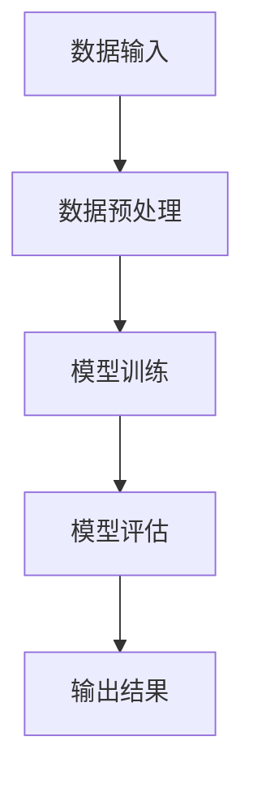
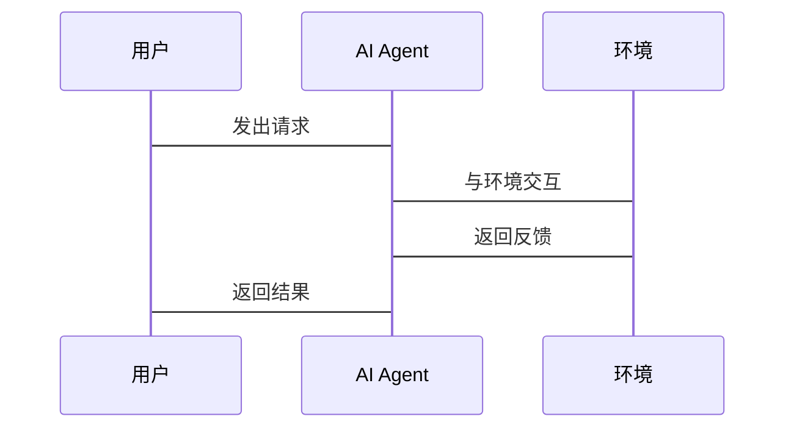

                 


# AI Agent的价值对齐：在LLM中植入人类价值观

**关键词**：AI Agent，价值对齐，LLM，人类价值观，人工智能伦理，大语言模型

**摘要**：  
随着大语言模型（LLM）的快速发展，AI Agent在各个领域的应用越来越广泛。然而，如何确保AI Agent的行为与人类价值观一致，即“价值对齐”，成为一个关键问题。本文将深入探讨AI Agent的价值对齐问题，分析其在LLM中的实现方法，并通过具体案例和算法实现，详细阐述如何在LLM中植入人类价值观，确保AI系统的行为符合人类的伦理和道德标准。

---

## 第一部分：AI Agent价值对齐的背景与核心概念

### 第1章：AI Agent价值对齐的背景与问题描述

#### 1.1 AI Agent与LLM的基本概念
- **AI Agent**：智能体，能够感知环境并采取行动以实现目标的实体。  
- **LLM（Large Language Model）**：大语言模型，基于深度学习的自然语言处理模型，如GPT系列。

#### 1.2 价值对齐的定义与重要性
- **价值对齐**：确保AI Agent的行为与人类价值观一致。  
- **重要性**：避免AI系统产生不符合人类伦理的行为，提升用户体验和信任度。

#### 1.3 当前挑战与解决思路
- **挑战**：人类价值观的多样性和动态变化；AI系统的复杂性。  
- **解决思路**：通过监督学习、强化学习和生成式方法，将人类价值观融入AI系统。

### 第2章：价值对齐的核心概念与理论基础

#### 2.1 人类价值观的建模
- **价值观的分类**：分为短期和长期目标，涉及伦理、法律和道德。  
- **建模方法**：通过规则、强化学习和生成模型捕捉人类价值观。

#### 2.2 价值对齐的实现机制
- **监督学习**：通过人工标注数据训练模型识别价值观。  
- **强化学习**：通过奖励机制引导模型学习人类价值观。  
- **生成式方法**：利用生成模型模拟人类决策过程。

#### 2.3 价值对齐的理论框架
- **对齐损失函数**：衡量AI行为与人类价值观的偏离程度。  
- **优化目标**：通过损失函数最小化实现价值对齐。

---

## 第二部分：AI Agent价值对齐的算法原理与实现

### 第3章：价值对齐的算法原理

#### 3.1 监督学习方法
- **实现步骤**：数据预处理、特征提取、模型训练。  
- **数学模型**：定义对齐损失函数，如交叉熵损失。  
  $$L = -\sum_{i=1}^{n} y_i \log(p_i)$$  
  其中，$y_i$是真实标签，$p_i$是模型预测概率。

#### 3.2 强化学习方法
- **算法流程**：通过环境反馈优化策略。  
- **数学模型**：定义奖励函数，如$$r(s, a) = 1 \text{ 如果 } a \text{ 符合人类价值观}$$

#### 3.3 生成式方法
- **实现步骤**：利用生成模型模拟人类决策。  
- **数学模型**：定义生成概率分布，如$$p(a|s) = \text{生成模型预测的概率}$$

### 第4章：价值对齐的系统架构设计

#### 4.1 系统架构概述
- **模块划分**：数据处理、模型训练、评估模块。  
- **交互流程**：数据输入→预处理→模型训练→评估输出。

#### 4.2 系统架构图


#### 4.3 系统交互流程


---

## 第三部分：AI Agent价值对齐的项目实战与案例分析

### 第5章：项目实战与案例分析

#### 5.1 环境安装与工具配置
- **开发环境**：Python 3.8+，安装库如TensorFlow、PyTorch。  
- **代码示例**：
  ```python
  import tensorflow as tf
  model = tf.keras.Sequential([
      tf.keras.layers.Dense(64, activation='relu'),
      tf.keras.layers.Dense(1, activation='sigmoid')
  ])
  model.compile(optimizer='adam', loss='binary_crossentropy')
  ```

#### 5.2 核心代码实现
- **数据预处理**：将人类价值观转化为标签。  
- **模型训练**：使用对齐损失函数优化模型参数。

#### 5.3 案例分析
- **案例一**：训练AI Agent在客服场景中对齐人类价值观。  
- **案例二**：在医疗领域确保AI诊断符合伦理标准。

---

## 第四部分：总结与展望

### 6.1 总结
- 价值对齐是确保AI系统可靠性的关键。  
- 通过监督学习、强化学习和生成式方法实现。

### 6.2 展望
- 进一步研究动态价值观的捕捉方法。  
- 探讨多模态模型在价值对齐中的应用。

---

**作者：AI天才研究院 & 禅与计算机程序设计艺术**

---

这篇文章系统地介绍了AI Agent价值对齐的背景、核心概念、算法原理和实现方法，并通过具体案例展示了如何在LLM中植入人类价值观。希望对读者理解价值对齐问题有所帮助。

