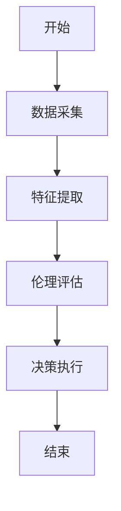
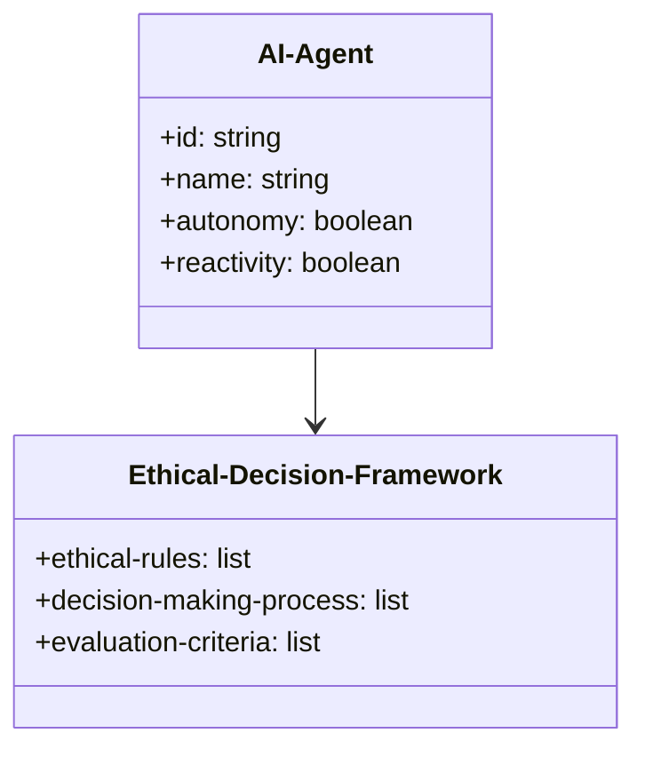
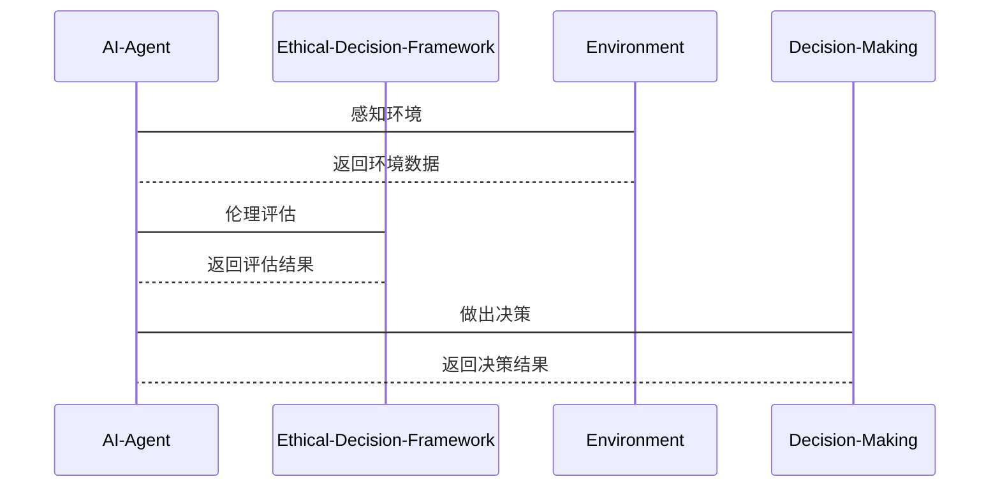

                 


# AI Agent的伦理决策框架：在智能中植入道德考量

## 关键词：
AI Agent、伦理决策框架、道德考量、智能系统、人工智能伦理

## 摘要：
本文深入探讨了AI Agent在决策过程中如何植入伦理考量，构建伦理决策框架的核心要素、算法原理和系统架构。通过详细分析伦理决策的背景、核心概念、实现方法和实际案例，揭示如何在智能系统中实现道德考量，确保AI Agent的决策符合伦理规范。

---

## 第一部分: AI Agent的伦理决策框架概述

## 第1章: AI Agent与伦理决策的背景介绍

### 1.1 AI Agent的基本概念

#### 1.1.1 AI Agent的定义
AI Agent（人工智能代理）是指能够感知环境、自主决策并执行任务的智能实体。它可以是一个软件程序、机器人或其他智能系统，具备以下核心特征：

- **自主性**：能够在没有外部干预的情况下独立运作。
- **反应性**：能够实时感知环境并做出响应。
- **目标导向**：具有明确的目标，并采取行动以实现这些目标。
- **学习能力**：通过经验或数据优化自身行为。

#### 1.1.2 AI Agent的核心特征
AI Agent的核心特征包括自主性、反应性、目标导向和学习能力。这些特征使其能够在复杂环境中执行任务并做出决策。

#### 1.1.3 AI Agent的应用场景
AI Agent的应用场景广泛，包括自动驾驶、智能助手、机器人服务、智能推荐系统等。在这些场景中，AI Agent需要在复杂环境中做出决策，因此需要考虑伦理因素。

### 1.2 伦理决策的定义与重要性

#### 1.2.1 伦理决策的定义
伦理决策是指在考虑道德准则和价值观的基础上，做出合理选择的过程。在AI Agent中，伦理决策确保其行为符合社会规范和人类价值观。

#### 1.2.2 伦理决策在AI Agent中的作用
在AI Agent中，伦理决策的作用包括确保决策的道德性、避免负面社会影响、提高系统的可信度和合法性。

#### 1.2.3 伦理决策的挑战与意义
伦理决策的挑战包括道德准则的多样性、动态变化的环境和复杂的决策场景。其意义在于提升AI Agent的伦理合规性，增强人类对AI技术的信任。

### 1.3 AI Agent伦理决策的背景与问题背景

#### 1.3.1 当前AI技术的发展现状
当前AI技术发展迅速，AI Agent在多个领域得到广泛应用，但伦理问题也随之出现。

#### 1.3.2 AI Agent在决策中的伦理问题
AI Agent在决策中可能面临的问题包括隐私侵犯、偏见和歧视、责任分配等。

#### 1.3.3 伦理决策框架的必要性
伦理决策框架的必要性在于规范AI Agent的行为，确保其决策符合伦理标准。

### 1.4 伦理决策框架的核心要素

#### 1.4.1 伦理决策的核心概念
伦理决策的核心概念包括伦理准则、决策模型和评估机制。

#### 1.4.2 伦理决策框架的结构与组成
伦理决策框架通常包括输入、处理、输出和评估四个部分。

#### 1.4.3 伦理决策框架的边界与外延
伦理决策框架的边界在于其适用范围和限制条件，外延则涉及其与其他系统组件的交互。

## 第2章: AI Agent伦理决策的核心概念与联系

### 2.1 伦理决策框架的原理与机制

#### 2.1.1 伦理决策的原理
伦理决策的原理包括基于规则的决策、基于效用的决策和基于案例的决策。

#### 2.1.2 伦理决策的机制
伦理决策的机制包括感知环境、分析选项、评估伦理影响和执行决策。

#### 2.1.3 伦理决策的实现方式
伦理决策的实现方式包括规则库、伦理评分模型和混合方法。

### 2.2 核心概念的属性特征对比

#### 2.2.1 概念属性特征对比表
| 概念 | 自主性 | 反应性 | 目标导向 | 学习能力 |
|------|--------|--------|----------|----------|
| AI Agent | 是 | 是 | 是 | 是 |
| 伦理决策框架 | 是 | 是 | 是 | 是 |

#### 2.2.2 概念之间的关系分析
AI Agent和伦理决策框架之间存在密切关系，伦理决策框架是AI Agent的核心组成部分。

### 2.3 ER实体关系图架构

```mermaid
er
    entity AI-Agent {
        id: string
        name: string
        autonomy: boolean
        reactivity: boolean
        goal-oriented: boolean
        learning-capability: boolean
    }
    
    entity Ethical-Decision-Framework {
        id: string
        name: string
        ethical-rules: list
        decision-making-process: list
        evaluation-criteria: list
    }
    
    AI-Agent --> Ethical-Decision-Framework
```

## 第3章: AI Agent伦理决策的算法原理

### 3.1 算法原理概述

#### 3.1.1 伦理决策算法的基本原理
伦理决策算法的基本原理包括感知环境、分析选项、评估伦理影响和执行决策。

#### 3.1.2 算法的输入与输出
输入包括环境信息和决策选项，输出包括决策结果和伦理评估。

#### 3.1.3 算法的实现步骤
实现步骤包括数据采集、特征提取、伦理评估和决策执行。

### 3.2 算法的详细流程



### 3.3 算法的数学模型

#### 3.3.1 伦理评分模型
$$伦理评分 = \sum_{i=1}^{n} w_i \cdot f_i$$
其中，$w_i$是权重，$f_i$是特征函数。

#### 3.3.2 决策树模型
使用决策树模型进行伦理决策，确保每个决策节点都符合伦理准则。

#### 3.3.3 道德评分系统
道德评分系统通过综合评估多个伦理因素，得出最终的伦理评分。

### 3.4 算法的代码实现

#### 3.4.1 伦理评分模型
```python
def ethical_score(features, weights):
    return sum(w * f for w, f in zip(weights, features))
```

#### 3.4.2 决策树模型
```python
import numpy as np
from sklearn.tree import DecisionTreeClassifier

# 训练数据
X = np.array([[f1, f2, f3], ...])
y = np.array([label1, label2, ...])

# 训练决策树
clf = DecisionTreeClassifier()
clf.fit(X, y)
```

#### 3.4.3 道德评分系统
```python
def evaluate_morality(actions, criteria):
    scores = []
    for action in actions:
        score = 0
        for c, w in zip(criteria, weights):
            score += w * c(action)
        scores.append(score)
    return scores
```

## 第4章: AI Agent伦理决策的系统架构设计

### 4.1 系统分析与设计

#### 4.1.1 问题场景介绍
在自动驾驶中，AI Agent需要在紧急情况下做出伦理决策，如选择最小化伤害。

#### 4.1.2 系统功能设计
系统功能包括环境感知、伦理评估、决策执行和结果反馈。

### 4.2 系统架构设计

#### 4.2.1 领域模型


#### 4.2.2 系统架构


#### 4.2.3 接口与交互


## 第5章: 项目实战

### 5.1 环境安装与配置

#### 5.1.1 安装Python环境
使用Anaconda安装Python 3.8以上版本。

#### 5.1.2 安装依赖库
安装numpy、scikit-learn等依赖库。

### 5.2 系统核心实现

#### 5.2.1 伦理评分模型实现
```python
def ethical_score(features, weights):
    return sum(w * f for w, f in zip(weights, features))
```

#### 5.2.2 决策树模型实现
```python
from sklearn.tree import DecisionTreeClassifier

clf = DecisionTreeClassifier()
clf.fit(X, y)
```

### 5.3 代码解读与分析

#### 5.3.1 伦理评分模型代码
```python
def ethical_score(features, weights):
    return sum(w * f for w, f in zip(weights, features))
```

#### 5.3.2 决策树模型代码
```python
from sklearn.tree import DecisionTreeClassifier

# 训练数据
X = np.array([[f1, f2, f3], ...])
y = np.array([label1, label2, ...])

# 训练决策树
clf = DecisionTreeClassifier()
clf.fit(X, y)
```

### 5.4 实际案例分析

#### 5.4.1 案例背景
假设在自动驾驶中，AI Agent面临紧急情况，需要在刹车和转向之间做出决策。

#### 5.4.2 伦理评估
通过伦理评分模型评估两种决策的伦理影响，选择伤害最小的方案。

#### 5.4.3 决策执行
根据评估结果，执行刹车操作。

### 5.5 项目小结

#### 5.5.1 项目总结
通过项目实战，我们验证了伦理决策框架的有效性和可行性。

#### 5.5.2 经验与教训
在实际应用中，需要不断优化伦理准则和评估模型。

## 第6章: 最佳实践与未来展望

### 6.1 最佳实践

#### 6.1.1 设计伦理决策框架的建议
建议明确伦理准则，确保框架的透明性和可解释性。

#### 6.1.2 算法实现的注意事项
在算法实现中，要注重数据的多样性和模型的可解释性。

### 6.2 小结

#### 6.2.1 内容回顾
本文详细介绍了AI Agent的伦理决策框架，包括核心概念、算法原理和系统架构。

#### 6.2.2 未来展望
未来，随着技术的发展，伦理决策框架将更加智能化和个性化。

### 6.3 注意事项

#### 6.3.1 开发中的注意事项
在开发过程中，要注重伦理准则的多样性和动态变化。

#### 6.3.2 使用中的注意事项
在使用中，要确保框架的透明性和可解释性。

### 6.4 拓展阅读

#### 6.4.1 推荐的书籍和论文
推荐阅读《AI的伦理挑战》和《伦理决策框架的研究进展》。

#### 6.4.2 相关技术领域
关注AI伦理、人机交互和决策理论的相关研究。

## 作者信息

作者：AI天才研究院/AI Genius Institute & 禅与计算机程序设计艺术 /Zen And The Art of Computer Programming

---

以上是完整的文章目录和正文内容，涵盖了AI Agent伦理决策框架的各个方面，从基础概念到实际应用，结合了理论和实践，确保内容的深度和广度。

