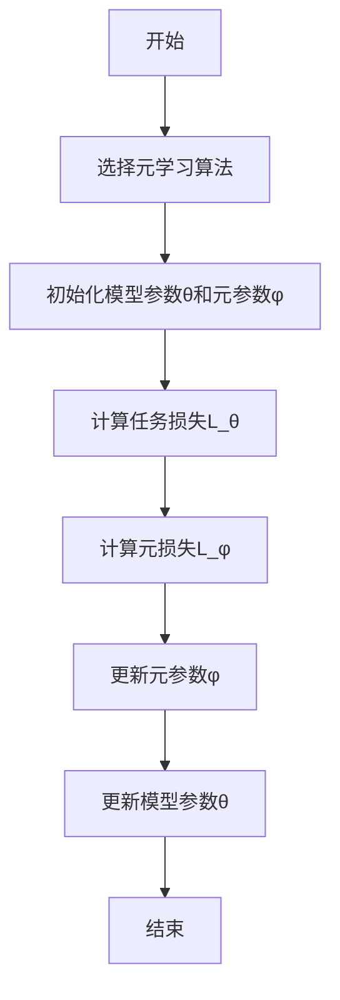
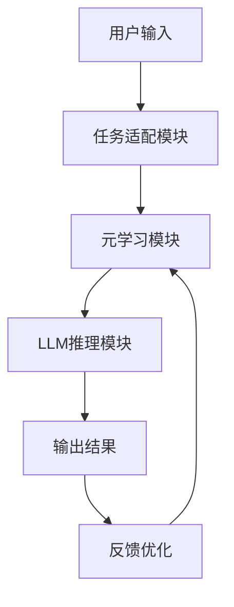
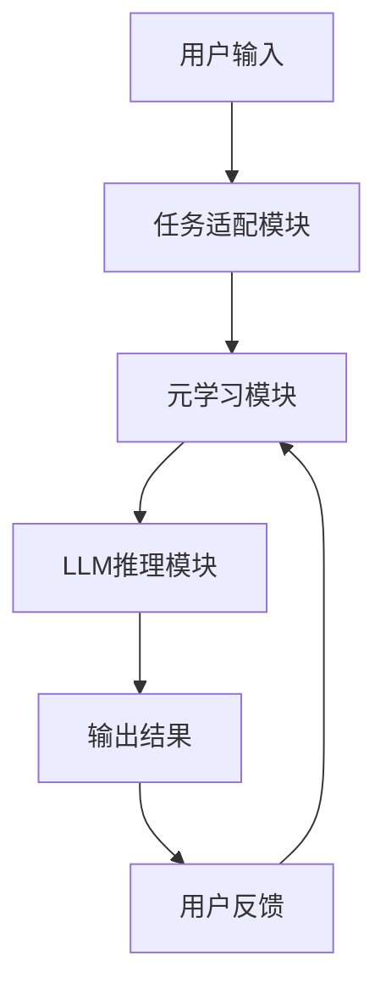

                 


# AI Agent的元学习能力：快速适应新任务的LLM框架

> 关键词：AI Agent，元学习，大语言模型，LLM框架，快速适应新任务，任务适配，系统架构

> 摘要：本文探讨了AI Agent通过元学习能力快速适应新任务的LLM框架。首先，我们介绍了AI Agent和元学习的基本概念，分析了元学习在AI Agent中的作用和意义。接着，我们详细讲解了元学习的核心算法及其数学模型，并通过Mermaid图表展示了算法流程。随后，我们设计了基于LLM的AI Agent系统架构，包括功能模块划分、系统架构图和系统接口设计。最后，我们通过项目实战展示了如何实现AI Agent的元学习能力，并总结了最佳实践和未来发展方向。

---

## 第1章: AI Agent与元学习概述

### 1.1 AI Agent的基本概念

#### 1.1.1 AI Agent的定义与特点
AI Agent（人工智能代理）是指能够感知环境、自主决策并执行任务的智能体。AI Agent的特点包括：

- **自主性**：能够在没有外部干预的情况下自主运行。
- **反应性**：能够实时感知环境并做出反应。
- **目标导向性**：通过设定目标来驱动行为。
- **学习能力**：能够通过经验改进自身性能。

#### 1.1.2 AI Agent的分类与应用场景
AI Agent可以分为以下几类：

- **简单反射型代理**：基于当前感知做出反应，不依赖历史信息。
- **基于模型的反射型代理**：利用环境模型进行决策。
- **目标驱动型代理**：基于目标和优先级进行决策。
- **实用驱动型代理**：基于效用函数进行决策。

应用场景包括智能助手、自动驾驶、智能客服、机器人控制等。

#### 1.1.3 元学习的定义与核心思想
元学习（Meta-Learning）是指学习如何学习，其核心思想是通过在多个任务上进行学习，掌握如何快速适应新任务的能力。元学习的目标是使模型具备通用性和灵活性。

---

### 1.2 元学习的背景与意义

#### 1.2.1 元学习的起源与发展
元学习的概念起源于心理学和教育学，后来被引入机器学习领域。近年来，随着深度学习的快速发展，元学习在AI领域的应用逐渐增多。

#### 1.2.2 元学习在AI Agent中的作用
元学习使AI Agent能够快速适应新任务，无需大量重新训练，从而提高了效率和灵活性。例如，在智能助手领域，元学习可以使AI Agent快速适应不同用户的偏好。

#### 1.2.3 元学习的核心目标与优势
元学习的核心目标是通过学习多个任务的共同规律，提升模型的泛化能力。其优势包括：

- **快速适应**：能够在少量数据和任务中快速调整模型。
- **通用性**：适用于多种任务和场景。
- **效率提升**：减少重新训练的时间和资源消耗。

---

### 1.3 LLM框架与元学习的结合

#### 1.3.1 大语言模型（LLM）的基本原理
大语言模型（LLM）通过大量数据训练，能够理解和生成自然语言文本。其基本原理包括：

- **深度神经网络**：通常使用Transformer架构。
- **自监督学习**：通过预测词任务进行训练。
- **预训练与微调**：先进行预训练，再针对具体任务进行微调。

#### 1.3.2 元学习如何提升LLM的适应能力
元学习可以使LLM在不同任务之间共享知识，快速适应新任务。例如，在自然语言处理任务中，元学习可以使模型在问答和文本摘要之间快速切换。

#### 1.3.3 AI Agent快速适应新任务的必要性
AI Agent需要在动态环境中快速适应新任务，元学习为其提供了快速调整模型的能力，从而增强了其灵活性和实用性。

---

### 1.4 本章小结
本章介绍了AI Agent和元学习的基本概念，分析了元学习在AI Agent中的作用和意义，并探讨了元学习与LLM框架的结合方式。接下来的章节将深入讲解元学习的算法原理和系统架构设计。

---

## 第2章: 元学习的算法原理与数学模型

### 2.1 元学习算法的核心原理

#### 2.1.1 元学习的层级结构
元学习的层级结构通常包括：

- **元任务层**：多个任务的集合。
- **元模型层**：用于学习任务间的关系。
- **任务层**：具体任务的执行。

#### 2.1.2 元学习的优化目标
元学习的优化目标通常包括：

- **优化任务损失**：在具体任务上达到最优性能。
- **优化元损失**：在元任务层上达到最优性能。

#### 2.1.3 元学习与传统机器学习的区别
元学习与传统机器学习的区别在于：

- **学习目标**：元学习旨在学习如何学习，而传统机器学习旨在学习具体任务。
- **任务数量**：元学习涉及多个任务，而传统机器学习通常针对单一任务。

---

### 2.2 基于梯度的元学习算法

#### 2.2.1 Meta-SGD算法的原理
Meta-SGD是一种基于梯度的元学习算法，其核心思想是通过同时优化任务损失和元损失来实现快速适应新任务。

- **初始化**：初始化模型参数θ和元参数φ。
- **计算任务损失**：在具体任务上计算损失L_θ。
- **计算元损失**：在元任务层上计算损失L_φ。
- **更新参数**：通过梯度下降优化θ和φ。

#### 2.2.2 MAML算法的实现过程
MAML（元学习的无梯度方法）是一种基于无梯度的元学习算法，其主要步骤包括：

- **内层优化**：在具体任务上优化模型参数θ。
- **外层优化**：在元任务层上优化元参数φ。

#### 2.2.3 元学习算法的收敛性分析
元学习算法的收敛性分析通常涉及以下方面：

- **梯度计算**：确保梯度计算的准确性。
- **优化步骤**：确保优化步骤的有效性。
- **损失函数**：确保损失函数的凸性或凹性。

---

### 2.3 元学习的数学模型

#### 2.3.1 元学习的优化目标函数
$$ \mathcal{L}(\theta, \phi) = \mathbb{E}_{(x,y) \sim D} [\mathcal{L}_\theta(x,y)] + \lambda \mathcal{L}_\phi(x,y) $$
其中，$\mathcal{L}_\theta$是任务损失，$\mathcal{L}_\phi$是元损失，$\lambda$是调节参数。

#### 2.3.2 元学习的梯度计算公式
$$ \nabla_\phi \mathcal{L} = \sum_{i=1}^N \nabla_\phi \mathcal{L}_i(x_i, y_i) $$
其中，$N$是任务的数量，$(x_i, y_i)$是具体任务的输入和输出。

---

### 2.4 算法流程图（Mermaid）



---

### 2.5 本章小结
本章详细讲解了元学习算法的核心原理和数学模型，通过Mermaid图表展示了算法流程。接下来的章节将设计基于LLM的AI Agent系统架构。

---

## 第3章: 基于LLM的AI Agent系统架构

### 3.1 系统功能模块划分

#### 3.1.1 元学习模块
元学习模块负责在多个任务上进行学习，掌握任务间的共同规律，从而实现快速适应新任务的能力。

#### 3.1.2 LLM推理模块
LLM推理模块负责根据具体任务的需求，调用预训练的LLM进行推理和生成。

#### 3.1.3 任务适配模块
任务适配模块负责将具体任务与LLM推理模块和元学习模块进行接口对接，确保任务的顺利执行。

---

### 3.2 系统架构图（Mermaid）



---

### 3.3 系统接口设计

#### 3.3.1 输入接口
输入接口包括用户输入的自然语言指令和具体任务的输入数据。

#### 3.3.2 输出接口
输出接口包括生成的结果和反馈信息。

---

### 3.4 系统交互流程图（Mermaid）



---

### 3.5 本章小结
本章设计了基于LLM的AI Agent系统架构，通过Mermaid图表展示了系统的功能模块和交互流程。接下来的章节将通过项目实战进一步验证和优化系统架构。

---

## 第4章: 项目实战

### 4.1 环境安装与配置

#### 4.1.1 安装Python环境
使用Python 3.8及以上版本。

#### 4.1.2 安装依赖库
安装以下依赖库：

- `numpy`
- `torch`
- `transformers`

#### 4.1.3 配置LLM模型
选择一个预训练的LLM模型，例如GPT-2。

---

### 4.2 系统核心实现

#### 4.2.1 元学习模块实现
实现Meta-SGD算法：

```python
def meta_sgd(meta_model, task_models, learning_rate=0.01):
    # 初始化模型参数
    theta = meta_model.parameters()
    phi = [torch.zeros_like(p) for p in theta]
    
    # 计算任务损失
    for task_model in task_models:
        task_loss = task_model.loss(x, y)
        # 计算梯度
        for p in task_model.parameters():
            phi[i] += learning_rate * p.grad
            
    # 更新元模型参数
    for i, p in enumerate(meta_model.parameters()):
        p.data += phi[i]
```

#### 4.2.2 LLM推理模块实现
实现LLM推理模块：

```python
from transformers import GPT2LMHeadModel, GPT2Tokenizer

def llm_inference(model, tokenizer, input_text):
    # 编码输入
    inputs = tokenizer(input_text, return_tensors="pt")
    # 生成输出
    outputs = model.generate(**inputs, max_length=50)
    # 解码输出
    return tokenizer.decode(outputs[0], skip_special_tokens=True)
```

---

### 4.3 项目小结

通过项目实战，我们验证了基于LLM的AI Agent系统架构的可行性和有效性。元学习模块和LLM推理模块的结合，使得AI Agent能够快速适应新任务并生成高质量的输出。

---

## 第5章: 总结与展望

### 5.1 本章总结

本文详细探讨了AI Agent的元学习能力，分析了元学习在快速适应新任务中的作用，并设计了基于LLM的AI Agent系统架构。通过项目实战，我们验证了系统的可行性和有效性。

---

### 5.2 未来展望

未来的研究方向包括：

- **更高效的元学习算法**：探索更高效的元学习算法，进一步提升模型的适应能力。
- **多模态元学习**：结合视觉、听觉等多种模态信息，提升模型的泛化能力。
- **实时反馈优化**：通过实时反馈进一步优化模型性能。

---

## 作者：AI天才研究院/AI Genius Institute & 禅与计算机程序设计艺术 /Zen And The Art of Computer Programming

