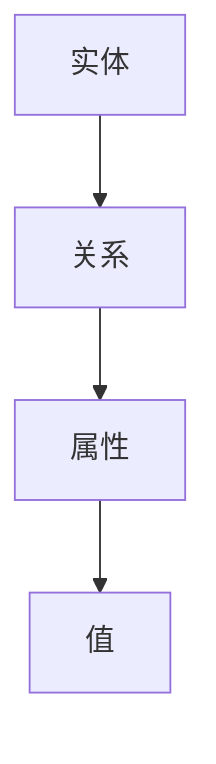
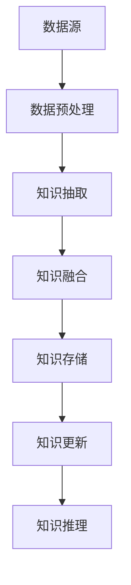

                 


# AI Agent的动态知识图谱构建与更新

> 关键词：知识图谱，AI Agent，动态更新，知识表示，智能推理

> 摘要：本文详细探讨了AI Agent动态知识图谱的构建与更新方法，从知识图谱的基本概念到动态更新的算法实现，再到系统的架构设计和实际应用案例，全面解析了动态知识图谱的核心技术与应用实践。

---

## 第一部分: AI Agent与知识图谱基础

### 第1章: 知识图谱概述

#### 1.1 知识图谱的定义与特点
知识图谱是一种以图结构形式表示知识的语义网络，节点表示实体或概念，边表示实体之间的关系。其特点包括：语义性、关联性、动态性和可扩展性。

#### 1.2 动态知识图谱的概念
动态知识图谱是在静态知识图谱的基础上，能够实时感知和响应数据变化的动态更新的知识网络。其核心在于知识的实时更新和维护。

---

### 第2章: AI Agent的基本概念

#### 2.1 AI Agent的定义与分类
AI Agent是一种具有感知环境、自主决策和执行任务能力的智能实体，分为简单反射型、基于模型的反射型、目标驱动型和效用驱动型。

#### 2.2 AI Agent的知识需求
AI Agent需要动态的知识图谱来支持其认知、推理和决策能力，包括知识表示、知识获取和知识更新。

---

### 第3章: 知识图谱构建的背景与挑战

#### 3.1 知识图谱构建的背景
大数据时代的知识管理需求推动了知识图谱的构建，AI Agent对动态知识的需求是其发展的主要驱动力。

#### 3.2 知识图谱构建的主要挑战
数据的多样性和异构性、动态知识的实时更新、知识图谱的可扩展性与性能优化是知识图谱构建的主要挑战。

---

### 第4章: 动态知识图谱的核心概念与联系

#### 4.1 知识图谱的核心概念
知识图谱的核心概念包括实体、关系、属性和值。通过这些概念的组合，构建出复杂的语义网络。

#### 4.2 动态知识图谱的实体关系图


#### 4.3 动态知识更新的流程


---

## 第二部分: 动态知识图谱的构建与更新算法

### 第5章: 知识图谱构建的算法原理

#### 5.1 知识抽取算法
知识抽取算法包括基于规则的抽取、基于机器学习的抽取和基于深度学习的抽取。其中，深度学习方法如BERT在实体识别中表现优异。

#### 5.2 知识融合算法
知识融合算法包括实体对齐、关系融合和属性融合。通过多源数据的融合，提升知识图谱的完整性和准确性。

#### 5.3 知识表示与推理算法
知识表示算法如向量表示和符号表示各有优劣。知识推理算法如路径推理和规则推理，支持复杂语义的推理需求。

---

### 第6章: 动态知识更新的算法实现

#### 6.1 动态知识更新的核心流程
动态知识更新包括数据变化检测、知识抽取、融合与校验、知识存储更新和推理。

#### 6.2 动态更新算法的实现
动态更新算法包括基于事件驱动的更新和基于时间戳的更新，通过增量式更新提升效率。

#### 6.3 知识一致性校验
通过冲突检测和一致性修复算法，确保动态更新后知识图谱的一致性和准确性。

---

## 第三部分: 系统分析与架构设计

### 第7章: 系统分析与架构设计

#### 7.1 问题场景介绍
动态知识图谱构建与更新系统需要支持多源异构数据的实时更新和高效查询。

#### 7.2 系统功能设计
系统功能包括数据接入、知识抽取、知识融合、知识存储、知识更新和知识推理。

#### 7.3 系统架构设计
系统架构采用微服务架构，包括数据处理服务、知识构建服务、知识更新服务和知识推理服务。

#### 7.4 系统接口设计
系统接口包括数据源接口、知识查询接口和知识更新接口。

---

## 第四部分: 项目实战

### 第8章: 动态知识图谱构建与更新的项目实战

#### 8.1 项目背景与目标
以电商推荐系统为例，构建动态知识图谱支持商品推荐和用户画像。

#### 8.2 系统核心实现
系统核心实现包括数据预处理、知识抽取、知识融合、知识存储和知识推理。

#### 8.3 代码实现与解读
```python
def knowledge_update():
    # 数据预处理
    data = preprocess()
    # 知识抽取
    entities = extract_entities(data)
    # 知识融合
    merged_knowledge = fuse_knowledge(entities)
    # 知识存储
    store_knowledge(merged_knowledge)
    return "知识更新完成"
```

---

## 第五部分: 最佳实践与总结

### 第9章: 最佳实践与总结

#### 9.1 小结
动态知识图谱的构建与更新是AI Agent实现智能化的关键技术，需要综合运用多种算法和系统设计方法。

#### 9.2 注意事项
在实际应用中，需要注意数据质量、知识表示的合理性以及系统的可扩展性。

#### 9.3 拓展阅读
建议深入学习知识图谱的标准和规范，关注最新的研究成果和工具。

---

## 作者：AI天才研究院/AI Genius Institute & 禅与计算机程序设计艺术 /Zen And The Art of Computer Programming

---

通过本文的详细讲解，读者可以全面掌握AI Agent动态知识图谱的构建与更新技术，从理论到实践，从算法到系统设计，为实际应用提供了丰富的参考和指导。

