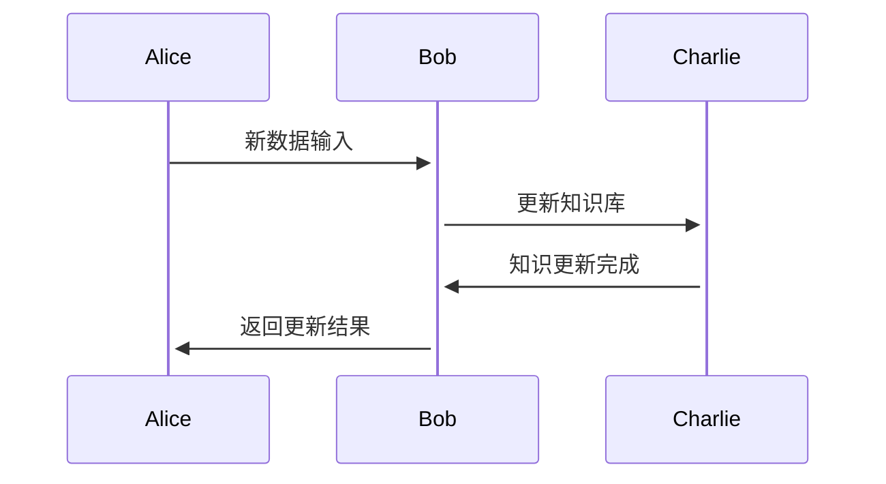

                 


# AI Agent的增量学习与知识更新机制

> 关键词：AI Agent, 增量学习, 知识更新机制, 在线学习, 终身学习

> 摘要：本文深入探讨了AI Agent的增量学习与知识更新机制，从理论基础到实际应用，系统分析了其核心概念、算法原理、系统架构、项目实现及最佳实践，为AI Agent的持续进化提供了全面的解决方案。

---

## 第一部分: AI Agent的背景与概念

### 第1章: AI Agent的基本概念

#### 1.1 AI Agent的定义
AI Agent（人工智能代理）是一种能够感知环境、自主决策并执行任务的智能实体。它可以是一个软件程序、机器人或其他智能系统，具备以下核心特征：

- **自主性**：无需外部干预，自主完成任务。
- **反应性**：能够实时感知环境并做出反应。
- **目标导向性**：基于目标驱动行为。
- **学习能力**：通过经验改进性能。

#### 1.2 增量学习的背景与意义
传统机器学习依赖于大量静态数据，难以适应动态变化的环境。增量学习通过实时更新模型，使AI Agent能够持续进化，适应新任务和新数据。

#### 1.3 知识更新机制的重要性
知识更新机制是AI Agent保持竞争力的关键。通过不断优化知识库，AI Agent能够提升准确性、效率和用户体验。

---

### 第2章: 增量学习与知识更新的核心概念

#### 2.1 增量学习的原理
增量学习是一种动态学习方法，特征如下：

- **在线性**：实时处理数据，无需存储全部历史数据。
- **高效性**：每次更新仅处理新数据，计算资源消耗低。
- **适应性**：能够快速适应新任务和数据变化。

#### 2.2 知识更新机制的实现方式
知识更新机制通过以下方式优化AI Agent的知识库：

- **在线更新**：实时更新模型参数，适应新数据。
- **基于规则的更新**：根据预定义规则筛选和更新知识。
- **基于反馈的更新**：根据用户反馈调整知识库。

---

### 第3章: 增量学习与知识更新的算法原理

#### 3.1 增量学习算法的分类
- **在线增量学习**：实时处理数据，适用于流数据场景。
- **离线增量学习**：批量处理数据，适用于周期性更新场景。
- **终身增量学习**：持续学习，适用于长期任务。

#### 3.2 知识更新机制的算法实现
- **知识表示**：使用向量或图结构表示知识。
- **更新规则**：定义知识更新的数学公式。
- **冲突处理**：处理新旧知识冲突，选择最优解。

---

### 第4章: 增量学习与知识更新的数学模型与公式

#### 4.1 增量学习的数学模型
增量学习的参数更新公式如下：
$$ \theta_{new} = \theta_{old} + \eta (y - \hat{y}) $$

其中，$\theta$ 表示模型参数，$\eta$ 表示学习率，$y$ 表示真实值，$\hat{y}$ 表示预测值。

#### 4.2 知识更新机制的数学模型
知识更新的相似度计算公式为：
$$ sim(s, s') = \frac{s \cdot s'}{||s|| \cdot ||s'||} $$

其中，$s$ 和 $s'$ 表示两个知识片段的向量表示。

---

### 第5章: 系统分析与架构设计

#### 5.1 问题场景介绍
AI Agent需要在动态环境中实时更新知识库，以应对新任务和数据变化。

#### 5.2 系统功能设计
- **知识库模块**：存储和管理知识片段。
- **学习引擎**：执行增量学习算法。
- **评估模块**：评估知识更新的效果。

#### 5.3 系统架构设计


#### 5.4 系统接口设计
- **输入接口**：接收新数据和用户反馈。
- **输出接口**：输出更新后的知识和决策结果。

#### 5.5 系统交互流程


---

### 第6章: 项目实战

#### 6.1 环境配置
- **编程语言**：Python 3.8+
- **框架**：TensorFlow 2.0+
- **工具库**：NumPy, Pandas

#### 6.2 核心代码实现
```python
def incremental_learning(new_data, model):
    # 更新模型参数
    model.fit(new_data)
    return model
```

#### 6.3 代码解读与分析
- **函数定义**：`incremental_learning` 函数接收新数据和模型，返回更新后的模型。
- **模型训练**：使用新数据实时更新模型参数。

#### 6.4 实际案例分析
以智能客服系统为例，通过增量学习优化回答准确性。

---

### 第7章: 最佳实践

#### 7.1 小结
增量学习和知识更新机制是AI Agent保持竞争力的关键。

#### 7.2 注意事项
- 定期评估知识更新效果。
- 处理知识冲突时选择最优解。
- 优化系统性能，减少计算开销。

#### 7.3 未来研究方向
- 更高效的知识更新算法。
- 多模态知识更新方法。
- 知识更新的可解释性研究。

---

## 作者

作者：AI天才研究院 & 禅与计算机程序设计艺术

---

通过以上结构和内容，您可以撰写一篇详尽的技术博客文章，涵盖AI Agent的增量学习与知识更新机制的各个方面。

