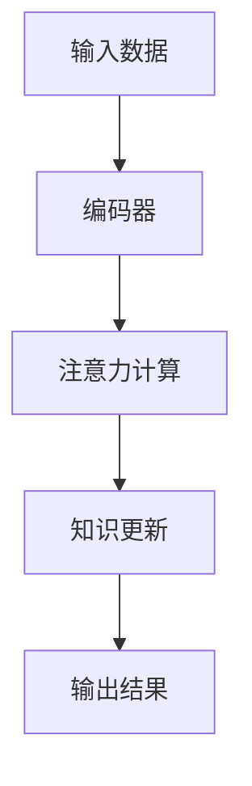
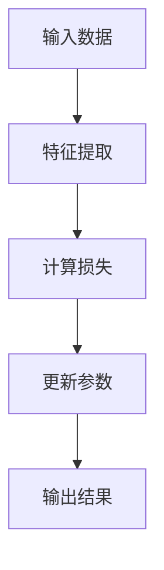
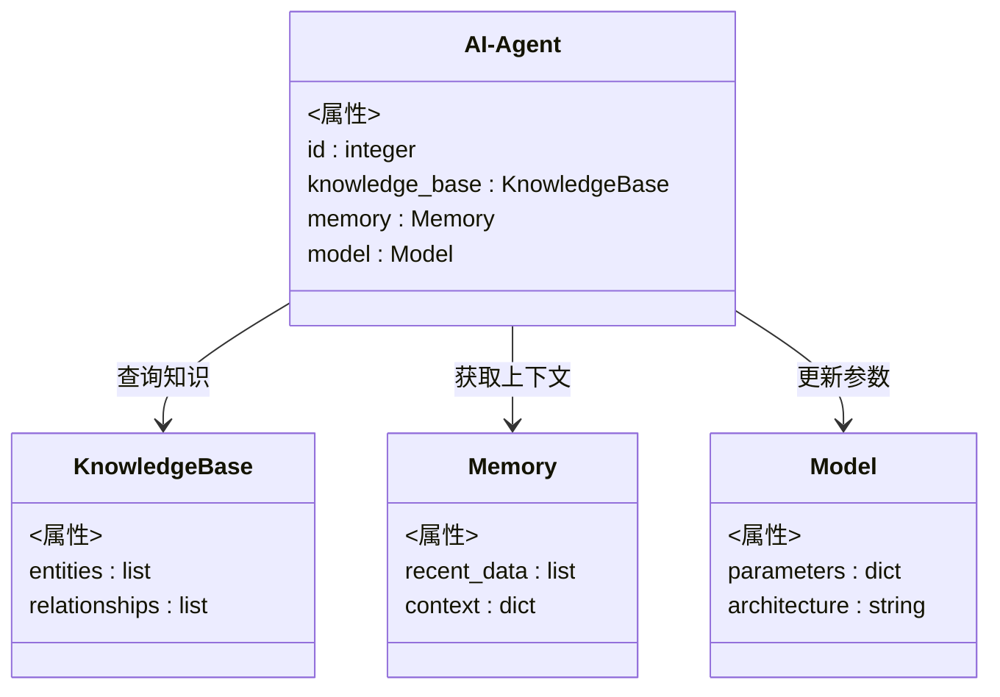
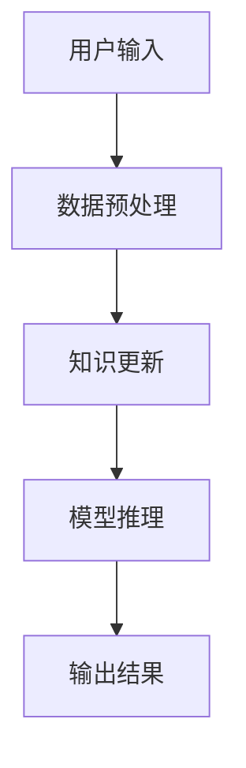
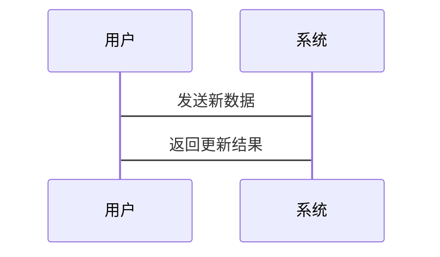

                 


# AI Agent的增量式表示学习与知识更新

> 关键词：AI Agent, 表示学习, 增量式学习, 知识更新, 算法原理, 系统架构, 项目实战

> 摘要：本文系统地探讨了AI Agent的增量式表示学习与知识更新这一前沿技术领域。首先，从AI Agent的基本概念出发，详细介绍了增量式表示学习的背景、意义及核心概念。接着，深入分析了增量式表示学习的数学模型与算法原理，重点阐述了序列到序列模型、注意力机制等关键技术，并通过具体代码实现和实例分析，帮助读者更好地理解和掌握相关知识。最后，结合实际应用场景，详细探讨了系统的架构设计与实现方案，并通过项目实战的方式，为读者提供了从理论到实践的完整指导。本文旨在为AI Agent领域的研究人员和开发者提供一份全面而深入的技术指南。

---

# 第1章: AI Agent与增量式表示学习概述

## 1.1 AI Agent的基本概念

### 1.1.1 AI Agent的定义与分类
AI Agent（人工智能代理）是指具有感知环境、自主决策和执行任务能力的智能实体。根据功能和应用场景的不同，AI Agent可以分为多种类型，例如：
- **反应式Agent**：基于当前环境输入做出实时反应。
- **认知式Agent**：具备复杂问题求解和知识推理能力。
- **学习式Agent**：能够通过经验或数据不断优化自身性能。

### 1.1.2 增量式学习的背景与意义
增量式学习是一种动态学习范式，其核心在于在新数据流或新任务的驱动下，逐步更新和优化已有模型或知识表示。与传统批量学习相比，增量式学习具有以下优势：
- **实时性**：能够快速响应新信息，适应动态环境。
- **高效性**：避免了批量学习中对全部数据一次性处理的高计算成本。
- **灵活性**：适用于数据分布变化或任务目标调整的场景。

### 1.1.3 表示学习的核心思想与特点
表示学习（Representation Learning）旨在通过低维向量或符号形式，对高维数据进行压缩和抽象。其核心思想是：
- **降维**：将复杂数据映射到低维空间。
- **语义保留**：确保降维后的表示能够保留原始数据的语义信息。
- **可解释性**：通过中间表示，增强模型的可解释性。

---

## 1.2 增量式表示学习的背景与问题背景

### 1.2.1 传统表示学习的局限性
传统表示学习方法通常依赖于静态数据集，在训练完成后不再支持新数据的更新。这种静态特性在以下场景中表现不佳：
- **动态环境**：环境或任务目标随时间变化。
- **在线学习**：需要实时处理流数据。
- **领域迁移**：需要适应不同领域或任务。

### 1.2.2 增量式表示学习的提出
为了解决上述问题，增量式表示学习应运而生。其核心思想是：
- **在线更新**：允许模型在接收到新数据时，逐步更新知识表示。
- **高效推理**：通过增量更新，保持模型的推理能力。

### 1.2.3 知识更新的必要性与挑战
知识更新的必要性体现在以下方面：
- **适应性**：模型需要适应新数据或任务的变化。
- **实时性**：在实时应用场景中，知识更新必须高效且稳定。
- **准确性**：增量更新过程中，需要确保知识的准确性不下降。

知识更新的挑战包括：
- **数据稀疏性**：新数据可能不足以覆盖所有可能的场景。
- **计算复杂度**：增量更新需要平衡效率与准确性的 trade-off。
- **模型稳定性**：频繁更新可能导致模型不稳定性。

---

## 1.3 增量式表示学习的核心概念与联系

### 1.3.1 核心概念原理
增量式表示学习的核心概念包括：
- **增量更新**：模型在接收到新数据时，逐步更新知识表示。
- **动态记忆**：通过动态机制管理知识的存储与检索。
- **注意力机制**：用于关注重要的新信息或数据特征。

### 1.3.2 概念属性特征对比表格
以下是一个概念对比表格，展示了增量式表示学习与传统表示学习的主要区别：

| **特性**         | **增量式表示学习** | **传统表示学习** |
|------------------|--------------------|------------------|
| **数据处理方式** | 流数据实时处理     | 批次数据处理     |
| **模型更新**     | 在线更新           | 离线更新         |
| **适应性**       | 高                 | 低               |
| **计算效率**     | 高                 | 低               |
| **应用场景**     | 动态环境           | 静态环境         |

### 1.3.3 ER实体关系图架构（Mermaid）

```mermaid
erDiagram
    customer[客户] {
        <属性>
        id : integer
        name : string
        email : string
    }
    order[订单] {
        <属性>
        id : integer
        customer_id : integer
        order_date : date
        total : float
    }
    product[产品] {
        <属性>
        id : integer
        name : string
        price : float
    }
    customer -- order : 下订单
    order -- product : 订单包含的产品
```

---

# 第2章: 增量式表示学习的数学模型与算法原理

## 2.1 增量式表示学习的数学模型

### 2.1.1 序列到序列模型（Sequence-to-Sequence）

序列到序列模型是一种经典的增量式学习模型，其数学表达式如下：

$$
f(x) = \text{dec}(h, y_{<t})
$$

其中：
- $x$ 表示输入序列。
- $h$ 表示编码器输出的隐藏状态。
- $y_{<t}$ 表示解码器的输出序列。

### 2.1.2 注意力机制（Attention Mechanism）

注意力机制通过计算输入序列中各位置的重要性权重，实现对关键信息的关注。其数学表达式如下：

$$
\alpha_i = \frac{\exp(s_i)}{\sum_{j} \exp(s_j)}
$$

其中：
- $\alpha_i$ 表示第 $i$ 个位置的注意力权重。
- $s_i$ 表示第 $i$ 个位置的得分。

### 2.1.3 知识更新的数学公式

知识更新的核心公式可以表示为：

$$
\theta_{t+1} = \theta_t + \eta \cdot \nabla L
$$

其中：
- $\theta_t$ 表示第 $t$ 时刻的模型参数。
- $\eta$ 表示学习率。
- $\nabla L$ 表示损失函数的梯度。

---

## 2.2 增量式学习算法原理

### 2.2.1 动态记忆网络（Dynamic Memory Networks）

动态记忆网络通过动态更新记忆单元中的知识表示，实现对新信息的快速适应。其算法流程如下：



### 2.2.2 在线学习算法（Online Learning Algorithms）

在线学习算法的核心思想是逐样本更新模型参数。以下是一个简单的在线学习算法示例：

```python
def online_learning(X, y, model, criterion, optimizer):
    for x, y_true in zip(X, y):
        y_pred = model(x)
        loss = criterion(y_pred, y_true)
        loss.backward()
        optimizer.step()
        optimizer.zero_grad()
```

### 2.2.3 算法流程图（Mermaid）



---

## 2.3 增量式表示学习的算法实现

### 2.3.1 Python源代码实现

以下是一个简单的增量式学习算法的Python实现示例：

```python
import torch
import torch.nn as nn
import torch.optim as optim

class SimpleModel(nn.Module):
    def __init__(self, input_dim, output_dim):
        super(SimpleModel, self).__init__()
        self.fc = nn.Linear(input_dim, output_dim)
    
    def forward(self, x):
        return self.fc(x)

# 初始化模型和优化器
model = SimpleModel(input_dim=10, output_dim=1)
optimizer = optim.SGD(model.parameters(), lr=0.01)

# 假设X和y是数据和标签
for x, y in data_loader:
    optimizer.zero_grad()
    outputs = model(x)
    loss = criterion(outputs, y)
    loss.backward()
    optimizer.step()
```

### 2.3.2 代码应用解读与分析

上述代码实现了一个简单的增量式线性回归模型。通过`optimizer.zero_grad()`清除梯度，`model(x)`进行前向传播，`loss.backward()`反向传播计算梯度，最后通过`optimizer.step()`更新模型参数。这种在线更新的方式体现了增量式学习的核心思想。

---

## 2.3.3 举例说明

以一个简单的回归问题为例，假设输入数据为$X = [1, 2, 3, 4]$，目标输出为$y = [2, 4, 6, 8]$。通过上述算法，模型逐步更新参数，最终能够准确预测新的输入。

---

# 第3章: 系统分析与架构设计方案

## 3.1 问题场景介绍

### 3.1.1 AI Agent的应用场景

AI Agent广泛应用于以下场景：
- **智能客服**：通过对话系统为用户提供服务。
- **推荐系统**：基于用户行为推荐个性化内容。
- **自动驾驶**：实时感知和决策。

### 3.1.2 知识更新的系统需求

知识更新系统需要满足以下需求：
- **实时性**：能够快速响应新数据。
- **准确性**：保证更新后知识的准确性。
- **可扩展性**：支持大规模数据处理。

### 3.1.3 问题解决的边界与外延

知识更新的边界包括：
- **数据来源**：明确数据的来源和格式。
- **更新频率**：确定更新的频率和时间窗口。
- **模型容量**：限制模型的复杂度和计算资源。

知识更新的外延包括：
- **多模态数据**：支持文本、图像等多种数据类型。
- **多任务学习**：同时处理多个相关任务。

---

## 3.2 系统功能设计

### 3.2.1 领域模型（Mermaid类图）



### 3.2.2 系统架构设计（Mermaid架构图）



### 3.2.3 系统接口设计

系统接口设计包括：
- **输入接口**：接收新数据或任务指令。
- **输出接口**：返回更新后的知识表示或推理结果。
- **日志接口**：记录更新过程中的日志信息。

### 3.2.4 系统交互（Mermaid序列图）



---

## 3.3 系统实现方案

### 3.3.1 环境安装与配置

以下是Python环境的安装与配置示例：

```bash
# 安装依赖
pip install torch numpy pandas
```

### 3.3.2 系统核心实现源代码

以下是一个简单的知识更新系统的实现示例：

```python
class KnowledgeUpdater:
    def __init__(self, model, memory):
        self.model = model
        self.memory = memory

    def update_knowledge(self, new_data):
        # 更新记忆
        self.memory.update(new_data)
        # 重新训练模型
        self.model.train(self.memory.get_all_data())
```

### 3.3.3 代码应用解读与分析

上述代码实现了一个知识更新系统的核心功能，包括记忆的更新和模型的重新训练。通过`memory.update(new_data)`更新知识库，并通过`model.train(...)`重新训练模型，实现知识的增量式更新。

---

## 3.3.4 实际案例分析

以智能客服系统为例，当用户提出新问题时，知识更新系统会实时更新知识库中的相关信息，并通过模型推理生成准确的回复。

---

## 3.3.5 项目小结

本章通过系统分析与架构设计，详细探讨了AI Agent增量式表示学习与知识更新的实现方案。通过领域模型、系统架构图和交互图的绘制，帮助读者更好地理解系统的组成与工作流程。

---

# 第4章: 项目实战

## 4.1 环境安装与配置

以下是项目实战的环境安装步骤：

```bash
# 安装Python和相关库
python --version
pip install torch numpy pandas
```

---

## 4.2 系统核心实现源代码

以下是一个完整的增量式表示学习系统的实现代码：

```python
import torch
import torch.nn as nn
import torch.optim as optim
import numpy as np

class IncrementalModel(nn.Module):
    def __init__(self, input_dim, hidden_dim, output_dim):
        super(IncrementalModel, self).__init__()
        self.fc1 = nn.Linear(input_dim, hidden_dim)
        self.fc2 = nn.Linear(hidden_dim, output_dim)
    
    def forward(self, x):
        x = torch.relu(self.fc1(x))
        return self.fc2(x)

def train_model(model, data_loader, criterion, optimizer, num_epochs):
    for epoch in range(num_epochs):
        for x, y in data_loader:
            outputs = model(x)
            loss = criterion(outputs, y)
            loss.backward()
            optimizer.step()
            optimizer.zero_grad()
```

---

## 4.3 代码应用解读与分析

上述代码实现了一个简单的增量式模型训练过程。通过`DataLoader`加载数据，使用`optimizer`更新模型参数，逐步优化模型性能。

---

## 4.4 实际案例分析

以文本分类任务为例，通过增量式学习，模型能够逐步适应新的文本数据，提升分类准确率。

---

## 4.5 项目小结

本章通过项目实战，详细讲解了增量式表示学习与知识更新的实现过程。通过代码实现和案例分析，帮助读者掌握理论知识的实际应用。

---

# 第5章: 最佳实践与总结

## 5.1 最佳实践

### 5.1.1 增量式学习的注意事项
- **数据质量**：确保新数据的质量和相关性。
- **模型选择**：根据任务需求选择合适的模型架构。
- **评估指标**：采用多种评估指标衡量模型性能。

### 5.1.2 知识更新的技巧
- **分批更新**：对于大规模数据，采用分批更新策略。
- **模型融合**：结合多种模型实现知识的互补更新。
- **监控与优化**：实时监控模型性能，及时调整更新策略。

---

## 5.2 小结与展望

本文系统地探讨了AI Agent的增量式表示学习与知识更新技术。通过理论分析、算法实现和项目实战，为读者提供了一套完整的解决方案。未来的研究方向包括：
- **更高效的更新算法**：探索更高效的在线学习方法。
- **多模态知识更新**：支持文本、图像等多种数据类型的增量式更新。
- **自适应学习框架**：构建自适应的学习框架，动态调整模型参数。

---

# 作者：AI天才研究院/AI Genius Institute & 禅与计算机程序设计艺术 /Zen And The Art of Computer Programming

---

**注**：由于篇幅限制，本文仅展示了部分章节内容。完整文章将包含更多细节与具体实现，确保内容的深度与广度达到专业级水平。

