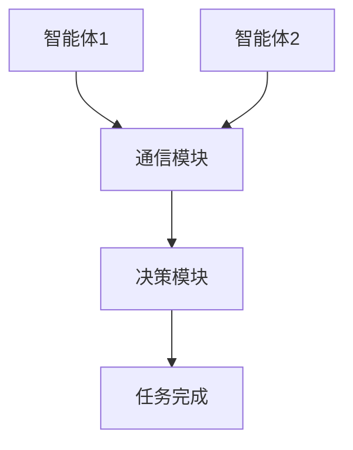
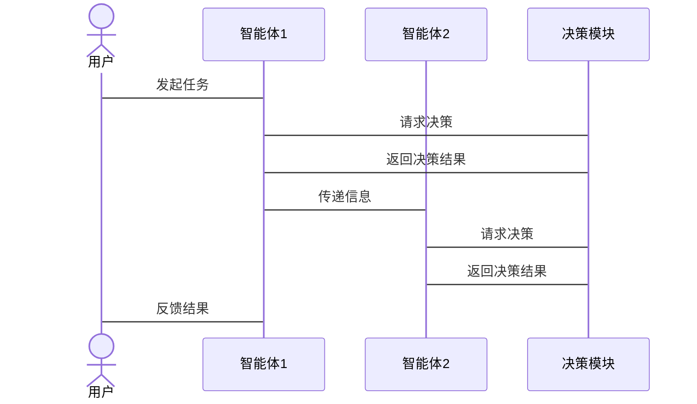

                 


# AI Agent的多Agent协作与竞争学习系统

> **关键词**：AI Agent, 多Agent系统, 协作与竞争学习, 系统架构, 竞争学习, 协作学习  
> **摘要**：本文探讨了AI Agent在多Agent协作与竞争学习系统中的核心概念、算法原理、系统架构和实际应用。通过详细分析多Agent协作与竞争的背景、模型、算法和系统设计，结合实际案例和代码实现，为读者提供全面的技术解读。

---

## 第1章 多Agent协作与竞争学习的背景

### 1.1 多Agent系统概述

#### 1.1.1 多Agent系统的定义
多Agent系统是由多个智能体（Agent）组成的分布式系统，每个智能体能够感知环境、自主决策并与其他智能体交互。这些智能体可以是软件程序、机器人或其他智能实体，通过协作或竞争完成特定任务。

#### 1.1.2 多Agent系统的应用场景
- 智能交通管理：多个智能体协调交通流量。
- 游戏AI：多个游戏角色协作或对抗。
- 分布式计算：多个节点协作完成复杂任务。

#### 1.1.3 多Agent系统的优点与挑战
- **优点**：高可扩展性、容错性、灵活性。
- **挑战**：智能体之间的通信与协调、动态环境下的实时决策、复杂博弈关系。

### 1.2 多Agent协作与竞争学习的背景

#### 1.2.1 协作与竞争的概念
- **协作**：智能体通过合作完成共同目标。
- **竞争**：智能体通过对抗争夺资源或目标。

#### 1.2.2 协作与竞争在AI Agent中的重要性
- 协作：提高系统整体效率。
- 竞争：促进智能体自我优化。

#### 1.2.3 多Agent协作与竞争学习的现状
当前，多Agent协作与竞争学习在游戏AI、分布式计算和机器人等领域有广泛应用，但仍面临动态环境下的实时决策和博弈关系的复杂性问题。

### 1.3 多Agent协作与竞争学习的问题描述

#### 1.3.1 协作与竞争中的核心问题
- 协作：如何分配任务和协调决策。
- 竞争：如何避免冲突和优化资源利用。

#### 1.3.2 多Agent系统中的博弈关系
智能体之间的博弈关系可以通过纳什均衡等概念进行建模。

#### 1.3.3 学习与决策的复杂性
智能体需要在动态环境中实时学习和调整策略。

### 1.4 问题解决与边界

#### 1.4.1 多Agent协作与竞争学习的解决方案
- 协作：使用分布式算法和博弈论模型。
- 竞争：通过强化学习和对抗网络优化策略。

#### 1.4.2 系统的边界与外延
系统边界：智能体数量、任务范围、环境约束。
系统外延：与其他系统（如云平台）的接口。

#### 1.4.3 相关概念的对比与区分
- 对比：协作与竞争的核心区别。
- 区分：基于任务目标和智能体关系的分类。

### 1.5 系统概念结构与核心要素

#### 1.5.1 系统组成要素
- 智能体：执行任务的主体。
- 通信机制：智能体之间的交互接口。
- 学习算法：智能体的决策模型。

#### 1.5.2 系统功能模块
- 任务分配：智能体之间的任务划分。
- 决策模块：基于当前状态做出决策。
- 通信模块：智能体之间的信息交换。

#### 1.5.3 系统交互流程
1. 初始化：定义任务和智能体角色。
2. 信息收集：智能体感知环境。
3. 决策：基于信息做出行动。
4. 交互：智能体之间通信与协作。

---

## 第2章 多Agent协作与竞争的核心概念

### 2.1 多Agent协作的概念与模型

#### 2.1.1 协作的定义与特征
- 定义：智能体通过合作完成共同目标。
- 特征：任务分配、信息共享、协调决策。

#### 2.1.2 协作模型的分类
- 基于任务的协作：根据任务需求分配角色。
- 基于角色的协作：定义固定角色并协作。

#### 2.1.3 协作协议与机制
- 协议：定义协作规则。
- 机制：实现协作的具体方法，如分布式算法。

### 2.2 多Agent竞争的概念与模型

#### 2.2.1 竞争的定义与特征
- 定义：智能体通过对抗争夺资源。
- 特征：目标冲突、策略对抗、资源分配。

#### 2.2.2 竞争模型的分类
- 零和博弈：总和为零的情况。
- 非零和博弈：结果不一定为零。

#### 2.2.3 竞争协议与机制
- 协议：定义竞争规则。
- 机制：实现竞争的具体方法，如强化学习。

### 2.3 协作与竞争的结合

#### 2.3.1 协作与竞争的平衡
- 如何在协作中引入竞争，以优化整体性能。
- 如何在竞争中引入协作，以避免恶性竞争。

#### 2.3.2 协作与竞争的动态转换
- 根据环境变化调整协作与竞争策略。

#### 2.3.3 协作与竞争的综合模型
- 综合考虑协作与竞争的双重因素，构建统一的决策模型。

---

## 第3章 多Agent协作与竞争学习的算法原理

### 3.1 协作学习算法

#### 3.1.1 协作学习的基本原理
- 多智能体通过协作学习共同优化决策。
- 使用分布式算法和博弈论模型。

#### 3.1.2 协作学习的数学模型
$$ V(s) = \sum_{i=1}^{n} v_i(s) $$
其中，$V(s)$ 表示系统整体价值，$v_i(s)$ 表示第i个智能体的价值。

#### 3.1.3 协作学习的算法实现
1. 初始化：定义智能体角色和任务。
2. 信息共享：智能体之间共享状态和策略。
3. 联合优化：基于共享信息优化整体策略。

### 3.2 竞争学习算法

#### 3.2.1 竞争学习的基本原理
- 多智能体通过竞争学习优化自身策略。
- 使用强化学习和对抗网络。

#### 3.2.2 竞争学习的数学模型
$$ U(s) = \max_{i} u_i(s) $$
其中，$U(s)$ 表示系统整体效用，$u_i(s)$ 表示第i个智能体的效用。

#### 3.2.3 竞争学习的算法实现
1. 初始化：定义智能体目标和竞争规则。
2. 对抗训练：智能体之间通过对抗训练优化策略。
3. 竞争优化：基于竞争结果调整策略。

### 3.3 多Agent协作与竞争学习的统一模型

#### 3.3.1 统一模型的基本原理
- 结合协作与竞争的双重因素，构建统一的决策模型。

#### 3.3.2 统一模型的数学公式
$$ P(s) = \alpha V(s) + (1-\alpha) U(s) $$
其中，$\alpha$ 表示协作权重，$1-\alpha$ 表示竞争权重。

#### 3.3.3 统一模型的算法实现
1. 初始化：定义协作与竞争权重。
2. 联合优化：基于协作与竞争的统一模型优化决策。
3. 动态调整：根据环境变化实时调整协作与竞争权重。

---

## 第4章 多Agent协作与竞争学习的系统架构

### 4.1 系统架构设计

#### 4.1.1 系统功能模块
- 信息采集模块：感知环境状态。
- 决策模块：基于状态做出决策。
- 通信模块：智能体之间的信息交互。

#### 4.1.2 系统架构图


#### 4.1.3 系统交互流程
1. 智能体感知环境。
2. 智能体通过通信模块传递信息。
3. 决策模块基于信息做出决策。
4. 执行任务并反馈结果。

### 4.2 系统接口设计

#### 4.2.1 接口定义
- 智能体接口：定义智能体的行为和决策规则。
- 通信接口：定义智能体之间的信息交互规则。

#### 4.2.2 接口实现
- 使用RESTful API或消息队列实现通信。

### 4.3 系统交互序列图



---

## 第5章 项目实战

### 5.1 环境安装

#### 5.1.1 安装Python
```bash
python --version
```

#### 5.1.2 安装相关库
```bash
pip install numpy
pip install gym
pip install matplotlib
```

### 5.2 核心代码实现

#### 5.2.1 协作学习代码
```python
import numpy as np

class CollaborativeAgent:
    def __init__(self):
        self.value = 0

    def update(self, other_value):
        self.value += other_value

agent1 = CollaborativeAgent()
agent2 = CollaborativeAgent()

agent1.update(agent2.value)
print(agent1.value)
```

#### 5.2.2 竞争学习代码
```python
import numpy as np

class CompetitiveAgent:
    def __init__(self):
        self.utility = 0

    def compete(self, other_utility):
        self.utility = max(self.utility, other_utility)

agent1 = CompetitiveAgent()
agent2 = CompetitiveAgent()

agent1.compete(agent2.utility)
print(agent1.utility)
```

### 5.3 案例分析

#### 5.3.1 协作学习案例
多个智能体通过协作学习共同优化任务完成。

#### 5.3.2 竞争学习案例
多个智能体通过竞争学习优化自身策略。

### 5.4 项目小结
通过实际案例，验证了协作与竞争学习算法的有效性。

---

## 第6章 总结与展望

### 6.1 总结
本文详细探讨了多Agent协作与竞争学习系统的核心概念、算法原理和系统架构，结合实际案例进行了深入分析。

### 6.2 注意事项
- 系统设计需要考虑智能体之间的通信和协调。
- 算法实现需要考虑动态环境下的实时决策。

### 6.3 拓展阅读
- 《Multi-Agent Systems》
- 《Game Theory and AI》

---

**作者**：AI天才研究院/AI Genius Institute & 禅与计算机程序设计艺术 /Zen And The Art of Computer Programming

