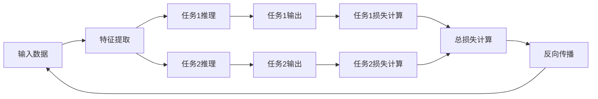
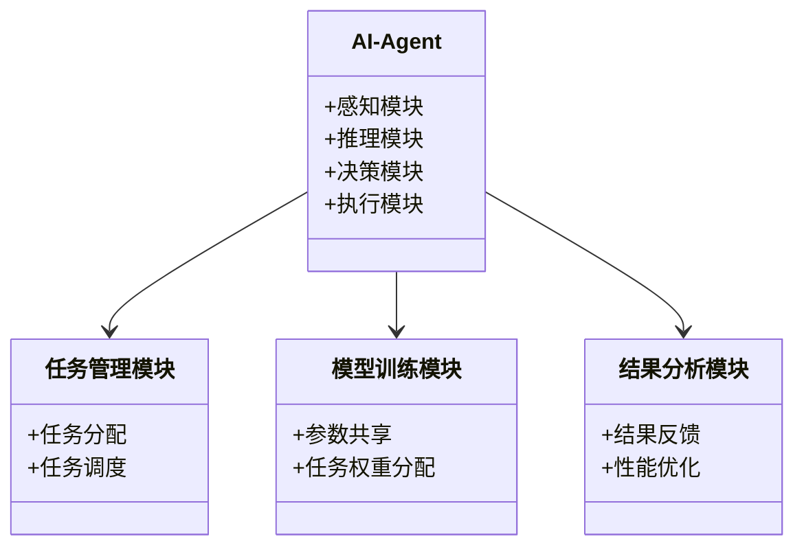
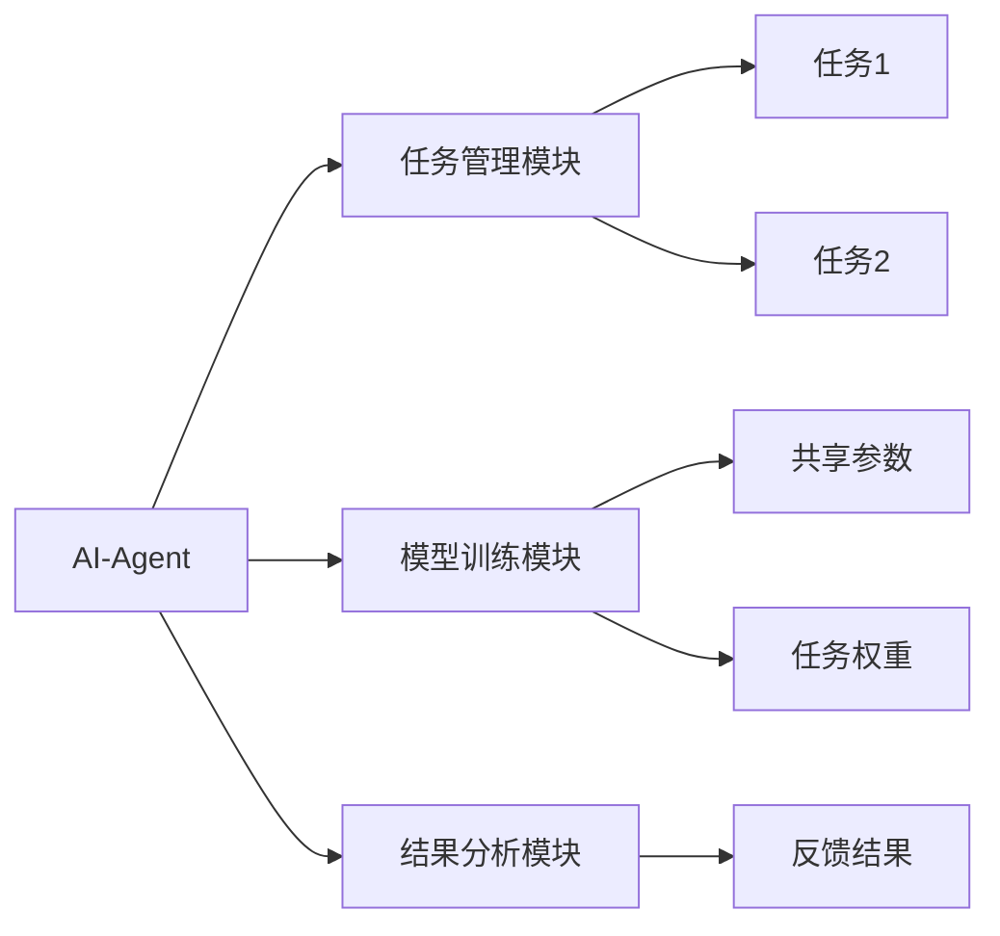
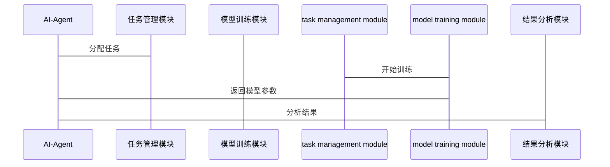

                 


# AI Agent的多任务迁移学习技术

## 关键词：AI Agent, 多任务学习, 迁移学习, 机器学习, 人工智能

## 摘要：  
本文深入探讨AI Agent在多任务迁移学习中的技术原理和应用。通过分析AI Agent的结构与功能，结合多任务迁移学习的核心概念、算法原理、系统设计与实际案例，为读者提供全面的技术解析。

---

# 第1章: AI Agent与多任务迁移学习的背景介绍

## 1.1 AI Agent的定义与特点
### 1.1.1 AI Agent的基本概念
AI Agent（人工智能代理）是指能够感知环境、执行任务并做出决策的智能实体。它通过传感器获取信息，利用推理能力解决问题，并通过执行器与环境交互。

### 1.1.2 AI Agent的核心特点
- **自主性**：能够在没有外部干预的情况下自主决策。
- **反应性**：能够实时感知环境并做出反应。
- **学习能力**：通过数据和经验不断优化自身性能。
- **社会能力**：能够与其他AI Agent或人类进行协作。

### 1.1.3 AI Agent的应用场景
- **智能助手**：如Siri、Alexa等，能够执行多种任务。
- **自动驾驶**：通过多任务学习处理感知、决策和控制。
- **智能客服**：通过多任务迁移学习实现问题分类、意图识别等功能。

## 1.2 多任务迁移学习的定义与特点
### 1.2.1 多任务迁移学习的基本概念
多任务迁移学习是指在多个任务之间共享知识，通过学习一个任务来提升其他任务的性能。其核心在于发现任务之间的共性和特性，从而实现知识的迁移。

### 1.2.2 多任务迁移学习的核心特点
- **任务相关性**：任务之间存在一定的关联性，可以共享知识。
- **知识共享**：通过共享参数或特征，提升模型的泛化能力。
- **效率提升**：通过迁移学习减少单任务学习所需的数据量和时间。

### 1.2.3 多任务迁移学习的应用场景
- **自然语言处理**：如机器翻译、文本分类等任务的联合优化。
- **计算机视觉**：如图像分类、目标检测等任务的联合优化。
- **机器人控制**：通过多任务学习实现感知、决策和控制的联合优化。

## 1.3 AI Agent与多任务迁移学习的关系
### 1.3.1 AI Agent中多任务迁移学习的必要性
AI Agent需要在复杂环境中执行多种任务，多任务迁移学习能够帮助其快速适应新任务，提升整体性能。

### 1.3.2 多任务迁移学习如何提升AI Agent的性能
通过共享任务之间的知识，AI Agent可以在新任务中更快地找到解决方案，减少训练数据的需求，提高泛化能力。

### 1.3.3 AI Agent在多任务迁移学习中的独特优势
AI Agent具有自主性和学习能力，能够动态地调整任务优先级和知识共享策略，实现更高效的任务执行。

## 1.4 本章小结
本章介绍了AI Agent和多任务迁移学习的基本概念、特点及应用场景，分析了两者之间的关系，为后续章节的深入探讨奠定了基础。

---

# 第2章: AI Agent的多任务迁移学习核心概念

## 2.1 AI Agent的结构与功能
### 2.1.1 AI Agent的组成模块
- **感知模块**：通过传感器获取环境信息。
- **推理模块**：对感知信息进行分析和推理。
- **决策模块**：基于推理结果做出决策。
- **执行模块**：通过执行器与环境交互。

### 2.1.2 各模块的功能描述
- **感知模块**：负责数据的采集和预处理。
- **推理模块**：利用机器学习模型进行分析。
- **决策模块**：基于推理结果制定行动方案。
- **执行模块**：将决策转化为具体操作。

### 2.1.3 模块之间的关系
模块之间通过数据流和控制流进行交互，感知模块为推理模块提供输入，推理模块为决策模块提供依据，决策模块指导执行模块行动。

## 2.2 多任务迁移学习的原理
### 2.2.1 知识迁移的基本概念
知识迁移是指将一个任务中学到的知识应用到另一个任务中，通过共享特征或参数来提升性能。

### 2.2.2 多任务学习的核心机制
- **参数共享**：在多个任务之间共享网络参数，减少参数数量。
- **任务相关度建模**：通过任务间的关系建模来指导知识共享。
- **注意力机制**：通过注意力机制动态分配任务权重，提升任务间的相互促进。

### 2.2.3 迁移学习的关键技术
- **领域适应**：通过调整模型参数使模型适应新领域。
- **任务归纳**：通过归纳推理发现任务间的共同特征。
- **对抗训练**：通过对抗网络实现任务间的知识共享。

## 2.3 AI Agent中多任务迁移学习的实现方式
### 2.3.1 知识表示方法
- **向量表示**：将任务表示为向量，通过向量运算进行知识共享。
- **图结构表示**：将任务表示为图结构，通过图运算进行知识共享。

### 2.3.2 任务间的关系建模
- **任务依赖图**：通过图结构描述任务之间的依赖关系。
- **任务相似度测量**：通过相似度指标衡量任务之间的关联性。

### 2.3.3 知识共享策略
- **全局共享**：所有任务共享相同的参数。
- **局部共享**：部分任务共享参数，其他任务独立优化。
- **动态共享**：根据任务需求动态调整共享参数。

## 2.4 核心概念对比表
| 比较维度       | AI Agent | 单任务学习 | 多任务学习 |
|----------------|----------|-----------|------------|
| 学习目标       | 多任务   | 单任务    | 多任务     |
| 数据需求       | 较低     | 较高      | 中等       |
| 性能表现       | 高       | 中等      | 更优       |
| 应用场景       | 复杂环境  | 简单场景  | 多任务场景 |

## 2.5 本章小结
本章详细介绍了AI Agent的结构与功能，分析了多任务迁移学习的原理与实现方式，通过对比表帮助读者理解多任务迁移学习的核心概念。

---

# 第3章: 多任务迁移学习的算法原理

## 3.1 多任务迁移学习的核心算法
### 3.1.1 基于参数共享的多任务学习算法
- **参数共享模型**：通过共享网络参数，减少模型的参数数量，提升模型的泛化能力。
- **实现方式**：在模型的不同任务分支中共享部分或全部参数。

### 3.1.2 基于任务相关度的多任务学习算法
- **任务相关度建模**：通过任务相关度矩阵描述任务之间的关联性。
- **实现方式**：通过矩阵分解或图结构建模任务之间的关系。

### 3.1.3 基于注意力机制的多任务学习算法
- **注意力机制**：通过注意力权重动态调整任务的重要性。
- **实现方式**：在模型的不同任务分支中引入注意力机制，动态分配计算资源。

## 3.2 算法原理的数学模型
### 3.2.1 参数共享模型的数学表达
$$ L_{total} = \lambda_1 L_1 + \lambda_2 L_2 + ... + \lambda_n L_n $$
其中，$L_i$ 表示第i个任务的损失函数，$\lambda_i$ 是任务权重。

### 3.2.2 注意力机制模型的数学表达
$$ attention = softmax(\frac{QK^T}{\sqrt{d}}) $$
其中，$Q$ 和 $K$ 分别是查询和键的表示，$d$ 是维度。

## 3.3 算法实现的Mermaid流程图


## 3.4 项目核心代码实现
```python
import torch
import torch.nn as nn
import torch.optim as optim

class MultiTaskModel(nn.Module):
    def __init__(self, input_dim, hidden_dim, output_dims):
        super(MultiTaskModel, self).__init__()
        self.shared_layer = nn.Linear(input_dim, hidden_dim)
        self.task_layers = nn.ModuleList([nn.Linear(hidden_dim, out_dim) for out_dim in output_dims])

    def forward(self, x):
        x = self.shared_layer(x)
        outputs = []
        for task_layer in self.task_layers:
            outputs.append(task_layer(x))
        return outputs

# 初始化模型和优化器
input_dim = 10
hidden_dim = 5
output_dims = [3, 4]
model = MultiTaskModel(input_dim, hidden_dim, output_dims)
optimizer = optim.Adam(model.parameters(), lr=0.001)
criterion = nn.MSELoss()

# 训练过程
for epoch in range(num_epochs):
    for batch_x, batch_y in dataloaders:
        optimizer.zero_grad()
        outputs = model(batch_x)
        loss = 0
        for i in range(len(outputs)):
            loss += criterion(outputs[i], batch_y[i])
        loss.backward()
        optimizer.step()
```

## 3.5 本章小结
本章详细介绍了多任务迁移学习的核心算法及其数学模型，通过Mermaid流程图和Python代码实现，帮助读者理解多任务迁移学习的实现方式。

---

# 第4章: 系统分析与架构设计

## 4.1 问题场景介绍
AI Agent需要在复杂环境中执行多种任务，如图像识别、语音识别和自然语言处理等，通过多任务迁移学习提升性能。

## 4.2 系统功能设计
### 4.2.1 领域模型设计
- **任务管理模块**：负责任务的分配和调度。
- **模型训练模块**：负责多任务迁移学习模型的训练。
- **结果分析模块**：负责模型输出结果的分析和反馈。

### 4.2.2 领域模型的Mermaid类图


## 4.3 系统架构设计
### 4.3.1 系统架构的Mermaid架构图


## 4.4 系统接口设计
- **输入接口**：接收环境数据和任务指令。
- **输出接口**：输出执行结果和反馈信息。

## 4.5 系统交互的Mermaid序列图


## 4.6 本章小结
本章通过系统分析与架构设计，详细描述了AI Agent在多任务迁移学习中的实现过程，为后续章节的项目实战奠定了基础。

---

# 第5章: 项目实战

## 5.1 环境配置
```bash
pip install torch
pip install numpy
pip install matplotlib
```

## 5.2 核心代码实现
### 5.2.1 数据预处理
```python
import numpy as np
from sklearn.datasets import make_classification

X, y = make_classification(n_samples=1000, n_features=10, n_classes=2)
```

### 5.2.2 模型定义
```python
class MultiTaskClassifier(nn.Module):
    def __init__(self, input_dim, hidden_dim, output_dim):
        super(MultiTaskClassifier, self).__init__()
        self.shared = nn.Sequential(
            nn.Linear(input_dim, hidden_dim),
            nn.ReLU()
        )
        self.task_specific = nn.Linear(hidden_dim, output_dim)

    def forward(self, x):
        x = self.shared(x)
        x = self.task_specific(x)
        return x
```

### 5.2.3 训练过程
```python
model = MultiTaskClassifier(input_dim=10, hidden_dim=5, output_dim=2)
criterion = nn.CrossEntropyLoss()
optimizer = optim.Adam(model.parameters(), lr=0.01)

num_epochs = 100
for epoch in range(num_epochs):
    outputs = model(X)
    loss = criterion(outputs, y)
    loss.backward()
    optimizer.step()
    optimizer.zero_grad()
```

## 5.3 代码应用解读与分析
- **数据预处理**：生成分类数据集。
- **模型定义**：定义一个多任务分类模型，包含共享层和任务特定层。
- **训练过程**：通过反向传播和优化器训练模型，提升模型性能。

## 5.4 实际案例分析
通过训练后的模型，可以在多个任务之间实现知识共享，提升分类准确率。

## 5.5 项目小结
本章通过实际项目实战，详细展示了AI Agent在多任务迁移学习中的实现过程，帮助读者理解理论与实践的结合。

---

# 第6章: 最佳实践与小结

## 6.1 小结
本文深入探讨了AI Agent的多任务迁移学习技术，从背景介绍到算法实现，再到系统设计和项目实战，为读者提供了全面的技术解析。

## 6.2 注意事项
- **数据质量**：确保数据的多样性和代表性。
- **任务相关性**：任务之间应具有一定的相关性，否则知识共享的效果不佳。
- **模型选择**：根据具体任务需求选择合适的模型和算法。

## 6.3 拓展阅读
- **Deep Learning for Natural Language Processing**：了解深度学习在自然语言处理中的应用。
- **Multi-task Learning with Label Insufficiency**：研究多任务学习中的标签不足问题。

---

# 作者：AI天才研究院/AI Genius Institute & 禅与计算机程序设计艺术 /Zen And The Art of Computer Programming

---

以上是《AI Agent的多任务迁移学习技术》的完整目录和内容概要，您可以根据需要进一步扩展每章的具体内容。

