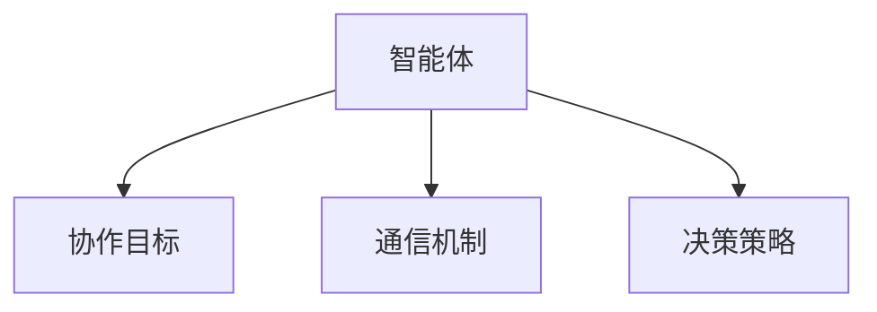
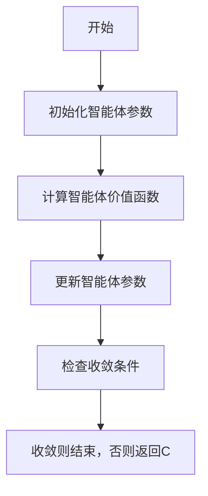
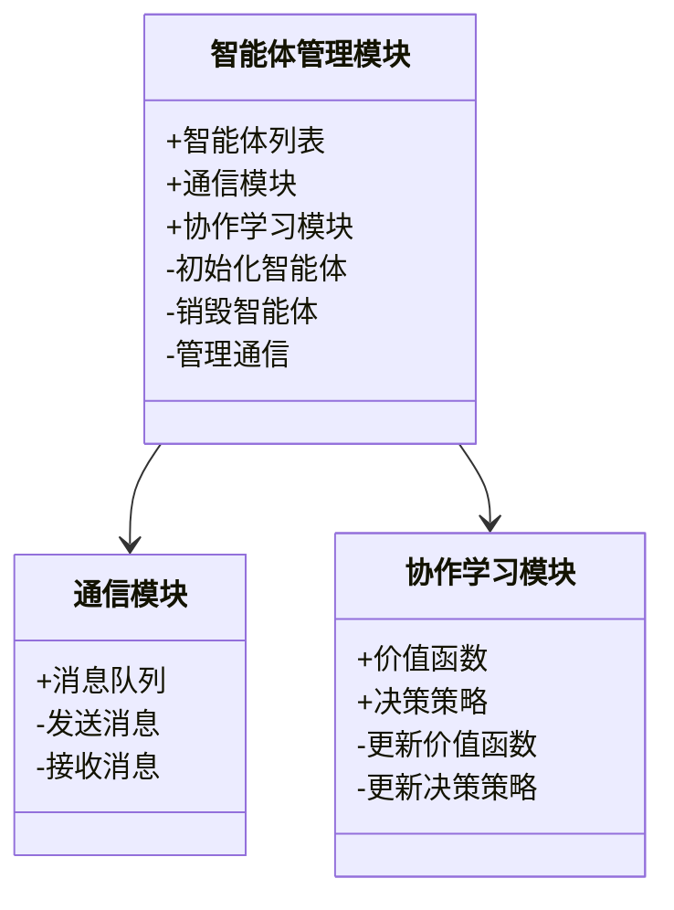
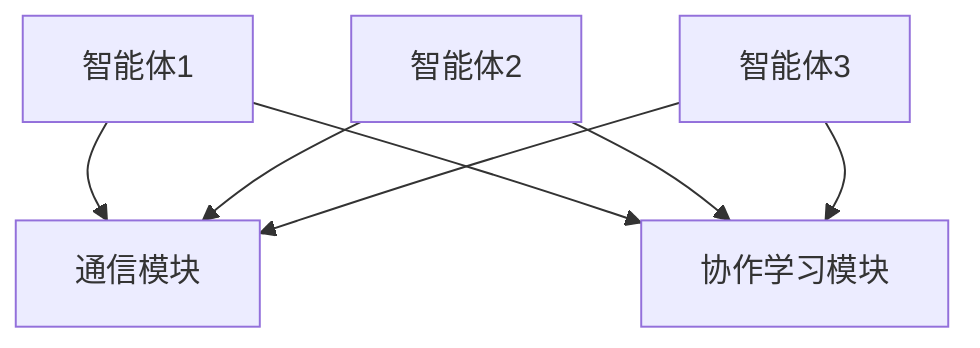
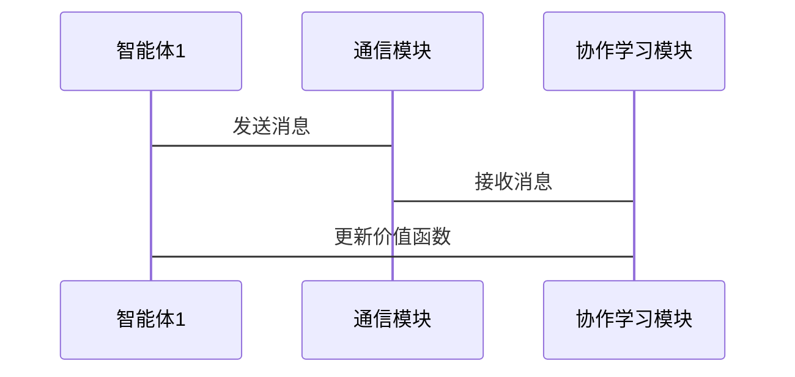

                 


# AI Agent的多智能体协作学习技术

> 关键词：多智能体协作学习，AI Agent，分布式强化学习，数学模型，协作优化

> 摘要：  
本文深入探讨了AI Agent的多智能体协作学习技术，从理论基础到算法实现，再到系统设计和项目实战，全面解析了多智能体协作学习的核心概念、算法原理、系统架构以及实际应用场景。通过详细分析多智能体协作学习的背景、核心要素、算法模型和系统设计，结合实际项目案例，帮助读者全面理解并掌握这一前沿技术。

---

# 第1章: 多智能体协作学习的背景与概念

## 1.1 多智能体协作学习的背景

### 1.1.1 人工智能的发展与多智能体系统
人工智能（AI）技术的快速发展，推动了多智能体系统（Multi-Agent System, MAS）的研究与应用。传统的单智能体学习方法虽然在许多任务中表现出色，但在复杂场景下，单智能体的能力往往受到限制。多智能体协作学习通过多个智能体的分工合作，能够更好地解决复杂问题。

### 1.1.2 多智能体协作学习的定义与特点
多智能体协作学习是指多个智能体通过协作和通信，共同完成一个复杂任务的学习过程。其特点包括：
- **分布式性**：智能体独立决策，但通过通信协作完成任务。
- **动态性**：环境和任务目标可能动态变化，智能体需要快速适应。
- **协作性**：智能体之间的协作是实现任务目标的核心。

### 1.1.3 多智能体协作学习的应用场景
多智能体协作学习在多个领域有广泛应用，例如：
- **机器人协作**：多个机器人协同完成任务，如仓储物流中的货物搬运。
- **游戏AI**：多个智能体在游戏场景中协作完成游戏任务。
- **交通控制**：智能交通系统中多个车辆或道路节点的协作优化。

## 1.2 多智能体协作学习的核心问题

### 1.2.1 分散决策与集中优化的矛盾
多智能体系统中，智能体需要在局部决策和全局优化之间找到平衡。分散决策能够提高系统的灵活性，但可能导致全局优化不足。

### 1.2.2 智能体之间的通信与协作
智能体之间的通信是协作的关键。如何设计高效的通信机制，避免信息冗余或信息不足，是多智能体协作学习的核心挑战。

### 1.2.3 动态环境下的适应性问题
动态环境要求智能体能够快速适应变化，调整协作策略和决策模型。

## 1.3 多智能体协作学习的边界与外延

### 1.3.1 与单智能体学习的差异
单智能体学习依赖于单个智能体的决策能力，而多智能体协作学习依赖于多个智能体的分工与协作。

### 1.3.2 与分布式计算的联系
多智能体协作学习借鉴了分布式计算的思想，但更注重智能体之间的协作与学习。

### 1.3.3 与强化学习的关系
强化学习是多智能体协作学习的重要基础。多智能体强化学习通过多个智能体的协作，实现全局优化。

## 1.4 多智能体协作学习的核心要素

### 1.4.1 智能体的定义与属性
智能体是多智能体系统的基本单元，具有以下属性：
- **独立性**：智能体能够独立决策。
- **协作性**：智能体能够通过通信协作完成任务。
- **适应性**：智能体能够根据环境变化调整行为。

### 1.4.2 协作目标的构建
协作目标是多智能体协作学习的核心。如何将全局目标分解为多个智能体的局部目标，是协作学习的关键问题。

### 1.4.3 通信机制的设计
通信机制决定智能体之间的信息交换方式。常见的通信机制包括基于消息传递和基于共享状态的通信。

### 1.4.4 共识与决策过程
多智能体协作学习需要设计高效的共识算法和决策机制，确保智能体能够快速达成一致并采取行动。

## 1.5 本章小结

---

# 第2章: 多智能体协作学习的核心概念与联系

## 2.1 多智能体协作学习的原理

### 2.1.1 分布式智能体的协作机制
多智能体协作学习通过分布式协作机制，实现智能体之间的信息共享与任务分工。

### 2.1.2 协作目标的分解与分配
将全局目标分解为多个子目标，并分配给不同的智能体完成。

### 2.1.3 智能体之间的信息交换
智能体通过通信机制交换信息，协调协作过程。

## 2.2 多智能体协作学习的核心概念对比

### 2.2.1 智能体类型对比
| 智能体类型 | 特性描述 |
|------------|----------|
| 单智能体    | 独立决策，无协作 |
| 多智能体    | 分工协作，通信共享 |

### 2.2.2 协作策略对比
| 协作策略 | 特性描述 |
|----------|----------|
| 分散协作  | 智能体独立决策，通过通信协作 |
| 集中协作  | 由中央协调器统一决策 |

### 2.2.3 通信机制对比
| 通信机制 | 特性描述 |
|----------|----------|
| 基于消息  | 智能体通过消息传递信息 |
| 基于共享状态 | 智能体共享全局状态 |

## 2.3 多智能体协作学习的ER实体关系图



## 2.4 本章小结

---

# 第3章: 多智能体协作学习的算法原理

## 3.1 多智能体强化学习算法

### 3.1.1 分布式强化学习
分布式强化学习通过多个智能体的协作，实现全局优化。典型算法包括：

#### 3.1.1.1 基于价值的协作学习
$$V_{\text{total}} = \sum_{i=1}^{n} V_i$$
其中，$V_i$ 是第i个智能体的值函数。

#### 3.1.1.2 基于策略的协作学习
$$\pi_i(a|s) = \text{softmax}(q_i(s,a))$$
其中，$\pi_i(a|s)$ 是第i个智能体在状态$s$下采取动作$a$的概率。

### 3.1.2 集中式强化学习
集中式强化学习通过中央控制器统一决策，典型算法包括：

#### 3.1.2.1 基于Q-learning的协作学习
$$Q_{\text{total}} = \sum_{i=1}^{n} Q_i$$
其中，$Q_i$ 是第i个智能体的Q值函数。

#### 3.1.2.2 基于_actor-critic_的协作学习
$$\nabla \theta = \sum_{i=1}^{n} \nabla \theta_i$$
其中，$\theta_i$ 是第i个智能体的参数。

### 3.1.3 基于价值的协作学习
基于价值的协作学习通过多个智能体的价值函数协作，实现全局优化。典型算法包括：

#### 3.1.3.1 基于DQN的协作学习
$$Q_i(s,a) = \text{DNN}(s,a;\theta_i)$$
其中，$Q_i(s,a)$ 是第i个智能体在状态$s$下采取动作$a$的Q值，$\theta_i$ 是参数。

---

## 3.2 分布式优化方法

### 3.2.1 基于一致性优化的算法
基于一致性优化的算法通过保持智能体之间的一致性，实现全局优化。典型算法包括：

#### 3.2.1.1 基于一致性约束的优化
$$\min_{\theta} \sum_{i=1}^{n} J_i(\theta_i) + \lambda \sum_{i=1}^{n} \|\theta_i - \theta\|^2$$
其中，$\lambda$ 是一致性约束的权重。

#### 3.2.1.2 基于Distributed ADMM的优化
$$\min_{\theta} \sum_{i=1}^{n} J_i(\theta_i) + \lambda \sum_{i=1}^{n} \|\theta_i - \theta\|^2$$
其中，$\theta$ 是全局参数，$\theta_i$ 是局部参数。

### 3.2.2 基于纳什均衡的算法
纳什均衡是多智能体协作学习的重要理论基础。典型算法包括：

#### 3.2.2.1 基于纳什博弈的优化
$$\min_{\theta_i} J_i(\theta_i, \theta_{-i})$$
其中，$\theta_{-i}$ 表示除第i个智能体外的其他智能体的参数。

#### 3.2.2.2 基于Q-learning的纳什均衡求解
$$Q_i(s,a) = r_i(s,a) + \gamma \max_{a'} Q_i(s',a')$$
其中，$r_i(s,a)$ 是智能体i在状态$s$下采取动作$a$的奖励。

### 3.2.3 基于图模型的分布式优化
基于图模型的分布式优化通过构建智能体之间的关系图，实现高效的全局优化。典型算法包括：

#### 3.2.3.1 基于图传播的优化
$$\theta_{t+1} = \theta_t + \alpha \sum_{i=1}^{n} \nabla J_i(\theta_i)$$
其中，$\alpha$ 是学习率。

#### 3.2.3.2 基于图注意力的优化
$$\text{Attention}(Q,K,V) = \text{softmax}\left(\frac{QK^T}{\sqrt{d}}\right)V$$
其中，$Q$、$K$、$V$ 是查询、键、值向量，$d$ 是维度。

---

## 3.3 多智能体协作学习的数学模型

### 3.3.1 协作目标函数
$$J = \sum_{i=1}^{n} J_i$$
其中，$J_i$ 是第i个智能体的目标函数。

### 3.3.2 智能体间通信模型
$$C_{ij} = \text{通信机制}(i,j)$$
其中，$C_{ij}$ 表示智能体i和j之间的通信。

### 3.3.3 分布式优化模型
$$\min_{\theta_i} J_i(\theta_i, \theta_{-i})$$
其中，$\theta_{-i}$ 表示除第i个智能体外的其他智能体的参数。

---

## 3.4 多智能体协作学习的算法流程图



---

## 3.5 本章小结

---

# 第4章: 多智能体协作学习的系统分析与架构设计

## 4.1 系统功能设计

### 4.1.1 领域模型设计
领域模型描述了多智能体协作学习系统的功能模块和数据流。典型模块包括：
- **智能体管理模块**：管理多个智能体的创建与销毁。
- **通信模块**：实现智能体之间的信息交换。
- **协作学习模块**：实现智能体的协作学习过程。

#### 4.1.1.1 领域模型类图


### 4.1.2 系统架构设计
系统架构设计描述了多智能体协作学习系统的整体结构。典型架构包括：
- **分布式架构**：智能体分布在不同的节点上，通过通信模块协作。
- **集中式架构**：由中央控制器统一管理智能体的协作过程。

#### 4.1.2.1 系统架构图


### 4.1.3 接口与交互设计
系统接口与交互设计描述了智能体之间的通信接口和交互流程。典型接口包括：
- **发送消息接口**：`SendMessage(sender, receiver, message)`
- **接收消息接口**：`ReceiveMessage(receiver, message)`

#### 4.1.3.1 交互序列图


---

## 4.2 系统实现与优化

### 4.2.1 系统实现
系统实现包括智能体管理模块、通信模块和协作学习模块的代码实现。典型代码如下：

#### 4.2.1.1 智能体管理模块代码
```python
class AgentManager:
    def __init__(self):
        self.agents = []
        self.communication = CommunicationModule()
        self.collaborative_learning = CollaborativeLearningModule()

    def initialize_agent(self, agent_id):
        # 初始化智能体
        agent = Agent(agent_id, self.communication, self.collaborative_learning)
        self.agents.append(agent)

    def destroy_agent(self, agent_id):
        # 销毁智能体
        for agent in self.agents:
            if agent.id == agent_id:
                agent.destroy()
                self.agents.remove(agent)
```

#### 4.2.1.2 通信模块代码
```python
class CommunicationModule:
    def __init__(self):
        self.message_queue = []

    def send_message(self, sender, receiver, message):
        # 发送消息
        self.message_queue.append((receiver, message))

    def receive_message(self, receiver):
        # 接收消息
        messages = []
        for msg in self.message_queue:
            if msg[0] == receiver:
                messages.append(msg[1])
        self.message_queue = [msg for msg in self.message_queue if msg[0] != receiver]
        return messages
```

#### 4.2.1.3 协作学习模块代码
```python
class CollaborativeLearningModule:
    def __init__(self):
        self.value_functions = {}
        self.policies = {}

    def update_value_function(self, agent_id, value_function):
        # 更新价值函数
        self.value_functions[agent_id] = value_function

    def update_policy(self, agent_id, policy):
        # 更新决策策略
        self.policies[agent_id] = policy
```

### 4.2.2 系统优化
系统优化包括通信模块的优化和协作学习模块的优化。典型优化方法包括：
- **通信优化**：通过压缩消息和减少通信频率，降低通信开销。
- **学习优化**：通过分布式优化算法，提高协作学习效率。

---

## 4.3 本章小结

---

# 第5章: 多智能体协作学习的项目实战

## 5.1 环境安装与配置

### 5.1.1 安装依赖
安装必要的Python库：
```bash
pip install numpy matplotlib gym
```

### 5.1.2 配置环境
配置运行环境，例如在Ubuntu系统上配置虚拟环境：
```bash
python -m venv myenv
source myenv/bin/activate
```

## 5.2 系统核心实现

### 5.2.1 智能体管理模块实现
实现智能体管理模块，包括智能体的初始化和销毁。

#### 5.2.1.1 初始化智能体
```python
agent_manager = AgentManager()
agent_manager.initialize_agent(1)
agent_manager.initialize_agent(2)
agent_manager.initialize_agent(3)
```

#### 5.2.1.2 销毁智能体
```python
agent_manager.destroy_agent(1)
agent_manager.destroy_agent(2)
agent_manager.destroy_agent(3)
```

### 5.2.2 通信模块实现
实现智能体之间的通信，包括消息的发送和接收。

#### 5.2.2.1 发送消息
```python
agent_manager.communication.send_message(1, 2, "Hello, Agent 2!")
```

#### 5.2.2.2 接收消息
```python
messages = agent_manager.communication.receive_message(2)
print(messages)  # 输出：["Hello, Agent 2!"]
```

### 5.2.3 协作学习模块实现
实现智能体的协作学习，包括价值函数的更新和决策策略的更新。

#### 5.2.3.1 更新价值函数
```python
agent_manager.collaborative_learning.update_value_function(1, lambda s: s*2)
```

#### 5.2.3.2 更新决策策略
```python
agent_manager.collaborative_learning.update_policy(1, lambda s: 'left' if s < 0 else 'right')
```

## 5.3 代码应用与解读

### 5.3.1 核心代码解读
解读智能体管理模块、通信模块和协作学习模块的核心代码，分析其功能和实现细节。

### 5.3.2 实际案例分析
通过实际案例分析，展示多智能体协作学习技术的应用效果和优化方向。

---

## 5.4 本章小结

---

# 第6章: 多智能体协作学习的最佳实践与小结

## 6.1 最佳实践

### 6.1.1 系统设计
- **模块化设计**：将系统划分为智能体管理模块、通信模块和协作学习模块，便于管理和优化。
- **高效通信**：通过压缩消息和减少通信频率，降低通信开销。

### 6.1.2 算法选择
- **选择合适的算法**：根据具体场景选择合适的多智能体协作学习算法，例如分布式强化学习或集中式强化学习。
- **优化算法性能**：通过分布式优化和并行计算，提高算法效率。

### 6.1.3 系统优化
- **优化通信模块**：通过减少消息大小和优化消息队列管理，提高通信效率。
- **优化协作学习模块**：通过分布式优化和并行计算，提高学习效率。

## 6.2 小结

### 6.2.1 多智能体协作学习的核心思想
多智能体协作学习通过多个智能体的分工合作，实现复杂任务的高效完成。

### 6.2.2 多智能体协作学习的关键技术
- **智能体管理**：智能体的初始化、销毁和管理。
- **通信机制**：智能体之间的信息交换。
- **协作学习**：智能体之间的协作学习和优化。

### 6.2.3 多智能体协作学习的未来发展方向
- **更高效的算法设计**：研究更高效的多智能体协作学习算法。
- **更智能的通信机制**：研究更智能的通信机制，提高协作效率。
- **更广泛的应用场景**：探索多智能体协作学习在更多领域的应用。

---

## 6.3 注意事项

### 6.3.1 系统设计中的常见问题
- **通信延迟**：智能体之间的通信延迟可能影响协作效率。
- **一致性问题**：智能体之间的一致性问题可能影响全局优化。

### 6.3.2 算法实现中的常见问题
- **收敛速度**：多智能体协作学习算法的收敛速度可能较慢。
- **计算复杂度**：多智能体协作学习算法的计算复杂度较高。

### 6.3.3 优化建议
- **优化通信机制**：通过减少消息大小和优化消息队列管理，提高通信效率。
- **优化算法性能**：通过分布式优化和并行计算，提高算法效率。

---

## 6.4 拓展阅读

### 6.4.1 推荐书籍
- 《Multi-Agent Systems: Algorithmic, Complexity Theoretic, and Game Theoretic Foundations》
- 《Distributed Computing and Multi-Agent Systems》

### 6.4.2 推荐论文
- "Multi-agent reinforcement learning: A survey"
- "Distributed optimization in multi-agent systems"

---

## 6.5 本章小结

---

# 作者信息

作者：AI天才研究院/AI Genius Institute & 禅与计算机程序设计艺术 /Zen And The Art of Computer Programming

