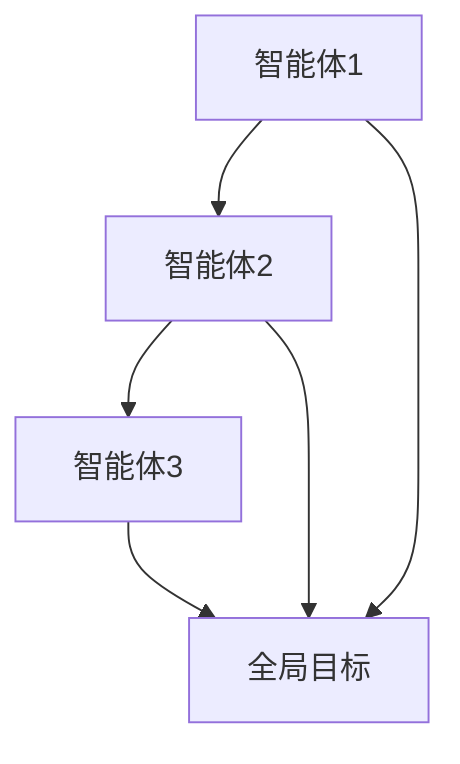
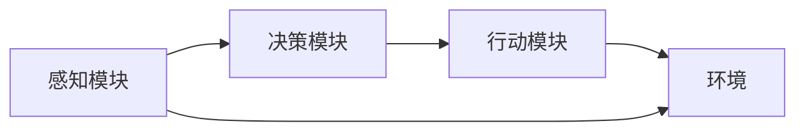

                 


# AI Agent的多智能体协同探索与学习

> 关键词：AI Agent, 多智能体, 协同学习, 分布式强化学习, 群智系统

> 摘要：本文深入探讨了AI Agent在多智能体协同中的核心概念、算法原理、系统设计与项目实现。通过分析多智能体系统的结构、协作机制及典型算法，结合实际案例，展示了如何实现高效的多智能体协同学习与探索。

---

# 第一部分: AI Agent的多智能体协同探索与学习基础

## 第1章: AI Agent与多智能体系统概述

### 1.1 AI Agent的基本概念

#### 1.1.1 什么是AI Agent
AI Agent（人工智能代理）是指能够感知环境、自主决策并采取行动以实现特定目标的智能实体。AI Agent可以是软件程序、机器人或其他智能系统。

**AI Agent的核心特征**：
- **自主性**：能够在没有外部干预的情况下自主运行。
- **反应性**：能够实时感知环境并做出反应。
- **目标导向**：通过决策和行动实现特定目标。
- **社会能力**：能够与其他智能体或人类进行交互和协作。

**AI Agent的分类与应用场景**：
- **简单反射型Agent**：基于当前感知做出反应，适用于简单任务（如自动门）。
- **基于模型的反射型Agent**：利用内部模型进行决策，适用于复杂任务（如自动驾驶）。
- **目标驱动型Agent**：通过规划和推理实现目标，适用于复杂场景（如智能助手）。
- **实用驱动型Agent**：通过优化目标函数实现目标，适用于强化学习场景（如游戏AI）。

### 1.2 多智能体系统的基本概念

#### 1.2.1 多智能体系统的定义
多智能体系统（Multi-Agent System, MAS）是由多个智能体组成的系统，这些智能体能够协作或竞争以完成共同或个体目标。

**多智能体系统的组成部分**：
- **智能体**：独立的决策和行动单元。
- **环境**：智能体感知和行动的空间。
- **通信机制**：智能体之间的信息交换方式。
- **协作机制**：智能体之间实现目标的协调方式。

#### 1.2.2 多智能体系统的优劣势对比

| 对比维度       | 单一智能体       | 多智能体系统     |
|----------------|------------------|------------------|
| 系统复杂度     | 简单             | 复杂             |
| 可扩展性       | 有限             | 高               |
| 协作能力       | 无               | 强               |
| 性能优化       | 单点优化         | 分布式优化       |

### 1.3 多智能体协同的核心问题

#### 1.3.1 协作目标的定义
协作目标是多智能体系统的核心，需要明确每个智能体的个体目标与全局目标之间的关系。

#### 1.3.2 协作策略的选择
选择合适的协作策略是实现高效协同的关键，常见的策略包括：
- **基于规则的协作**：通过预定义规则进行协作。
- **基于博弈论的协作**：通过纳什均衡等理论进行协作。
- **基于强化学习的协作**：通过学习策略实现协作。

#### 1.3.3 协作过程的优化
协作过程的优化需要考虑通信开销、计算资源和目标冲突等问题。

---

## 第2章: AI Agent的核心概念与联系

### 2.1 AI Agent的结构与功能

#### 2.1.1 感知层
感知层负责从环境中获取信息，例如通过传感器或API接口获取数据。

#### 2.1.2 决策层
决策层负责处理感知信息，选择最优行动方案。

#### 2.1.3 行动层
行动层负责执行决策层的指令，与环境进行交互。

### 2.2 多智能体系统中的角色与关系

#### 2.2.1 单一智能体的角色
单一智能体在多智能体系统中可以扮演以下角色：
- **执行者**：负责执行具体任务。
- **协调者**：负责协调其他智能体的行动。
- **监督者**：负责监控系统状态。

#### 2.2.2 多智能体之间的关系
多智能体之间的关系可以是竞争、协作或混合关系。

### 2.3 AI Agent与多智能体系统的区别与联系

#### 2.3.1 单一智能体与多智能体的对比

| 对比维度       | 单一智能体       | 多智能体系统     |
|----------------|------------------|------------------|
| 系统复杂度     | 简单             | 复杂             |
| 可扩展性       | 有限             | 高               |
| 协作能力       | 无               | 强               |

#### 2.3.2 群智协同的核心特征
群智协同是指多个智能体通过协作实现超越个体能力的目标。

### 2.4 本章小结

---

## 第3章: 多智能体协同的算法原理

### 3.1 分布式多智能体强化学习

#### 3.1.1 算法概述
分布式多智能体强化学习是一种通过多个智能体协作实现全局目标的强化学习方法。

#### 3.1.2 算法流程



#### 3.1.3 算法实现

```python
import numpy as np

class Agent:
    def __init__(self, state_space, action_space):
        self.state_space = state_space
        self.action_space = action_space
        self.Q = np.zeros((state_space, action_space))

    def感知(self, state):
        # 根据状态返回动作
        pass

    def 学习(self, state, action, reward):
        # 更新Q值
        pass

class MultiAgentSystem:
    def __init__(self, agents):
        self.agents = agents

    def run_episode(self):
        while not done:
            for agent in self.agents:
                state = agent.感知()
                action = agent.决策()
                reward = agent.获取奖励()
                agent.学习(state, action, reward)
```

### 3.2 多智能体协作的数学模型

#### 3.2.1 状态空间的定义
状态空间描述了智能体所处的环境状态。

#### 3.2.2 动作空间的定义
动作空间描述了智能体可以执行的动作。

### 3.2.3 奖励函数的设计

$$ R(s, a) = \sum_{i=1}^{n} r_i $$

其中，$r_i$ 表示第i个智能体的奖励。

---

## 第4章: 系统分析与架构设计

### 4.1 系统架构设计

#### 4.1.1 系统功能模块
- **感知模块**：负责从环境中获取数据。
- **决策模块**：负责制定决策策略。
- **行动模块**：负责执行决策。
- **通信模块**：负责智能体之间的信息交换。

#### 4.1.2 系统架构图



---

## 第5章: 项目实战

### 5.1 项目背景
在本项目中，我们将实现一个简单的多智能体协作系统，用于解决一个资源分配问题。

### 5.2 项目实现

#### 5.2.1 环境安装
```bash
pip install numpy matplotlib
```

#### 5.2.2 核心代码实现

```python
import numpy as np

class Agent:
    def __init__(self, state_space, action_space):
        self.state_space = state_space
        self.action_space = action_space
        self.Q = np.zeros((state_space, action_space))

    def感知(self, state):
        return self.Q[state]

    def 学习(self, state, action, reward):
        self.Q[state, action] += reward

class MultiAgentSystem:
    def __init__(self, agents):
        self.agents = agents

    def run_episode(self):
        state = 0
        while not done:
            actions = [agent.决策(state) for agent in self.agents]
            reward = self.计算奖励(actions, state)
            for i in range(len(self.agents)):
                self.agents[i].学习(state, actions[i], reward)
            state = self.更新状态(actions)
```

### 5.3 项目总结

---

## 第6章: 总结与展望

### 6.1 本章小结
通过本文的介绍，我们全面探讨了AI Agent的多智能体协同探索与学习的核心概念、算法原理、系统设计与项目实现。

### 6.2 注意事项
在实际应用中，需要考虑多智能体系统中的通信开销和计算资源分配问题。

### 6.3 拓展阅读
- 《Multi-Agent Systems》
- 《Distributed Reinforcement Learning》

---

# 作者：AI天才研究院 & 禅与计算机程序设计艺术

