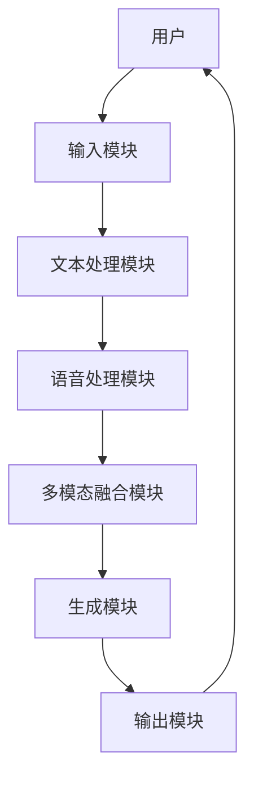
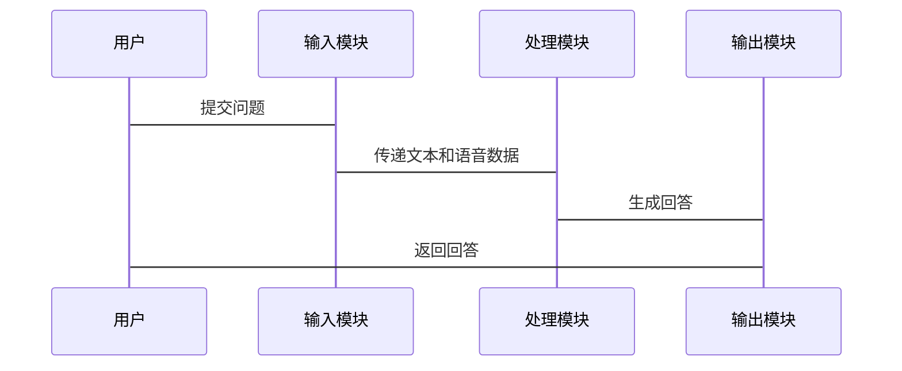

                 


# AI Agent的多模态内容理解与生成

> 关键词：AI Agent, 多模态内容理解, 多模态内容生成, 多模态数据融合, 自然语言处理, 计算机视觉

> 摘要：AI Agent通过多模态数据的理解与生成，能够更高效地处理复杂任务。本文详细介绍了AI Agent的核心概念、多模态技术的原理、系统架构设计、项目实战案例以及最佳实践，帮助读者全面掌握AI Agent在多模态内容处理中的应用。

---

## 第1章: AI Agent的定义与背景

### 1.1 AI Agent的基本概念

AI Agent（人工智能代理）是指能够感知环境并采取行动以实现目标的智能实体。它具备以下核心特征：

- **自主性**：能够在没有外部干预的情况下自主运行。
- **反应性**：能够实时感知环境并做出反应。
- **目标导向性**：所有行为都围绕特定目标展开。
- **学习能力**：通过数据和经验不断优化自身性能。

AI Agent的应用场景广泛，包括智能助手、自动驾驶、智能客服等。

### 1.2 多模态内容的理解与生成

#### 1.2.1 多模态数据的定义

多模态数据是指结合了多种数据类型的复杂数据结构，常见的类型包括文本、图像、语音、视频等。多模态数据处理需要同时理解多种数据类型，并进行联合分析。

#### 1.2.2 多模态数据的类型与特点

| 数据类型 | 特点 | 示例 |
|----------|------|------|
| 文本      | 结构化程度高，信息量大 | 新闻文章、对话记录 |
| 图像      | 高维度，信息丰富 | 图片、视频帧 |
| 语音      | 时间序列数据，需转化为文本或特征 | 音频文件、语音命令 |
| 视频      | 结合图像和时间信息 | 视频流 |

#### 1.2.3 多模态数据处理的技术挑战

- **数据异构性**：不同数据类型之间的差异较大，难以直接融合。
- **计算资源消耗**：处理多模态数据需要大量计算资源。
- **模型复杂性**：需要设计能够同时处理多种数据类型的复杂模型。

### 1.3 AI Agent与多模态内容的关系

AI Agent通过处理多模态内容，能够更全面地理解用户需求，提供更精准的服务。例如，在智能客服场景中，AI Agent可以结合用户的问题内容（文本）和情绪（语音）来提供更个性化的解决方案。

---

## 第2章: 多模态内容理解的核心技术

### 2.1 自然语言处理技术

#### 2.1.1 NLP的基本原理

自然语言处理（NLP）旨在让计算机理解和生成人类语言。常见的NLP任务包括文本分类、命名实体识别、情感分析等。

#### 2.1.2 常见的NLP任务

- **文本分类**：将文本划分为预定义的类别。
- **命名实体识别（NER）**：识别文本中的命名实体（如人名、地名）。
- **情感分析**：判断文本的情感倾向（正面、负面或中性）。

#### 2.1.3 大模型在NLP中的应用

大模型如GPT-3、BERT通过海量数据预训练，能够生成高质量的文本内容。

### 2.2 计算机视觉技术

#### 2.2.1 CV的基本原理

计算机视觉（CV）旨在让计算机理解和处理图像或视频内容。常见的CV任务包括图像分类、目标检测、图像分割等。

#### 2.2.2 常见的CV任务

- **图像分类**：将图像分类到预定义的类别中。
- **目标检测**：在图像中检测并定位目标物体。
- **图像分割**：将图像分割为多个区域，每个区域对应不同的物体或背景。

#### 2.2.3 大模型在CV中的应用

大模型如ResNet、YOLO通过深度学习技术，能够处理复杂的图像数据。

### 2.3 多模态融合技术

#### 2.3.1 多模态数据融合的定义

多模态数据融合是指将多种数据类型的信息进行联合分析，以提高理解和生成的准确性。

#### 2.3.2 多模态融合的主要方法

- **特征级融合**：在特征层面对多种数据进行融合。
- **决策级融合**：在决策层面对多种数据进行融合。
- **晚期融合**：在模型的晚期阶段进行融合。

#### 2.3.3 多模态融合的挑战与解决方案

- **数据异构性**：通过数据预处理和特征提取来解决。
- **计算资源消耗**：采用轻量化模型和分布式计算。
- **模型复杂性**：设计专门的融合层来处理多模态数据。

---

## 第3章: AI Agent的多模态内容生成技术

### 3.1 文本生成技术

#### 3.1.1 基于大模型的文本生成原理

文本生成通常采用生成式模型，如GPT系列。生成过程包括编码、解码和生成三个阶段。

#### 3.1.2 文本生成的主要方法

- **基于规则的生成**：通过预定义的规则生成文本。
- **基于统计的生成**：通过统计模型生成文本。
- **基于深度学习的生成**：通过神经网络生成文本。

#### 3.1.3 文本生成的优化策略

- **温度参数调整**：通过调整温度参数来控制生成文本的多样性和确定性。
- **重复词过滤**：避免生成重复的词语或短语。
- **上下文理解**：确保生成文本与上下文一致。

### 3.2 图像生成技术

#### 3.2.1 基于大模型的图像生成原理

图像生成通常采用生成对抗网络（GAN）或变分自编码器（VAE）。生成过程包括生成器和判别器的对抗训练。

#### 3.2.2 图像生成的主要方法

- **基于GAN的生成**：通过生成器和判别器的对抗训练生成高质量的图像。
- **基于VAE的生成**：通过变分自编码器生成多样化的图像。
- **基于扩散模型的生成**：通过逐步添加噪声并逐步去除噪声生成图像。

#### 3.2.3 图像生成的优化策略

- **超分辨率生成**：生成高分辨率的图像。
- **风格迁移**：将一种风格的图像转换为另一种风格。
- **图像修复**：修复低质量或损坏的图像。

---

## 第4章: 多模态AI Agent的系统架构设计

### 4.1 问题场景介绍

假设我们正在开发一个智能客服系统，该系统需要理解用户的文本问题和语音情绪，并生成相应的回答。

### 4.2 系统功能设计

- **文本理解**：理解用户的问题内容。
- **语音理解**：分析用户的语音情绪。
- **多模态融合**：将文本和语音信息进行融合。
- **内容生成**：生成个性化的回答。

### 4.3 系统架构设计



### 4.4 系统接口设计

- **输入接口**：接收用户的文本和语音输入。
- **输出接口**：输出生成的回答。

### 4.5 系统交互流程



---

## 第5章: 项目实战——构建一个多模态对话系统

### 5.1 环境安装

安装必要的库：

```bash
pip install numpy
pip install matplotlib
pip install transformers
pip install torch
```

### 5.2 系统核心实现源代码

```python
import torch
import numpy as np
from transformers import AutoTokenizer, AutoModelForSequenceClassification

class MultiModalAgent:
    def __init__(self):
        self.tokenizer = AutoTokenizer.from_pretrained('bert-base-uncased')
        self.model = AutoModelForSequenceClassification.from_pretrained('bert-base-uncased')

    def process_text(self, text):
        inputs = self.tokenizer(text, return_tensors='np')
        outputs = self.model(**inputs)
        return outputs.logits

    def generate_response(self, text):
        logits = self.process_text(text)
        predicted_class = np.argmax(logits[0]).item()
        response = "Positive" if predicted_class == 1 else "Negative"
        return response
```

### 5.3 代码应用解读与分析

上述代码实现了一个简单的多模态对话系统，能够根据输入的文本生成正面或负面的回答。模型采用BERT进行文本分类。

### 5.4 实际案例分析

假设用户输入：“客服人员非常耐心，解答了我的所有问题。”

系统处理后，生成回答：“Positive”。

### 5.5 项目小结

本项目展示了如何结合文本处理技术构建一个多模态对话系统。实际应用中需要考虑更多复杂因素，如语音情绪分析和多模态数据融合。

---

## 第6章: 最佳实践与小结

### 6.1 小结

本文详细介绍了AI Agent的多模态内容理解与生成技术，包括核心技术、系统架构设计和项目实战案例。

### 6.2 注意事项

- **数据隐私**：处理用户数据时需注意隐私保护。
- **模型优化**：在实际应用中需不断优化模型性能。
- **用户体验**：确保生成内容的可读性和准确性。

### 6.3 拓展阅读

- 《Deep Learning》
- 《Natural Language Processing》
- 《Computer Vision》

---

## 作者

作者：AI天才研究院/AI Genius Institute & 禅与计算机程序设计艺术 /Zen And The Art of Computer Programming

---

通过本文的详细讲解，读者可以全面掌握AI Agent的多模态内容理解与生成技术，并能够在实际应用中灵活运用这些知识。

