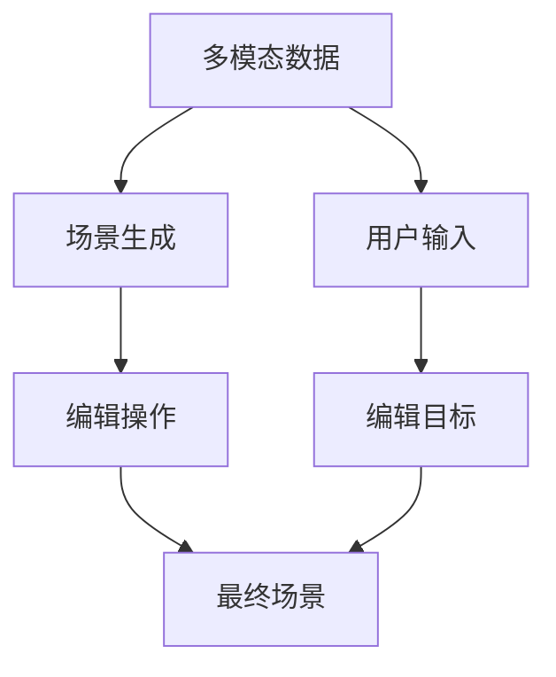
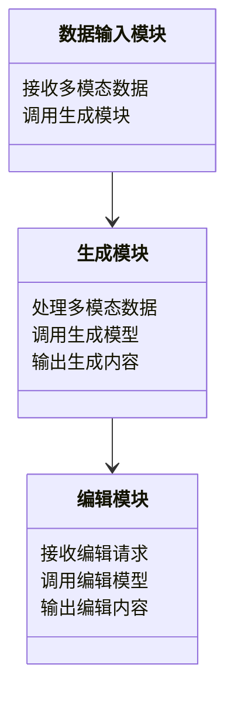
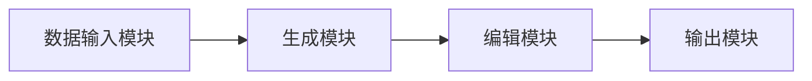
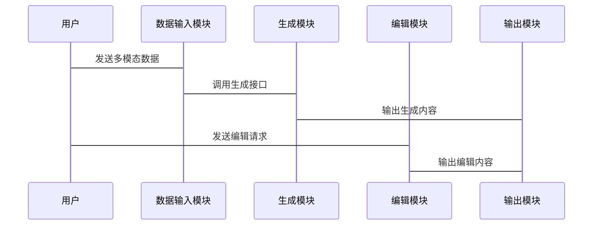

                 


```markdown
# AI Agent的多模态场景生成与编辑

## 关键词：AI Agent, 多模态场景, 场景生成, 场景编辑, 生成式AI, 多模态数据

## 摘要：  
本文深入探讨了AI Agent在多模态场景生成与编辑中的应用，系统性地分析了多模态场景生成与编辑的核心概念、技术基础、算法原理、系统架构设计以及实际应用案例。文章从背景介绍、核心概念、技术基础、算法实现、系统设计、项目实战到未来展望，层层递进，为读者提供了全面而深入的指导，帮助读者理解并掌握AI Agent在多模态场景生成与编辑领域的核心技术与实践方法。

---

# 第1章: AI Agent与多模态场景概述

## 1.1 AI Agent的基本概念

### 1.1.1 AI Agent的定义与分类  
AI Agent（人工智能代理）是指能够感知环境、自主决策并执行任务的智能实体。根据功能和应用场景，AI Agent可以分为以下几类：  
1. **反应式AI Agent**：实时感知环境并做出反应，适用于实时交互场景。  
2. **认知式AI Agent**：具备推理、规划和学习能力，适用于复杂任务。  
3. **协作式AI Agent**：能够与其他Agent或人类协作完成任务，适用于团队协作场景。  

### 1.1.2 多模态技术的背景与意义  
多模态技术是指整合多种数据形式（如文本、图像、语音、视频等）的技术。在AI Agent中，多模态技术能够增强感知能力，提升任务执行的准确性和灵活性。例如，在智能客服场景中，AI Agent可以通过文本、语音和表情等多种模态信息理解用户需求，提供更精准的服务。  

### 1.1.3 AI Agent在多模态场景中的作用  
AI Agent在多模态场景中扮演着关键角色，它能够：  
1. **整合多模态数据**：将不同形式的数据进行融合，提供更全面的感知能力。  
2. **生成与编辑场景**：基于多模态数据生成或编辑场景，满足特定任务需求。  
3. **实时交互与反馈**：通过多模态数据与用户进行实时交互，并根据反馈调整行为。  

---

## 1.2 多模态场景生成与编辑的核心问题

### 1.2.1 多模态数据的特点与挑战  
多模态数据具有以下特点：  
1. **异构性**：不同模态的数据形式和语义不同，难以直接融合。  
2. **多样性**：数据来源广泛，涵盖文本、图像、语音等多种形式。  
3. **关联性**：不同模态数据之间存在语义关联，可以通过多模态模型进行联合建模。  

挑战包括：  
1. **数据对齐**：如何在不同模态之间建立有效的关联关系。  
2. **计算复杂度**：多模态数据处理需要更高的计算资源。  
3. **模型泛化能力**：多模态模型需要在多种场景下保持稳定的性能。  

### 1.2.2 场景生成与编辑的目标与边界  
场景生成的目标是根据输入的多模态数据，生成符合特定需求的场景。场景编辑的目标是对生成的场景进行调整，使其更符合用户意图。  

边界包括：  
1. **生成范围**：生成的内容应符合逻辑和语义约束。  
2. **编辑限制**：编辑操作应在生成内容的基础上进行，避免破坏原有的结构和语义。  
3. **实时性要求**：在动态场景中，生成与编辑需要满足实时性要求。  

### 1.2.3 多模态场景生成与编辑的应用领域  
多模态场景生成与编辑的应用领域包括：  
1. **虚拟现实**：生成虚拟场景并实时编辑，用于游戏、培训等领域。  
2. **智能客服**：通过多模态数据生成和编辑对话场景，提供更智能的服务。  
3. **内容创作**：利用多模态数据生成文本、图像等内容，并进行编辑优化。  

---

## 1.3 本章小结  
本章从AI Agent的基本概念出发，介绍了多模态场景生成与编辑的核心问题，包括多模态数据的特点、生成与编辑的目标与边界，以及应用场景。下一章将深入探讨多模态场景生成与编辑的核心概念和技术要点。

---

# 第2章: 多模态场景生成与编辑的核心概念

## 2.1 多模态场景生成的原理

### 2.1.1 多模态数据融合的原理  
多模态数据融合是指将不同形式的数据进行整合，以获得更全面的信息。常见的融合方法包括：  
1. **早期融合**：在数据预处理阶段进行融合，适用于实时性要求较高的场景。  
2. **晚期融合**：在特征提取阶段或决策阶段进行融合，适用于需要深度语义分析的场景。  

### 2.1.2 场景生成的关键步骤  
场景生成的步骤包括：  
1. **数据输入**：接收多模态数据输入。  
2. **特征提取**：对输入数据进行特征提取，得到语义表示。  
3. **生成模型推理**：基于生成模型生成场景内容。  
4. **输出结果**：输出生成的场景数据。  

### 2.1.3 多模态生成模型的优缺点对比  
多模态生成模型的优缺点对比：  

| **模型类型** | **优点** | **缺点** |  
|--------------|----------|----------|  
| GAN（生成对抗网络） | 高生成质量，适用于图像生成 | 训练不稳定，难以控制生成结果 |  
| Diffusion模型 | 稳定性高，生成质量优 | 训练时间长，计算资源需求高 |  
| 多模态扩散模型 | 能够同时处理多种模态数据 | 计算复杂度高，推理速度慢 |  

---

## 2.2 多模态场景编辑的技术要点

### 2.2.1 场景编辑的基本流程  
场景编辑的基本流程包括：  
1. **输入生成内容**：接收生成的场景数据。  
2. **用户意图解析**：理解用户的编辑需求。  
3. **编辑操作执行**：根据用户意图对生成内容进行调整。  
4. **输出编辑结果**：输出编辑后的场景数据。  

### 2.2.2 多模态数据编辑的挑战  
多模态数据编辑的挑战包括：  
1. **编辑粒度**：如何实现细粒度的编辑操作。  
2. **跨模态一致性**：编辑操作需要在不同模态之间保持一致性。  
3. **用户反馈**：如何有效利用用户的反馈提升编辑效果。  

### 2.2.3 编辑效果的评估指标  
编辑效果的评估指标包括：  
1. **相似性**：编辑后的内容与原始内容的相似程度。  
2. **忠实度**：编辑后的内容是否忠实于用户的意图。  
3. **创新性**：编辑后的内容是否具有新的创意。  

---

## 2.3 核心概念的ER实体关系图



---

## 2.4 本章小结  
本章详细介绍了多模态场景生成与编辑的核心概念，包括生成的原理、编辑的技术要点以及核心概念的实体关系图。下一章将从技术基础的角度，进一步探讨多模态场景生成与编辑的实现方法。

---

# 第3章: 多模态场景生成与编辑的技术基础

## 3.1 生成式AI模型的基本原理

### 3.1.1 生成式模型的分类  
生成式AI模型的分类：  
1. **基于生成对抗网络（GAN）的模型**：如GPT、Diffusion模型。  
2. **基于变分自编码器（VAE）的模型**：如VAE、Flow-based models。  

### 3.1.2 基于概率的生成模型  
基于概率的生成模型通过学习数据的分布来生成新的样本。常见的概率模型包括：  
1. **生成对抗网络（GAN）**：由生成器和判别器组成，通过对抗训练生成高质量样本。  
2. **变分自编码器（VAE）**：通过最大化似然和KL散度来生成样本。  

### 3.1.3 基于规则的生成模型  
基于规则的生成模型通过预定义的规则或模板生成内容，适用于需要严格控制生成结果的场景。  

---

## 3.2 多模态数据处理技术

### 3.2.1 多模态数据的预处理方法  
多模态数据的预处理方法包括：  
1. **数据清洗**：去除噪声数据，确保数据质量。  
2. **数据对齐**：将不同模态的数据进行对齐，使其在语义上一致。  
3. **特征提取**：提取有助于生成的特征，降低计算复杂度。  

### 3.2.2 多模态数据融合的技术  
多模态数据融合的技术包括：  
1. **早期融合**：在数据预处理阶段进行融合，适用于实时性要求高的场景。  
2. **晚期融合**：在特征提取或决策阶段进行融合，适用于需要深度语义分析的场景。  

---

## 3.3 生成式AI模型的训练与优化

### 3.3.1 模型训练的流程  
模型训练的流程包括：  
1. **数据准备**：收集并预处理多模态数据。  
2. **模型构建**：选择合适的生成模型并定义损失函数。  
3. **训练过程**：通过对抗训练或优化算法进行模型训练。  
4. **模型评估**：通过生成样本的质量和多样性评估模型性能。  

### 3.3.2 模型优化的策略  
模型优化的策略包括：  
1. **超参数调优**：通过调整学习率、批量大小等超参数优化模型性能。  
2. **数据增强**：通过数据增强技术增加训练数据的多样性。  
3. **模型压缩**：通过模型剪枝、量化等技术减少模型的计算资源需求。  

---

## 3.4 多模态场景生成的实现步骤

### 3.4.1 数据输入与预处理  
数据输入与预处理步骤：  
1. **接收多模态数据**：如文本、图像等。  
2. **数据清洗与对齐**：去除噪声数据，确保不同模态数据的语义一致性。  

### 3.4.2 模型推理与生成  
模型推理与生成步骤：  
1. **特征提取**：将预处理后的数据输入生成模型进行特征提取。  
2. **生成内容**：通过生成模型生成多模态场景内容。  

### 3.4.3 生成结果的输出与评估  
生成结果的输出与评估步骤：  
1. **输出生成内容**：将生成的多模态场景内容输出到目标系统。  
2. **评估生成质量**：通过预设的评估指标对生成内容进行质量评估。  

---

## 3.5 本章小结  
本章从技术基础的角度，详细介绍了生成式AI模型的基本原理、多模态数据处理技术以及生成模型的训练与优化策略。下一章将从算法原理的角度，深入探讨多模态场景生成与编辑的具体实现方法。

---

# 第4章: 多模态场景生成与编辑的算法原理

## 4.1 生成对抗网络（GAN）的原理

### 4.1.1 GAN的基本结构  
GAN由生成器和判别器两个部分组成：  
1. **生成器**：负责生成与真实数据分布相似的样本。  
2. **判别器**：负责区分生成样本和真实样本。  

### 4.1.2 GAN的损失函数  
GAN的损失函数包括：  
1. **生成器的损失函数**：$L_G = \log(D(G(z)))$，其中$D$为判别器，$G$为生成器，$z$为输入噪声。  
2. **判别器的损失函数**：$L_D = \log(D(x)) + \log(1-D(G(z)))$，其中$x$为真实样本。  

### 4.1.3 GAN的训练过程  
GAN的训练过程包括：  
1. **交替优化**：生成器和判别器交替训练，分别优化各自的损失函数。  
2. **梯度计算**：通过反向传播计算梯度，并更新模型参数。  

---

## 4.2 扩散模型的原理

### 4.2.1 扩散模型的基本结构  
扩散模型通过逐步添加噪声到数据中，然后逐步去除噪声来生成样本。  

### 4.2.2 扩散模型的训练过程  
扩散模型的训练过程包括：  
1. **正向过程**：将数据逐步添加噪声，直到数据完全噪声化。  
2. **反向过程**：通过学习一个反向扩散过程，逐步去除噪声，生成干净数据。  

### 4.2.3 扩散模型的数学公式  
扩散模型的数学公式：  
1. 正向过程：$q(x_t|x_{t-1}) = \mathcal{N}(x_t; \sqrt{1-\beta_t}x_{t-1}, \beta_t I)$  
2. 反向过程：$p_\theta(x_{t-1}|x_t) = \mathcal{N}(x_{t-1}; \mu_\theta(x_t,t), \sigma_\theta(x_t,t)^2 I)$  

---

## 4.3 多模态生成模型的算法实现

### 4.3.1 多模态生成模型的输入与输出  
多模态生成模型的输入包括多模态数据，输出是生成的多模态场景内容。  

### 4.3.2 多模态生成模型的训练流程  
多模态生成模型的训练流程：  
1. **数据准备**：收集并预处理多模态数据。  
2. **模型构建**：选择合适的生成模型并定义损失函数。  
3. **训练过程**：通过对抗训练或优化算法进行模型训练。  
4. **模型评估**：通过生成样本的质量和多样性评估模型性能。  

---

## 4.4 本章小结  
本章从算法原理的角度，详细介绍了生成对抗网络（GAN）和扩散模型的基本原理，以及多模态生成模型的实现方法。下一章将从系统架构设计的角度，探讨多模态场景生成与编辑的实现方案。

---

# 第5章: 多模态场景生成与编辑的系统架构设计

## 5.1 问题场景介绍

### 5.1.1 问题背景  
多模态场景生成与编辑需要解决的问题包括：  
1. **数据异构性**：不同模态的数据形式和语义不同，难以直接融合。  
2. **计算复杂度**：多模态数据处理需要更高的计算资源。  

### 5.1.2 问题目标  
本系统的目标是设计一个支持多模态场景生成与编辑的AI Agent系统，能够高效处理多模态数据，生成高质量的场景内容，并支持实时编辑功能。

---

## 5.2 系统功能设计

### 5.2.1 系统功能模块划分  
系统功能模块包括：  
1. **数据输入模块**：接收多模态数据输入。  
2. **生成模块**：基于多模态数据生成场景内容。  
3. **编辑模块**：支持用户对生成内容进行编辑操作。  
4. **输出模块**：输出生成或编辑后的场景内容。  

### 5.2.2 功能模块的领域模型



---

## 5.3 系统架构设计

### 5.3.1 系统架构设计的总体思路  
系统架构设计的总体思路是基于微服务架构，将生成与编辑功能模块化，便于扩展和维护。  

### 5.3.2 系统架构图



---

## 5.4 系统接口设计

### 5.4.1 系统接口的设计原则  
系统接口设计的原则包括：  
1. **模块化**：接口设计应模块化，便于功能扩展。  
2. **标准化**：接口应遵循标准化协议，便于与其他系统集成。  

### 5.4.2 系统接口的实现  
系统接口的实现包括：  
1. **RESTful API**：用于模块之间的通信。  
2. **消息队列**：用于异步处理复杂的生成与编辑任务。  

---

## 5.5 系统交互设计

### 5.5.1 系统交互的流程图



---

## 5.6 本章小结  
本章从系统架构设计的角度，详细介绍了多模态场景生成与编辑系统的功能模块划分、架构设计以及接口设计。下一章将从项目实战的角度，提供具体的实现代码和案例分析。

---

# 第6章: 多模态场景生成与编辑的项目实战

## 6.1 环境安装与配置

### 6.1.1 开发环境要求  
开发环境要求包括：  
1. **操作系统**：Linux/Windows/MacOS  
2. **Python版本**：3.8以上  
3. **依赖库**：TensorFlow、PyTorch、Keras、Mermaid等  

### 6.1.2 安装依赖库  
安装依赖库的命令：  
```bash
pip install tensorflow keras pytorch mermaid4jupyter jupyter notebook
```

---

## 6.2 系统核心实现

### 6.2.1 生成模块的实现

```python
import tensorflow as tf
from tensorflow.keras import layers

# 定义生成器模型
def build_generator(input_dim):
    model = tf.keras.Sequential([
        layers.Dense(256, activation='relu'),
        layers.Dense(128, activation='relu'),
        layers.Dense(input_dim, activation='sigmoid')
    ])
    return model

# 定义判别器模型
def build_discriminator(input_dim):
    model = tf.keras.Sequential([
        layers.Dense(128, activation='relu'),
        layers.Dense(64, activation='relu'),
        layers.Dense(1, activation='sigmoid')
    ])
    return model

# 定义损失函数
cross_entropy = tf.keras.losses.BinaryCrossentropy()

# 定义生成器损失函数
def generator_loss(fake_output):
    return cross_entropy(tf.ones_like(fake_output), fake_output)

# 定义判别器损失函数
def discriminator_loss(real_output, fake_output):
    return cross_entropy(tf.ones_like(real_output), real_output) + cross_entropy(tf.zeros_like(fake_output), fake_output)

# 编译模型
generator = build_generator(input_dim)
discriminator = build_discriminator(input_dim)
generator_optimizer = tf.keras.optimizers.Adam(0.0002)
discriminator_optimizer = tf.keras.optimizers.Adam(0.0002)

# 训练过程
def train_step(real_images, generator, discriminator, generator_optimizer, discriminator_optimizer):
    noise = tf.random.normal([batch_size, noise_dim])
    generated_images = generator(noise)
    
    real_labels = tf.ones_like(real_images)
    fake_labels = tf.zeros_like(generated_images)
    
    with tf.GradientTape() as gen_tape, tf.GradientTape() as disc_tape:
        generated_output = discriminator(generated_images)
        gen_loss = generator_loss(generated_output)
        real_output = discriminator(real_images)
        disc_loss = discriminator_loss(real_output, generated_output)
        
    gradients_of_generator = gen_tape.gradient(gen_loss, generator.trainable_weights)
    gradients_of_discriminator = disc_tape.gradient(disc_loss, discriminator.trainable_weights)
    
    generator_optimizer.apply_gradients(zip(gradients_of_generator, generator.trainable_weights))
    discriminator_optimizer.apply_gradients(zip(gradients_of_discriminator, discriminator.trainable_weights))
```

### 6.2.2 编辑模块的实现  
编辑模块的实现包括：  
1. **接收编辑请求**：解析用户的编辑需求。  
2. **调用编辑模型**：对生成内容进行编辑操作。  
3. **输出编辑结果**：返回编辑后的场景内容。  

---

## 6.3 项目实战案例分析

### 6.3.1 案例背景  
本案例旨在通过多模态数据生成与编辑一个虚拟场景，包括文本描述和图像生成。  

### 6.3.2 案例实现步骤  
1. **数据输入**：接收用户的场景描述文本。  
2. **生成场景**：基于文本生成虚拟场景图像。  
3. **用户编辑**：用户对生成图像进行编辑，调整颜色、布局等。  
4. **输出结果**：输出编辑后的虚拟场景图像。  

---

## 6.4 项目总结与经验分享

### 6.4.1 项目总结  
本项目通过实现一个多模态场景生成与编辑系统，验证了AI Agent在多模态场景生成与编辑中的应用潜力。系统实现了生成与编辑功能，能够处理多种模态数据，并支持实时交互。

### 6.4.2 经验分享  
1. **数据质量**：多模态数据的质量直接影响生成效果，数据预处理至关重要。  
2. **模型选择**：根据具体需求选择合适的生成模型，如GAN或扩散模型。  
3. **系统优化**：通过模型压缩和并行计算优化系统的运行效率。  

---

## 6.5 本章小结  
本章通过项目实战，详细介绍了多模态场景生成与编辑系统的实现过程，包括环境配置、核心代码实现、案例分析以及经验总结。下一章将从未来展望的角度，探讨多模态场景生成与编辑的发展方向。

---

# 第7章: 多模态场景生成与编辑的未来展望

## 7.1 未来研究方向

### 7.1.1 新型生成模型的研究  
未来的研究方向包括：  
1. **更高效的生成模型**：如更稳定的扩散模型和更高效的GAN变体。  
2. **多模态生成模型的优化**：提升多模态数据融合的效率和质量。  

### 7.1.2 AI Agent的智能性提升  
AI Agent的智能性提升方向包括：  
1. **增强学习**：通过强化学习提升AI Agent的自主决策能力。  
2. **多模态推理**：提升AI Agent在多模态数据中的推理能力。  

---

## 7.2 多模态场景生成与编辑的应用趋势

### 7.2.1 虚拟现实中的应用  
多模态场景生成与编辑在虚拟现实中的应用包括：  
1. **虚拟场景生成**：生成高质量的虚拟场景用于游戏、培训等领域。  
2. **实时交互与编辑**：支持用户实时编辑虚拟场景，提升用户体验。  

### 7.2.2 智能客服中的应用  
多模态场景生成与编辑在智能客服中的应用包括：  
1. **对话生成**：生成自然的对话内容。  
2. **情感分析与编辑**：通过分析用户情感生成相应的编辑内容。  

---

## 7.3 本章小结  
本章从未来展望的角度，探讨了多模态场景生成与编辑的发展方向和应用趋势。未来的研究和应用将更加注重生成模型的效率和智能性，同时在虚拟现实和智能客服等领域发挥更大的作用。

---

# 结语

多模态场景生成与编辑是一项充满挑战和机遇的技术，随着生成式AI模型的不断进步和AI Agent智能性的提升，其应用前景将更加广阔。希望本文能够为读者提供有价值的参考，帮助他们在多模态场景生成与编辑领域取得更大的突破。

---

# 作者：AI天才研究院/AI Genius Institute & 禅与计算机程序设计艺术 /Zen And The Art of Computer Programming
```

