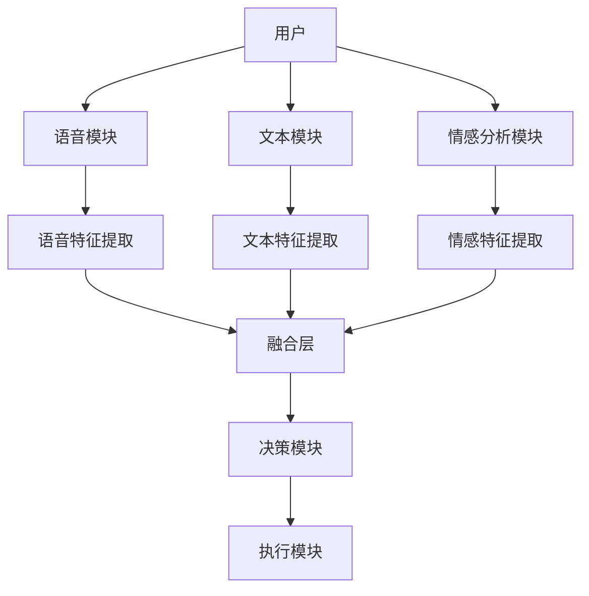

                 

# AI Agent的多模态情境感知与反应系统

> 关键词：AI Agent，多模态情境感知，反应系统，深度学习，系统架构

> 摘要：本文详细探讨了AI Agent在多模态情境感知与反应系统中的应用。通过分析多模态数据的融合方法、情境感知的实现原理、系统架构设计以及实际案例，本文为读者提供了全面的技术解读。

---

## 第1章: AI Agent的基本概念与背景

### 1.1 AI Agent的定义与特点

AI Agent（人工智能代理）是指能够感知环境、自主决策并采取行动以实现特定目标的智能体。与传统的程序不同，AI Agent具备以下特点：

- **自主性**：能够在没有外部干预的情况下独立运行。
- **反应性**：能够实时感知环境变化并做出反应。
- **学习能力**：通过数据和经验不断优化自身的行为。
- **多模态交互**：能够处理和整合多种类型的数据（如视觉、听觉、语言等）。

### 1.2 多模态情境感知的背景与意义

#### 1.2.1 多模态数据的定义与分类

多模态数据指的是来自不同感官渠道的信息，包括：

- **视觉模态**：图像、视频等。
- **听觉模态**：语音、音乐等。
- **语言模态**：文本、自然语言处理相关的数据。
- **触觉模态**：触摸感知的数据。
- **嗅觉模态**：气味相关的数据。

#### 1.2.2 情境感知的重要性

情境感知是指AI Agent能够理解当前环境的状态，并基于此做出合理的决策。多模态情境感知通过整合多种模态的数据，能够更全面地理解环境，从而提高决策的准确性和鲁棒性。

#### 1.2.3 多模态情境感知的应用场景

- **智能安防**：通过整合视频、声音等多种数据，实现对异常行为的实时监测。
- **智能交通**：通过整合视觉、雷达等数据，实现对交通状况的实时分析。
- **智能家居**：通过整合语音、温度、湿度等多种数据，实现对家庭环境的智能控制。

---

## 第2章: 多模态情境感知的原理与方法

### 2.1 多模态数据的融合原理

#### 2.1.1 数据预处理

在融合多模态数据之前，需要对各个模态的数据进行预处理，以消除噪声并提取有用的特征。例如：

- **图像模态**：进行降噪、边缘检测等预处理。
- **语音模态**：进行降噪、特征提取（如MFCC）等预处理。

#### 2.1.2 数据融合方法

数据融合的方法可以分为以下几种：

1. **基于特征的融合**：将不同模态的特征向量进行拼接或加权融合。
2. **基于决策的融合**：将不同模态的决策结果进行融合。
3. **基于模型的融合**：通过深度学习模型（如多模态神经网络）进行融合。

### 2.2 情境感知的实现方法

#### 2.2.1 基于深度学习的感知方法

深度学习模型（如卷积神经网络CNN、循环神经网络RNN）在多模态情境感知中得到了广泛应用。例如，可以通过多模态注意力网络（Multi-modal Attention Network）来实现对不同模态信息的关注。

#### 2.2.2 基于规则的感知方法

基于规则的感知方法通过预定义的规则来判断环境状态。例如，当图像中检测到“烟雾”且语音中提到“火灾”时，触发报警。

#### 2.2.3 混合感知方法

混合感知方法结合了基于深度学习和基于规则的方法，通过深度学习模型提取高级特征，并结合预定义规则进行最终的判断。

---

## 第3章: 多模态数据融合的数学模型与算法

### 3.1 多模态注意力网络的数学模型

多模态注意力网络通过计算不同模态之间的注意力权重，实现对重要信息的聚焦。其数学模型如下：

$$
\text{Attention}(Q, K, V) = \text{softmax}\left(\frac{QK^T}{\sqrt{d_k}}\right)V
$$

其中，$Q$、$K$、$V$分别表示查询、键、值向量，$d_k$表示向量的维度。

### 3.2 多模态融合算法的实现步骤

#### 3.2.1 数据预处理

1. 对图像数据进行归一化处理。
2. 对语音数据提取MFCC特征。

#### 3.2.2 特征提取

1. 使用卷积神经网络提取图像特征。
2. 使用循环神经网络提取语音特征。

#### 3.2.3 多模态融合

1. 将图像和语音特征拼接成一个多维向量。
2. 使用多模态注意力网络计算注意力权重。
3. 根据注意力权重对特征向量进行加权求和，得到最终的融合特征。

---

## 第4章: 多模态情境感知的系统架构设计

### 4.1 系统架构的组成

多模态情境感知系统通常由以下几部分组成：

- **数据采集层**：负责采集多模态数据。
- **特征提取层**：对采集到的数据进行特征提取。
- **融合层**：将不同模态的特征进行融合。
- **决策层**：基于融合后的特征进行情境判断并输出决策结果。
- **执行层**：根据决策结果采取相应的行动。

### 4.2 系统架构的优缺点

- **优点**：能够充分利用多模态数据的优势，提高感知的准确性和鲁棒性。
- **缺点**：系统复杂度较高，实现难度较大。

---

## 第5章: 项目实战——基于多模态情境感知的智能客服系统

### 5.1 项目背景与目标

智能客服系统通过整合用户的语音、文本和情感数据，实现对客户需求的精准理解，并提供个性化的服务。

### 5.2 系统功能设计

#### 5.2.1 领域模型设计

- **用户模块**：管理用户信息。
- **语音模块**：处理用户的语音输入。
- **文本模块**：处理用户的文本输入。
- **情感分析模块**：分析用户的情感状态。
- **决策模块**：基于多模态数据进行情境判断并输出服务方案。

#### 5.2.2 系统架构设计

---

## 第6章: 总结与展望

### 6.1 本章总结

本文详细探讨了AI Agent在多模态情境感知与反应系统中的应用，从理论到实践，全面分析了多模态数据融合的方法、系统架构设计以及实际案例。

### 6.2 未来展望

随着深度学习和多模态技术的不断发展，AI Agent在多模态情境感知与反应系统中的应用前景广阔。未来的研究方向包括：

- 更高效的多模态数据融合方法。
- 更智能的决策算法。
- 更灵活的系统架构设计。

---

## 作者

作者：AI天才研究院 & 禅与计算机程序设计艺术

---

希望这篇文章能够为读者提供有价值的技术见解和实践指导。

