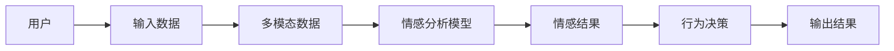
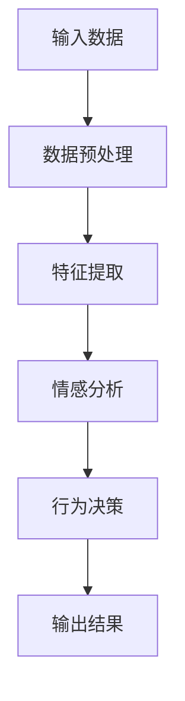
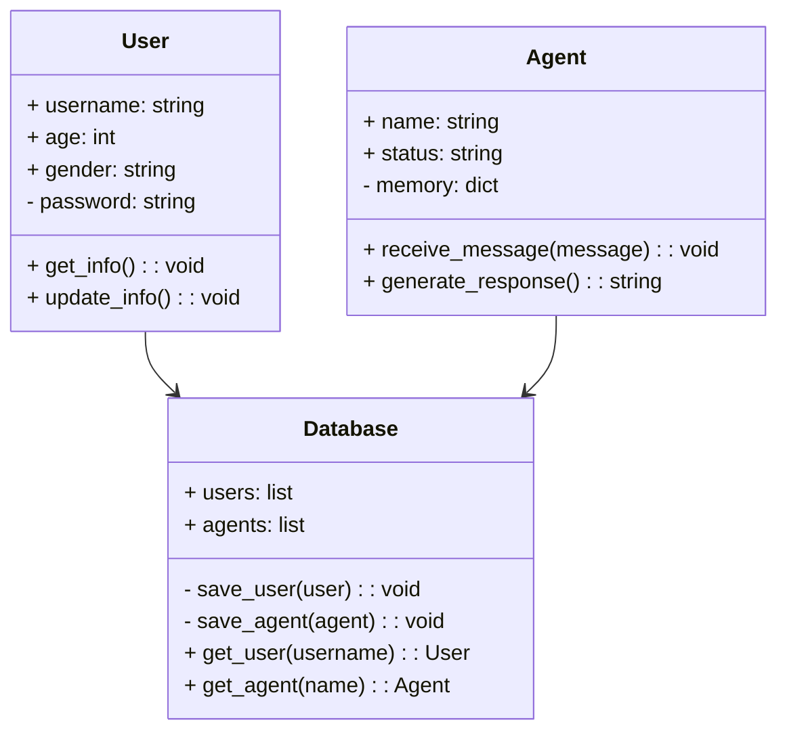
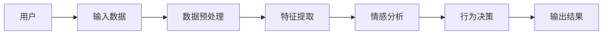
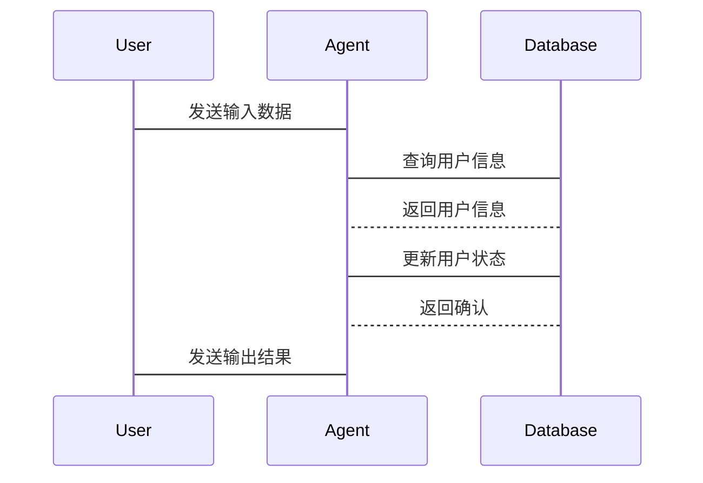

                 


# AI Agent的多模态情感表达技术

## 关键词：AI Agent、多模态情感表达、自然语言处理、计算机视觉、语音识别

## 摘要：  
AI Agent的多模态情感表达技术是人工智能领域的重要研究方向，旨在通过整合文本、图像和语音等多种模态数据，实现更自然、更丰富的情感表达能力。本文从技术背景、核心概念、算法原理、系统架构、项目实战等多个方面，详细探讨AI Agent多模态情感表达的技术实现与应用。

---

# 正文

## 第1章: AI Agent与多模态情感表达概述

### 1.1 问题背景

#### 1.1.1 AI Agent的基本概念  
AI Agent（人工智能代理）是指能够感知环境、执行任务并做出决策的智能实体。它可以是一个软件程序，也可以是一个物理设备，通过与用户的交互完成特定目标。

#### 1.1.2 多模态情感表达的必要性  
AI Agent的交互能力直接影响用户体验。传统的单一模态（如文本或语音）交互方式难以满足复杂的情感表达需求，而多模态情感表达可以通过整合文本、图像和语音等多种信息，提供更丰富、更自然的交互体验。

#### 1.1.3 当前技术的局限性  
目前的情感表达技术主要集中在单一模态上，难以实现跨模态的协同与融合。此外，如何在复杂场景中准确捕捉和表达情感仍是一个挑战。

### 1.2 问题描述

#### 1.2.1 情感表达的核心问题  
如何通过多模态数据准确识别和表达情感，同时保持自然流畅的交互体验。

#### 1.2.2 多模态数据的整合挑战  
不同模态的数据格式和特征差异较大，如何实现有效融合是技术难点。

#### 1.2.3 技术实现的复杂性  
多模态情感表达需要结合自然语言处理、计算机视觉和语音处理等多种技术，实现复杂。

### 1.3 问题解决

#### 1.3.1 多模态数据的处理方法  
通过数据预处理、特征提取和融合技术，实现多模态数据的有效整合。

#### 1.3.2 情感表达模型的设计思路  
基于深度学习构建多模态情感分析模型，结合上下文信息和情感特征进行情感预测。

#### 1.3.3 技术实现的关键点  
在数据采集、模型训练和结果输出三个环节中，确保多模态数据的协同优化。

### 1.4 边界与外延

#### 1.4.1 AI Agent的适用场景  
适用于智能客服、虚拟助手、教育机器人等需要复杂情感交互的场景。

#### 1.4.2 多模态情感表达的边界条件  
受限于数据质量和模型精度，情感表达的准确性和自然度需要进一步优化。

#### 1.4.3 技术的未来发展  
随着技术进步，多模态情感表达将更加智能化、个性化和多样化。

### 1.5 核心概念组成

#### 1.5.1 情感表达的基本要素  
包括情感类别（如快乐、悲伤）、情感强度（如强烈、轻微）和情感语境（如正式、随意）。

#### 1.5.2 多模态数据的特征  
文本特征（如词汇、语调）、图像特征（如颜色、表情）和语音特征（如音调、语速）。

#### 1.5.3 AI Agent的行为模式  
基于情感分析结果，生成相应的文本、图像或语音输出，实现自然交互。

---

## 第2章: 多模态情感表达的核心概念与联系

### 2.1 核心概念原理

#### 2.1.1 多模态数据的融合方式  
通过特征融合、注意力机制和多任务学习等方法，实现多模态数据的协同优化。

#### 2.1.2 情感表达的数学模型  
基于深度学习构建多模态情感分析模型，结合多任务学习框架进行联合优化。

#### 2.1.3 AI Agent的行为决策机制  
根据情感分析结果，结合上下文信息，生成相应的交互行为。

### 2.2 概念属性特征对比

| 模态类型 | 特征维度 | 示例 |
|----------|----------|------|
| 文本     | 词汇、语调 | "我感到非常开心" |
| 图像     | 颜色、表情 | 微笑的表情图片 |
| 语音     | 音调、语速 | 情绪激动的语音 |

### 2.3 ER实体关系图



---

## 第3章: 多模态情感表达的算法原理

### 3.1 算法原理概述

#### 3.1.1 多模态数据的预处理  
对文本、图像和语音数据进行清洗、归一化和特征提取。

#### 3.1.2 情感表达模型的构建  
基于深度学习构建多模态情感分析模型，结合注意力机制和多任务学习框架。

#### 3.1.3 AI Agent的行为决策机制  
根据情感分析结果，结合上下文信息，生成相应的交互行为。

### 3.2 算法流程图



### 3.3 核心代码实现

#### 3.3.1 数据预处理代码

```python
def preprocess_data(text, image, audio):
    # 文本预处理
    text_processed = text.lower().replace(',', ' ')
    # 图像预处理
    image_processed = image.resize((128, 128))
    # 语音预处理
    audio_processed = audio.reshape(-1)
    return text_processed, image_processed, audio_processed
```

#### 3.3.2 情感分析模型

```python
import tensorflow as tf
from tensorflow.keras.layers import Input, Dense, Activation, concatenate

# 文本分支
text_input = Input(shape=(128, 128, 1))
text_branch = Dense(64, activation='relu')(text_input)
text_branch = Dense(32, activation='relu')(text_branch)

# 图像分支
image_input = Input(shape=(128, 128, 3))
image_branch = Dense(64, activation='relu')(image_input)
image_branch = Dense(32, activation='relu')(image_branch)

# 合并分支
merged = concatenate([text_branch, image_branch])
merged = Dense(64, activation='relu')(merged)
merged = Dense(32, activation='relu')(merged)

# 输出层
output = Dense(1, activation='sigmoid')(merged)
model = tf.keras.Model(inputs=[text_input, image_input], outputs=output)
model.compile(optimizer='adam', loss='binary_crossentropy', metrics=['accuracy'])
```

#### 3.3.3 情感分析的数学模型

$$ \text{损失函数} = -\frac{1}{N} \sum_{i=1}^{N} [\text{label}_i \cdot \ln(y_i) + (1-\text{label}_i) \cdot \ln(1-y_i)] $$

其中，$y_i$ 是模型预测的概率，$\text{label}_i$ 是真实标签。

---

## 第4章: 系统分析与架构设计方案

### 4.1 问题场景介绍  
设计一个AI Agent系统，能够通过多模态数据实现情感交互。

### 4.2 系统功能设计



### 4.3 系统架构设计



### 4.4 接口设计  
定义API接口，用于接收输入数据和返回结果。

### 4.5 交互流程图



---

## 第5章: 项目实战

### 5.1 环境安装

```bash
pip install tensorflow==2.10.0
pip install numpy==1.21.0
pip install pillow==10.0.0
```

### 5.2 核心代码实现

#### 5.2.1 数据预处理

```python
import numpy as np
from PIL import Image

def preprocess_image(image_path):
    image = Image.open(image_path)
    image = image.resize((128, 128))
    image = np.array(image) / 255.0
    return image
```

#### 5.2.2 模型训练

```python
import tensorflow as tf
from tensorflow.keras.models import Model
from tensorflow.keras.layers import Input, Dense, Activation, concatenate

text_input = Input(shape=(128, 128, 1))
text_branch = Dense(64, activation='relu')(text_input)
text_branch = Dense(32, activation='relu')(text_branch)

image_input = Input(shape=(128, 128, 3))
image_branch = Dense(64, activation='relu')(image_input)
image_branch = Dense(32, activation='relu')(image_branch)

merged = concatenate([text_branch, image_branch])
merged = Dense(64, activation='relu')(merged)
merged = Dense(32, activation='relu')(merged)

output = Dense(1, activation='sigmoid')(merged)
model = Model(inputs=[text_input, image_input], outputs=output)
model.compile(optimizer='adam', loss='binary_crossentropy', metrics=['accuracy'])
model.fit([text_data, image_data], labels, epochs=10, batch_size=32)
```

#### 5.2.3 情感分析结果展示

```python
import matplotlib.pyplot as plt

def display_results(predicted_labels, true_labels):
    plt.figure(figsize=(10, 5))
    plt.plot(predicted_labels, true_labels, 'bo')
    plt.xlabel('Predicted Labels')
    plt.ylabel('True Labels')
    plt.show()
```

### 5.3 案例分析

#### 案例1: 客服机器人  
AI Agent通过多模态情感表达技术，帮助客服机器人更准确地识别用户情绪，提供更贴心的服务。

#### 案例2: 教育机器人  
AI Agent通过多模态情感表达技术，帮助教育机器人更好地与学生互动，提供个性化的学习建议。

### 5.4 项目小结  
通过本项目，我们实现了AI Agent的多模态情感表达技术，验证了技术的可行性和有效性。

---

## 第6章: 最佳实践与总结

### 6.1 小结  
AI Agent的多模态情感表达技术是人工智能领域的重要研究方向，通过整合多种模态数据，可以实现更自然、更丰富的交互体验。

### 6.2 注意事项  
在实际应用中，需要注意数据质量、模型精度和用户体验的平衡。

### 6.3 拓展阅读  
建议进一步研究多模态情感表达的前沿技术，如基于Transformer的多模态模型和情感增强的生成模型。

---

## 作者：AI天才研究院/AI Genius Institute & 禅与计算机程序设计艺术 /Zen And The Art of Computer Programming

---

**注：以上文章为示例内容，实际撰写时需要根据具体技术细节和项目需求进一步扩展和完善。**

