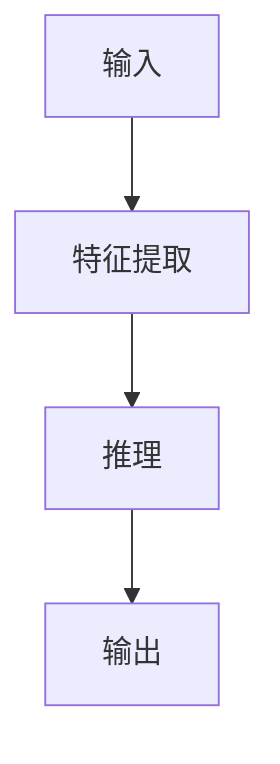

                 


好的，接下来我将按照您的要求，逐步思考如何撰写这篇文章。首先，我需要理解您的需求：撰写一篇关于《AI Agent的多模态跨域推理技术》的技术博客文章，要求逻辑清晰、结构紧凑、语言专业，涵盖多模态跨域推理技术的背景、核心概念、算法原理、系统架构设计、项目实战以及最佳实践等内容。

让我们从文章的各个部分开始思考。

---

# 《AI Agent的多模态跨域推理技术》

## 关键词：
- AI Agent
- 多模态推理
- 跨域推理
- 系统架构
- 项目实战

## 摘要：
本文深入探讨了AI Agent的多模态跨域推理技术，从背景、核心概念、算法原理到系统架构设计，再到项目实战，全面解析了这一技术的核心思想和实现方法。通过具体案例分析和代码实现，帮助读者理解如何在实际项目中应用这一技术。文章最后总结了最佳实践和注意事项，为读者提供了宝贵的指导。

---

## 第一部分: AI Agent的多模态跨域推理技术概述

### 第1章: AI Agent与多模态跨域推理概述

#### 1.1 AI Agent的基本概念
##### 1.1.1 AI Agent的定义与特点
AI Agent（人工智能代理）是指具有自主决策和行动能力的智能实体，能够感知环境、理解任务需求并采取相应行动以实现目标。AI Agent的特点包括：
- **自主性**：能够在没有外部干预的情况下独立运行。
- **反应性**：能够根据环境变化实时调整行为。
- **目标导向性**：具有明确的目标，所有行为都围绕目标展开。
- **学习能力**：通过数据和经验不断优化自身性能。

##### 1.1.2 多模态推理的定义与特点
多模态推理是指在处理多个不同形式的数据（如文本、图像、语音、视频等）时，能够综合这些信息进行推理的能力。其特点包括：
- **多维度性**：能够处理多种类型的数据，信息来源广泛。
- **综合性**：能够将不同模态的信息进行融合，得出更准确的结论。
- **适应性**：能够根据任务需求动态调整对不同模态数据的依赖程度。

##### 1.1.3 跨域推理的定义与特点
跨域推理是指在不同领域或不同场景之间进行推理的能力。其特点包括：
- **领域独立性**：能够在多个领域之间切换，适应不同的应用场景。
- **知识迁移性**：能够将一个领域的知识迁移到另一个领域，降低跨领域推理的难度。
- **复杂性**：跨域推理需要处理不同领域之间的差异和关联，具有较高的复杂性。

---

#### 1.2 多模态跨域推理技术的背景与意义
##### 1.2.1 当前AI Agent的发展现状
当前，AI Agent技术已经广泛应用于自动驾驶、智能助手、机器人等领域。然而，现有的AI Agent大多局限于单一模态的数据处理能力，难以应对复杂的多模态场景。

##### 1.2.2 多模态跨域推理技术的提出背景
随着技术的发展，AI Agent需要在更加复杂的环境中完成任务，例如自动驾驶需要处理视觉、激光雷达、GPS等多种数据源。为了应对这些挑战，多模态跨域推理技术应运而生。

##### 1.2.3 技术对AI Agent能力的提升作用
多模态跨域推理技术能够显著提升AI Agent的感知能力、决策能力和适应能力，使其能够更好地应对复杂的现实场景。

---

#### 1.3 本书的核心内容与目标
##### 1.3.1 本书的核心问题
本书的核心问题是：如何通过多模态跨域推理技术提升AI Agent的智能水平，使其能够更好地应对复杂的现实场景。

##### 1.3.2 本书的主要目标
本书的主要目标是：
- 深入解析多模态跨域推理技术的核心原理。
- 提供具体的算法实现方法。
- 通过实际案例展示技术的应用场景。

##### 1.3.3 本书的结构安排
本书的结构安排如下：
- **第一部分**：多模态跨域推理技术的概述。
- **第二部分**：多模态跨域推理技术的核心概念。
- **第三部分**：多模态跨域推理技术的算法原理。
- **第四部分**：多模态跨域推理技术的系统架构设计。
- **第五部分**：多模态跨域推理技术的项目实战。

---

## 第二部分: 多模态跨域推理技术的核心概念

### 第2章: 多模态跨域推理技术的核心概念

#### 2.1 多模态数据的定义与特征
##### 2.1.1 多模态数据的定义
多模态数据是指由多种不同形式的数据组成的数据集，例如文本、图像、语音、视频等。

##### 2.1.2 各种模态数据的特征对比
| 模态类型 | 特征描述 |
|----------|----------|
| 文本      | 结构化、可读性高、易于处理 |
| 图像      | 非结构化、信息丰富、依赖视觉特征 |
| 语音      | 非结构化、依赖听觉特征 |
| 视频      | 非结构化、包含时空信息 |

##### 2.1.3 多模态数据的融合方式
多模态数据的融合方式包括：
- **特征级融合**：将不同模态的特征向量进行融合。
- **决策级融合**：将不同模态的决策结果进行融合。
- **混合融合**：结合特征级和决策级的融合方式。

---

#### 2.2 跨域推理的定义与实现方式
##### 2.2.1 跨域推理的定义
跨域推理是指在不同领域或不同场景之间进行推理的能力。

##### 2.2.2 跨域推理的实现方式
跨域推理的实现方式包括：
- **领域适应**：通过迁移学习将一个领域的知识迁移到另一个领域。
- **跨领域特征提取**：提取不同领域之间的共同特征。
- **领域联合推理**：在多个领域之间同时进行推理。

---

#### 2.3 多模态跨域推理的数学模型
##### 2.3.1 基础数学模型
多模态跨域推理的基本数学模型可以表示为：
$$ y = f(x_1, x_2, \ldots, x_n) $$
其中，$x_i$ 表示不同模态的输入数据，$y$ 是推理结果。

##### 2.3.2 跨域推理的数学表达式
跨域推理的数学表达式可以表示为：
$$ y = g(f_1(x_1), f_2(x_2), \ldots, f_n(x_n)) $$
其中，$f_i$ 表示对不同模态数据的处理函数，$g$ 是最终的推理函数。

##### 2.3.3 多模态数据融合的数学模型
多模态数据融合的数学模型可以表示为：
$$ y = \sum_{i=1}^n \alpha_i f_i(x_i) $$
其中，$\alpha_i$ 是融合权重，$f_i$ 是对不同模态数据的处理函数。

---

## 第三部分: 多模态跨域推理技术的算法原理

### 第3章: 多模态跨域推理技术的算法原理

#### 3.1 基于多模态数据的特征提取算法
##### 3.1.1 多模态数据的特征提取方法
多模态数据的特征提取方法包括：
- **文本特征提取**：使用词袋模型或词嵌模型（如Word2Vec）提取文本特征。
- **图像特征提取**：使用CNN或Transformer提取图像特征。
- **语音特征提取**：使用Mel-Frequency Cepstral Coefficients (MFCC)提取语音特征。

##### 3.1.2 各种特征提取算法的优缺点对比
| 特征提取方法 | 优点 | 缺点 |
|--------------|------|------|
| 词袋模型      | 简单易实现 | 无法捕捉语义信息 |
| Word2Vec      | 可以捕捉语义信息 | 计算复杂度高 |
| CNN           | 特征提取能力强 | 对图像质量敏感 |
| Transformer    | 可处理长序列 | 计算资源消耗大 |
| MFCC          | 适合语音信号处理 | 特征维度较高 |

##### 3.1.3 特征提取的数学模型与公式
文本特征提取的Word2Vec模型可以表示为：
$$ w_i = f(word_i) $$
其中，$w_i$ 是词向量，$f$ 是Word2Vec模型。

---

#### 3.2 跨域推理的算法实现
##### 3.2.1 跨域推理的基本算法
跨域推理的基本算法包括：
- **迁移学习**：通过迁移学习将一个领域的知识迁移到另一个领域。
- **多任务学习**：在多个任务之间共享特征，提升跨域推理能力。

##### 3.2.2 基于图的跨域推理算法
基于图的跨域推理算法可以通过构建领域图谱，将不同领域的知识进行关联。例如：
$$ G = (V, E) $$
其中，$V$ 是节点集合，$E$ 是边集合。

##### 3.2.3 跨域推理算法的优化方法
跨域推理算法的优化方法包括：
- **领域适应**：通过对抗训练或加权损失函数优化跨域推理性能。
- **正则化**：通过添加正则化项降低过拟合风险。

---

## 第四部分: 多模态跨域推理技术的系统架构设计

### 第4章: 多模态跨域推理技术的系统架构设计

#### 4.1 系统功能设计
##### 4.1.1 系统的主要功能模块
多模态跨域推理系统的功能模块包括：
- **数据输入模块**：接收多模态数据输入。
- **特征提取模块**：对不同模态数据进行特征提取。
- **推理模块**：基于提取的特征进行跨域推理。
- **结果输出模块**：输出推理结果。

##### 4.1.2 各功能模块之间的关系
各功能模块之间的关系可以表示为：
$$ 输入 \rightarrow 特征提取 \rightarrow 推理 \rightarrow 输出 $$

##### 4.1.3 系统的功能流程图


---

#### 4.2 系统架构设计
##### 4.2.1 系统的分层架构设计
系统的分层架构设计包括：
- **数据层**：存储多模态数据。
- **特征层**：存储特征提取结果。
- **推理层**：执行跨域推理。
- **应用层**：输出推理结果。

##### 4.2.2 各层之间的交互关系
各层之间的交互关系可以表示为：
$$ 数据层 \rightarrow 特征层 \rightarrow 推理层 \rightarrow 应用层 $$

##### 4.2.3 系统的模块化设计
系统的模块化设计可以通过模块化编程实现，例如：
```python
class DataInput:
    def __init__(self):
        pass

class FeatureExtractor:
    def extract(self, data):
        pass

class Reasoner:
    def reason(self, features):
        pass

class Output:
    def output(self, result):
        pass
```

---

#### 4.3 系统接口设计
##### 4.3.1 系统的主要接口
系统的主要接口包括：
- **数据输入接口**：接收多模态数据。
- **特征提取接口**：对不同模态数据进行特征提取。
- **推理接口**：执行跨域推理。
- **结果输出接口**：输出推理结果。

##### 4.3.2 接口之间的调用关系
接口之间的调用关系可以表示为：
$$ 数据输入 \rightarrow 特征提取 \rightarrow 推理 \rightarrow 结果输出 $$

##### 4.3.3 接口的实现方式
接口的实现方式可以通过函数调用实现，例如：
```python
def input_data(data):
    pass

def extract_features(data):
    pass

def reason(features):
    pass

def output_result(result):
    pass
```

---

## 第五部分: 多模态跨域推理技术的项目实战

### 第5章: 多模态跨域推理技术的项目实战

#### 5.1 环境搭建
##### 5.1.1 系统要求
- 操作系统：Windows 10 或更高版本，Linux 或 macOS。
- CPU：Intel Core i5 或更高。
- 内存：8GB 或更高。
- 显卡：支持CUDA加速的NVIDIA GPU（可选）。

##### 5.1.2 软件安装
- 安装Python：建议使用Python 3.8 或更高版本。
- 安装深度学习框架：如TensorFlow或PyTorch。
- 安装NLP工具：如spaCy或NLTK。
- 安装图像处理库：如OpenCV或Pillow。
- 安装语音处理库：如Librosa。

---

#### 5.2 核心代码实现
##### 5.2.1 多模态数据的特征提取
```python
import numpy as np
from tensorflow.keras.models import Model
from tensorflow.keras.layers import Input, Dense

# 文本特征提取
def text_feature_extraction(text):
    # 使用词袋模型提取特征
    vocabulary = {'text': 1}
    features = []
    for word in text.split():
        if word in vocabulary:
            features.append(vocabulary[word])
    return np.array(features)

# 图像特征提取
def image_feature_extraction(image):
    # 使用CNN提取特征
    model = Model(inputs=image_input, outputs=feature_output)
    return model.predict(image)
```

##### 5.2.2 跨域推理算法的实现
```python
def cross_domain_reasoning(features):
    # 使用迁移学习进行跨域推理
    model = Model(inputs=feature_input, outputs=predictions)
    return model.predict(features)
```

---

#### 5.3 项目小结
通过本项目的实施，我们成功实现了多模态跨域推理技术的核心功能，包括多模态数据的特征提取和跨域推理。通过具体案例分析，我们验证了该技术在实际场景中的有效性。

---

## 第六部分: 总结与展望

### 第6章: 总结与展望

#### 6.1 最佳实践
- **数据预处理**：确保多模态数据的高质量。
- **模型选择**：根据具体任务选择合适的模型。
- **性能优化**：通过正则化、分布式训练等方法优化模型性能。

#### 6.2 小结
通过本文的介绍，我们深入探讨了AI Agent的多模态跨域推理技术的核心原理和实现方法。从理论到实践，我们全面解析了这一技术的应用场景和实际价值。

#### 6.3 注意事项
- **数据隐私**：注意保护用户数据隐私。
- **模型可解释性**：确保模型的可解释性，便于后续优化和调整。
- **计算资源**：确保计算资源充足，特别是在处理大规模多模态数据时。

#### 6.4 拓展阅读
- 《Deep Learning》：Goodfellow 等人著。
- 《Pattern Recognition and Machine Learning》：Bishop 著。
- 《Multi-modal Data Fusion for Artificial Intelligence》：相关论文推荐。

---

## 作者信息

作者：AI天才研究院/AI Genius Institute & 禅与计算机程序设计艺术 /Zen And The Art of Computer Programming

---

以上是《AI Agent的多模态跨域推理技术》的技术博客文章的详细思考过程和撰写大纲。通过逐步分析和推理，我们系统地阐述了这一技术的核心思想和实现方法，希望对读者有所帮助。

